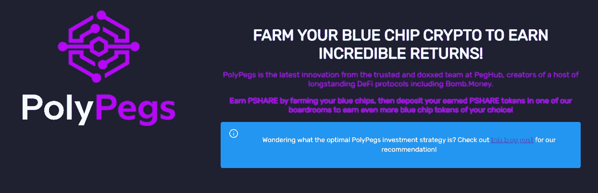
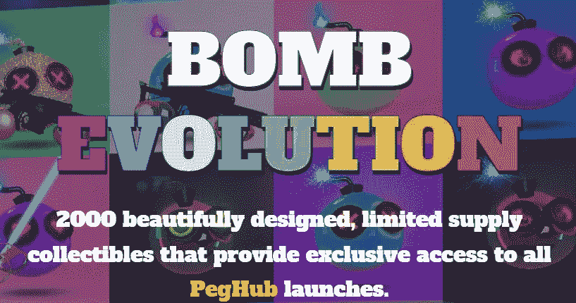
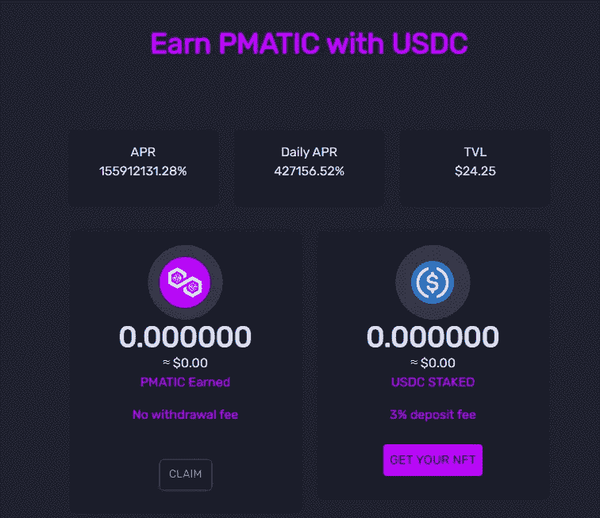
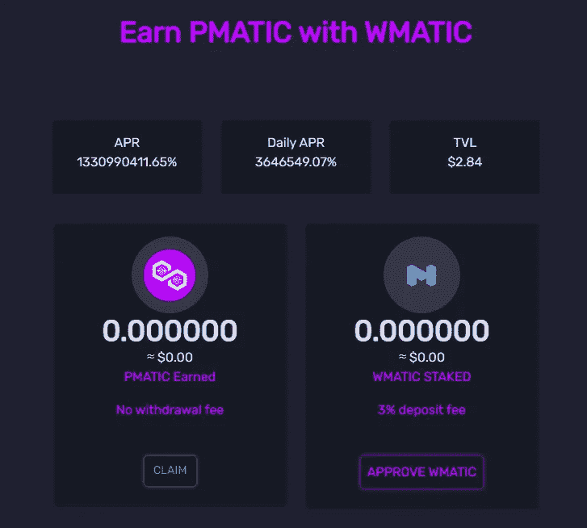
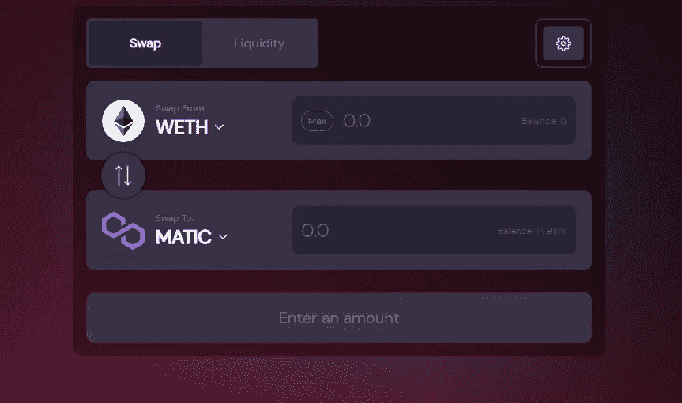

# 一个从赌注 MATIC 赚取高 APR 的机会

> 原文：<https://medium.com/coinmonks/an-opportunity-to-earn-a-high-apr-from-staking-matic-2c51f516b784?source=collection_archive---------8----------------------->

[https://app.polypegs.com/](https://app.polypegs.com/)

您希望在不购买 **MATIC 的情况下接触 MATIC 吗？或者，你可以在 **WMATIC** 上一天赚取高达 10%的收益。这一切都是通过将于 10 月 24 日发布的 [**聚腿**](https://app.polypegs.com/) 创世纪农场实现的。**

[**poly egs**](https://app.polypegs.com/)是 [**弹钱**](http://app.bomb.money) 团队已经创建的多边形网络上的一个墓叉。我曾经写过[为什么我看好炸弹钱](/coinmonks/an-unloved-defi-protocol-that-could-see-major-gains-2434a67eb098?source=your_stories_page-------------------------------------)生态系统。**poly legs**将坐在 [Peg Hub](http://app.peghub.com) 保护伞下，而 **MATIC** 将作为另一种蓝筹加密货币提供，可以很容易地下注以赚取高年利率。你可以在这里阅读更多关于炸弹钱的信息。

**关于多足代币**

**PMATIC:** 此令牌与 **WMATIC** 的价格挂钩。

**PSHARE**:poly egs 的股票，在上市后的前 7 天内，当它超过 peg 进行交易时，在董事会上被押下以赚取更多的利润。

**创世纪农场如何运作**

创世农场将会 24 小时运作，这是你在这段时间内获得自动驾驶的唯一方法。 **PMATIC** 将支付给持有 **USDC** 和/或 **WMATIC** 股份的人。这是一个支付率最大化的专属时期，只有持有**炸弹进化 NFT** 的人才能进入(最多 2000 人，但仍有很多人可用)。

炸弹进化 NFT 可以在这里[购买](https://mint.bombevolution.com/)价格 0.025 ETH(以太坊网上)。进入各自的游泳池还需要支付 3%的押金。这是为了阻止鲸鱼进入创世纪农场，倾倒令牌，然后离开生态系统。

**创世纪农场后**

在最初的 7 天里，如果你在董事会里下注 **PSHARE** ，你将会得到 **PMATIC** 的报酬，不管你的赌注是多少。要获得 **PSHARE** 你有三个选择。

1.  将 **PMATIC** 与 **WMATIC** 配对，将 LP 押在农场上以赚取 **PSHARE** 。
2.  直接从市场上购买 PSHARE。只要明白，初期流动性低，推出后不久价格就会相对较高。
3.  将 **PSHARE** 与 **WMATIC** 配对，以在 LP 农场赚取更高的 **PSHARE** 比率。这个农场有较高的非永久性损失风险。

农场的年平均回报率往往在上市后不久就非常高。随着越来越多的人进入农场，这种情况会逐渐减少，股票自然会下跌。

期待什么

创世纪农场是有风险的，你需要保持警惕，并愿意将资本置于风险之中。你可以通过持有 peg 令牌来谨慎行事，但最好把它看作是认真投资于该协议的启动工具。

该团队对以前的 Genesis Farms 进行了一些更改，他们认为这将允许他们在初始扩展阶段支持 peg(如果需要)。Peg Hub 保护伞下还会有更多的 Genesis 农场。参与 PolyPegs 是了解这些发布如何工作的好方法。

或者，你可以等待 **PMATIC** 价格真正下跌，但如果**炸弹**的看涨势头蔓延到铸币税协议，这就不能保证了。当盯住汇率极低时，投资墓叉通常是令人恐惧的，但让它们回到盯住汇率并不需要太多，而且如果它们回到盯住汇率，可能会非常有利可图。

**参加创世纪农场的步骤**

1.  购买**炸弹进化 NFT** 。确保你的钱包在以太网上。这将允许您参与 Peg Hub 保护伞下的所有未来 Genesis 农场。

[https://mint.bombevolution.com/](https://mint.bombevolution.com/)

2.将您的钱包切换到多边形网络。

3.在**聚腿**网站上下注 **USDC** 。

[https://app.polypegs.com/farm/GenesisUSDCPMATICRewardPool](https://app.polypegs.com/farm/GenesisUSDCPMATICRewardPool)

4.将 **WMATIC** 标在**多脚架** Genesis 农场上。

[https://app.polypegs.com/farm/GenesisMATICPMATICRewardPool](https://app.polypegs.com/farm/GenesisMATICPMATICRewardPool)

5.如果你既没有 **USDC** 也没有 **WMATIC** ，你可以去**聚腿**网站上的交换页面。确保它连接到多边形网络。

[https://swap.peghub.com/swap](https://swap.peghub.com/swap?inputCurrency=0x7ceB23fD6bC0adD59E62ac25578270cFf1b9f619)

***免责声明:*** *本文所写内容均不构成理财建议。投资加密货币，尤其是去中心化金融，是高风险的。我写的不是投资我讨论的项目的建议。我不清楚你的个人情况。只投资你能承受的损失。确保做你自己的研究，而不是仅仅依靠我的内容。*

**链接**

PolyPegs 网站:[https://app.polypegs.com/](https://app.polypegs.com/)

炸弹进化铸币:[https://mint.bombevolution.com/](https://mint.bombevolution.com/)

Peg Hub 高级文档:[https://docs.peghubadvanced.com/welcome-start-here/readme](https://docs.peghubadvanced.com/welcome-start-here/readme)

钉住枢纽互换地点:[https://swap.peghub.com/swap](https://swap.peghub.com/swap)

炸弹钱网站:[https://www.bombmoney.com/](https://www.bombmoney.com/)

> 交易新手？试试[加密交易机器人](/coinmonks/crypto-trading-bot-c2ffce8acb2a)或者[复制交易](/coinmonks/top-10-crypto-copy-trading-platforms-for-beginners-d0c37c7d698c)