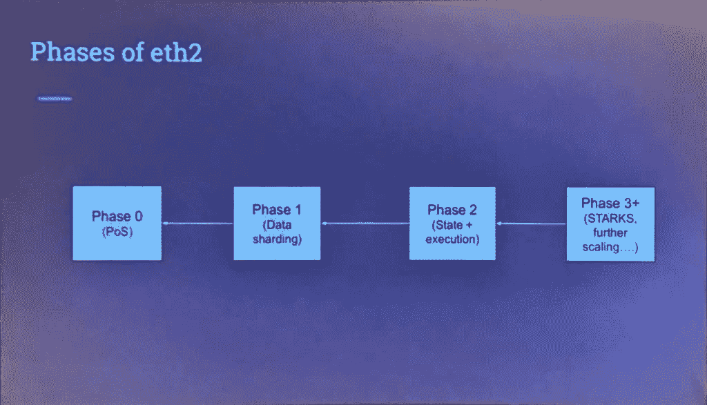

# 以太坊路线图概述(不完整)和 ETH2.0 对网络速度、交易成本和可持续性的影响

> 原文：<https://medium.com/coinmonks/an-overview-of-ethereum-roadmap-incomplete-and-eth2-0-5303dd697652?source=collection_archive---------11----------------------->

## 这篇文章是关于以太坊升级(合并的信标链)和 Eth2.0 对网络用户意味着什么的指南。

以太坊自诩为智能合约原区块链和第一个可编程区块链。以太坊使他们能够在其网络上启动新项目，并利用其安全性和用户基础，而不是从头开始构建新项目。

以太坊网络的可编程性得到了回报，从那时起它就享受着巨大的进步。虽然大规模采用是好事，但它很快导致了不可预见的问题，如交易延迟、高昂的汽油费和环境问题。

为了保持其作为领先智能合同链的地位，以太坊团队和开发人员一直在集思广益，以改善网络。他们似乎已经在 ETH 2.0 中找到了解决方案。这篇文章将带你了解 ETH 2.0 及其对网络用户的意义。

# 什么是 ETH 2.0？

ETH 2.0(又名宁静层或共识层)是一系列升级，将使网络更便宜、更快、更可持续。

至关重要的是，升级完成后，以太坊每秒将能够处理更多的交易，网络费用将大幅降低。此外，该网络将降低能耗。

值得注意的是，ETH 2.0 不仅仅是下个月将要发生的一次网络调整。相反，这是一系列的升级，前面还有很长的路要走。这是有意义的，因为为了顺利执行，需要进行几个测试。

当 ETH 2.0 最终到来时，它的工作方式将与 ETH 1.0 不同。因此，在深入研究 ETH 2.0 的路线图之前，让我们先讨论一下它的新特性。

# ETH 2.0 有什么新特性？

当前的 ETH 1.0 在 Mainnet 上运行，并使用工作一致性模型的证明。然而，代替 mainnet，ETH 2.0 将在一个称为信标链的新链上启动，通过利益一致性模型的证明来保护网络，并在碎片上存储数据。

让我们来分解所有这些术语，以及它们将如何在 ETH2.0 上实现。

## 利害关系证明

以太坊和比特币等区块链使用工作证明来保护他们的网络。PoW 要求验证器解决一个复杂的数学难题来验证事务。

第一个解决难题的人将交易添加到区块链，并获得网络的本地货币(ETH)奖励。

电力的问题是，矿商需要高计算能力(电力和硬件)来验证交易，这使其成为能源密集型和昂贵的。

ETH 2.0 通过使用利害关系证明共识模型解决了这个问题。在 PoS 中，网络随机选择一个验证器，将新交易添加到区块链中。所选择的验证器提出一个新的块，并等待其他验证器来证明该联盟。一旦相当数量的验证者证明了这个块，它就会被添加到这个链中，参与者就会得到补偿。

股权证明不需要重型硬件，消耗更少的能源，使其具有成本效益和环保。任何拥有 32 ETH(现在$50k)的人都可以成为验证者。

## 信标链

这是一个全新的链条，将 PoS 带入以太坊网络。它的一些作用包括:

*   协调 ETH 2.0 的活动，
*   委派职责给碎片，和
*   促进碎片之间的交流。

## 碎片链

碎片链是主区块链的子链。它们并行工作，以减少中央网络的工作量。

其逻辑是，不是一个链做所有的工作(就像我们对 mainnet 所做的那样)，信标将把一些关键角色委托给更小的链(碎片)，使网络更快更轻。

那么，工作证明、信标链和碎片将如何使以太坊网络更具可扩展性？

# ETH 2.0 路线图

ETH 2.0 具有不同的特性，开发人员正在同时开发这些特性。每个部分将在下面列出的不同阶段推出:

## 阶段 0:信标链

信标链是 ETH 2.0 网络的大脑，升级的第一阶段于 2020 年 12 月 1 日上线，此前在其上下注了足够数量的 ETH。

目前，信标链没有碎片。因此，它既不处理事务，也不处理智能合约。

在这个阶段，以太坊仍然在主网上运行。信标链没有任何碎片，也不能处理事务。

它只有一个单向的智能契约，允许潜在的验证者贡献 ETH，用于在合并后保护网络。

## 第一阶段:合并。

这就是 PoW mainnet (ETH 1.0)与风险证明信标链合并的地方。也就是说，以太网将留下工作证明，并转移到利害关系证明。

mainnet 将为信标链带来智能合同，它将能够存储整个网络上发生的交易数据。

PoS 更加安全和环保，信标链将与[第二层扩展解决方案](https://ethereum.org/en/developers/docs/scaling/)紧密合作，提高交易速度，使以太坊更接近其愿景。

值得注意的是，合并仍然是 ETH 2.0 路线图中的一个阶段，而不是使以太坊更便宜的最终游戏。

在两次成功的公共测试网之后，信标链和 mainnet 的合并预计在 2022 年 9 月发布。

## 第二阶段:分片

这是 ETH 2.0 的最后一个阶段，将向信标链添加新的链(碎片)。

这些碎片将使以太坊的吞吐量增加 64 倍，并使其能够每秒处理大约 100，000 次交易。

除了缩放之外，分片还会减轻信标链上的负载，并显著减小其文件大小。因此，消费者将能够在他们的个人计算机上运行一个节点，使网络更加分散，并减少攻击面。

碎片链预计将于 2023 年发布，但碎片的完整操作角色仍有待定义。然而，从目前的叙述来看，2 个碎片版本是清晰的。

一方面，碎片将充当数据仓库，即它们将只存储数据，而不运行智能合约或处理交易。

另一方面，碎片链会更智能。在这个版本中，可能会有一个折衷，一些链充当数据仓库，其他一些链将能够执行代码和运行智能契约。

以太坊的联合创始人 Vitalik Buterin 认为第三种用例也是可能的，即碎片与[零知识 snarks](https://vitalik.ca/general/2021/01/26/snarks.html) 并行工作，将私人交易引入以太坊网络。然而，zkSNARK 仍在调查中。

# 合并会如何影响用户？

ETH 2.0 描述了以太坊网络从 POW 到 POS 的过渡。所有技术升级都将在引擎盖下进行，因此 Dapp 用户不会受到影响。

以太仍将作为网费。将不会有新的令牌，以太坊网络作为一个整体仍将是我们热爱的以太坊，只是这次它将更快、更安全、更便宜、更可持续。

炒作可能会在短期内提高 ETH 的价格。至于合并对 ETH 价格的长期影响，向股权证明的过渡将改变 ETH 的象征经济学。首先，ETH 的日发行量将从 12,000 ETH 减少到 1280ETH 左右。

此外，在合并后，赌注奖励将从 4.5%增加到 10-15%，这将鼓励更多的人下注他们的 ETH。

此外，股权证明将减少验证者的出售压力，因为他们没有理由出售。

当所有这些因素都被定价时，如果合并按计划进行，从长远来看价格可能会上涨。你可以参考无银行公司的大卫·霍夫曼的这篇[文章](https://newsletter.banklesshq.com/p/dont-sleep-on-the-merge-lite?s=w)，更好地了解合并会如何影响 ETH 价格。

# 包扎

ETH2.0 路线图正在进行中，如果你正在阅读这篇文章，它比以往任何时候都更接近了。

信号链已经启动了。去年的[伦敦硬分叉](https://academy.binance.com/en/articles/what-is-the-ethereum-london-hard-fork)对交易费做了一个至关重要的改变，为以太坊过渡到股权证明设定了正确的路径。

随着两个公共测试网的成功，合并只有一步之遥，碎片链可能在 2023 年的某个时候发布。

以太坊网络的未来依赖于这些升级的成功和社区来使 ETH2.0 安全运行。

***我是阿泽斯，自由撰稿人，区块链爱好者。请为这个故事鼓掌，这样更多的人可以看到它。此外，请跟随我进行更深的潜水。我对工作持开放态度。***

> 交易新手？试试[密码交易机器人](/coinmonks/crypto-trading-bot-c2ffce8acb2a)或[复制交易](/coinmonks/top-10-crypto-copy-trading-platforms-for-beginners-d0c37c7d698c)