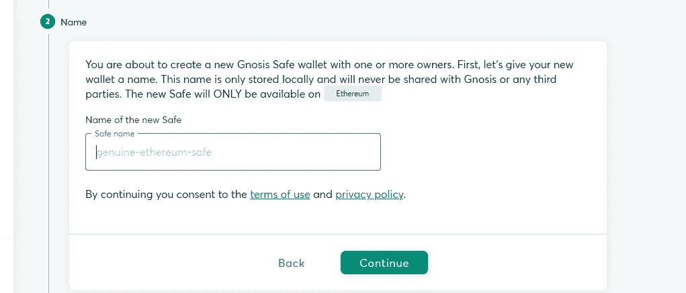
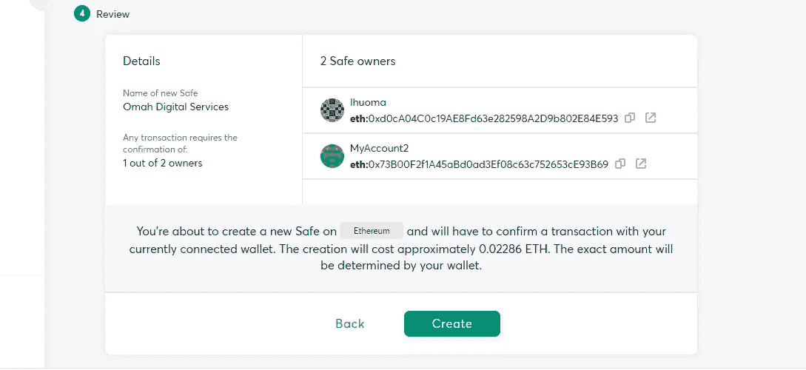

# Gnosis 安全概述

> 原文：<https://medium.com/coinmonks/an-overview-of-gnosis-safe-fe47c27f6688?source=collection_archive---------1----------------------->

Gnosis safe

一些组织和机构的许多问题包括解决资金的适当管理和安全问题。

如此多的区块链组织将他们的资金存储在外部钱包中，其中一个人具有最大的权限来促进整个组织的交易，并且随着信息安全威胁率的增加，例如软件攻击、身份盗窃、知识产权盗窃、破坏和信息勒索，存在对资金的高安全性的需求，尤其是在区块链空间中。这是引起恐慌的主要原因。

多年来，区块链机构和 Dao 一直在为寻找一个安全的地方存放其资金和治理令牌这一单一问题而陷入混乱。一些项目被外包给了黑客，而其他一些项目因为这个单一的缺陷而不复存在，然后就出现了 gnosis safe。所有数字资产的救星。

gnosis wallet

Gnosis Safe 是一款运行在以太坊上的智能合约钱包，在交易发生之前，需要最少数量的人批准交易。gnosis 团队已经提出了一个解决方案，当然，它将解决所有组织基金的所有安全和验证难题，从而解决问题。

# 灵知的简单起源

Gnosis 是由 Martin Kö ppelmann 和 Stephan George 在 2015 年创建的，当时以太坊网络刚刚推出，尽管他们没有参与以太令牌的推出。这两人自 2013 年以来一直在区块链，当时比特币是唯一的数字资产，交易价格仅为 30 美元左右。他们了解了比特币白皮书，随着时间的推移，开始为比特币编写软件和预测市场交易。然后在 2014 年底，他们遇到了 consensys 的创始人 Joseph Lubin，他也鼓励他们加入 Consensys 并在其上建立他们的新项目，Gnosis Safe 就是这样开始的。

据 Cointelegraph 报道，2017 年，Gnosis 能够剥离其首次发行的硬币，并能够在几分钟内赚到超过 300 美元的 MLN。

在这里查看:有史以来最快的 ICO:基于以太坊的灵知在几分钟内创造了 300 美元 MLN，筹集了 1200 万美元

然而，如果不提及不同类型的以太坊账户，我们不可能开始谈论灵知安全。

## 以太坊账户的类型

基本上有两种不同类型的以太坊账户，包括:

1.  **境外账户(EOA)**
2.  **合同账户**

外部拥有的账户(EOA)，通常被称为简单账户。这些帐户由私钥和公钥控制，如果您拥有与外部拥有的帐户(EOA)相关联的私钥，则您可以将 ETH 发送到另一个钱包。MetaMask 是最流行的以太坊软件钱包。

合约账户通常被称为智能合约。它们由一系列代码组成，作为一个程序在以太坊区块链上运行。但是，与外部拥有的帐户(EOA)不同，它们没有私钥。[点击此处了解有关智能合约的更多信息](https://ethereum.org/en/developers/docs/smart-contracts/)。

## 新的方式

**Multisig 钱包**

根据 [Bitstamp](https://blog.bitstamp.net/post/what-is-a-multisig-wallet/) 的说法，多重签名钱包是一种使用多重签名地址的数字钱包。这意味着它需要一个以上的私钥来签署和授权一个加密交易。多重签名钱包为资金增加了一层安全保障。

# 灵知到底什么是安全的？

 [## Hannatv GIF by Amazon Prime Video -在 GIPHY 上查找和共享

### 原创电视剧《TVOD》和《SVOD》中的 GIFS

media2.giphy.com](https://media2.giphy.com/media/fAcRSdMsE2JuU2j8VO/giphy.gif?cid=ecf05e47pqfbtdvfpfomlknj9i21zrokq8m9apfiue1y62a0&rid=giphy.gif&ct=g) 

Gnosis Safe 是一个 MultiSig 智能合约钱包，允许用户在与分散式 web 交互时安全地存储 ether 和 ERC20 令牌。

想象一下，你想开始一项业务，需要两个或更多的人作为联合创始人、合作伙伴，或者让我们说，你和你的另外两个朋友想建立一个去中心化的自治组织(DAO)，或者一个不可替代的令牌(NFT)市场，在那里你将是首席执行官，你的第一个朋友是智能合同工程师，而第二个朋友成为 UI/UX 设计师。采用和可用性的可能性很大，这反过来会增加每笔 NFT 交易的收入。

你可能储存在智能合约中的利润不可避免地不安全，因为你的一个朋友可能会在某一天无赖地决定提取智能合约中的所有资金，因为他很容易获得这些资金。真是进退两难！。幸运的是，你有一个替代储备，可以维持项目，防止它折叠，或者相反的情况可能会发生。

然后，您决定这种情况永远不会重复，因此，您采用了一个验证流程，该流程将允许智能合同上的所有交易都由组织中的关键人员授权和批准。例如，如果您组织中的关键人员有 10 人，您可以决定对于每笔提款交易，至少有 6 名关键人员在交易继续进行之前验证和批准交易。

幸运的是，Gnosis Safe 已经解决了所有这些问题，因为它允许您安全地与您的 NFT 市场或您的治理令牌进行交互，而无需手动使用甚至从头开始学习这些验证方法。

作为一个想要保护自己资金安全的组织或个人团体，你所需要的只是创建一个 Gnosis 安全钱包，启用一定数量的签名者并存入你的资金。现在，如果业务中有三(3)个关键人员，提取资金至少需要两次批准。这意味着没有一个人对组织的资金有最大的控制权。

这正是 Gnosis Safe 向其用户保证的安全率。

## Gnosis Safe 的特性

gnosis safe 的众多特性包括:

*   多重签名:Gnosis safe 通过允许公司账户的多个关键签名人，实现了关于如何管理公司数字资产的完全可定制的功能。这些签署人仅限于促进、授权和批准交易以执行交易，这有助于防止未经授权访问公司资产。
*   Gnosis Safe 支持 ETH、ERC20(代币)和 ERC721(收藏品)。并让你看到你的资产的法定价值。
*   Gnosis Safe 还允许您使用您最喜欢的钱包来签署交易。无论是手机钱包、浏览器扩展还是硬件钱包。
*   Gnosis Safe 应用程序为 Defi 带来了 multisig 安全性。它允许您直接从 Gnosis 安全界面利用您的数字资产进行投资、赚取、借贷、开具发票、支付工资等。用户可以通过从应用程序列表中选择来定制自己的界面，也可以通过简单地放置链接来添加额外的应用程序
*   Gnosis Safe 有移动应用程序(适用于 Android 和 iOS)、桌面应用程序(适用于 Windows、macOS 和 Linux)和浏览器内扩展三种版本。

> 交易新手？试试[加密交易机器人](/coinmonks/crypto-trading-bot-c2ffce8acb2a)或者[复制交易](/coinmonks/top-10-crypto-copy-trading-platforms-for-beginners-d0c37c7d698c)

## Gnosis 安全智能钱包怎么设置？

要设置 Gnosis 安全钱包，首先要做的是

*   从您的桌面或 app store 下载 Gnosis Safe 智能钱包并安装应用程序。或者访问 Gnosis Safe 网站，在右上角点击打开应用程序。

Gnosis home page

*   然后点击“创建新钱包”图标，并通过选择您喜欢的钱包类型(Metamask、pocket wallet 等)来连接钱包。

creating new wallet on gnosis safe

*   选择你想要的网络，因为有很多网络像以太坊，灵知链，多边形，BNB 智能链等。但我总是更喜欢它在以太坊网络中，所以，我们将把它留在那里，然后单击继续。

selecting the right network on gnosis safe

*   给你的钱包起一个名字，可以是组织、团体甚至个人的名字

give a name to your wallet

*   添加您的姓名，并添加另一个将成为该帐户关键签署人的用户。然后选择您想要的签名人数并继续。

add more signatories to the account

*   在弹出窗口中确认您已准备好创建钱包，因为将根据您的钱包向您收取一定的费用，然后点击创建。

review and confirm that you are ready to create your wallet

*   这就是你的 Gnosis 安全智能钱包，它现在是活跃的，随时可以使用

This is how the Gnosis wallet looks like

## 为什么你需要灵知安全

以下是你需要灵知安全的一些原因

*   **安全性**:这是每个计划进入数字空间的投资者、组织或个人最关心的问题之一，Gnosis Safe 为您的所有数字资产提供最佳安全性。在 gnosis 中，没有一个人拥有对组织资金的最佳控制权，在有争议的情况下，如果一个人受到损害，组织的资金仍然很少或没有威胁
*   **全在一个资产银行** : Gnosis 提供了一个机会，让你把所有的资产，包括加密和非加密技术，都放在一个地方，从而减少从一个钱包切换到另一个钱包的压力。
*   **智能合约** : Gnosis 作为智能合约运行，这意味着不需要私有和公共密钥，分配给组织的每一笔资金都被发送到 Gnosis 网络上运行的特定合约。
*   社会恢复:与丢失钱包种子短语的常规问题不同，gnosis safe 提供了一个社会恢复的机会，允许个人通过其他关键签名者的确认来恢复他的钱包。这意味着，如果你失去了你的电子产品的所有权或使用权，你可以很容易地找回你的钱包。

# 结论

灵知保险箱的使用怎么强调都不为过。每一个数字机构的核心责任都是在盈利的同时保证其机构和用户资金的绝对安全。像 Consensys、ENS、Yearn finance、1inch 和许多其他项目已经证明，Gnosis safe 是管理数字资产最值得信赖的平台。

那么，今天你还在等什么来保护你的资金呢？点击链接立即开始使用 [Gnosis Safe App](https://gnosis-safe.io/app/) ！

# 关于作者

Igwe Ihuoma Patience 是一名自学成才的创意和特定行业内容作家，也是一名加密货币爱好者，拥有 2 年多的经验和不断发展的区块链空间的知识。

我擅长内容创作、文案撰写、字幕管理、视频编辑和手机图形设计，我教其他人如何在加密货币和区块链领域起步，我的目标是让区块链的学习和更新易于任何人理解。

> 加入 Coinmonks [电报频道](https://t.me/coincodecap)和 [Youtube 频道](https://www.youtube.com/c/coinmonks/videos)了解加密交易和投资

# 另外，阅读

*   [最佳加密分析或链上数据](https://coincodecap.com/blockchain-analytics) | [Bexplus 评论](https://coincodecap.com/bexplus-review)
*   [NFT 十大市场造币集锦](https://coincodecap.com/nft-marketplaces)
*   [AscendEx Staking](https://coincodecap.com/ascendex-staking)|[Bot Ocean Review](https://coincodecap.com/bot-ocean-review)|[最佳比特币钱包](https://coincodecap.com/bitcoin-wallets-india)
*   [Bitget 回顾](https://coincodecap.com/bitget-review) | [双子星 vs BlockFi](https://coincodecap.com/gemini-vs-blockfi) | [OKEx 期货交易](https://coincodecap.com/okex-futures-trading)
*   [美国最佳加密交易机器人](https://coincodecap.com/crypto-trading-bots-in-the-us) | [经常性回顾](https://coincodecap.com/changelly-review)