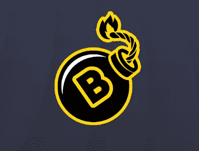

# 一个不受欢迎的 Defi 协议，可以看到重大进展

> 原文：<https://medium.com/coinmonks/an-unloved-defi-protocol-that-could-see-major-gains-2434a67eb098?source=collection_archive---------6----------------------->

秘密熊市一直很残酷。很难找到任何 Defi 协议没有遭受重大出售或总价值锁定损失(TVL)。在 2022 年，有许多协议是从坟墓融资中派生出来的。这些协议中的大多数已经死亡，或者在熊市中挣扎。许多投资者(像我一样)坐拥大量未实现的损失，而其他人出于自己的原因退出了协议。

你现在可能已经发现，我喜欢思考未来，而不是过去。我将介绍一个墓叉，经历了重大损失的 TVL 和穷人的价格表现。我个人认为这个项目有一个计划，如果你有耐心并愿意承担风险，它将允许它强劲复苏并提供令人难以置信的性能。

**引入炸弹钱**

你们中的许多人可能不太了解炸弹钱。事实上，我很惊讶他们得到的关注如此之少。炸弹钱是坟墓融资的第一个分支，在币安智能链上。原生令牌**炸弹**以一万**炸弹**比 **BTCB** 的比例盯住 **BTCB** 的价格。为了实现这一点，在**炸弹**和 **BTCB** 之间提供流动性的机制已经到位。当**炸弹**落到栓钉下方时，燃烧机械用于使**炸弹**退出循环。当**炸弹**结束时，**共享**代币的持有者可以在会议室下注并获得新铸造的**炸弹**。

和很多墓叉一样，最初非常成功。这是一种创新的机制，为押注比特币提供了可持续的高 APR，并将在价格下跌期间自我修正(当股票价格下跌时，APR 较低，当股票价格上涨时，APR 较高)。像所有 DeFi 的事情一样，坟墓分叉具有相当大的风险，在熊市期间实现了。坟墓分叉暴露在一个迷你死亡螺旋中，低回报导致人们恐慌并退出协议。它成为一个自我实现的预言，回报随着挂钩令牌的价格下跌。在一天结束时，原生令牌需要一个可感知的效用(像任何其他硬币一样)，否则它将崩溃。

在 Terra Luna 崩溃后的大规模加密抛售期间，炸弹与大多数坟墓分叉一起大幅跌破 peg。此后，TVL 降至非常低的水平。APR 仍然比银行账户更好，但许多人已经退出生态系统，寻找下一个闪亮的物体。那些将他们的**炸弹**与 **BTCB** 配对的投资者，如果他们现在打破 LP，将会面临巨大的潜在损失。

**有些事情正在改变**

那么，我为什么要讨论一个远低于 peg 的墓叉呢？答案很简单。炸弹正在卷土重来。看下面的图表。较 9 月份的低点上涨了 12.5 倍。

对于那些知道坟墓分叉的人，你会知道还有一个共享令牌。炸弹钱有 **BSHARE** 。请看 **BSHARE** 的图表。

**BSHARE** 从低点做了一个 3.4x。共享可以让你在超过上限时收到更多的**炸弹**。因为**炸弹**远低于 peg，所以一直处于低位。在撰写本文的时候，即使在最近的运行之后，**炸弹**也只有 11.5%的钉住水平。 **BSHARE** 价格受**炸弹**的影响很大，因为它的内在价值是基于**炸弹**相对于 **BTCB** 的价格。

**难道 FOMO 在对价格采取行动**

在跳进去等着**弹**做个 9x 和 **BSHARE** 更动的价格之前，请自己做一下这方面的研究。我将简单解释一下为什么会出现这种情况，为什么我仍然看涨。这并不意味着你应该简单地在文章的基础上跳进去。了解正在发生的事情，了解这个团队。他们非常活跃，创始人 Aaron Shames 在 Telegram 和 Discord 上也很活跃。

**炸弹链公布**

**炸弹**恢复的主要原因是团队宣布推出[炸弹链](https://www.peghub.com/blog/bombshell-monday-our-biggest-alpha-ever-you-be-the-judge/)。炸弹链将被启动，使蓝筹股加密货币在他们自己的祖国区块链的赌注。为了交易，用户需要**炸弹**来支付汽油费。这为**炸弹**创造了一个全新的潜在用例。这个想法是创建一个类似于 Celsius 的用户体验，而没有相同的风险，同时在公共区块链上拥有完全透明的资金。

**b 共享排放将于下月停止**

像坟墓金融一样， **BSHARE** 排放将在推出一年后结束。结束日期定于 11 月 25 日。这将使 **BSHARE** 越来越稀缺。制造更多**炸弹**的唯一方法是当**炸弹**结束时，在董事会议上下注**股票**。在币安智能链上制造的炸弹可以转移到炸弹链上。如果需要**炸弹**来押注蓝筹股加密货币，那么**炸弹**很有可能会在未来进行盯住交易。

**牛市案例——我期望它如何发展**

我的看涨观点是，经济将进一步复苏，并很快再次转向盯住美元。这将给你 9 倍于**炸弹**本身的回报，甚至可能更高。当**炸弹**交易超过挂钩时，您可以将**股票**放在会议室中，以赚取更多的**炸弹**。

我预计炸弹链会增加对**炸弹**的需求，同时也会减少供应，因为人们在炸弹链上支付汽油费。这应该会继续对**弹**的价格造成上行压力。如果**炸弹**价格继续上涨并保持在挂钩之上，**b 股票**持有者将继续获得**炸弹**，直到达到 2.5 亿**炸弹**代币的硬供应上限(我们现在还没有接近这个上限)。BSHARE 将会非常有价值，而且没有通货膨胀，同时允许你赚取(潜在的)升值资产。

**会出什么问题呢？**

**弹**和 **BSHARE** 的成功，将归结于团队吸引用户弹链的能力。该团队目前的重点是一款移动应用程序，它将使初学者能够轻松地在 Bomb Chain 上押注流行的加密货币。除此之外，该团队正在寻找一个潜在的选项，为开发人员构建 dApps 开放链，但这不是当前的重点。要理解的重点是 ***这个还没发生*** 。风险在于，他们无法推动用户使用 Bomb Chain。

另一个需要注意的问题是，目前流动性非常低。投入大量资金将大幅推动价格，同时可能会有玩家从中获利。我建议逐渐积累，而不是一次全进。短期内价格波动会非常剧烈。

**应该如何参与？**

你可能会忍不住去模仿 **BSHARE** 。我建议一个风险较小的选择。你可以买一些**炸弹**和 **BTCB** 配对，然后把它放在农场里。这将允许你赢得**b 份额**。你也可以直接从市场上购买 **BSHARE** ，但是我个人在积累少量的同时也在种植**炸弹/BTCB** LP。此外，你可以将你的 **BSHARE** 与 **BNB** 配对，赚取更多的 **BSHARE** 。暂时的损失可能意味着你最好把那份 **BSHARE** 放在钱包里。如果你是在 **BSHARE** 排放停止后读到这篇文章的，那么你唯一的选择就是直接购买**炸弹**和 **BSHARE** 。

[https://app.bomb.money/farm](https://app.bomb.money/farm)

**最后的想法**

这可能是一个月球拍摄发挥，但有很多其他的选择，以参与炸弹钱生态系统。他们也有**钉毂**这是 3(即将成为 4)铸币协议的发射台。您可以使用 Peg Hub 本身，它允许您押注蓝筹股加密货币或进入铸币协议( [BitBomb](https://app.bitbomb.io/) 、 [CZPegs](https://www.czpegs.com/) 和 [SnowPegs](https://snowpegs.com/) )。Peg Hub 将逐步在所有 EVM 兼容的链上推出铸币税协议，以允许投资者能够在一系列蓝筹加密货币资产中持股。

现在我个人更关注**炸弹**和 **BSHARE** 但是如果你离 11 月 25 日更近，那么你最好看看**钉毂**上的铸币协议。这些协议也有极低的 TVL，但如果你愿意冒这个险，就有机会看到巨大的收益。我肯定会在 **BSHARE** 排放结束前更新。我还将在其他文章中介绍 Peg Hub 和 seignorage 协议。

请在评论中留下任何想法或问题，我将非常乐意回答。我很想知道你想听些什么。

***免责声明:*** *本文所写内容均不构成理财建议。投资加密货币，尤其是去中心化金融，是高风险的。我写的不是投资我讨论的项目的建议。我不清楚你的个人情况。只投资你能承受的损失。确保做你自己的研究，而不是仅仅依靠我的内容。*

**链接**

炸弹钱网站:[https://www.bomb.money/](https://www.bomb.money/)

钉住枢纽网站:[https://app.peghub.com/](https://app.peghub.com/)

每周更新:[https://www.peghub.com/blog/category/bomb-shell-monday/](https://www.peghub.com/blog/category/bomb-shell-monday/)

电报:

> 交易新手？尝试[加密交易机器人](/coinmonks/crypto-trading-bot-c2ffce8acb2a)或[复制交易](/coinmonks/top-10-crypto-copy-trading-platforms-for-beginners-d0c37c7d698c)