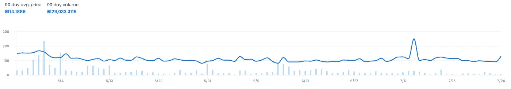
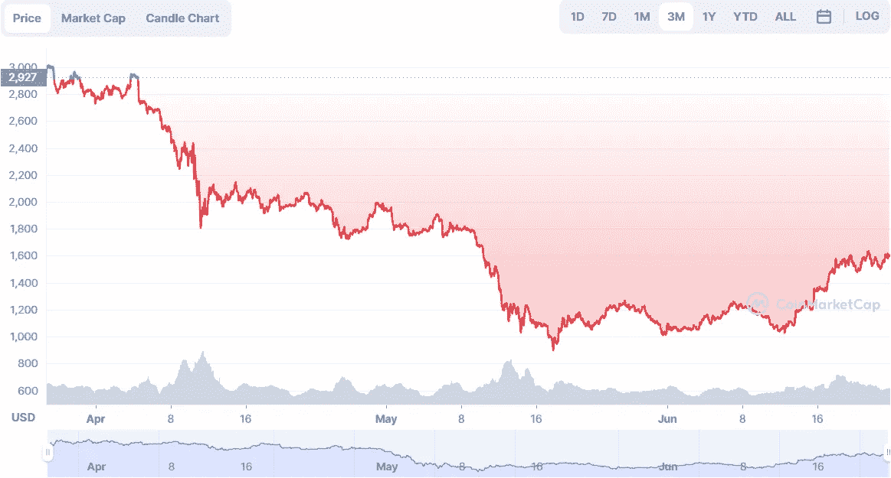
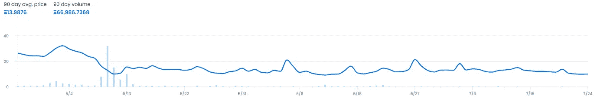
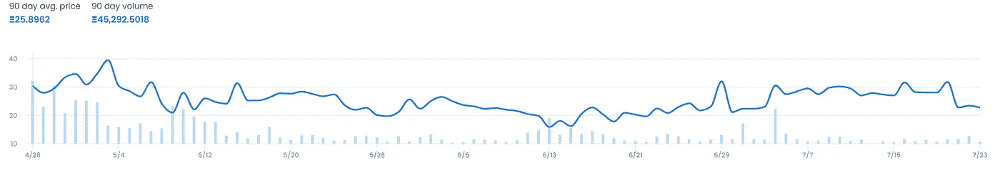

# 密码市场和个人方向的更新

> 原文：<https://medium.com/coinmonks/an-update-on-crypto-markets-and-personal-direction-ded65eaf70b0?source=collection_archive---------33----------------------->

我从来都不是一个以博客相关风格写作的人，也不会分享太多个人情况。我认为我的经验不足以讲述真正深刻的故事。然而，对于市场和我想在不久的将来写的东西，有些想法是应该的。

# **宏**

> 宏观看起来很糟糕，但不会像看起来那么糟糕。

我从来都不是一个宏观的人——我选择了一个非常脚踏实地、非常自以为是的信念，即宏观经济学家总是在正确的方向上，但从来没有在正确的时机上。坦率地说，我不相信有人能把握好时机，因此，那些把自己标榜为纸上谈兵的人类学之神的公司，相对于其他所有人来说，实际上并没有获得多少利润，但肯定会获得最多的电视和经济会议邀请。自 COVID 问世以来，不幸的是，市场在很大程度上受制于宏观事件，每个人的眼睛都盯着 FOMC 会议纪要，试图了解他们如何能够在美联储决定是向自己的心脏还是肺部开枪时抢先一步。

底线是，免费货币时代目前正在急剧下降，利率将继续攀升，增长+依赖于印刷的行业将继续以快速飙升的速度下降，随后是暂时的缓解蔓延。问题不再是美联储何时会转向鹰派，而是这只鹰是野生动物还是来自动物园(我打赌是动物园)。两种结果都不好。我不认为接下来的 8 个月是买入你最喜欢的科技公司股票的好时机。然而，如果你是 DCA 的合法从业者——请继续买入有真实现金流的真实公司:谷歌、苹果、亚马逊和微软。我个人对帕兰蒂尔的押注被列出，因为这是我的文章，但悬而未决的世界地缘政治状态也支持帕兰蒂尔赚一大笔钱。

由于我不是宏观专家，目前有几个故事被比我聪明得多的人关注着:[公司债务危机](/galois-capital/btc-and-the-pending-corporate-credit-collapse-3c59814e625b)，[欧洲央行和欧盟的潜在崩溃](https://blog.bitmex.com/the-doom-loop/)，显然[汽车贷款也有自己的“08 时刻”](https://www.bloomberg.com/news/articles/2022-05-13/bonds-backed-by-car-loans-are-selling-at-fastest-pace-in-years)。

我对整个市场的信念仍然是积极的，是的，明年或两年将继续糟糕，我们可以让宏观交易员继续狂欢，但最终，我们将进入下一个牛市周期，一切都会再次好转。现在就把钱堆起来，准备好在春天回来的时候去打猎。

TL；大卫:时局不好，但是找份工作，尽可能多赚钱。准备好现金购买严重贬值的资产，你可以 DCA 或等待几个月，看看市场是否准备好停止因政府无能而内爆。

# 定义机会

回到真实的密码世界。事实上，我看到了一个购买严重贬值的 Defi 治理令牌的大好机会，这些令牌是已经证明了效用或机制的项目，可以支持规模，而不需要像 Terra 这样的庞氏经济学。这是我写这篇文章时的清单和价格(ToW)，它们也有很好的象征经济学，因为 FDV 的倍数不高于 2:

1.  凸形融资(50 美元峰值→7.80 美元拖车)
2.  化合物(854 美元峰值→55.83 美元丝束)
3.  aave(632 美元→90.06 美元拖)
4.  制造商(6012 美元→ 986.82 美元)

原因很简单:TradFi 想要进入加密领域，而地狱加密原生代正在竞相创造资金，并渴望在新的世代低点部署资本。第一个进入的门户将是 Defi 项目，尤其是治理令牌。列出的项目都有很高的 Mcap:FDV 比率，具有功能效用的工作项目，以及像 power 这样的基金，因此对提案进行投票是他们通过参与“改善生态系统”的观点。

我还没有深入研究每一份白皮书，以确定价值捕获是发生在协议还是令牌级别，坦率地说，我有点懒于过多地验证这种直觉，但我想把这作为一个显而易见的交易写下来，并将收集更多的证据。2024 年见。

# NFTs

令人惊讶的是，NFT 还没有完全消亡。我有一个有趣的论点，我想见证一下:在基础资产如 ETH 或 SOL 大幅贬值的情况下，NFT 价格会重定为美元价格还是保持加密价格？用英语来说，假设 ETH 是 4000 美元，那么如果 ETH 下降到 1000 美元或保持在 100 ETH，一个值 100 ETH = 400，000 美元的猴子 Jpeg 还会以 400，000 美元的标签定价吗？正如我们从下图中看到的过去 90 天的 BAYC 最低价

Prices did fall from a high of 149E to their current floor at 88E, but it's holding consistent

Price of ETH during the same time period,

这实际上非常有趣，因为它证明了非功能性交易本质上是纯粹的投机工具，而且社区力量确实提供了一种价值观念。猿在一起=强大。

是的，美元价值随着 ETH 价格的下跌而下跌，但 NFT 没有立即跌至 0 的事实证明，它们不仅仅是 crypto 上的杠杆滑块，实际上可能会作为一种资产类别保持不变，目前跟踪其基础资产。这同样适用于志那都红豆等非蓝筹股或新上市公司吗？

Azuki also had a near 50% drop, also holding the line

我不会在 OpensSea 上看所有的系列，但这里也有 Moonbirds

30E peak to currently 22E

结论是，我们看到了下跌，但非金融资产的下跌幅度没有超过其基础资产。某些集合甚至在完全基于社区投机和独立交易模式的情况下出现价格飙升，而忽略了加密的性能。在这个阶段，我能说的唯一确定的结论是，非正规金融机构肯定不会有任何发展，而且肯定会在下一个周期变得更强。至于在世界末日或更糟糕的情况下，它们是否会成为资本保值的选择；长期熊市还言之过早。

# 傲慢 vs 信念

我们有几个完全自大的例子，我发现这是非常宝贵的学习机会。

3AC 使用非抵押贷款为 long crypto 提供保证金，导致其破产，而那些敢于向客户提供数亿至数十亿美元贷款的债权人，是信心游戏中一个疯狂但堪称典范的例子。

这不是唯一的例子，也不是第一个，它让我想到了下面这个问题:

> 狂妄和信念之间的界限在哪里？

如果我们看看过去 5 年中一些最大的交易机会，最好的例子是:

1.  持有比特币从 9 美元到 69000 美元
2.  持有特斯拉股票从 6 美元到 1200 美元
3.  持仓量从 0.011 美元升至 0.77 美元

这仅仅是我想到的三个突出的例子，在人们可以推理这些价格爆炸有几个原因的地方，我的一部分想知道信念和傲慢之间的区别是这个想法是否简单可行。

铁杆早期采用者或信徒会说，他们总是看到这一天的到来。我们已经听说了 2011 年地下技术公司挖掘比特币梦想新金融系统的故事，家庭出售他们所有的资产购买特斯拉股票，狗币百万富翁可能会变得幸运，因为他们喜欢狗迷迷。我发现把这些原则并列在一起说 3AC 是骗子或者道权是骗子是很可笑的，对我来说，他们也是他们自己的故事的信徒和英雄，他们正在进行重要的战斗。

可能存在这样一个世界，特斯拉并没有书中所述的所有优势来帮助他们取得成功，也没有零售营销努力来推动他们的股票达到 100 倍的收益估值。可能存在这样一个世界，在对比特币的狂热得以繁荣之前很久，比特币就被中央政府关闭了。可能存在这样一个宇宙，在那里 Doge 只不过是一个迷因。相比之下，也可能存在这样一种情况，Terra 确实达到了临界质量，在没有其惊人的排放结构的情况下生存下来，或者 3AC 的超级周期确实取得了成果。这些思想的主导者或那些一开始就把所有积蓄都投入进去的人，常常坚持他们的论点是“信念”。我认为，这和傲慢之间的界限往往只是旁观者所认为的最终结论。

我对这个想法的结论是，对一个想法的信念是好的，但更多的时候我们必须意识到，即使我们可以找到一千个为什么一个想法应该成功的原因，在它失败的情况下，也会有一千个为什么它失败的原因被挖掘出来。一旦市场变得对我们不利，我们不能对好的想法视而不见，我们不能傲慢地认为我们的信念不是傲慢。最好的交易方式可能是索里西式的，认识到失败并快速退出，但对赢家加倍下注，不要和想法结合。最终，市场根据你账户上的美元和法律诉讼中的债务来决定谁对谁错。

为疯狂的人干杯。

> 交易新手？试试[密码交易机器人](/coinmonks/crypto-trading-bot-c2ffce8acb2a)或者[复制交易](/coinmonks/top-10-crypto-copy-trading-platforms-for-beginners-d0c37c7d698c)