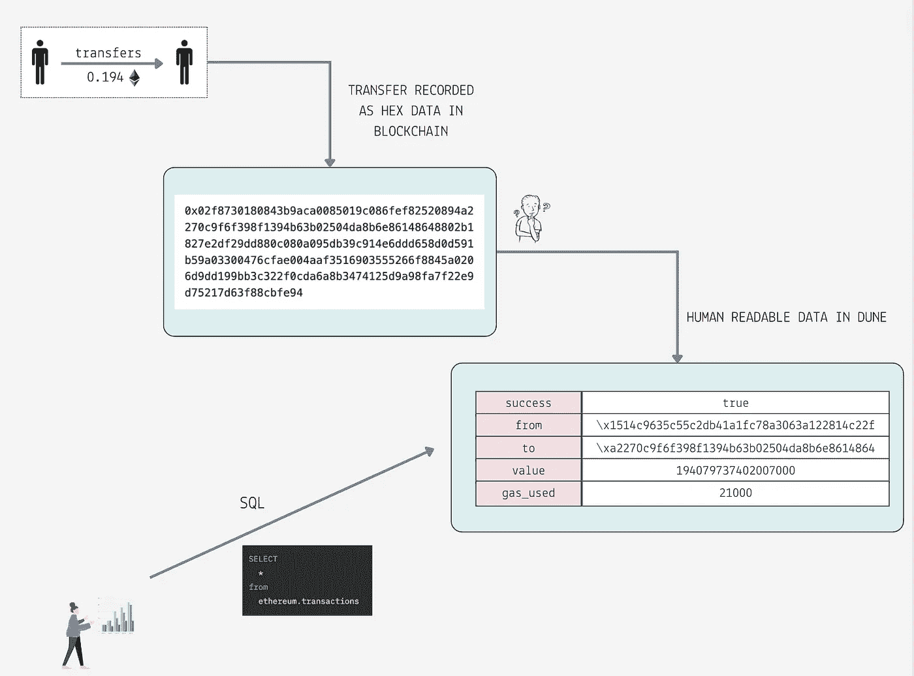
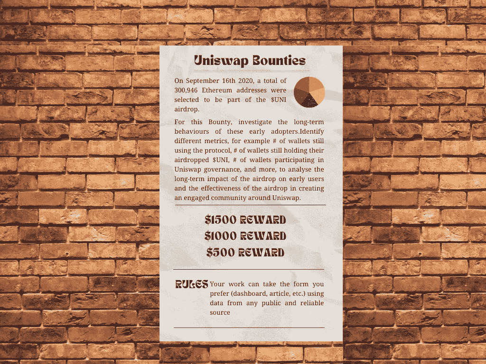
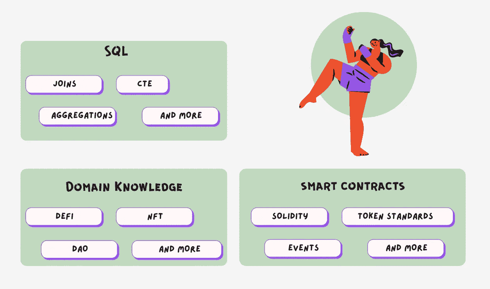
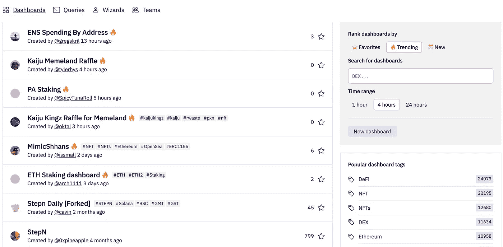

# 使用沙丘分析分析区块链数据—入门

> 原文：<https://medium.com/coinmonks/analyse-blockchain-data-with-dune-analytics-getting-started-8c46084adf6e?source=collection_archive---------12----------------------->


How to analyse blockchain data with Dune Analytics — Getting started

任何人都可以访问公共区块链数据，因为它不属于任何中央实体。随着生态系统的扩展，区块链将存储无限量的宝贵信息。

当与数据分析和机器学习相结合时，从这些开放数据中收集的见解将极具价值。

尽管区块链包含大量有用的信息，但它不是为处理分析查询而设计的；相反，它旨在提供安全性、不变性和透明性。

许多数据提供商正试图让分析师、研究人员和科学家更容易获得区块链数据。

Dune Analytics 是一种使用 SQL 探索 web3 数据的奇妙方式，同时也是一个神奇的向导社区的一部分。

Dune 解码原始区块链数据并将其加载到 SQL 数据库中。然后，分析师可以专注于创造有意义的见解，而不是花时间解析原始数据。



Dune enables analysts to easily query blockchain data using SQL.

## 谁会使用沙丘分析？

*   顶级协议利用链上分析来更好地了解他们的生态系统中发生了什么。
*   研发公司，创建特定行业数据情报和报告的分析初创公司。
*   个人或投资者寻求更高的知名度，以便做出更明智的决策。

以下是 Uniswap 的分析请求示例，在该示例中，任何人都可以通过创建有洞察力的仪表板来帮助回答关键问题。



Analytics bounty from Uniswap (Content source : [Uniswap](https://unigrants.notion.site/Getting-started-with-Uniswap-Analytics-0d325ecd19ca4f9d91ee9bb4bd2e0277))

## 一个人需要掌握哪些技能？

*   检索数据并将其转换为所需格式的基本 SQL 技能。
*   领域知识允许对业务及其独特挑战的透彻理解。例如，在为 Uniswap 开发洞察力时，理解分散式交换如何工作以及 TVL、流动性等常用术语至关重要。
*   智能合约知识有助于分析师破译协议的逻辑，并确定要监控的关键事件/跟踪。



Don’t get overwhelmed. It is not as difficult as it sounds.

## 如何入门？

*   加入沙丘的不和谐，以进入社区。
*   通过探索[其他用户的仪表板](https://dune.com/browse/dashboards)来学习。Dune 可以让您找到仪表板，将它们分叉，并对它们进行实验以获得更好的理解。
*   首先为特定的生态系统(如以太坊或多边形)生成简单的见解(例如，[气体分析](https://dune.com/hildobby/Gas))。
*   开始为您想要关注的任何特定部门(DeFi、NFT、DAO 等)构建基准指标(例如， [DEX 指标](https://dune.com/hagaetc/dex-metrics))。)
*   最后，深入研究一个特定的协议(如渴望，Aave 等)。为了更好地理解，请查看以前的奖金和现有的仪表板。
*   开始参与奖金(如 Dune discord 中所张贴的)，或者申请自由职业或全职工作，甚至启动自己的创业。



Dune analytics community dashboard (Source: [Dune](https://dune.com/browse/dashboards))

## 去哪里进一步学习？

这里有一些学习更多沙丘分析的优秀资源。

*   [我们的网络](https://ournetwork.mirror.xyz/gP16wLY-9BA1E_ZuOSv1EUAgYGfK9mELNza8cfgMWPQ):来自区块链分析训练营的会议记录。
*   [Metrics DAO](https://metricsdao.xyz/) :了不起的人组成的社区，让分析师能够进行链分析。
*   [沙丘 youtube 教程](https://www.youtube.com/playlist?list=PLK3b5d4iK10ext4v-GBySekaA8-GP8quD)

```
💁 While this may appear daunting, I’ll break down the steps in subsequent blogs to get you started from scratch to creating compelling dashboards in Dune.
```

> 接下来:在 Dune Analytics 中构建以太坊总览仪表板。

*我希望这篇文章对你开始使用 Dune Analytics 有用。关注我，以便在我的下一篇帖子发布时收到通知。如果您有任何问题或意见，请随时联系我们。* [*推特*](https://twitter.com/kirubakumaresh)*|*[*LinkedIn*](https://www.linkedin.com/in/kirubakumaresh/)

> 交易新手？试试[加密交易机器人](/coinmonks/crypto-trading-bot-c2ffce8acb2a)或者[复制交易](/coinmonks/top-10-crypto-copy-trading-platforms-for-beginners-d0c37c7d698c)