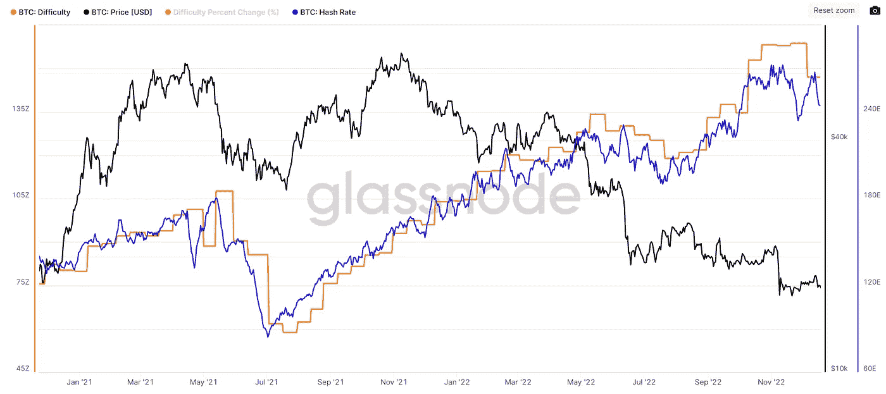
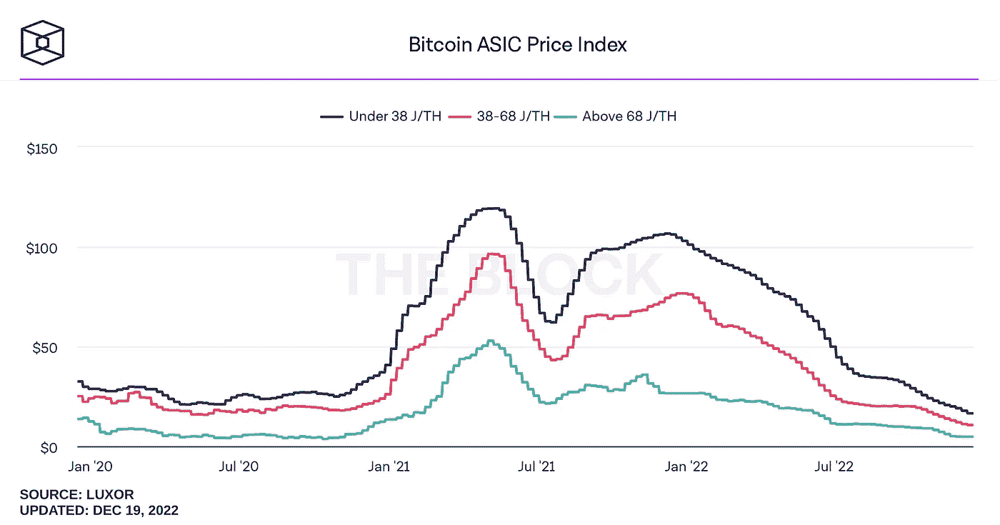
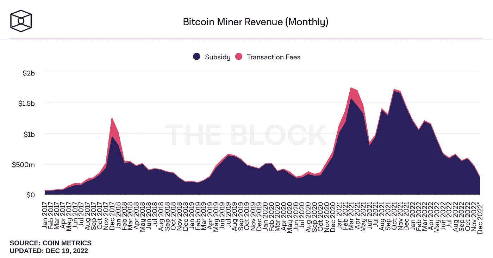
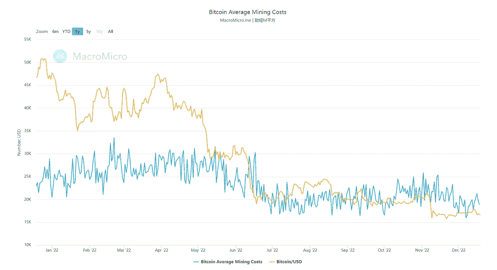
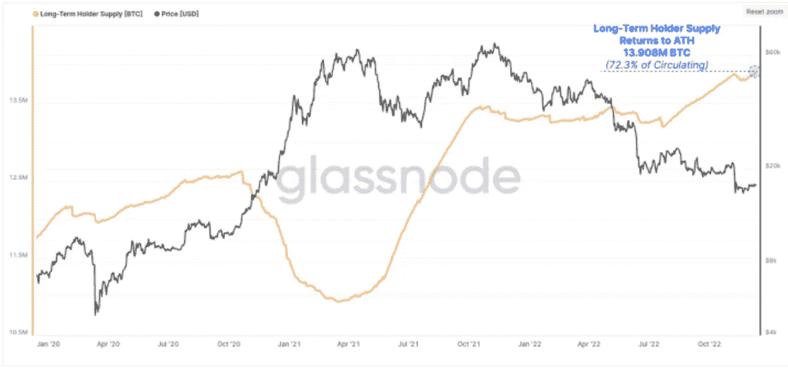
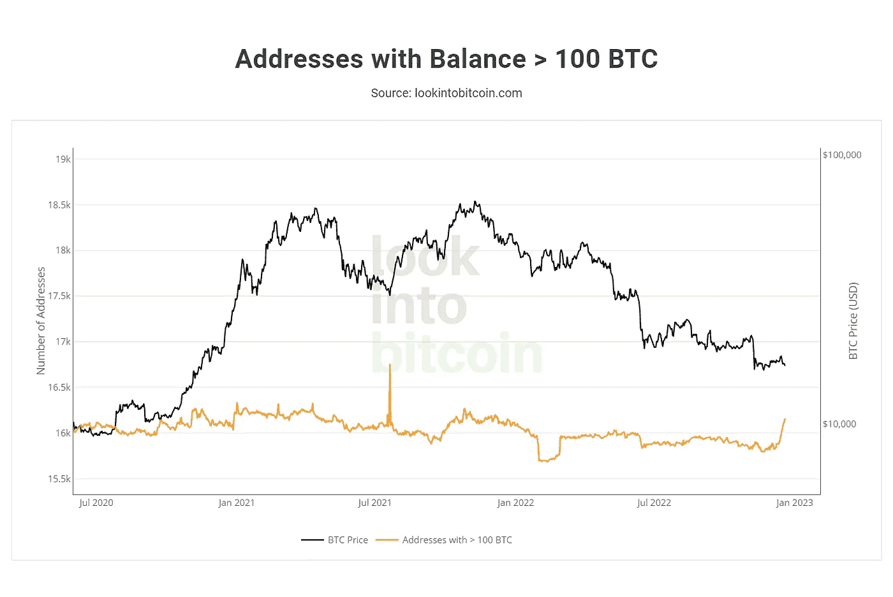
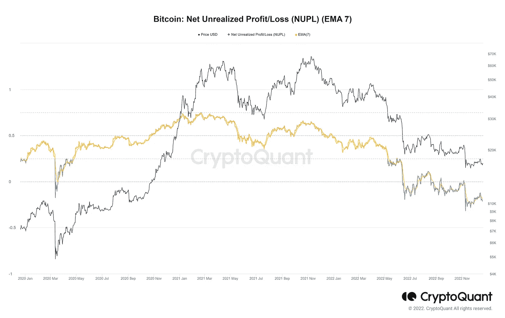

# 基于链上数据的 2023 年比特币分析

> 原文：<https://medium.com/coinmonks/analysis-of-bitcoin-in-2023-based-on-on-chain-data-3374b43424b2?source=collection_archive---------16----------------------->

Analysis of Bitcoin in 2023 based on On-Chain Data

**比特币在网络安全方面的未来:**

最近两年，表示网络安全性的哈希率指标经历了多次大起大落。2021 年 5 月 ATH 注册后，中国禁止开采导致同年 7 月 hash 率下降很多。Satoshi 为网络安全设想的奇妙的自我调节系统发挥了作用，降低了网络的难度，从而降低了采矿设备的价格，激励新人进入该行业，也激励中国矿工向其他国家提供服务。 这最终使哈希利率注册一个新的 ATH，但在未来，随着大多数有影响力的国家的宏观经济中产生的问题，冒险市场受到这些事件的影响，并导致他们中的许多人下跌。 这也导致了矿工们在当前成本的压力下，以更低的价格出售他们的比特币，从而导致价格进一步下跌，以至于最后，对于一些矿工来说，比特币的价格在经济上不再合理，并导致运营的关闭。被开采，再次哈希率受到影响，在这个阶段，几个月后，情况有所改善。最后，最近几天，随着加密货币行业破产等事件的发生以及宏观经济缺乏改善，我们再次看到比特币价格的下跌，这再次影响了哈希率，但似乎随着 Satoshi 的自我调节系统在几个月内也将很好地发挥作用，随着网络难度的降低以及采矿设备价格的降低， 即使一些矿工离开这个行业，也会鼓励新人投入到这个领域，网络的安全性也会得到保证。

Comparison of hash rate, difficulty, and price

bitcoin-ASIC-price-index

**来年矿工状态:**

最近几个月，矿工已经成为比特币生态系统中最重要的参与者之一，因为随着世界大部分地区能源价格的上涨和比特币价格的下降，他们面临着前所未有的压力。在下图中，你可以看到矿工的月收入，自 2022 年初以来，他们的收入一直在减少。而且看起来按照世界经济的状态，这种趋势在未来几个月内还会继续，或者最好的情况下，维持在同样的区间。

bitcoin-miner-revenue-monthly

此外，根据下图，您可以看到矿工持有的比特币数量明显减少，这可能是出售比特币以覆盖其当前成本的迹象，尽管根据下图，根据宏微网站的报告，目前平均开采成本约为 18800 美元。

Bitcoin Average Mining Cost

根据上述信息，如果宏观经济形势仍然处于收缩状态，能源价格不断上涨，那么一批矿工破产的可能性可能就在不远处，并且考虑到矿工们可支配的比特币数量在 It 市场上是显著和有效的，出售过多会导致其价格急剧下降。

**长期持有人行为分析:**

长期持有人通常是那些没有被瞬间事件俘获，并在比特币的整个历史中赚取了最多利润的人。在下表中，你可以看到，当比特币价格上涨时，他们一直是卖家，当价格下跌时，他们一直是比特币的买家，并增加了自己的比特币数量。目前，同样的事情再次发生，自从比特币价格跌至 26000 美元以下以来，长期持有者一直在购买和添加他们的比特币。可以假定，他们预计未来价格会上涨。

Long-Terms Holder Supply (BTC)

此外，为了得到更多的证实，我们去了有超过 100 个比特币的地址，检查他们的行为，你可以在下面的图表中看到，这群演员的行为没有伴随着恐惧，他们几乎有一个中性的行为。

Bitcoin Wallet Sizes _ 100 BTC

这是长期持有者和比特币巨鲸的行为，而 NUPL 指数自 7 月以来一直处于投降方，加密市场正处于最绝望的日子。

Bitcoin Net Unrealized Profit_Loss (NUPL) (EMA 7)

**结论:** 根据这样的数据，如果我们想对密码市场的各种参与者的情绪有一个总结，并以此为基础，提出 2023 年的一些可能场景。

**第一个场景:**

根据这种情况，宏观经济形势保持紧缩，并且还会发生诸如大型项目破产或失败的事件，这引起了严重的恐惧并导致资金从加密市场大量撤出。在这种情况下，许多矿商将面临流动性和经济效率低下的问题，并将不可避免地被从市场中移除，这将给市场带来双重销售压力。随着新的矿用设备价格和网络难度的降低，新的投资者进入这个行业，降低了网络安全的风险。

**第二种情景:** 在这种情景中，crypto 不会发生非常大的坏事，宏观经济状况将从 2023 年年中开始改善。它将走出严重的收缩，这可能导致资金进入高风险市场，持有人将退出交易，交易量将增加。市场状况会慢慢好转。

**第三种情况:** 考虑到宏观经济数据和条件无法预计至少在 2023 年初退出紧缩趋势，为了有一个乐观的情况，密码行业必须发生重大事件，以便流动性进入该行业，这些事件如有影响力和人口众多的国家通过法律将有助于流动性进入该市场，或区块链行业出现新趋势，将改变该领域的投资和资金。

> 交易新手？尝试[加密交易机器人](/coinmonks/crypto-trading-bot-c2ffce8acb2a)或[复制交易](/coinmonks/top-10-crypto-copy-trading-platforms-for-beginners-d0c37c7d698c)
> 
> 多样化密码持有量，了解币安的替代方案
> 
> 加入 Coinmonks [电报频道](https://t.me/coincodecap)和 [Youtube 频道](https://www.youtube.com/c/coinmonks/videos)获取每日[加密新闻](http://coincodecap.com/)

# 另外，阅读

*   [复制交易](/coinmonks/top-10-crypto-copy-trading-platforms-for-beginners-d0c37c7d698c) | [加密税务软件](/coinmonks/crypto-tax-software-ed4b4810e338)
*   [网格交易](https://coincodecap.com/grid-trading) | [加密硬件钱包](/coinmonks/the-best-cryptocurrency-hardware-wallets-of-2020-e28b1c124069)
*   [密码电报信号](/coinmonks/top-3-telegram-channels-for-crypto-traders-in-2021-8385f4411ff4) | [密码交易机器人](/coinmonks/crypto-trading-bot-c2ffce8acb2a)
*   [最佳加密交易所](/coinmonks/crypto-exchange-dd2f9d6f3769) | [印度最佳加密交易所](/coinmonks/bitcoin-exchange-in-india-7f1fe79715c9)
*   [面向开发人员的最佳加密 API](/coinmonks/best-crypto-apis-for-developers-5efe3a597a9f)
*   最佳[密码借贷平台](/coinmonks/top-5-crypto-lending-platforms-in-2020-that-you-need-to-know-a1b675cec3fa)
*   [免费加密信号](/coinmonks/free-crypto-signals-48b25e61a8da) | [加密交易机器人](/coinmonks/crypto-trading-bot-c2ffce8acb2a)
*   杠杆代币的终极指南