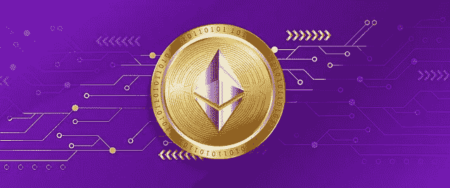
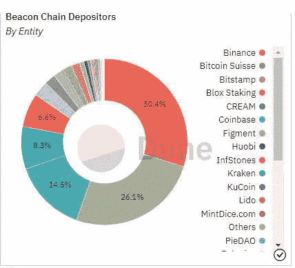
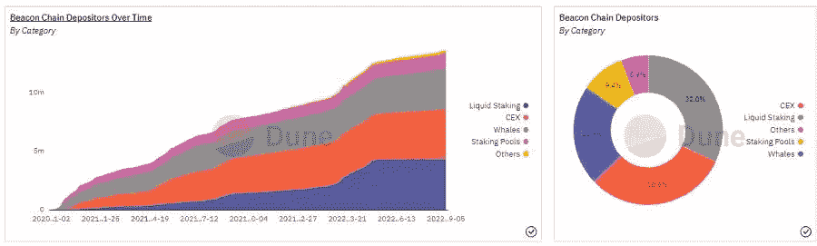

# 分析以太坊信标链在当前形式下的去中心化程度

> 原文：<https://medium.com/coinmonks/analyzing-ethereum-beacon-chains-level-of-decentralization-in-its-current-form-e162e80924e?source=collection_archive---------5----------------------->

以太坊计划在几天内过渡到股权证明网络，我在之前的博客中提供了详细信息

[以太坊本月的重大事件，即将发生的合并将它转变为一个 POS 链！！](/coinmonks/grand-event-this-month-for-ethereum-with-the-merge-happening-soon-transitioning-it-into-a-pos-chain-9683d86ad89b)

许多零售以太坊持有者已经设法在信标链上下注，利用赌注池服务。

[Source](https://dune.com/hildobby/ETH2-Deposits). Ethereum’s Beacon Chain has been open accepting ETH stake deposits since December 2020.

让我们用区块链数据分析公司 [Dune 在此](https://dune.com/hildobby/ETH2-Deposits) -提供的数据，在以太坊的信标链中偷偷看一下以太坊存款和赌注图片

【https://dune.com/hildobby/ETH2-Deposits 

## 以太坊信标链网络中的标桩数综述

Data from [Dune Analytics](https://dune.com/hildobby/ETH2-Deposits)

因此，目前超过 11%的 ETH 供应锁定在信标链中，自近 2 年前于 2020 年 12 月启动以来，信标链合同中存放了 13，620，226 ETH。

信标链在其网络中有 425，632 个验证器。

## 评估当前信标链网络的分散化水平

***我们来分析一下信标链是如何去中心化的，看看赌注实体持有的网络股份。***

现在让我们检查由以太坊赌注池控制的 ETH 赌注。

Data from [Dune Analytics](https://dune.com/hildobby/ETH2-Deposits)

丽都金融在以太坊的信标链中持有 staked 以太坊 30.37%的市场份额，而比特币基地持有 14.53%，北海巨妖 8.34%，币安 6.6%。这些实体总共拥有以太坊信标链中超过三分之二的以太坊。总的来说，这 4 个最大的赌注池实体持有 60%的以太坊股份。！

Data from [Dune Analytics](https://dune.com/hildobby/ETH2-Deposits)

*是的，从这个角度看，以太坊的信标链看起来是集中的，因为前 4 个池持有相当大比例的赌注以太坊。在分散式网络中，赌注被分配给多个验证器，因此网络的控制是分散的。*

这就是为什么一部分加密社区担心以太坊信标链的集中化，他们特别担心丽都在信标链中占有以太坊超过 30%的市场份额。这显然是巨大的。

[Tweet Source](https://twitter.com/DU09BTC/status/1559962260340195330?s=20&t=UYU2E6N3SH0C-3lm6Ia5VQ)

# 以太坊信标链网络在未来仍然可以变得分散

然而，这并不是全部情况，因为现在只有超过 11%的 ETH 供应存放在信标链中，在不久的将来，可能会出现更多的以太坊股份池，吸收更多的以太坊股份存款。

此外，当更多的以太坊储户在信标链中下注时，如果他们在其他可用的赌注池中下注，而不是在信标链中已经持有大部分赌注以太坊的赌注池中下注，动态可能会改变。

# 信标链上的大多数以太坊位于提供液体赌注的赌注池上

Beacon Chain 中的大部分赌注都是利用流动性赌注服务完成的，以太坊用户可以在获得流动性赌注以太坊资产的同时进行赌注。用户的赌注以太坊一直锁定在信标链中，直到在信标链中激活存款提取。

灯塔链中 32%的以太坊位于提供这些流动赌注服务的赌注池中。丽都金融的 stETH 是市场领导者，作为一种流动的股份以太坊资产，丽都金融的 stETH 广泛用于 AAVE 和化合物等 DEFI 协议。

stETH asset 是如此突出，以至于今年该资产与以太坊挂钩引起了 CEFI 借贷平台 Celsius 的动荡。

**你可以在我的文章中读到这个有趣的故事-:**

[庆祝以太坊与斯特思公司合并，因为这一资产成为今年的头条新闻！！](/coinmonks/celebrating-the-ethereum-merge-with-a-steth-story-as-this-asset-made-headlines-this-year-8251338ddc75)

# 很大一部分以太坊赌注是使用 CEXs 的服务完成的

Data from [Dune Analytics](https://dune.com/hildobby/ETH2-Deposits)

CEXs 占据了 staked ether eum 30%以上的市场份额，许多用户使用币安、比特币基地和北海巨妖等 CEXs 的 staking 服务将他们的 ETH 加入信标链。

币安赌注池也提供液体赌注以太坊，用户在那里下注他们的 ETH 接收 bETH，这是币安灯塔 ETH，这个 bETH 可以在币安智能链的 DEFI 中使用。

比特币基地赌注池还向那些在其赌注池中下注的人提供其液体赌注以太坊资产版本，他们接收 cbETH，这是比特币基地包装的赌注 ETH。cbETH 可以像 stETH 一样在 DEFI 中使用。

# 让我们共同承担以太坊的责任，保持网络的去中心化

好吧，如果我要用一个赌注池来赌我的以太坊，我会选择像 Ankr 这样的赌注池，因为它的市场份额不到 Beacon chain 中赌注以太坊存款的 1%,因为我关心去中心化，这是我可以做的事情，以支持去中心化的以太坊网络。

当然，我希望 Ankr 也能提供我可以在 DEFI 中使用的液体支撑以太坊。

这是我的第三篇关于以太坊灯塔链的文章，庆祝 9 月份几天后发生的“合并”月。

***你可以看我另外两篇关于以太坊信标链的文章*** -:

[以太坊本月将举行盛大活动，合并即将进行，它将转变为一个 POS 链](/coinmonks/grand-event-this-month-for-ethereum-with-the-merge-happening-soon-transitioning-it-into-a-pos-chain-9683d86ad89b)

庆祝以太坊与 stETH 的合并，这一资产成为今年的头条新闻！！

***感谢阅读。***

> 交易新手？尝试[加密交易机器人](/coinmonks/crypto-trading-bot-c2ffce8acb2a)或[复制交易](/coinmonks/top-10-crypto-copy-trading-platforms-for-beginners-d0c37c7d698c)