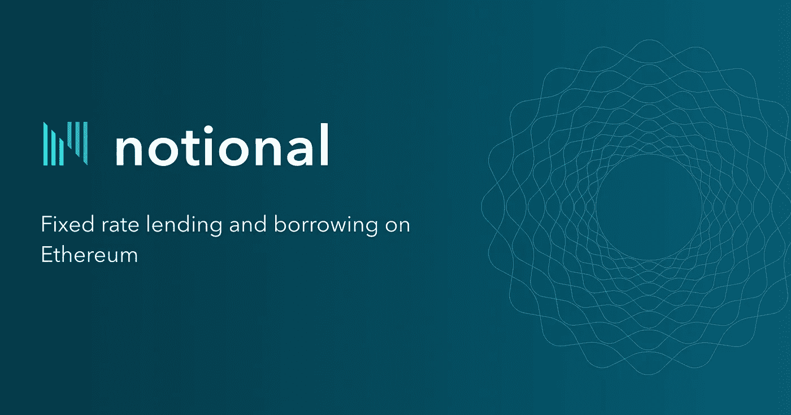
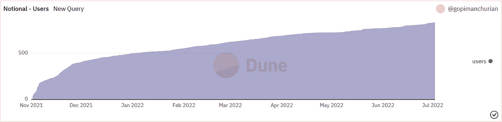
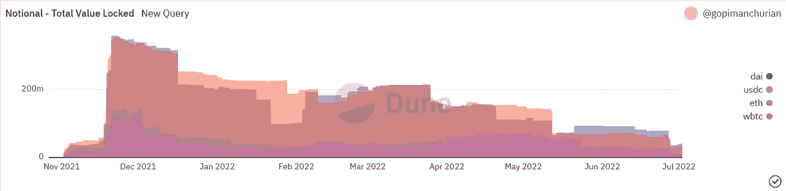
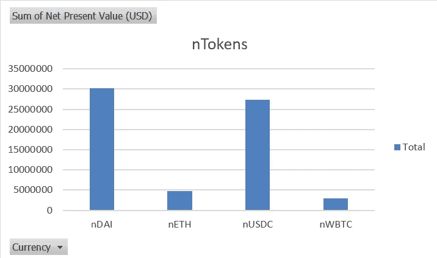
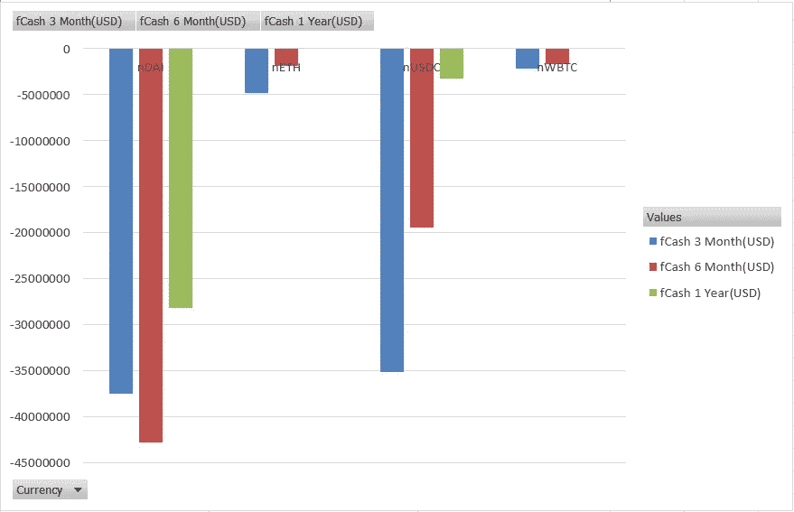
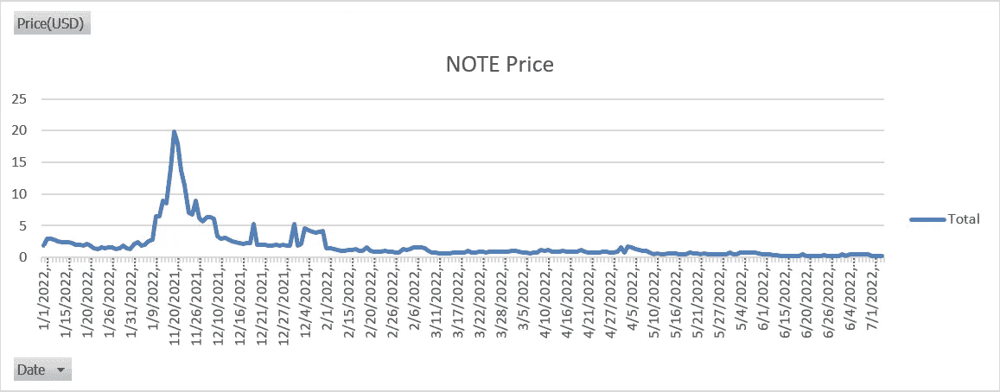
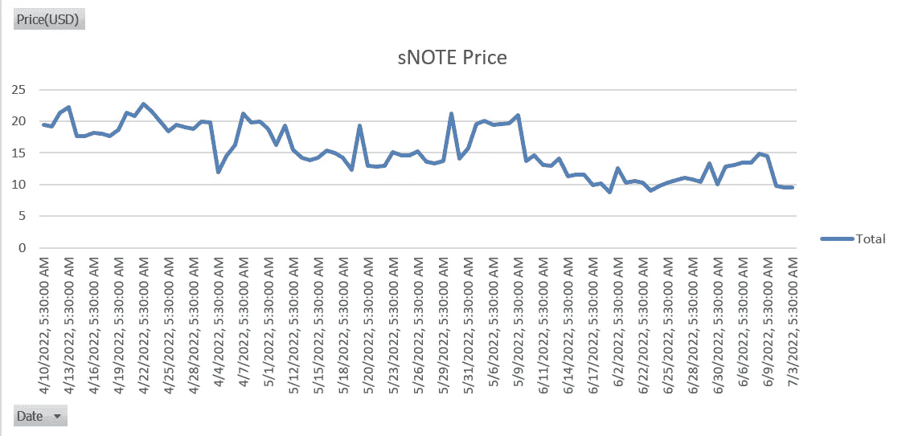

# 分析名义金融

> 原文：<https://medium.com/coinmonks/analyzing-notional-finance-b2859d6ec720?source=collection_archive---------34----------------------->

[【网站】](https://notional.finance/) [【文档】](https://docs.notional.finance/notional-v2/) [【推特】](https://twitter.com/NotionalFinance)[【Github】](https://github.com/notional-finance)

名义协议是一个分散的协议，用于以太坊上加密资产的固定利率、固定期限借贷。用户可以以各种资产作为抵押，以固定利率借出或借入像和戴这样的稳定资产，期限最长为 6 个月。

在这篇文章中，我将浏览名义上的协议的统计数据，伴随着从 Dune、Messari、Flipside 等公共数据源创建的各种视图和仪表板，以及名义上自己的历史数据浏览器，以支持相同的功能。[nominal 的历史数据](https://info.notional.finance/historical-data) explorer 允许用户下载不同指标的历史数据，从而更快、更轻松地分析趋势和模式。

先说平台，名义金融的第一版于 2020 年初开发并推出，但自第二版发布以来，它在 2021 年底获得了牵引力。从下面两个视图中可以明显看出这一点，这两个视图显示了随着时间的推移，名义 V2 锁定的用户基数和总价值。

Notional Userbase over time (Data Source: Dune Analytics)

Notional TVL across different Crypto offerings (Data Source: Dune Analytics)

fCash 令牌充当概念平台的构建块。它们基本上是一个人在平台上交易的收据，用于表示对未来特定时间点的正(借贷)或负(借贷)现金流的主张。这些 fCash 令牌总是成对生成，正表示资产，负表示负债，它们的净值总是为零。

> 交易新手？尝试[加密交易机器人](/coinmonks/crypto-trading-bot-c2ffce8acb2a)或[复制交易](/coinmonks/top-10-crypto-copy-trading-platforms-for-beginners-d0c37c7d698c)

名义银行也有自己的 AMM，可以实现无缝借贷。用户也可以选择启用代币的流动性，通过 nTokens 换取被动回报。每项资产都有自己的 nToken，它们有利息，可转让，也可以作为平台上的高质量抵押品。从下面的观点来看，很明显，用户更喜欢提供稳定的货币流动性，很可能是为了避免瑞士法郎和 WBTC 的波动带来的非永久性损失。

Net Present Value of nTokens (USD) (Data Source: Notional Historical Data Explorer)

同样的情况也适用于 fCash，如下图所示，这基本上表明了一个事实，即用户更喜欢与 stablecoins 中的名义(借出、借入或提供流动性)进行互动，而不是 ETH 和 WBTC。

fCash trend (USD) (Data Source: Notional Historical Data Explorer)

注意，名义上的治理是在它们的令牌的帮助下完成的。票据持有人可以提议、投票和实施对名义系统参数和智能合约的更改。每个票据持有人持有的每张票据都有一票。以下视图显示了票据的价格:

NOTE Price since Jan 2022 (USD) (Data Source: Notional Historical Data Explorer)

票据持有人还可以将他们的票据代币进行赌注以获得赌注票据代币(sNOTE)，这使得他们可以从他们的票据中赚取收益，并且有助于名义协议的安全性并为票据代币提供流动性。为了赚取 sNOTE，用户必须在平衡器上将他们的纸币转换为 80/20 纸币/WETH LP 令牌。sNOTE 可用于赎回存款资产，也是可转让的。以下视图显示了 sNOTE 价格的变化:

sNOTE Price since Apr 2022 (USD) (Data Source: Notional Historical Data Explorer)

在以太坊区块链，名义金融无疑是最有希望的稳定货币交易平台之一，无论是借贷。他们有一个透明的管理系统，并向用户提供各种方法来赚取利息和他们所拥有的资产的收益。然而，他们在 WBTC 和瑞士联邦理工学院的不稳定资产方面做得不太好。考虑到 stablecoins 的成功历史，Notional 应该考虑将更多的 stablecoins 纳入他们的投资组合，最好从 USDT 开始，为他们的用户提供更多的选择。未来加入多链支持也能为协议创造奇迹，极大地增加他们的用户基础，让他们接触到更广泛的受众。

他们的礼宾储备也说了同样的关于他们有前途的性质:

Protocol Reserves since Nov 2021 (Data Source: Notional Historical Data Explorer)

对于未来的用户来说，什么样的概念应该是真正令人兴奋的等待形式，这个平台有可能真的去月球！🚀