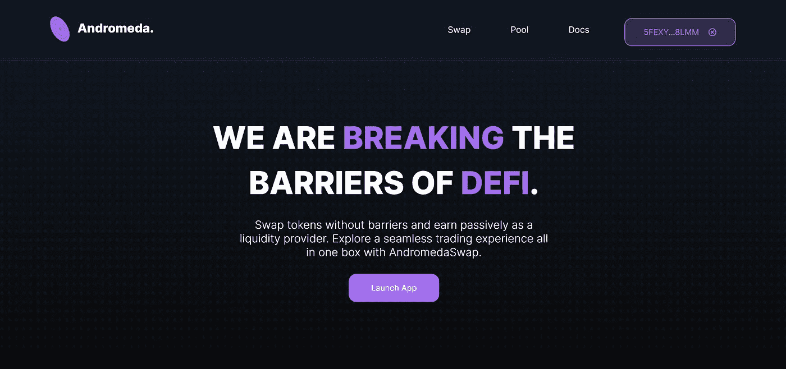
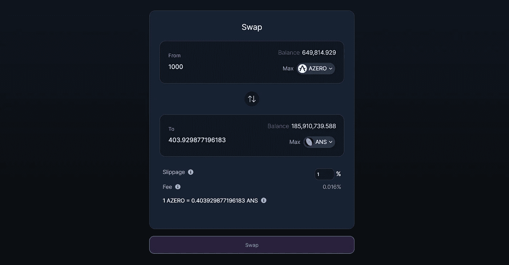
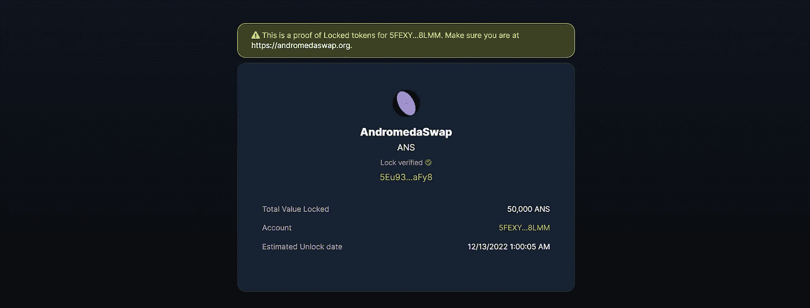
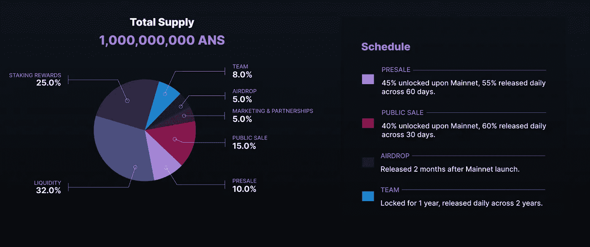

# AndromedaSwap:在 Aleph Zero 上保护 DeFi 的网关？让我们找出方法。

> 原文：<https://medium.com/coinmonks/andromedaswap-gateway-to-secure-defi-on-aleph-zero-lets-find-out-how-78b30ea88a34?source=collection_archive---------23----------------------->

I 建立 DeFi 解决方案是一回事，为社区建立安全、可持续和安全的解决方案是另一回事；这就是为什么 AndromedaSwap 在 Aleph Zero 上推出了与众不同的产品。

Aleph Zero 被证明是一个改变游戏规则的第一层区块链，专注于隐私、安全、去中心化以及最重要的性能；号称 10 万 TPS 和 0.8 到 0.9s 的块终结性(厉害吧？).

不仅这些令人难以置信的壮举得以上演，而且它还带来了惊人的低交易费，平均为 0.0004 Aleph Zero(按当前市场利率计算，约为 0.00032 美元)。

这些是 Aleph Zero 成为冒险定义的最佳地点之一的一些原因；不仅仅是 DeFi…区块链技术可以应用于许多其他领域，以提供围绕 AgriFi、GameFi 等的高效产品和服务。

这就是为什么仙女座互换是建立在 Aleph Zero 上的原因。

# 什么是仙女座互换？

AndromedaSwap 是一个基于 Aleph Zero 区块链的自动化做市商(AMM)分散式交易所，旨在为社区提供一种安全可靠的资产交易方式。

凭借强大的基础设施，AndromedaSwap 为流动性提供商提供了一种通过向他们最喜欢的令牌对提供流动性来盈利的手段，同时为两个令牌之间的互换(交易)创造了一种途径；使用一个定义的公式，从令牌 A 到令牌 B，反之亦然。

AndromedaSwap 为 Aleph Zero 区块链带来了以下几个解决方案:

## AMM(互换)

AndromedaSwap Swap Interface

AndromedaSwap 作为一个协议使用 PSP22 令牌，并允许在 PSP22 令牌和 PSP22 令牌或 AZERO 和 PSP22 令牌之间进行交易，视情况而定，这可能基于由流动性提供者提供的流动性。交易基于由 AZERO 和 PSP22 代币或 PSP22 代币和 PSP22 代币组成的任何池中的资产比率。

当流动性被提供给任何池时，与之相关联的若干 PSP22 代币(称为流动性池代币)被铸造给提供者，并且代表它们的供应份额。假设**爱丽丝**有两个代币，分别是**代币 A** 和**代币 B** ，并且她想要向给定的池(代币最初没有存入其中)添加流动性，并且她分别添加了 100 和 200 的代币 A 和代币 B，100 LP 代币被铸造给她以代表她在池中的份额。在这种情况下，LP 令牌的总供应量变为 100。

现在，假设 **Bob** 也想为同一个池提供流动性，他必须以 100:200 的相同比例存放代币 A 和 B，根据具体情况，该比例可以是 500:1000 或 1000:2000。如果他分别存入 200 个代币 A 和 400 个代币 B，他将获得 200 个为他铸造的 LP 代币(该对代币中的第一个代币用于将铸造量与流动性提供者挂钩)，这也代表了他在池中的份额。这样，LP 代币的总供应量变成 300，然后他的份额是 200/300 乘以 100，这是池的 66.66…%, Alice 的份额变成 100/300 乘以 100，这是池的 33.33…%。就这么简单。

该协议收取费用，这些费用被拆分并留在资金池中，供流动性提供者作为费用赚取。这样，当他们通过发送 LP 令牌来撤回令牌时。他们可以根据他们在池中的份额以及价值相同的代币 A 和代币 B 的数量来扣除额外的费用。

当交易者交换代币时，他们支付从存放的代币中扣除的费用，并且打算从任何相关联的池中接收代币。

就这么简单。

## 令牌锁定/刻录

Proof of Locked Liquidity

这是该协议最吸引人的方面，因为从项目所有者的角度来看，它与协议的安全性和真实性相关联。令牌锁定/刻录功能为用户提供了无缝锁定和刻录令牌的途径。

当对协议执行锁定时，用户可以与他人共享与给定锁定令牌相关联的链接，以进行确认或验证。在烧伤方面也是如此。

这两个特性之间的唯一区别是令牌锁是临时的，而令牌烧录是永久的。

这一切意味着什么？这让我们想到了“流动性被锁定的证明”和“流动性被烧毁的证明”的现象。

**锁定流动性的证明:**这是一种方式，项目所有者在预定的时间段内锁定他们的 LP 令牌，以避免在锁定的时间范围内被移除；还具有社区可以容易地验证动作真实性的手段。你可以在[这篇文章](https://hackernoon.com/why-locking-liquidity-is-important-for-cryptocurrency-qv4d37hd)中了解更多。仙女座互换以一种非常流畅的方式和体验从头到尾促进了这个过程。

**流动性枯竭的证据:**这是项目所有者永远烧掉(或扔掉)他们的 LP 代币的一种方式，烧到一个无法接近的钱包或通过算术扣除；还具有社区可以容易地验证动作真实性的手段。当代币被烧毁时，它导致代币的价值增加。但在流动性枯竭的情况下，它会永久取消项目所有者或相关个人从相关池中移除流动性的权利。你可以在[这篇文章](https://academy.swissborg.com/en/learn/token-burning)中了解更多。AndromedaSwap 使烧毁代币变得容易，并显示可验证的烧毁流动性代币的证据。

说了这么多，下面将分享一些关于该协议的信息:

# 令牌组学

要访问仙女座互换，请访问 https://andromedaswap.org 的。

要加入它的 Discord 服务器，请点击[链接](https://discord.gg/3T3KfzC2AZ)。

推特: [@SwapAndromeda](https://twitter.com/SwapAndromeda)

# 摘要和脚注

仙女座互换是阿莱夫零号上 DeFi 的未来。通过[这个链接](https://alephzero.org)访问 Aleph Zero 的官方主页。