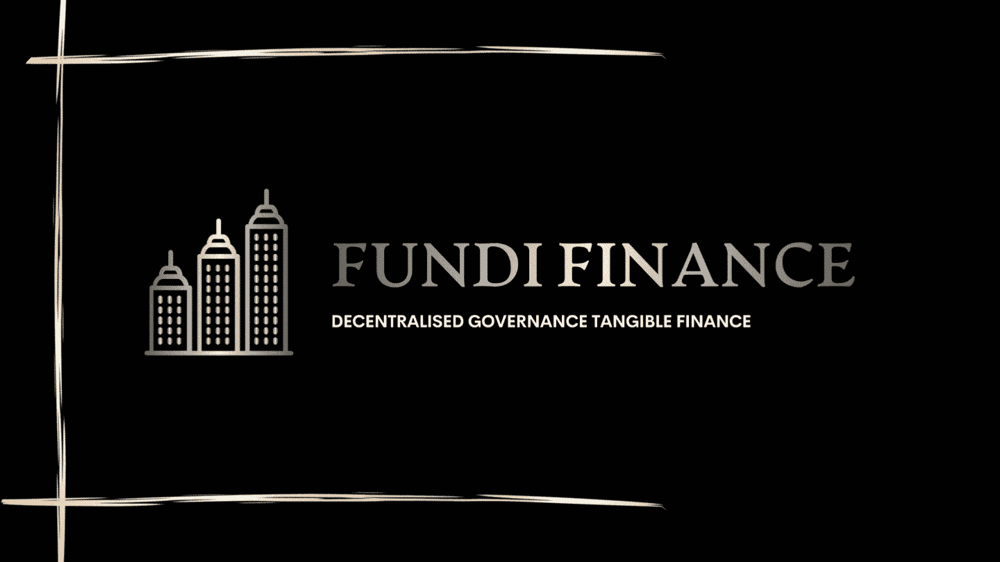

# 芬迪金融有限公司的天使投资机会。

> 原文：<https://medium.com/coinmonks/angel-investment-opportunity-at-fundi-finance-ltd-6106196d4220?source=collection_archive---------22----------------------->

我们在 Fundi Finance 为所有投资者带来了一些好消息，现在我们是一家在英国注册的公司，我们准备寻求一些进一步的投资来帮助公司发展。我们目前有机会让天使投资者通过可转换票据购买一些股票，成为我们神奇旅程的一部分。在这轮投资中，我们将释放 5%的商业股权，总投资价值为 50，000 美元，天使投资者可以每次购买低至 0.2%股权的股份。这让散户投资者有机会购买股票，目前的法律允许年收入 10 万美元或以下的散户投资者投资 2000 美元。高收入阶层的高净值个人或天使可以购买全部的 5%,如果他们愿意的话。

# **如何联系 Fundi Finance 获得天使投资机会？**

天使投资人可以通过以下途径直接联系 Fundi Finance CEO。
地址
老格洛斯特街 127 号
伦敦
WC1N 3AX
英国。

电话
(+44) **02045484883**

电子邮件
founder@fundifinance.com

# **天使基金会被用来做什么？**

建议的一轮投资资金将用于两个领域，首先是房地产平台的开发，该平台目前仅处于演示阶段，演示可在此处查看[https://fundi-website-6z spk 1 hat-fundi-finance . vercel . app/realestatemarket . html](https://fundi-website-6zspk1hat-fundi-finance.vercel.app/realestatemarket.html)。其次是申请 FCA 注册和申请许可证，在英国提供金融服务。

# **可转换票据的期限是多长？**

目前提议的天使投资轮将向天使投资者发行 12 个月到期的可转换票据。

# **票据将在什么样的法律下发行？**

票据将遵循英国法律的法律要求，并根据我们的法律团队提供的建议，遵循每个投资者的司法管辖权。

> 交易新手？试试[加密交易机器人](/coinmonks/crypto-trading-bot-c2ffce8acb2a)或者[复制交易](/coinmonks/top-10-crypto-copy-trading-platforms-for-beginners-d0c37c7d698c)