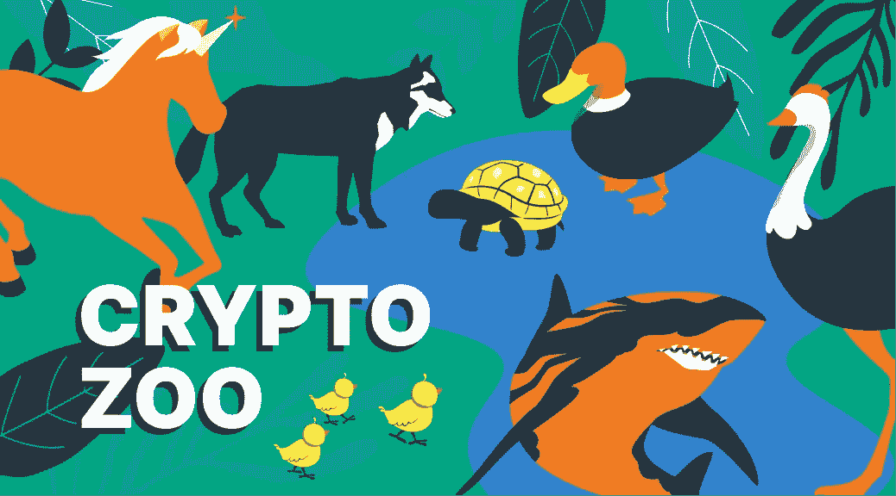

# 加密市场中的动物:独角兽、乌龟、鸡、狗、仓鼠和许多其他动物

> 原文：<https://medium.com/coinmonks/animals-in-the-crypto-market-unicorns-turtles-chickens-dogs-hamsters-and-many-others-ada4280b6b9b?source=collection_archive---------15----------------------->

欢迎来到我们快乐的加密动物园！这是关于加密投资中不同动物的文章的第二部分。你可以在这里阅读第一部分— [加密鲸、公牛和熊的概述](https://stealthex.io/blog/a-brief-overview-of-crypto-whale-bull-and-bear/)。

虽然在谈论加密货币时，你经常会遇到鲸鱼、鲨鱼、熊和公牛，但还有许多其他奇异的动物生活在加密世界中。你不能总是仅凭动物的种类来判断它们是谁或做什么。让我们继续了解一些更令人兴奋和鲜为人知的术语，并深入了解加密货币背后的文化。首先，我们将触及不存在的隐秘动物…

# 流行的秘密投资俚语:动物

# 熊鲸

这个词是我们在上一篇文章中讨论过的两个流行术语[的混合。这是什么动物品种？好吧，事实上，这是一个拥有巨大金融机会的交易员的名字，他对某种加密货币持悲观态度，并预计其报价会下跌。](https://stealthex.io/blog/a-brief-overview-of-crypto-whale-bull-and-bear/)

让我们用几个与熊相关的术语来结束它。“熊市”、“空头陷阱”和“熊市旗”也属于这一类。术语“看跌”是指交易者悲观，认为价格会从目前的位置下跌。如果你看跌一个市场，你认为市场会下跌。

“空头陷阱”是指当一种货币对的价格下跌时，交易员建立空头头寸，结果价格反转并走高。“熊市”是一种技术形态，它是现有下降趋势的延伸/延续。熊市形态是从一个最初的强向下移动开始的，随后是一个向上的盘整通道。强势下跌被称为“旗杆”，而盘整被称为“旗帜”本身。

# 独角兽企业

金融家们似乎越来越喜欢市场中的动物形象。在股票市场上，我们有多头和空头争夺价格水平，甚至有独角兽战胜所有这一切。“独角兽”是一个相对较新的术语，是一家私人控股的初创公司，通常位于科技行业，估值超过 10 亿美元，在首次公开募股(IPO)后可能会有更大的财富。近年来，这些独角兽公司中的一些进行了首次公开募股，却眼睁睁地看着它们的股票下跌。

# 猿和猿

“模仿”这个词在加密社区中经常出现。apeing 一词来源于 ape，指的是交易者在没有做任何适当的研究或尽职调查的情况下，就购买了一个新的代币或硬币。为什么一个交易者会这么做？不做任何研究就买东西交易，显然不是明智之举。好吧，这样的交易者通常是在他们害怕错过下一个大机会的时候，或者当他们有 FOMO，害怕错过的时候。

# 兔子

密码行业的许多俚语也来源于股票市场的交易。兔子这个词用来描述那些在很短时间内建仓的交易者或投资者。这些交易者的交易时间通常是几分钟。

这些类型的交易者是黄牛党，试图在白天获利。他们不想要隔夜(或长期)风险，只是在寻找一个机会在白天赚点快钱。

# 龟

海龟们是典型的慢买慢卖的投资者，做长期交易。他们着眼于长期框架，尽量少交易。这种投资者不关心短期波动，最关心的是长期回报。

# 羊

绵羊是那些坚持一种投资风格，不随市场变化的投资者。他们通常是最后一个进入上升趋势的，也是最后一个走出下降趋势的。羊喜欢站在大多数(羊群)的一边，跟随导师。他们对开发自己的投资/交易方法不感兴趣。

# 猪

这些投资者或交易者缺乏耐心，愿意承担高风险，贪婪，情绪化。这些投资者不做任何分析，总是寻找热门提示，想从股票市场赚点快钱。猪是市场上最大的输家。

# 鸡

胆小鬼指的是那些害怕股票市场的投资者，因此不愿意冒险。他们通过坚持债券、银行存款或政府证券等保守工具来规避市场风险。

# 鸵鸟

鸵鸟是那种在市场不景气时把头埋在沙子里，希望自己的投资组合不会受到严重影响的投资者。这类投资者会忽略负面消息，期望这些消息最终会消失，不会影响他们的投资。鸵鸟投资者认为，如果他们不知道自己的投资组合表现如何，它可能会以某种方式生存下来，并最终表现良好。

# 狗

狗就是那些因为业绩不好而被市场打趴下的股票。许多金融分析师密切关注狗股，因为他们预计这些股票将在未来几天内回升。

# 牡鹿

这些投资者或交易者对牛市或熊市并不真正感兴趣。他们只是在寻找机会。他们既不看涨也不看跌。例如，stags 可以是在一家公司首次公开发行(IPO)时买入该公司股票，并在股票上市交易时卖出的交易员。他们做股票交易，希望获得上市收益，因此这些人被称为股票交易者。

# 狼（wolf 的复数）

狼是强大的投资者/交易者，他们使用不道德的手段从股票市场赚钱。大多数情况下，这些狼都参与了推动股市走向光明的骗局背后。

# 跛脚鸭

跛脚鸭是一种交易者或投资者，他们交易并以巨额亏损告终。跛脚鸭要么拖欠债务，要么因无力弥补交易损失而破产。这个短语可以追溯到商品交易的早期和 18 世纪中期伦敦证券交易所的发展。

# 鹰派和鸽派

鹰派和鸽派是用来描述对不同经济形势持批评态度的政策制定者的术语。在美国金融市场，“鹰派对鸽派”通常指的是对利率和美联储货币政策的对立态度。“鹰派”希望在经济形势下采取强硬立场，而“鸽派”则希望轻松应对。

# 道琼斯的狗

这是一种流行的投资策略，投资者每年从道琼斯工业平均指数(DJIA)中选择 10 只股息收益最高的蓝筹股。跟踪这些狗的主要原因是它提供了一个简单的公式，设计用来表现与道琼斯指数大致一致的股票。这个概念最初是由迈克尔·奥·希金斯(Michael O'Higgins)在他的《击败道指》(Beating the Dow)一书中提出的，他还在书中创造了“道指之狗”(Dogs of the Dow)这个名字。类似于这个概念，狗的 Sensex 是在印度使用。

# 死猫反弹

死猫反弹俚语用来指熊市期间的暂时恢复。它可能意味着熊市中的暂时上涨，也可能指特定的股票行为。有趣的是，这个短语被用来解释如果你把一只死猫高速扔向墙壁，它会反弹——但它仍然是死的。

# 飞越秘密巢穴

动物俚语不仅限于股票。一些选择策略是以昆虫和鸟类命名的。蝴蝶差价、秃鹰和铁秃鹰都是期权策略，旨在通过时间的推移或波动性的变化(或缺乏变化)来获利。

举例来说，一个长蝴蝶价差使用的是基于 1:2:1 比例的期权合约，其中外侧的单一期权是多头头寸，即“翅膀”，中间的两个期权是空头，构成了“身体”他们的风险分布图的形状类似于有翅膀的生物，蝴蝶的头比秃鹰或铁秃鹰更尖。

# 黑天鹅

也许华尔街动物园里最恐怖的动物是黑天鹅，这意味着最深刻的危机。黑天鹅通常适用于人们从未准备好的异常的、极端影响的事件。2008 年雷曼兄弟的倒闭、2010 年 5 月的“闪电崩盘”和 2016 年的英国退出欧盟投票被认为是黑天鹅。金融学教授、作家、前华尔街交易员纳西姆·尼古拉斯·塔勒布在他 2007 年的著作《黑天鹅:极不可能事件的影响》中推广了这个术语。

# 仓鼠

最后，让我们用一只真正的仓鼠来结束我们的动物园。2021 年秋天，一只名叫 Goxx 先生的德国仓鼠和数百万其他密码爱好者一起加入了这股潮流。

仓鼠的人类商业伙伴进行了刚刚超过 300 欧元的初始投资，仓鼠绕着“意向轮”运行以选择特定的硬币。接下来，仓鼠要么穿过买入隧道，要么穿过卖出隧道。每当仓鼠这样做时，他的人类伙伴要么购买要么出售价值 20 美元的所选加密货币。

这只仓鼠的买卖订单已经发布在 Reddit 和 Twitch 上，它的表现相当令人印象深刻。2021 年 9 月，自 6 月份以来，Goxx 的初始投资获得了约 20%的回报，不仅跑赢了标准普尔 500，也跑赢了沃伦巴菲特旗舰基金伯克希尔哈撒韦的表现。

如果你正在寻找购买加密，你可以随时使用用户友好的和非托管的 [StealthEX](https://stealthex.io/) 加密交换平台。你可以私下购买加密，不需要注册服务。我们的加密收藏有 600 多种不同的硬币，您可以立即进行钱包到钱包的转账，没有任何问题。

请务必关注我们的[媒体](https://stealthex-io.medium.com/)、[推特](https://twitter.com/Stealthex_io)、[电报](https://t.me/StealthEX)、 [YouTube](https://www.youtube.com/channel/UCeES_XBesX76ge7xf1meuSw) 和 [Publish0x](https://www.publish0x.com/stealthex) 以获取 [StealthEX.io](https://stealthex.io/) 更新和关于加密世界的最新消息。如果你需要帮助，请发邮件至 support@stealthex.io。

*请确保在投资前研究任何加密货币并评估风险。*

*最初发表于*[T5【https://stealthex.io/blog/】T6](https://stealthex.io/blog/animals-in-the-crypto-investing-market/)T8👈

> *交易新手？试试* [*密码交易机器人*](/coinmonks/crypto-trading-bot-c2ffce8acb2a) *或* [*复制交易*](/coinmonks/top-10-crypto-copy-trading-platforms-for-beginners-d0c37c7d698c)
> 
> *分散加密持股，了解一下* [*币安的替代品*](https://coincodecap.com/binance-alternatives)
> 
> *加入 Coinmonks* [*电报频道*](https://t.me/coincodecap) *和* [*Youtube 频道*](https://www.youtube.com/c/coinmonks/videos) *获取每日* [*加密新闻*](http://coincodecap.com/)

# 另外，阅读

*   [复制交易](/coinmonks/top-10-crypto-copy-trading-platforms-for-beginners-d0c37c7d698c) | [加密税务软件](/coinmonks/crypto-tax-software-ed4b4810e338)
*   [网格交易](https://coincodecap.com/grid-trading) | [加密硬件钱包](/coinmonks/the-best-cryptocurrency-hardware-wallets-of-2020-e28b1c124069)
*   [密码电报信号](/coinmonks/top-3-telegram-channels-for-crypto-traders-in-2021-8385f4411ff4) | [密码交易机器人](/coinmonks/crypto-trading-bot-c2ffce8acb2a)
*   [最佳加密交易所](/coinmonks/crypto-exchange-dd2f9d6f3769) | [印度最佳加密交易所](/coinmonks/bitcoin-exchange-in-india-7f1fe79715c9)
*   [开发人员的最佳加密 API](/coinmonks/best-crypto-apis-for-developers-5efe3a597a9f)
*   最佳[密码借贷平台](/coinmonks/top-5-crypto-lending-platforms-in-2020-that-you-need-to-know-a1b675cec3fa)
*   [免费加密信号](/coinmonks/free-crypto-signals-48b25e61a8da) | [加密交易机器人](/coinmonks/crypto-trading-bot-c2ffce8acb2a)
*   杠杆代币的终极指南