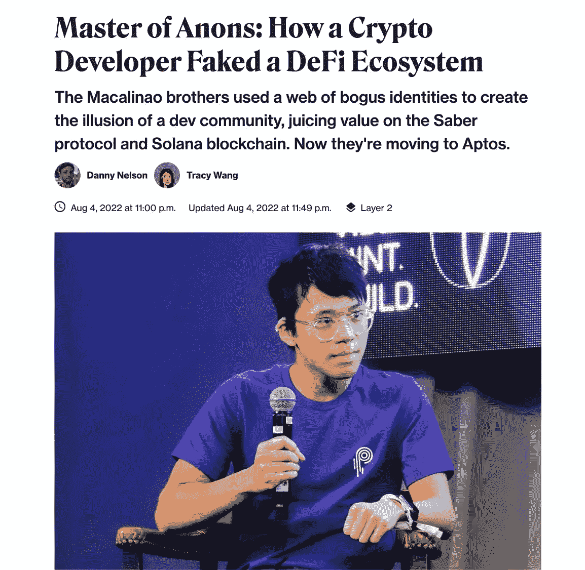
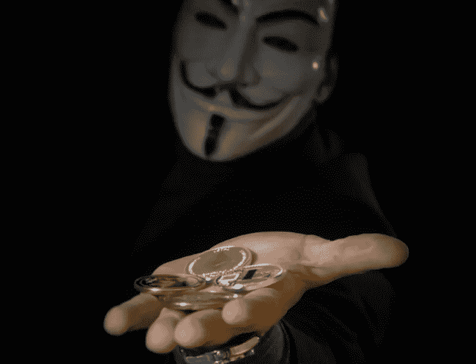

# 匿名在 Web3 中是一把双刃剑

> 原文：<https://medium.com/coinmonks/anonymity-is-a-double-edged-sword-in-web3-b5b0411bd7bb?source=collection_archive---------34----------------------->

Was Solana was a huge promise that never quite delivered?

我刚刚写了一篇关于索拉纳的停机，黑客和成为 Eth 杀手的承诺的文章。

似乎毯子下面有更多的麻烦。

显然，伊恩和迪伦·马卡里诺两兄弟伪造了十几个不同的身份，并建立了 Saber 协议来提高索拉纳的 TVL。

Saber 是 Solana 上最大的 DeFi 应用程序。

TVL 是锁定的总价值，是衡量区块链规模和成功程度的常用指标。

更多的价值锁定在区块链意味着更多的用户和更多的活动，因此更多的增长和生活。

因此，有必要提高区块链的 TVL，向市场发出强烈信号，表明区块链正在增长，市场对此有信心。

索拉纳的 TVL 越高，Sol token 的价格就越高，极大地提高了估值。

“Macalinao 兄弟对 Saber 的操作似乎带有明显的欺骗意图:“我设计了一个方案来最大化 Solana 的 TVL:我将建立一个堆叠在彼此之上的协议，这样一美元可以被数几次，”Ian Macalinao 在未发表的博客帖子中写道。"

I am certainly impressed by the level and effort of investigative journalism put into work to uncover this.

简单来说，开发者创造了一种多次数钱的方法，操纵 TVL 比实际高得多。

他们跨不同的服务和协议多次计算资产，这些服务和协议看起来不同，但实际上是同一件事。

它有多大？

索拉纳·TVL 为 105 亿美元

Saber protocol 在巅峰时期有 75 亿美元。

简单地说，索拉纳的 3/4 的 TVL 可能被操纵和虚假报道。

他们做错了什么？

他们伪造了身份。

这在 web3 中很常见，在那里你基本上是未知的，直到你被正确地 doxxed。

他们还创建完整的协议和服务来吸引资金。

这创造了一个庞大且不断增长的用户群和总价值的虚假信号，但实际上是相当误导的。

这在加密领域一直都在发生。

制造炒作，产生信号，并向市场发出信号，表明某些事情即将发生。

当人们买它的时候，你就把代币扔给他们，然后获得可观的利润。

Anonymity was a prized feature of crypto, but also its most controversial.

在这种情况下，Macalinao 兄弟实际上花费了额外的努力来博弈系统，并在协议之上构建协议来执行他们的计划。

这是一个精心设计的，耐心和非常计算的举动。

建立一个协议一点也不容易。

再加上 Solana 是最热门的连锁店之一，用户数量激增，复杂性和问题指数化。

你必须尊重马卡里诺兄弟在这场漫长的骗局中的努力工作(如果这确实是真的)。

现在，他们正把 Saber 转移到 Aptos，另一个 1 层区块链。

冲洗和重复？

但愿不会。

这将如何伤害索拉纳？

人们还会相信马卡里诺兄弟吗？

怎样才能防止这样的事情再次发生？

匿名和 web3 能和平共存吗？

随着 web3 的发展壮大，这些都是我们必须努力解决的问题。

-

在 Web3 中匿名是一件好事吗？

-

#创业#商业# startupx #成长#成功#社交媒体#文化#网络 3 #战略#区块链# tvl # sola na # sol # saber # sunny # eth # BTC # crypto #黑客#Macalinaobrothers

> 交易新手？试试[加密交易机器人](/coinmonks/crypto-trading-bot-c2ffce8acb2a)或者[复制交易](/coinmonks/top-10-crypto-copy-trading-platforms-for-beginners-d0c37c7d698c)