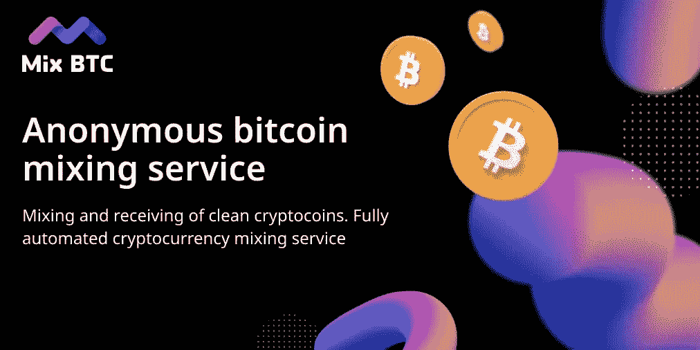

# 匿名购物

> 原文：<https://medium.com/coinmonks/anonymous-shopping-de21dd97dcdc?source=collection_archive---------42----------------------->

如果你想购买商品，出于这样或那样的原因，即使在加密货币的帮助下，你也不想公开购买，那么有几种选择可以实现这种目的。让我们考虑一个可接受的方法，它不与暗网相关联，也不被法律起诉。这些是[比特币混合器](https://mixbtc.online/)。

比特币混合器是一种混合不同所有者的硬币的服务，在输出端，用户从混合的来源接收到与他/她的钱包无关的硬币。如果区块链已经是一个匿名和安全的网络，为什么还要使用这样的服务呢？如你所知，所有交易都公开存储在区块链，每个人都可以看到硬币从哪里来，送到哪里去。如果这个或那个钱包属于某个人的信息被披露，那么就有可能追踪你在什么地方花了钱以及你用了多少钱。如果你担心这些信息会被披露，安全比遗憾好，使用[比特币混合器](https://mixbtc.online/)。

 [## MixBTC

### 混合量应大于 0.001 BTC。此外，它应该作为一个整体在一个交易中发送，而不是分割…

mixbtc.online](https://mixbtc.online/) 

比特币搅拌机的算法不是什么大事。你发送硬币，它们被混合(同时，你可以选择质量水平和混合时间，这直接影响混合的质量，从而影响匿名的水平)，然后你得到不再与你的钱包相关联的硬币。同时，服务收取少量的佣金，在某些情况下，你可以选择佣金的大小。此外，该服务不会存储您的数据。

不要忘记，骗子也可以在这个行业中出现，所以在发送所有硬币之前，尝试在一个或另一个服务中混合少量硬币。在你确定一切正常后，你可以发送更大的金额。此外，阅读关于这个主题的论坛和文章，以及对各种[混音器](https://mixbtc.online/)优缺点的评论，并分析评级。所有这些信息将让你找到一个搅拌机，是正确的，你会让你安全地购买任何商品，而不用担心暴露匿名。

[https://mixbtc.online/](https://mixbtc.online/)

> 交易新手？尝试[加密交易机器人](/coinmonks/crypto-trading-bot-c2ffce8acb2a)或[复制交易](/coinmonks/top-10-crypto-copy-trading-platforms-for-beginners-d0c37c7d698c)