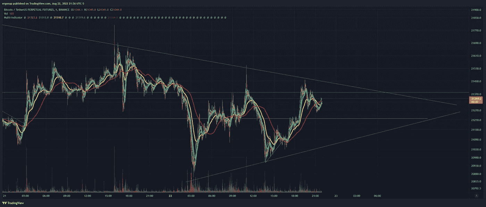
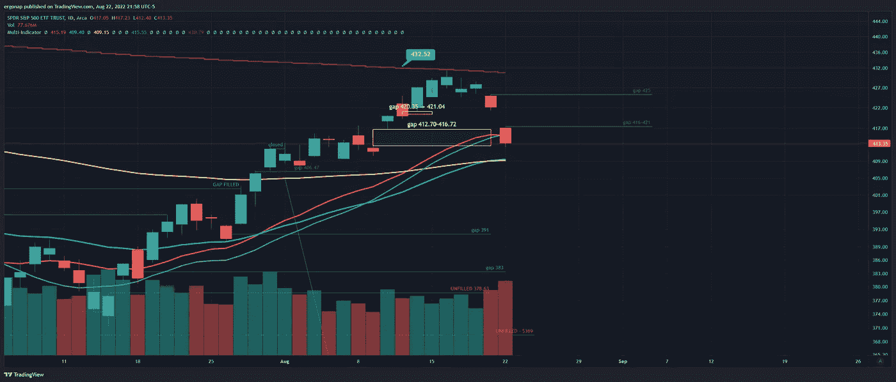
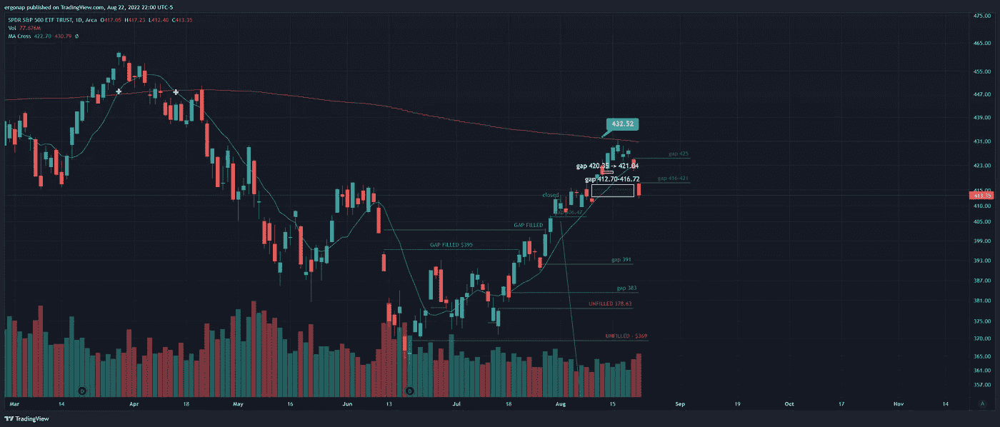

# 又一天，又一个悬而未决的下降

> 原文：<https://medium.com/coinmonks/another-day-another-pending-drop-5162513778d5?source=collection_archive---------34----------------------->

## 加密货币市场/比特币分析 8/22

因此，市场再次走向下跌。我认为这种深夜分析目前进行得很好。比特币就在这个令人捧腹的人造三角中，此刻这几乎是滑稽的。意味着我们可以以任何一种方式突围，但整合即将到来。目前，我预计我们会再次下跌。

it is what it is [https://www.tradingview.com/x/gSHIeCCf/](https://www.tradingview.com/x/gSHIeCCf/)

为什么？嗯，归咎于间谍和百万差距，其中一个填补了，其余的从这里下降了 20%——这只是为了缩小差距。

we’re gapping down, which means momentum is downward. And on big volume, too. [https://www.tradingview.com/x/tiVJfoje/](https://www.tradingview.com/x/tiVJfoje/)

几个小时后收盘，所以他们可以填补缺口，明天上涨或填补缺口，明天进一步下跌。我的猜测是更多的下降，因为我们在间谍上的差距下降了 50%——对于比特币来说是 90%。我们能走多远取决于被拒绝的红色日报 200ma 发生了什么——这是非常罕见的事情，但确实发生了。

有一个非常著名的 10/200 十字架，也很接近，但没有雪茄。事实上，如果我们继续下跌，就像往常一样，离市场远点。至少在看涨的情况下是如此。

it was almost going to cross, until it went sideways

因此，尽管反弹的可能性很小，但可能性是我们很快就会突破 20000 点——要么在本周，要么在下周一期货到期时。