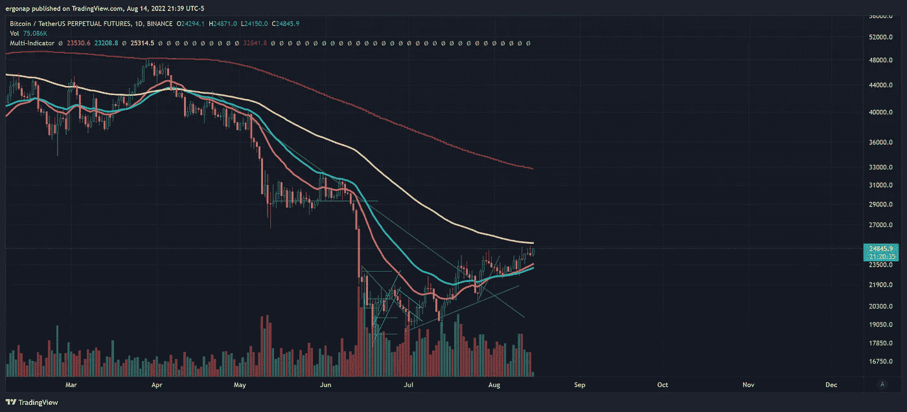
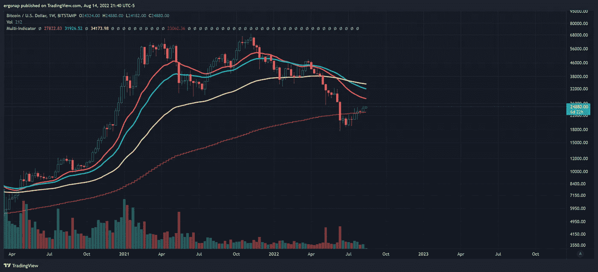
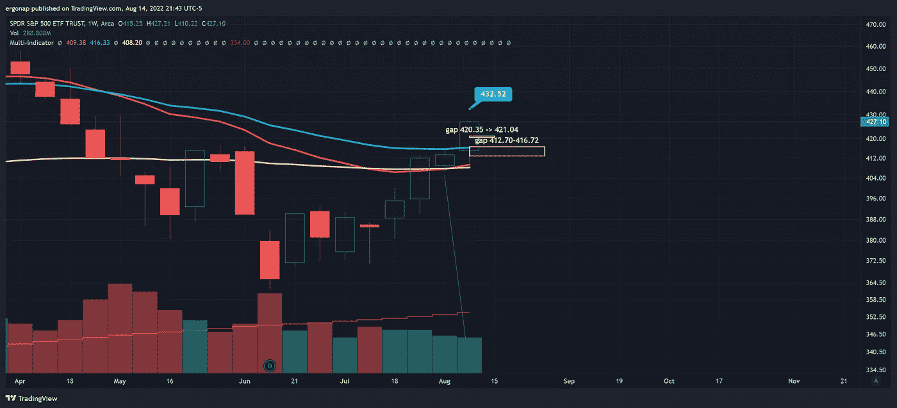
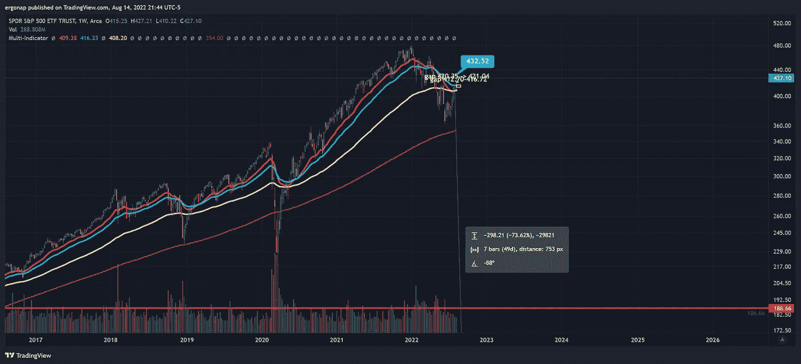
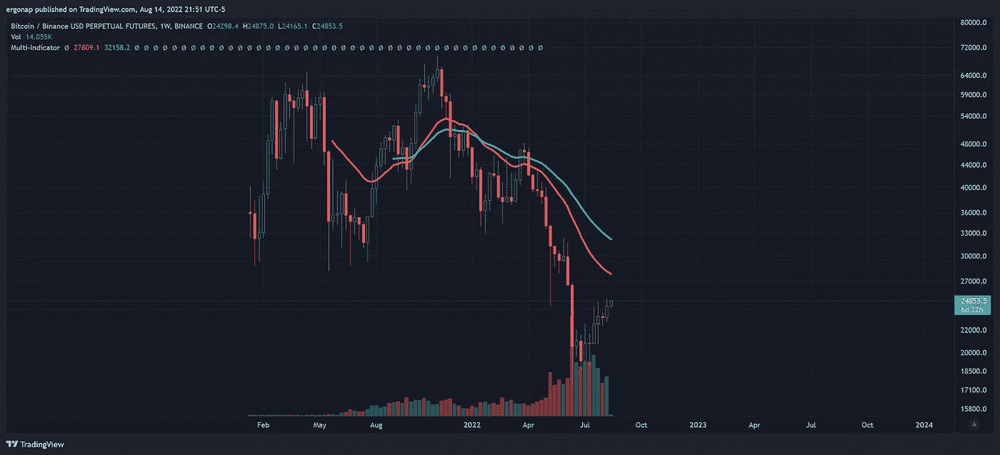
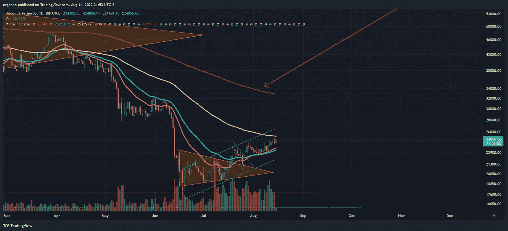
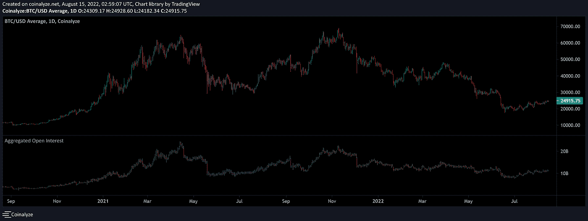

# 新的一天，新的不确定性

> 原文：<https://medium.com/coinmonks/another-day-another-uncertainty-2a241694b759?source=collection_archive---------28----------------------->

比特币/加密货币市场分析 8/14

所以，我带着大 C (covid)下来了。我会有点不舒服，所以不要太看重这个分析，因为不在巅峰状态=一个问题。BTC 的每日指标在周末看起来几乎没有变化，真的。我们在低交易量上移动了很多，这意味着回撤即将到来。

bulls are fighting for control, but…we’re near major MA’s. We can go up even above the yellow MA, but still fairly unlikely. [https://www.tradingview.com/x/1vmxUQwp/](https://www.tradingview.com/x/1vmxUQwp/)

刚刚收盘的周马，此时对比特币基本都是“LOL no”。

Look at the volume here, I mean are you kidding me? There’s nothing there, as there has been since **April** of **last year**. Especially for bulls. Bitstamp is very telling vs tether and other bullshit. [https://www.tradingview.com/x/MMRKGosX/](https://www.tradingview.com/x/MMRKGosX/)

和往常一样，去年的顶部并不意味着“牛市结束”，但它意味着聪明的资金撤出。牛市结束是在 10 月到 11 月，那时我们和马少校分手了。也就是说，在 25k 左右甚至不尝试也是一个确定的问题。甚至没有提高音量，也是一个问题。请记住，从日常的角度来看，保持船漂浮显然是一场战斗。我知道亚瑟·海斯(Arthur Hayes)和 T2·阿拉米达研究公司(Alameda Research)一直希望白痴成为他们的囊中之物，所以他们现在可以向他们出售，当白痴在底部出售时，再从他们那里回购。我有 100%的现金，到目前为止，我甚至可能会交易期权，以稍微摆脱加密思维。

比特币为什么会涨？因为这是必须的。因为叙事是“比特币是股票市场的主要组成部分，遵循股票市场定价”。

difference in volume on S&P vs BTC is enormous, obviously.

即使我们从更宏观的角度来看，数量上的差异对间谍来说也是正常的。

and yet, we go up as normal for stock market, but not for crypto. [https://www.tradingview.com/x/sl8MAziN/](https://www.tradingview.com/x/sl8MAziN/)

甚至 crypto 的反弹充其量也不过是蝴蝶放屁变成飓风，因为…… *没人买*。很明显，散户投资者已经出局，机构现在正在使用场外交易/流动性池，因此散户投资者无法安排他们在做什么。

 [## 比特币基地股票飙升，为贝莱德客户提供加密服务

### 周四，加密货币交易所比特币基地全球公司的股价飙升超过 16%，此前该公司宣布已…

www.reuters.com](https://www.reuters.com/technology/coinbase-blackrock-ink-crypto-trading-partnership-targeting-institutional-2022-08-04/) 

记住，你要求机构参与进来。现在，他们要控制局面了。他们会拿走你的钱。他们知道如何做到这一点，因为这是和以往一样的游戏。我最近开玩笑说，如果 eth 上市，然后 Vitalik 以某种方式将其所有股份转让给 Blackrock，我不会感到惊讶——只是为了获得完全的机构控制权。

问题是， [institutional 至少已经在 coinbase](https://www.coindesk.com/markets/2021/02/25/coinbase-institutional-retail-trading-volume-grew-at-equal-rates-in-2020/) 工作了近 3 年(下面也有链接)。所以我们不能说“成交量下降是因为机构”，不行。这意味着空投就要来了。我不能告诉你什么时候，因为我不能预测未来，但神圣的狗屎将是一滴。我不知道即使是 10k-11k 美元也会是底部。

 [## 2020 年，比特币基地机构零售交易量以同样的速度增长

### 随着投资者周四首次公开一瞥美国加密货币交易所比特币基地金融…

www.coindesk.com](https://www.coindesk.com/markets/2021/02/25/coinbase-institutional-retail-trading-volume-grew-at-equal-rates-in-2020/) 

我猜这卷书已经被转移到 spot 和 BUSD 了。

not surprising as BUSD has 0 fees for now. [https://www.tradingview.com/x/DPkleAuh/](https://www.tradingview.com/x/DPkleAuh/)

我们要么整到爆炸，要么整到下跌。但不管怎样，一场大的变动已经开始。我想我可能会在 25.4 美元做空，但我们会看到。现在是做出重大时间表决定的高峰期，所以最好在此之后再做决定。

sells still appear to dominate. [https://www.tradingview.com/x/jYChpfSm/](https://www.tradingview.com/x/jYChpfSm/)

其他图表参考也是如此——OI 在 4 月份全面下跌，第二轮回来，但此后就离开了。那不是承诺的标志，真的。

notice the OI from a macro perspective, it’s super fucking low. [https://coinalyze.net/snapshot/t1pQ4OMu](https://coinalyze.net/snapshot/t1pQ4OMu)

> 加入 Coinmonks [电报频道](https://t.me/coincodecap)和 [Youtube 频道](https://www.youtube.com/c/coinmonks/videos)了解加密交易和投资

# 另外，阅读

*   [币安 vs FTX](https://coincodecap.com/binance-vs-ftx) | [最佳(SOL)索拉纳钱包](https://coincodecap.com/solana-wallets)
*   [比诺莫评论](https://coincodecap.com/binomo-review) | [斯多葛派 vs 3Commas vs TradeSanta](https://coincodecap.com/stoic-vs-3commas-vs-tradesanta)
*   [Capital.com 评论](https://coincodecap.com/capital-com-review) | [香港的加密借贷平台](https://coincodecap.com/crypto-lending-hong-kong)
*   [如何在 Uniswap 上交换加密？](https://coincodecap.com/swap-crypto-on-uniswap) | [A-Ads 评论](https://coincodecap.com/a-ads-review)
*   [WazirX vs CoinDCX vs bit bns](/coinmonks/wazirx-vs-coindcx-vs-bitbns-149f4f19a2f1)|[block fi vs coin loan vs Nexo](/coinmonks/blockfi-vs-coinloan-vs-nexo-cb624635230d)