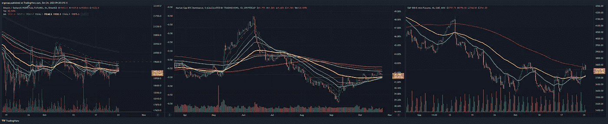
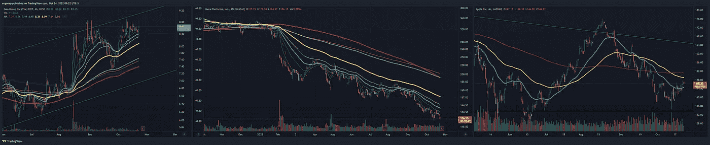
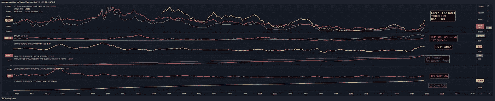

# 又是一天，一如既往的悲观

> 原文：<https://medium.com/coinmonks/another-day-as-bearish-as-ever-5e9425190695?source=collection_archive---------37----------------------->

市场分析 10 月 24 日

显然，这些市场是如此不可预测。🙄谁会想到……好吧，BTC 和间谍都可以在 4H 200MA 拒绝？这并不意味着我现在就想交易这些东西，我只是睡在看跌期权上，等待资金的到来。

link might be needed as I’m covering 3 tickers. [https://www.tradingview.com/x/yw1Xr7lQ/](https://www.tradingview.com/x/yw1Xr7lQ/)

地理上升，AAPL 伪造，元崩溃，因为 chucklezuck 值得。没有比这更准确的自恋者了。

[https://www.tradingview.com/x/RwOdAvgN/](https://www.tradingview.com/x/RwOdAvgN/)

什么变了？没什么。我们漂浮在空中，而降落下来的是酸雨。大多数事情看起来都很糟糕，我们正走向衰退和萧条。

[https://www.tradingview.com/x/V0e7POb1/](https://www.tradingview.com/x/V0e7POb1/) .

比特币大会的影响者(不会做 TA 的坏人)现在仍然非常看好比特币。所以否认和合作还没有到位。我不碰任何涉及密码的东西。

坐好，享受旅程，小睡一会儿，学习新事物，出去走走。😪这主要是一个 bot 市场，而不是一个人的市场。如果你有一个很长的时间框架，这不是一个平均下跌的好时机，但绝对是未来几个月最糟糕的事情。

see ya at the bottom.

> 交易新手？试试[加密交易机器人](/coinmonks/crypto-trading-bot-c2ffce8acb2a)或者[复制交易](/coinmonks/top-10-crypto-copy-trading-platforms-for-beginners-d0c37c7d698c)