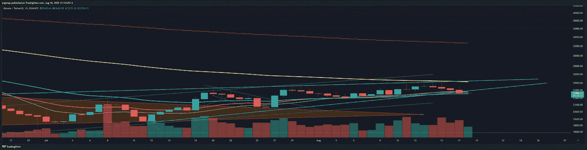
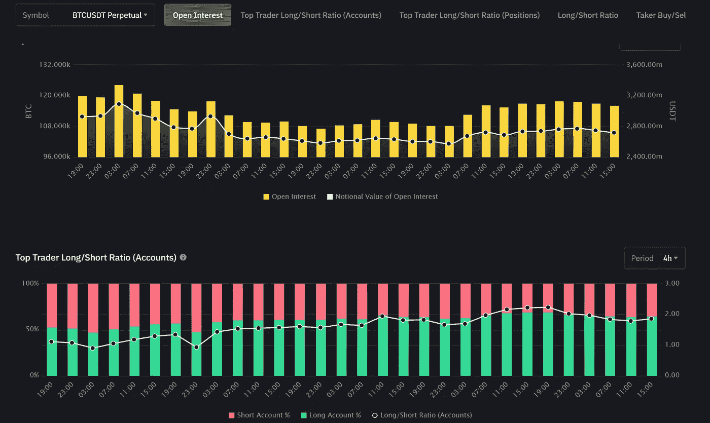
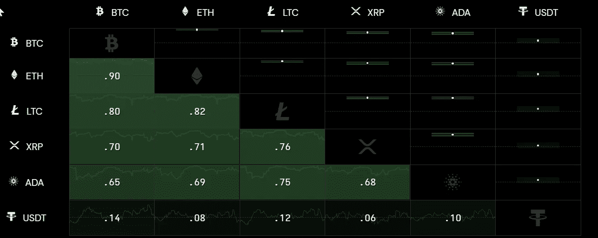
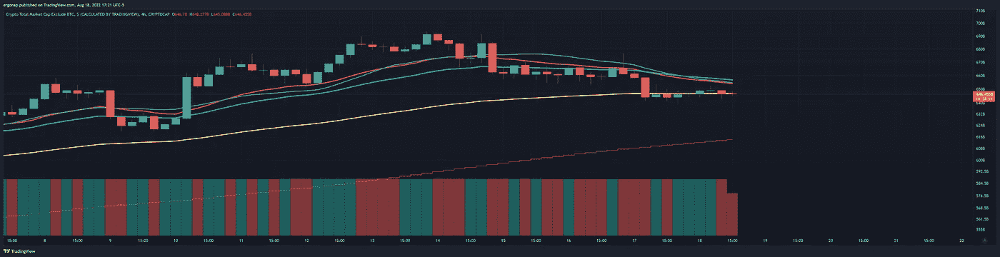

# 另一天的审查，看跌是预测

> 原文：<https://medium.com/coinmonks/another-days-review-bearishness-is-the-forecast-e9fef8d36103?source=collection_archive---------24----------------------->

比特币/加密货币市场分析 8/18

今天和昨天之间发生了什么变化？基本没有。从技术分析的角度来看，我看不出牛市有什么令人信服的地方。我们刚刚跌出楔形(确认)，流入交易所的资金继续增加。

There is no bullish case here. [https://www.tradingview.com/x/ioipImQu/](https://www.tradingview.com/x/ioipImQu/)

这些都不会给我带来乐观情绪。事实上，事情正在缓慢地建立巩固。散户多头和空头不知道该怎么办，实际上未平仓合约一直在跟随空头下跌。这意味着，这可能是一个相当大的下降。我等得不耐烦了，平仓获利。我也病得很重，目前无法很好地监控头寸，所以回到现金。玩了一点 dogechain 垃圾炒作，但谁知道呢？机会很大，但风险很小。

OI rising with movement down = confirmed

7d 相关平均显示一切都跟随比特币，除了偶尔 XRP 和阿达做他们自己的事，并且(不出所料)一起逆势移动。老实说，这很能说明问题。有一桶硬币正在推广，即阿达和 XRP，市场的其余部分也在一起移动。

TOTAL2 (alt market)现在也完美地设置在支点上。因此，如果 BTC 从这里跌落，一切都会跌落。

those of you who know my lessons know this yellow line and how significant it is. [https://www.tradingview.com/x/uH2j9rev/](https://www.tradingview.com/x/uH2j9rev/)

我们在底部见。像往常一样。

> 交易新手？试试[加密交易机器人](/coinmonks/crypto-trading-bot-c2ffce8acb2a)或者[复制交易](/coinmonks/top-10-crypto-copy-trading-platforms-for-beginners-d0c37c7d698c)