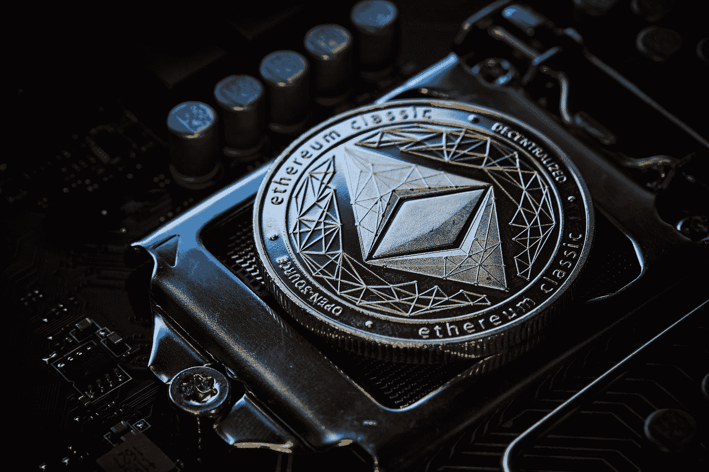
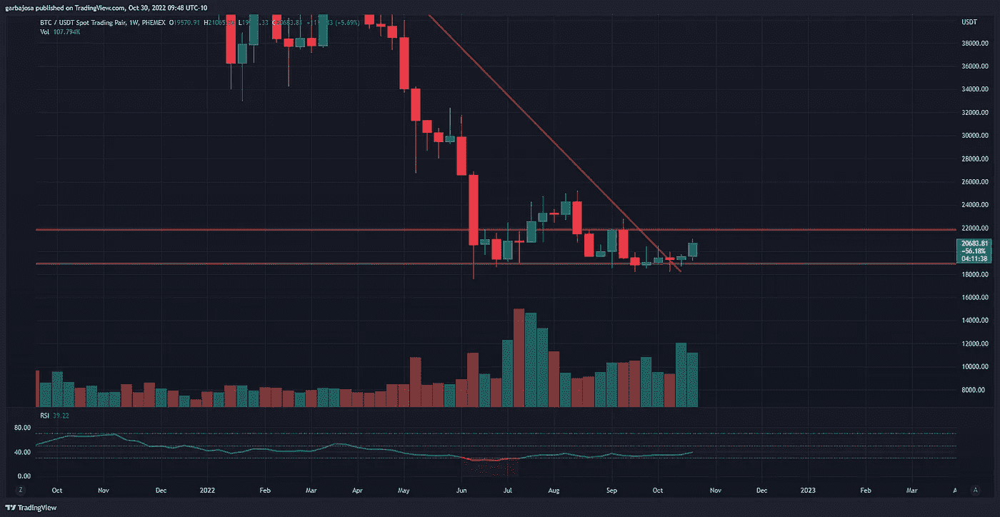
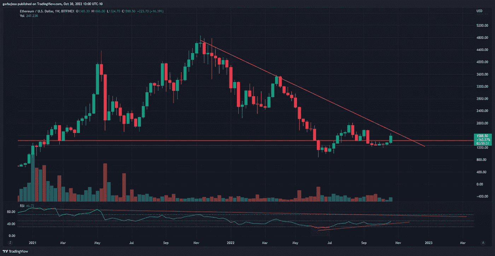
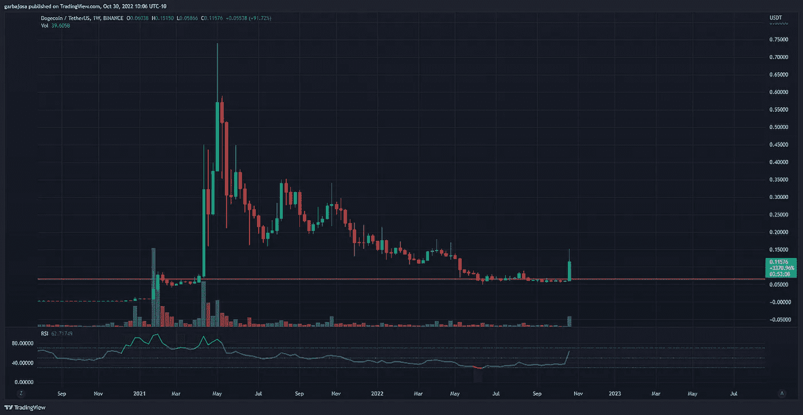
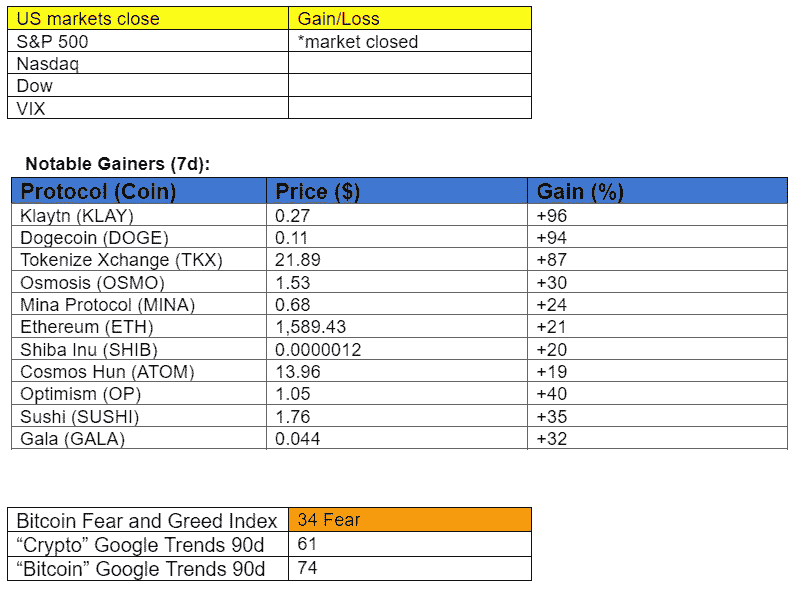

# 本周又一次加息。它将如何影响加密？

> 原文：<https://medium.com/coinmonks/another-interest-rate-hike-this-week-how-will-it-affect-crypto-c1c208212f0f?source=collection_archive---------21----------------------->

## 每日征服#113

最好的每日新闻、见解和阿尔法信息来源。

Photo by [Michael Förtsch](https://unsplash.com/@michael_f?utm_source=medium&utm_medium=referral) on [Unsplash](https://unsplash.com?utm_source=medium&utm_medium=referral)

*密码市场是一个狂野、奇妙而令人生畏的地方；不要一个人跋涉！订阅加密征服者，让我们成为您的向导。*

订阅这份每日时事通讯，永不错过任何一期。

*   下周(FOMC，联邦基金利率)
*   替代币看涨，而比特币下跌。
*   萨尔瓦多推动瑞士采用比特币。
*   Frax Finance 引入了一种新的以太赌注模式。
*   宇宙修订 V2 白皮书。

早上好，家人，

这是又一个 FOMC 周，定于周三加息。尽管围绕“美联储支点”的情绪正在形成，但经济数据显示美联储有足够的理由保持鹰派。无论如何，市场可能已经根据美联储的立场进行了调整和定价。

美联储保持鹰派立场的原因:

*   尽管过去两次国内生产总值下降，但第三季度国内生产总值增长了+2.6%
*   9 月份的 CPI 数据高于预期的+0.4%，为+0.06
*   9 月份的就业数据比预期的 24.8 万份工作更热，26.3 万份工作的失业率为 3.7%，失业率为 3.5%。

出于这些原因，美联储可能会保持其路线，并将利率提高 75 个基点

周三早上。

尽管数据超出预期，Meta 和谷歌等大公司的收益也不佳，但市场表现积极，这为市场情绪的转变提供了证据。除非美联储在最后一刻对加息做出调整，否则没有理由相信看涨情绪会消失。虽然，市场行为总是有一定的不可预测性。

# 市场更新🌍

**BTC/USDT 1W**

加密市场在经历了六周的横向波动后，经历了坚实的一周，导致 BTC 波动性达到历史最低水平之一。虽然 BTC 表现良好，但在过去一周小幅上涨+5.75%后，它未能跟上替代硬币的步伐。然而，尽管市场一致认为美联储已经改变了激进政策的基调，加息即将到来，但市场看起来将迎来又一个看涨的一周。BTC 本周收于 20，682 美元，似乎准备在未来五天内测试 22k 阻力位(橙色)。

*高分辨率* [*图表*](https://www.tradingview.com/x/x7tJQeYf/) 。

**ETH/USD 1W**

以太网(ETH)是本周表现最好的替代货币之一，尽管其市值为 1910 亿美元。围绕其合并后通缩特征的大肆宣传将 ETH 置于聚光灯下，而第二层(L2s)的强劲出现加剧了这种情绪。此外，部署在 L2 多边形网络上的 Reddit NFTs 的成功打开了公众对独特资产类别可能性领域的视野，其中许多是使用以太坊开发的。ETH 希望测试下跌趋势阻力(红色),如果牛市在接下来的一周继续。ETH 完成周蜡烛上涨+16.39%，至 1588 美元。

*高清* [*图表*](https://www.tradingview.com/x/zgwU5Syo/) 。

**DOGE/USD 1W**

受埃隆马斯克收购 Twitter 的推动，Dogecoin 经历了自 2021 年 4 月以来最好的一周。马斯克是否会在平台上使用 altcoin 仍不得而知，但这并没有阻止散户看涨者登上平台。因此，DOGE 完成了每周蜡烛上涨+91%，至 0.115 美元。

*高分辨率* [*图表*](https://www.tradingview.com/x/sxZNB8o1/) 。

如果你喜欢这份报告，并且认为它值 20 分(0.01 美分)，请按下面的鼓掌按钮来支持我的写作。(最多 50 次！)谢谢！

# 新闻观察📰

**萨尔瓦多+卢加诺传播比特币采用**。首个采用比特币作为法定货币的国家萨尔瓦多将在瑞士城市卢加诺开设“比特币办公室”。此外，这两个地区签署了一份谅解备忘录(MOU)以推广收养。大约 7 个月前，卢加诺启动了 B 计划项目，将收养带到这座小城。

**乙醚通过 Frax 打桩。**分散的稳定币供应商和贷款人服务已经推出了一个双令牌以太赌注模式，承诺更高的收益率。这项服务希望通过提供 frxETH 来交换 ETH，提供 sfrxETH 来交换 staking frxETH，从而改善 Lido stETH 令牌的不足之处。然后，sfrxETH 可用于曲线等 DeFi 协议，以寻求额外回报。

**宇宙白皮书修订版。**Cosmos Hub 团队提交了一份 Cosmos 2.0 [白皮书的修订版](https://gateway.pinata.cloud/ipfs/QmdC3YuZBUq5b9mEr3bKTDRq4XLcxafe3LHqDNFUgUoa61)，重点关注加强网络的互操作性和安全性。此外，新版本包括对原始版本中存在争议的发行模式的更新。该白皮书开放供机构群体投票。

**新闻花絮:**

*   签证[文件](https://www.coindesk.com/business/2022/10/28/visa-files-trademark-applications-for-crypto-wallets-nfts-and-the-metaverse/) NFT、元宇宙和加密钱包商标。
*   区块链协会[提交](https://www.coindesk.com/policy/2022/10/28/crypto-lobbyist-group-blockchain-association-asks-court-for-permission-to-support-ripple-against-sec-case/)加入 Ripley 诉 SEC 案。
*   THORChain 网络[在暂停 20 小时后恢复](https://cointelegraph.com/news/thorchain-network-resumes-following-20-hour-chain-halt)。
*   Terra 的跆拳道在新加坡面临 5700 万美元的诉讼。

**NFT &元宇宙更新🐵**

*   **日本城市** [**考虑到**](https://cointelegraph.com/news/metaverse-schooling-to-help-japanese-city-combat-growing-absenteeism) **元宇宙要解决学校缺席的问题。**

**我的五分钱……**

万圣节前夕，股市像僵尸一样从坟墓里爬了出来。

未来一周看起来很有希望，而较低的时间框架图(1h-4h)仍处于上升趋势。我预计美联储不会用鹰派言论动摇市场信心，但这些事情总是不可预测的。杰罗姆·鲍威尔将在美国东部时间周三 0830 发表讲话，此前美国东部时间 0800 联邦基金利率宣布。

另一方面，请继续关注明天的《早安加密》,我希望为过去一周冲出起跑门的项目增加一个亮点。这些替代硬币可能是下一个主要牛市周期的高点。这是一个你不想错过的问题！

# 加百列

*关注我* [*推特*](https://twitter.com/web3_gabri) *每日更新！*

> 交易新手？试试[加密交易机器人](/coinmonks/crypto-trading-bot-c2ffce8acb2a)或者[复制交易](/coinmonks/top-10-crypto-copy-trading-platforms-for-beginners-d0c37c7d698c)