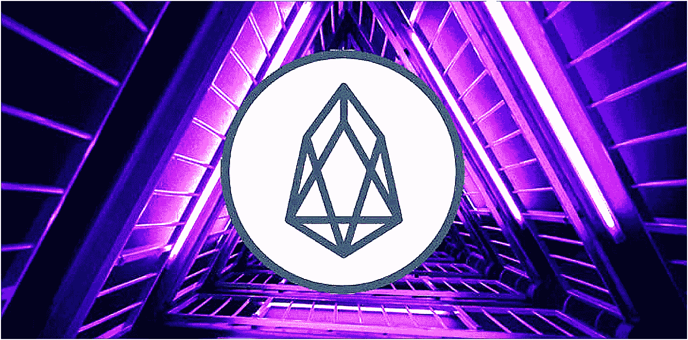
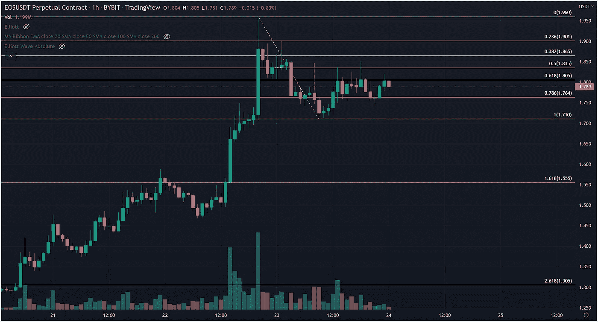
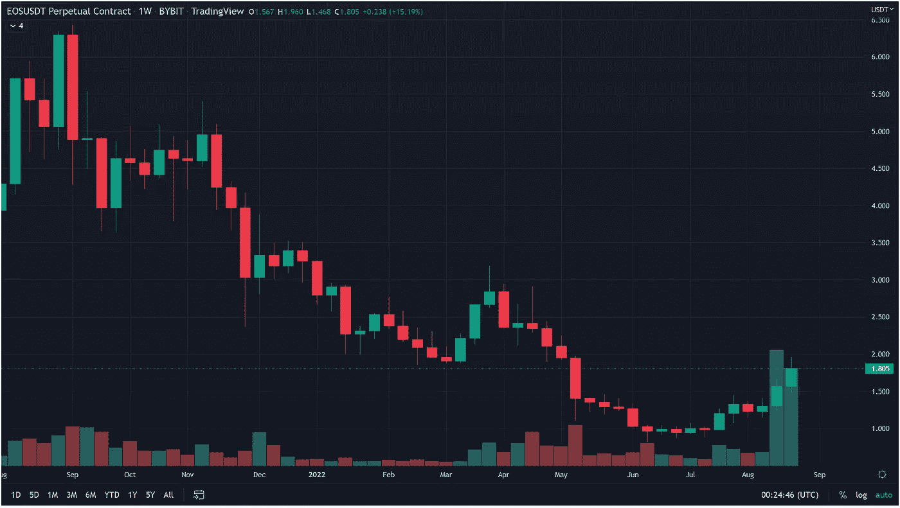
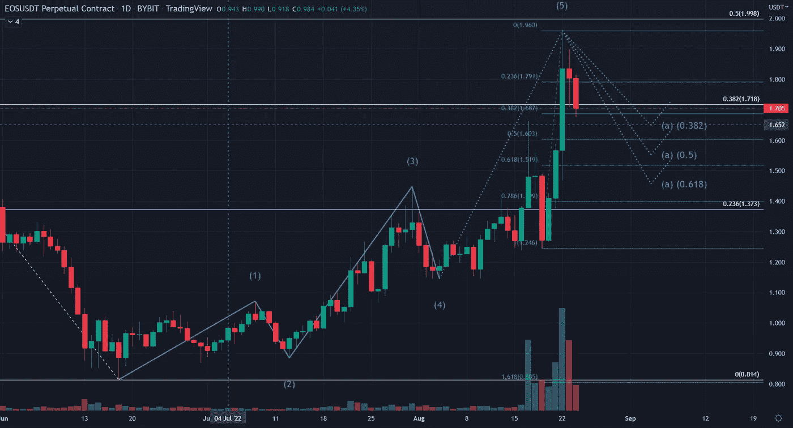

# 另一个第 1 层区块链从即将到来的升级中获得了推动

> 原文：<https://medium.com/coinmonks/another-layer-1-blockchain-gets-a-boost-from-an-upcoming-upgrade-e63f0fabd231?source=collection_archive---------40----------------------->

过去一个月，以太坊转向 PoS(股权证明)一直是加密货币交易商、矿工和整个社区的主要焦点。这一合并将是最大、最具纪念意义、最受期待的事件，已经并将在未来一个月继续极大地影响市场情绪。然而，它并不是唯一一个大肆宣传 9 月份升级的公司。

EOS 网络基金会(ENF)的标志在 ENF 上周宣布羚羊将被用作基于 EOSIO 的区块链的底层协议后飙升。羚羊，一个社区运行的区块链协议，将得到 ENF 成员的支持，其中包括 EOS，Telos，Wax 和 UX 网络。

EOS 是诞生于 2018 年 ICO 的第三代第一层加密，据 Coinmarketcap.com 称:“EOS 网络是第三代第一层区块链，是低延迟和高性能的区块链，解放了开发人员……将可编程架构、多功能区块链基础设施和定制智能合约结合在一起。”

由于对 9 月 21 日将发生的硬分叉的乐观情绪，EOS 的价值在过去 7 天里上涨了 30%以上。然而，从技术角度来看，EOS 似乎已经见顶，短期内注定会进一步回撤。我这样做是基于这样一个事实:在一个小时的时间框架内，市场已经在日内 61.8%的斐波纳契回撤水平遇到阻力。

我使用的回撤从 1.70 美元开始，这里有试探性的支撑，直到 8 月 22 日的最近高点 1.96 美元。低于 1.70 美元的支撑位位于 1.68 美元，这恰好是日内 38%的回撤位，也非常接近 8 月 17 日宣布羚羊升级的当天触及的价格。这可能是做多的好切入点，因为尽管短期前景是看跌的，但中期(下个月)可能会非常看涨。如果我们看不到从 1.68 美元的反弹，那么下一个支撑位是三重顶，这个顶部是早在 5 月份形成的，位于 1.46 美元。如果 EOS 继续上涨，上涨潜力很可能高达 2.67 美元。

对于任何对我们致力于比特币交易和加密货币选择的免费服务感兴趣的人，只需点击此[链接](https://www.thegoldforecast.com/bitcoin)。

> 交易新手？试试[密码交易机器人](/coinmonks/crypto-trading-bot-c2ffce8acb2a)或者[复制交易](/coinmonks/top-10-crypto-copy-trading-platforms-for-beginners-d0c37c7d698c)