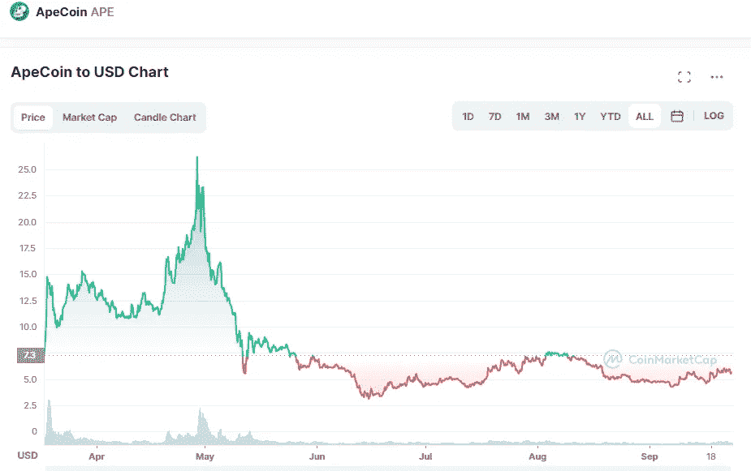

# APE coin(APE)2022–2025 年价格预测，9 月 23 日更新

> 原文：<https://medium.com/coinmonks/apecoin-ape-price-prediction-2022-2025-update-23th-of-september-5f3f369886c5?source=collection_archive---------15----------------------->

Source photo [ApeCoin price today, APE to USD live, marketcap and chart | CoinMarketCap](https://coinmarketcap.com/currencies/apecoin-ape/)

# Apecoin 是什么？

加密货币 ApeCoin 是一种 ERC-20 令牌，是建立在以太坊区块链上的数字资产。推出后不久，该令牌几乎在所有主要的集中式加密货币交易所上市。在市场上仅仅一天后，ApeCoin 的价值已经上升到大约 20 亿美元，相当于一枚 APE 硬币…