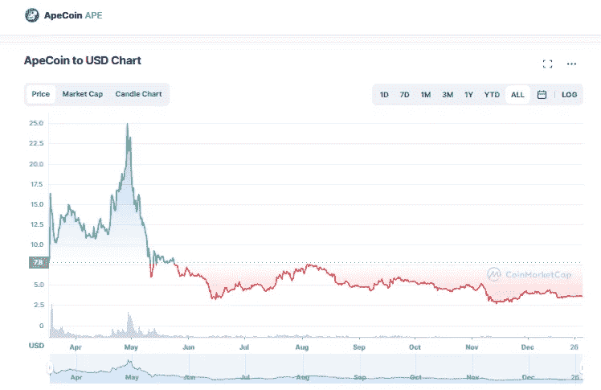

# APE coin(APE)2023–2025 年价格预测，12 月 30 日更新

> 原文：<https://medium.com/coinmonks/apecoin-ape-price-prediction-2023-2025-update-30th-of-december-39d000d60e05?source=collection_archive---------23----------------------->

Source photo [ApeCoin price today, APE to USD live, marketcap and chart | CoinMarketCap](https://coinmarketcap.com/currencies/apecoin-ape/)

# ApeCoin(猿)是什么？

ERC-20 代币，像硬币一样，是一种建立在以太坊区块链上的加密货币。该令牌在首次亮相后几分钟内就在几乎所有主要的中央加密货币交易所上市。一枚 ApeCoin (APE)目前价值约 14 美元，仅发行一枚 ApeCoin 后，该硬币的市值就接近 20 亿美元