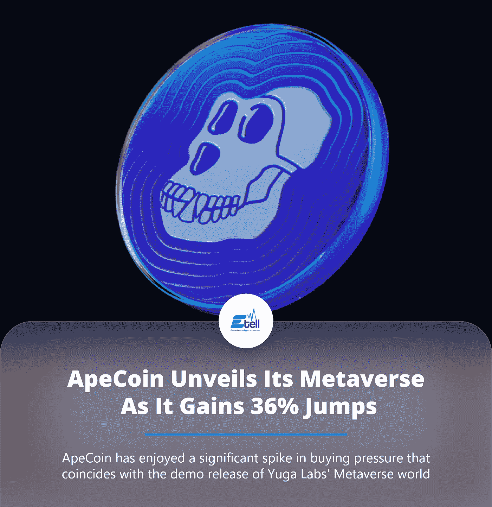

# ApeCoin 推出元宇宙，涨幅达 36%

> 原文：<https://medium.com/coinmonks/apecoin-unveils-its-metaverse-as-it-gains-36-jumps-697a9eaa3c41?source=collection_archive---------42----------------------->

在宇迦实验室的《元宇宙世界，另一边》试玩版发布的同时，ApeCoin 的购买压力也大幅上升。

在宇迦实验室放弃了备受期待的另一边元宇宙的演示后，ApeCoin 似乎要爆发了。

无聊猿游艇俱乐部的创造者在周末分享了一个早期发布版本的 Otherside，邀请数千名游戏的 NFT 持有者先看看它的元宇宙。试玩版是“第一次旅行”之一，它允许游戏中被称为 Otherdeeds 的虚拟地块的所有者参与游戏。

在放弃 Otherside 演示后不久，宇迦发布了一篇精简版论文，给出了项目进展的一些早期提示。第一个开发阶段包括一个故事情节游戏模式“围绕一个神秘的方尖碑出现在另一边的宇宙。”第二和第三阶段尚未发布，但玩家将在塑造“平台的核心能力”方面发挥至关重要的作用。

“为了给一个成功的社区播下种子，我们开始与旅行者一起在另一边发展，他们是我们的第一批采纳者和信徒。他们是彼岸历史的重要组成部分，被邀请加入航海家号的旅程，”lite 报纸写道。

> 交易新手？试试[加密交易机器人](/coinmonks/crypto-trading-bot-c2ffce8acb2a)或者[复制交易](/coinmonks/top-10-crypto-copy-trading-platforms-for-beginners-d0c37c7d698c)

硬币在“另一边”扮演着重要的角色，因为它是游戏的官方货币。当宇迦在 4 月份出售 Otherdeeds NFTs 时，这变成了一场灾难性的拍卖，堵塞了以太坊，有兴趣的买家被要求使用 APE 支付他们的虚拟土地。

现在，自上周六取消演示以来，ApeCoin 的价格已经上涨了近 36%。APE 周一早盘从 4.60 美元的低点反弹至 6.30 美元的高点。随着更广泛的加密货币市场享受新的顺风，围绕当前价格水平的进一步购买压力可能导致更大的收益。

ApeCoin 似乎已经突破了 12 小时图上形成的上升三角形。这一技术形态预计，只要价格保持在 5.30 美元以上，就会朝着 7.50 美元上涨 42%。

未能保持在 5.30 美元以上可能会导致获利回吐。这可能意味着 ApeCoin 跌至 4.30 美元，这可能使乐观的前景变得无效。

点击这里，关注我们的更多故事[。](http://t.me/etellworld)