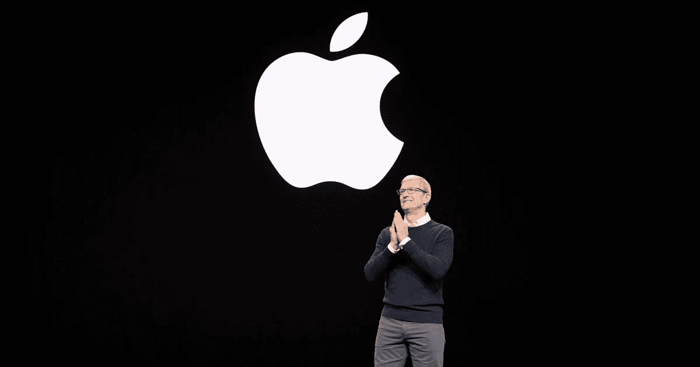
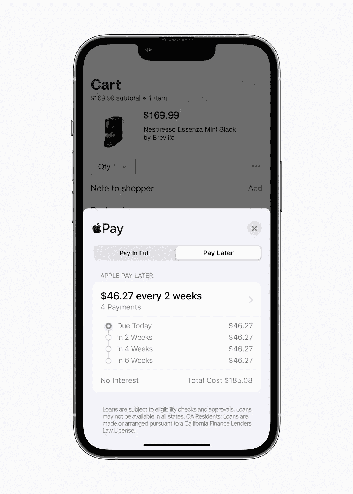

# 苹果在 1 小时内扼杀了数十家企业

> 原文：<https://medium.com/coinmonks/apple-killed-dozens-of-businesses-in-1-hour-16a727d423ae?source=collection_archive---------7----------------------->

Everyone is looking forward to Apple’s amazing keynote events, or are they?

**如果苹果增加了一个让你的创业公司过时的功能，你会怎么做？**

WWDC 是苹果的旗舰活动，他们邀请来自世界各地的开发者和爱好者加入他们，因为他们推出了一些最酷的最新更新。

大多数时候，这对其他人来说都是好消息。

但对于少数初创公司来说，这可能很糟糕。

为什么？

想象一下，你是一家脏兮兮、羽翼未丰的初创公司，正在开发一款软件，可以毫不费力地将你的自拍照神奇地变成信息贴纸。

它有趣、令人兴奋，你的用户喜欢它。

但你猜怎么着，苹果突然宣布了他们 iMessage 的新更新，基本上允许你把任何自拍变成贴纸。

噗。

那是你创业梦想蒸发的声音。

当然，这可能不是世界末日，但这肯定会让与苹果这样的巨头竞争变得更加困难，不是吗？

当然，我说的是假设，但关切是真实的，同样悲惨。

创业创业者在那里挣扎，你一定知道我在说什么。

公告在不到一个小时的时间里就发布了。

And just like that, Apple has a BNPL solution ready for market.

让我们看看苹果在他们最新的 WWDC 中透露了什么，以及他们可能摧毁了多少初创公司。

apple Pay la ter——现在购买，以后支付。没兴趣。

初创公司可能会受到伤害:Afterpay、Klarna、Affirm、Sezzle、Splitit、Perpay。

自由形式——极简协作白板。

初创公司可能受到伤害:壁画，Figjam，米罗，异想天开。

密码——我们所知的密码的终结？

初创公司可能会受到伤害:LastPass、Dashlane、1Password、LogMeOnce、Keeper。

点击支付——用无线网卡或 iPhone 对着 iPhone 点击支付。

创业公司可能受到伤害:Square，Clover Go，Toast。

我从贾诺那里得到了一些信息，他是另一个发现这个有趣想法的作家。

所以除非你自己是创业创始人，亲身经历奋斗，深入战壕，这大概不会影响到你。

Remember how electric is was when Steve Jobs revealed the iphone?

这就是苹果，这个科技商业之母，能对他们可能从未听说过的创始人做的事情。

这才是苹果在膨胀到如此规模之后的真正实力和影响力。

它刚刚发布了 Q2 业绩，赚了 830 亿美元。

三个月就赚了 830 亿美元！

iPhone 的销售额是这个数字的一半，为 400 亿美元。

其市值为 2.6 万亿美元

我想知道他们是如何赚到这么多钱的，所以我在一部 2600 新元的 iPhone 上输入了所有这些。

摇摇头，尴尬地笑着讽刺。

-

你看苹果的主题演讲吗？

-

#初创公司#业务# startupx #员工#成功#社交媒体#文化#远程工作#战略# timcook #收入#万亿美元#创始人# iphone #苹果

> 交易新手？试试[密码交易机器人](/coinmonks/crypto-trading-bot-c2ffce8acb2a)或者[复制交易](/coinmonks/top-10-crypto-copy-trading-platforms-for-beginners-d0c37c7d698c)