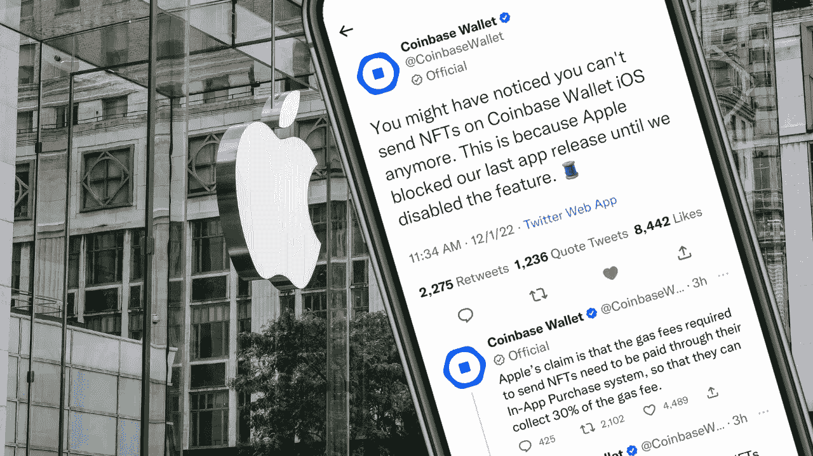
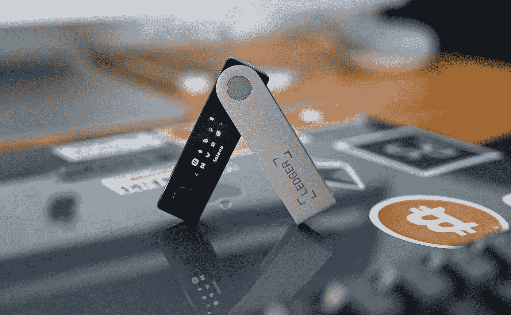
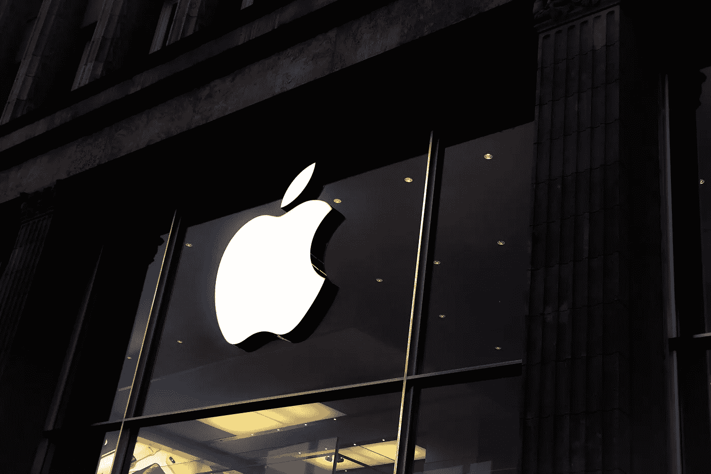

# 苹果希望从 NFT 交易中获得 30%的利润，阻止比特币基地钱包上的转账。其他 iOS 钱包会被迫跟随吗？

> 原文：<https://medium.com/coinmonks/apple-wants-30-from-nft-trades-blocking-transfers-on-coinbase-wallet-75e20b9c4885?source=collection_archive---------20----------------------->

## 比特币基地钱包宣布他们无法在 2022 年 12 月 1 日给他们的 iOS 钱包推送新的更新，理由是苹果的封锁。

Reportedly, Coinbase Wallet will not be able to publish their newest iOS app update until they disable the sending of [non-fungible tokens, or NFTs](https://ethereum.org/en/nft/).

# 比特币基地钱包不再提供应用内 NFT 交易

2022 年 12 月 1 日，比特币基地钱包在推特上解释了这一情况，并提醒用户。

在他们努力推出 iOS 更新的过程中，比特币基地钱包由于苹果的新政策而面临挫折。

# 苹果公司想分一杯羹吗？

苹果希望对应用内交易的所有汽油费削减 30%——这是比特币基地钱包还不愿意支付的。事实上，比特币基地甚至认为，由于 NFT 和区块链的工作方式，这“显然是不可能的”。

这一声明导致他们推出新更新的进程停滞不前，用户将不得不等待该公司与苹果解决这个问题。

这些发展让许多人怀疑其他钱包，如 Rainbow 和 MetaMask，是否会在不久的将来面临类似的问题。

# 比特币基地钱包并不是第一个面临苹果监管问题的 iOS 钱包

看看几周前莱杰发生了什么。[莱杰](https://support.ledger.com/hc/en-us/articles/7572912170653-NFT-features-disabled-for-iOS?docs=true)在 11 月发表了一篇博客文章，阐述了这些变化。

> *2022 年 10 月 24 日，苹果发布了其 Apple Store 指南的* [*更新版*](https://developer.apple.com/news/?id=xk8d7p8c) *。该版本包括关于如何在 App Store 上列出的应用中管理 NFTs 的限制性要求。*

这次更新包括了许多新的和不可预见的 iOS 应用程序限制，限制了这些钱包应用程序的许多重要功能。

令人欣慰的是，莱杰分享了一些变通办法——但这似乎还不够，特别是如果苹果继续他们的打击，并希望在加密馅饼中分得更大一杯羹。

许多钱包正在转向桌面应用和网络浏览器，放弃 iOS 应用商店内的进一步创新，直到这些限制被取消。

# 今天的新闻回避了其他移动加密货币钱包将受到何种影响的问题。

其他钱包会跟随比特币基地和莱杰的脚步吗？或者他们会继续维持现状，直到苹果更加严厉地打击他们？

这一消息让许多人感到震惊，主要是因为比特币基地钱包对于“Web3 新手”和对 NFT 空间不熟悉的人来说是一个很好的解决方案。它为初学者提供了一个更加用户友好的解决方案来开始使用 crypto 和 NFTs。现在，这个选项可能不再可用。

这是否意味着苹果用户会更多地转向像安卓这样的解决方案？或者，游戏中的其他玩家会追随 Solana 的脚步，创建自己版本的 Solana Mobile，承诺推出新的“dApp 商店”和“ [Web3 in your pocket](https://solanamobile.com/) ”？

索拉纳爱好者已经提出了一个潜在的解决方案，但目前仍没有解决方案。

# 我们将何去何从？

其他钱包可能会被迫对其应用程序进行重大修改。随着苹果继续对应用商店交易实施严格的指导方针，这引发了其他钱包如 Rainbow 和 Metamask 是否必须调整其应用程序的问题。苹果的严格规定长期以来一直是许多开发者争论的焦点，尤其是那些在加密领域的开发者。苹果在 2022 年 10 月首次向[提及这些变化的指导方针，将加密交易纳入其标准的 30%税收中，现在，他们正在严厉打击。](https://www.coindesk.com/business/2022/10/24/apple-refuses-to-exempt-nfts-from-app-stores-30-fee/)

# 通过要求应用程序开发者支付所有应用程序内交易的 30%的提成，苹果可以在本质上决定应用程序如何在他们的商店中运行。

很明显，比特币基地和莱杰在这件事上几乎没有选择，唯一合理的选择是禁用 NFT 交易——这极大地影响了用户体验，使这款应用对一些用户来说基本上毫无用处。只有时间才能证明其他钱包是否也会被迫遵从苹果的要求，但可能性似乎并不大。虽然这很可能不是一个受欢迎的决定，但如果这些公司想保持他们的应用程序更新并保持他们的苹果用户群，这可能会成为一种必要。

苹果的政策已经对用户在 iOS 设备上轻松发送 NFT 的能力产生了直接影响，如果其他钱包无法找到解决办法，这种趋势可能会蔓延。

最终，苹果公司将决定是否允许 NFT 在其应用商店内交易——但这不会阻止不高兴的苹果用户和钱包提供商在网上表达他们的不满。此举对整个 NFT 行业来说是一个巨大的打击，在那里，大规模采用在很大程度上依赖于用户能够直接从他们的钱包发送令牌。

Rainbow、MetaMask 和 Trust 似乎一直在正常运行，迄今为止，它们都没有报告其 iOS 应用程序出现任何问题。这些变化是否会蔓延到其他受欢迎的钱包还有待观察。也就是说，很可能这些钱包将很快面临与比特币基地钱包和莱杰相同的问题。

# 随着苹果现在削减应用内交易，开发者面临两个选择:要么遵守新政策，要么寻找另一种方式发送数字资产。

苹果的收费可能会导致其他加密公司的浏览器应用之间的竞争加剧。随着费用削减了开发者的利润，他们可能会决定专注于在没有 iOS 应用的情况下创造更好的用户体验，或者提供更低的费用来与苹果竞争。其他钱包可以继续提供服务，不需要苹果的批准。

对于 Rainbow、MetaMask、Trust 和其他受欢迎的钱包，他们可能会找到替代解决方案来保持其 iOS 应用程序的运行。他们可能会考虑采用其他加密服务，以规避苹果的费用。

对于天生更有技术头脑的加密本地人来说，这些变通办法似乎都是不言自明的，但这肯定会伤害那些迫切寻找简单、用户友好的钱包解决方案的新手。手机应用程序的便利性无可匹敌。

最终，没有人能确定这种情况将如何长期发展。

然而，似乎很明显，如果开发者想让他们的 iOS 应用保持运行，他们将不得不做出一些调整。

这种影响不仅仅局限于钱包提供商，因为非功能性钱包越来越受创作者的欢迎，他们利用非功能性钱包从自己的作品中获得收入。如果不能接触到 NFTs，这些创作者将很难将他们的作品货币化。苹果最终可能会为数字创作者破例，但这个问题将如何长期发展还有待观察。苹果的这一举措可能会对整个加密货币格局产生重大影响，因为许多人使用移动友好型钱包来交易、转移和管理数字资产。

最终，比特币基地和莱杰在他们的 iOS 应用上禁用 NFT 传输的决定可能会在整个加密社区产生连锁反应。目前还不清楚其他钱包是否会被迫效仿，但用户应该密切关注 App Store 内 NFT 交易可能发生的任何变化。

如果你需要我，我会在彩虹和超能面具之间来回转移我所有的 NFT，只是为了感受一些东西。

话说回来，换三星好像也没那么糟糕……

*最初发表于 2022 年 12 月 1 日*[*【https://www.adriannalakatos.com】*](https://www.adriannalakatos.com/blog/apple-blocking-transfers-on-coinbase-wallet)*。*

[octo view . io](http://octoview.io)—web 3-原生数字营销