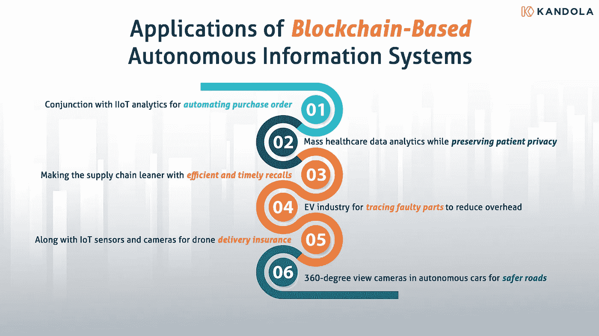

# 基于区块链的自主信息系统的应用

> 原文：<https://medium.com/coinmonks/applications-of-blockchain-based-autonomous-information-systems-b79fcbe9e7c7?source=collection_archive---------29----------------------->

除了信任和安全之外，大多数 Web2 信息系统缺乏自动化、互操作性、可审计性和从单个数据库访问所有数据的能力。简而言之，尽管数据丰富，但这些系统的自主性不足以创造创新的解决方案。那么，区块链是如何让信息系统自治的呢？答案在于区块链分类账的创建和更新方式。区块链账本中的数据是可访问的但不可改变的，是包容的但经过共识审查的，是透明的但保护隐私的，是核实的但分散的。这些区块链可以使用智能合约和区块链间通信(IBC)协议相互交互。出于这个原因，区块链是建设固有自主信息系统的理想之地。在这里，我们讨论由这些自主信息系统支持的创新应用。

## **自动化和互操作性**

在大多数工厂中，资产管理和订购有不同的流程。随着 IIoT 分析技术的进步，确定零件何时磨损或失效并需要更换变得越来越容易。IIoT 分析系统可以使用区块链技术记录这些信息，基于智能合同的自动化流程可以触发更换零件的订单。自动化可以最大限度地减少生产停工时间，提高生产率。类似地，不同的系统可以使用自动化进行互操作。例如，化学沉积物的增加或 pH 值的变化可以使用智能合同触发自我清洁过程，而无需人工干预。自动化和互操作性的可能性可以导致创新的解决方案，这些解决方案由系统自主地和确定性地执行。

## **隐私保护数据分析**

数据分析算法需要物联网系统收集大量用户数据。虽然由此产生的见解能够实现数据驱动的研究并改善用户体验，但这些设备及其连接的电子系统必须遵守通用数据保护法规(GDPR)并保护个人数据。手动甚至数字分离个人数据既麻烦又不安全。一个例子是对健康数据进行批量分析，以确定特定人群中的患者对新发现疾病的易感性。在 Covid 疫情期间，缺乏对拉丁美洲患者的充分研究的医疗数据使得医疗专业人员难以为这些患者制定有效的治疗计划。区块链的匿名账户和智能合约相结合，可以控制对个人数据的访问，并允许大规模研究。事实上，智能手机、智能手表、智能手环和智能家居等所有物联网设备都可以使用这种方法。

## **避免代价高昂的召回**

虽然使用区块链追踪食品、药品、咖啡和葡萄酒的来源对消费者有用，但它们对生产商、零售商和店主也同样有用。这些产品的供应链是一个复杂的网络。如果爆发食源性疾病，需要很多天才能找到源头。如果调查未能确定采购农场，消费者别无选择，只能完全避开这种食品。事实上，沃尔玛曾经不得不撤下数百万袋生菜。这不仅对沃尔玛不利，而且农民也受到了影响。有了可追溯性，沃尔玛本可以只移除受影响的产品，从而挽救农民的生计。

## 提高电动汽车供应链效率

电动汽车制造商需要跟踪来自其他国家的材料。有时很难确定某些物质的来源，如黑钨矿和钴。当这些材料在运往工厂的途中易手时，虐待和篡改经常发生。基于区块链的记录可以记录这些原材料的来源和状况。这些不可改变的记录有助于召回使用有缺陷材料制造的电动汽车。电动汽车制造商可以快速反应，只召回受影响的车辆。使用区块链使供应链具有成本效益，并减少生产费用。

## **寻找撞车背后的原因**

亚马逊和联邦快递等公司越来越多地使用无人机送货。无人机保险对于医疗递送、包含易碎物品的包裹和昂贵物品尤其必要。安装在无人机上的视频和传感器可以捕捉事故现场的图像，并将信息存储在区块链中。如果无人机在坠毁中损坏了财产或伤害了人或动物，这一点至关重要。知道了撞车的确切原因，保险公司就可以做出相应的决策。即使公司拥有这些数据，它也不能改变已经记录在区块链中的信息。

## 让自动驾驶汽车在路上更安全

自动驾驶汽车的一个主要问题是确定对不幸事件负责的实体。从停车到故障再到事故，360 度摄像头和传感器的数据都可以记录在区块链上。虽然车主和汽车制造商可以访问记录，但他们不能更改信息。制造商还可以对数据进行广泛的分析，并改进自动驾驶汽车操纵功能的算法。这些信息也有助于识别黑点。最终，这些数据可以让自动驾驶汽车在路上更加安全。

## **结论**

区块链在记录信息方面的好处不仅仅是透明、安全和去中心化。区块链作为一种技术，补充了 IIoT 分析、数据分析、自动化和互操作性。对于上面列出的应用程序，我们只覆盖了冰山一角。在 Kandola，我们正致力于创建一个不受行业限制的分散式交换平台，在确保端到端数据加密的同时，实现跨多个链的无缝数据流。要了解更多关于 Kandola 解决方案的信息，请发送电子邮件至 hello@kandola.network。

> *交易新手？试试* [*密码交易机器人*](/coinmonks/crypto-trading-bot-c2ffce8acb2a) *或* [*复制交易*](/coinmonks/top-10-crypto-copy-trading-platforms-for-beginners-d0c37c7d698c)
> 
> *分散密码持有量，了解* [*币安替代品*](https://coincodecap.com/binance-alternatives)
> 
> *加入 Coinmonks* [*电报频道*](https://t.me/coincodecap) *和* [*Youtube 频道*](https://www.youtube.com/c/coinmonks/videos) *获取每日* [*加密新闻*](http://coincodecap.com/)

# 另外，阅读

*   [复制交易](/coinmonks/top-10-crypto-copy-trading-platforms-for-beginners-d0c37c7d698c) | [加密税务软件](/coinmonks/crypto-tax-software-ed4b4810e338)
*   [网格交易](https://coincodecap.com/grid-trading) | [加密硬件钱包](/coinmonks/the-best-cryptocurrency-hardware-wallets-of-2020-e28b1c124069)
*   [密码电报信号](/coinmonks/top-3-telegram-channels-for-crypto-traders-in-2021-8385f4411ff4) | [密码交易机器人](/coinmonks/crypto-trading-bot-c2ffce8acb2a)
*   [最佳加密交易所](/coinmonks/crypto-exchange-dd2f9d6f3769) | [印度最佳加密交易所](/coinmonks/bitcoin-exchange-in-india-7f1fe79715c9)
*   [面向开发者的最佳加密 API](/coinmonks/best-crypto-apis-for-developers-5efe3a597a9f)
*   最佳[密码借贷平台](/coinmonks/top-5-crypto-lending-platforms-in-2020-that-you-need-to-know-a1b675cec3fa)
*   [免费加密信号](/coinmonks/free-crypto-signals-48b25e61a8da) | [加密交易机器人](/coinmonks/crypto-trading-bot-c2ffce8acb2a)
*   [杠杆代币的终极指南](/coinmonks/leveraged-token-3f5257808b22)