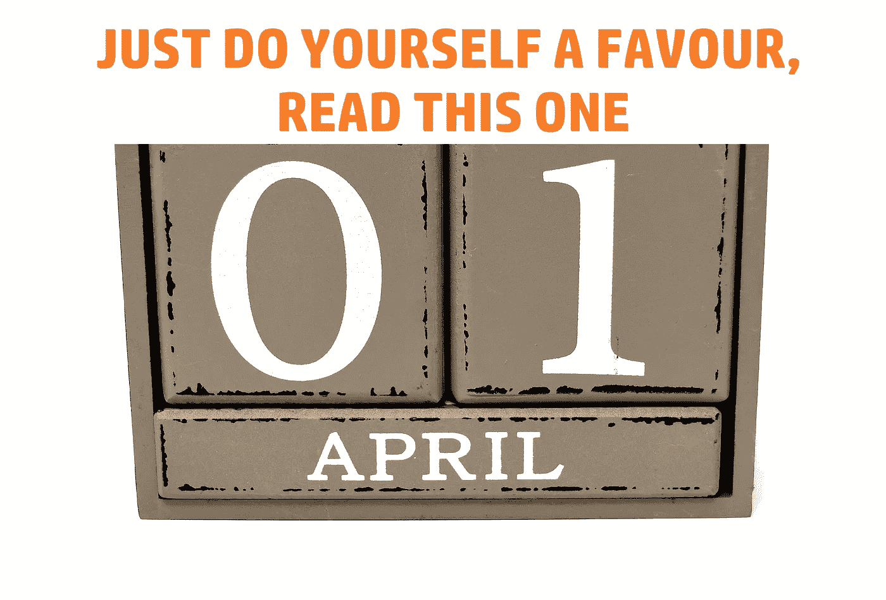

# 愚人节提前到来，因为 Cardano 背后的公司将推出一个新的隐私区块链

> 原文：<https://medium.com/coinmonks/april-fools-day-has-come-early-as-the-firm-behind-cardano-is-set-to-launch-a-new-privacy-4d29b1d897f0?source=collection_archive---------16----------------------->

# 我打赌有人把日期搞混了。提前写了这篇文章，然后不小心把它的发表日期设错了。我敢打赌，新的区块链将被称为“铁离子”或类似的东西..等等，什么？他们..是认真的吗？？

# 午夜新隐私区块链

卡尔达诺区块链背后的公司 Input Output Global (IOG)将发布一种新的隐私区块链和令牌。新的区块链将被称为午夜，令牌将被称为灰尘。这种新的专注于隐私的区块链将使用所谓的零知识证明技术。这将使新的区块链在用户隐私方面更上一层楼。

> 这是一种全新的编写和运行私有智能契约和私有计算的方式。所以你可以有一个私有的 DEX(分散交换)或者去挖掘一个匿名的数据集或者诸如此类的东西。-IOG 首席执行官查尔斯·霍金森

新的链将采用“Kachina”一文中谈到的智能合同概念，并将其变为现实。这将是一件非常棒的事情。这很可能是创新和隐私的最佳解决方案。因为它将合并这两种功能。

那问题是什么，一切都很好，对吗？对吗？他们还宣布，为了解决隐私币目前存在的问题。审计师和监管者对此一无所知。这导致韩国禁止所有私人硬币在该国交易。这只是针对这些类型的加密所采取的行动的一个例子。

那么 Midnight 对这个问题的解决方案是什么呢？我的意思是，到目前为止，他们打了 1000 分(或者任何你想用的体育隐喻或不同的隐喻)。我相信他们也会解决这个问题。他们计划做什么？他们正在为审计员和监管者打开后门……我会让他们稍微明白这一点。

我现在希望你明白我说的愚人节提前或推迟是什么意思。一个隐私区块链，里面有后门。这有点违背了隐私的全部目的。这让我想起了一个无门无锁的保险箱。它看起来很好，但它不会再做它的设计用途了。这种纯粹的愚蠢让我莫名其妙。

我不知道说什么好。

请让我知道你对整件事的看法。你会考虑用这个吗？是或否，请在下面的评论区让我知道你对此的想法。如果你想支持我和我制作的内容，请考虑关注我，阅读我的其他帖子，或者为什么不两者都做。

网络上见！

图片提供:[https://pixabay.com/](https://pixabay.com/)

资源

1.  [https://iohk . io/en/research/library/papers/kachina-foundations-of-private-smart-contracts/](https://iohk.io/en/research/library/papers/kachina-foundations-of-private-smart-contracts/)

> 交易新手？试试[密码交易机器人](/coinmonks/crypto-trading-bot-c2ffce8acb2a)或者[复制交易](/coinmonks/top-10-crypto-copy-trading-platforms-for-beginners-d0c37c7d698c)