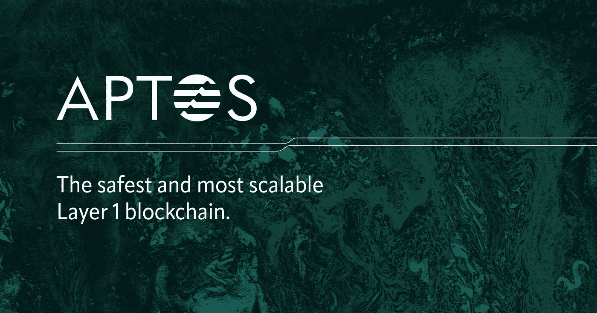
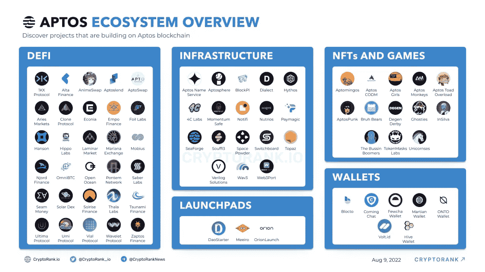

# Aptos 区块链分析:机遇与风险

> 原文：<https://medium.com/coinmonks/aptos-blockchain-analysis-opportunities-risks-1f3b0cd5f657?source=collection_archive---------1----------------------->

是时候对 Aptos 进行分析了，Aptos 是 Aptos 实验室开发的第 1 层区块链，其目标是比其他解决方案更好、更快、更可靠、更可扩展、更安全、更易于使用。

开始了。

> 2012 年 6 月 10 日更新
> 
> 项目首席执行官卷入了一场价值数十亿美元的诉讼，这给项目蒙上了一层阴影。
> 
> 该项目的估值相对较高，为[、40 亿美元](https://www.nftgators.com/aptos-hits-4b-valuation-after-strategic-investment-from-binance-labs/)，这可能意味着投资者不应指望项目启动后价格会上涨 5 倍或 10 倍。

## Aptos 的历史和未来路线图

Aptos 区块链由 [Aptos Labs](https://www.crunchbase.com/organization/aptos-96b4) 建造，Aptos Labs 是一家成立于 2021 年的 web3 初创公司，位于美国加利福尼亚州的帕洛阿尔托。

首先，快速总结一下 Aptos 的历史:

*   2021 年 1 月 Meta(原脸书)拥有的区块链项目 Diem 被 Silvergate 收购
*   2022 年 2 月— Aptos 上市
*   2022 年 3 月— Aptos 获得 2 亿美元融资
*   2022 年 3 月—币安宣布对 Aptos 进行战略投资
*   2022 年 5 月— Aptos 发布了一个激励性测试网络
*   2022 年 6 月— Aptos 启动生态系统资助计划
*   2022 年 7 月— Aptos 获得 1.5 亿美元融资

正如我们所看到的，Aptos 一直很忙，并且已经完成了很多工作。

他们刚刚在九月份完成了他们的测试网络 AIT-3。他们还计划在今年冬天引入 [AIT-4，测试扩展分散](https://aptoslabs.com/currents)和进一步的性能优化。该团队的计划是在今年第三季度推出 mainnet。

好吧。现在，让我们来看看他们的白皮书中有哪些详细信息。

## Aptos 白皮书

Aptos 白皮书解释了区块链工作原理的许多技术方面。强烈建议有兴趣的大家看一下。

亮点包括:

*   Aptos 使用 BFT PoS 共识和基于 Rust 的 Move 编程语言。
*   Aptos 区块链依靠并行执行来同时处理多个事务。目前，Aptos 每秒可以处理 130，000 个事务，同时保持安全性和可靠性。目标是达到 16 万。
*   当访问和改变数据时，Aptos 的成本几乎是固定的。
*   区块链支持将大规模数据集存储在表中，并且支持共享或自治帐户。

## Aptos 记号组学

像许多其他 L1-区块链法案一样，Aptos 依赖链上的本地令牌来进行交易、网络费用、治理投票和赌注。重要提示:令牌尚未颁发。

因此，代币上的许多信息仍然缺失，如供应、分配、授予时间等。这就是为什么在这方面无法给出确凿的评估。

## Aptos 团队

Aptos 实验室由 Meta(脸书)的前员工创建。他们中的一些人来自 Meta 的前 Diem 区块链团队，包括两位联合创始人 Mo Shaikh 和 Avery Ching。

莫谢赫 在 2020-2021 年间负责 Meta 的战略合作伙伴关系。在此之前，他作为总部位于区块链的投资平台 Meridio 的创始人兼首席执行官，积累了加密领域的经验。

[**Avery Ching**](https://www.linkedin.com/in/averyching/) 从 2011 年到 2021 年在脸书和 Meta 担任首席软件工程师超过 10 年。他的大部分职责是开发和维护 Meta's Diem 区块链。

各创始成员的简历读起来令人印象深刻。在研究、工程、设计和运营领域有很多专业知识。Aptos 实验室目前雇佣了大约 70 名员工，并且还在持续增长。

## Aptos 基金和合作伙伴

今年 3 月，Aptos 完成了由安德森·霍洛维茨(Andreessen Horowitz)牵头的 2 亿美元投资，老虎环球(Tiger Global)、Multicoin Capital、三箭资本(Three Arrows Capital)、FTX 风险投资公司、比特币基地风险投资公司等都参与了投资。

今年 7 月，Aptos 在由 FTX 风投和 Jump Crypto 牵头的首轮融资中筹集了 1.5 亿美元。这包括来自安德森·霍洛维茨、Multicoin Capital 和 Circle Ventures 以及币安等其他加密公司的投资

这是一大笔资金。这个项目从著名投资者那里获得了如此多的资金，这说明了很多问题。

Overview of the Aptos Ecosystem. Source: [https://news.cryptorank.io/aptos-ecosystem-overview/](https://news.cryptorank.io/aptos-ecosystem-overview/)

## Aptos 生态系统

据 [Aptos](/aptoslabs/announcing-the-aptos-grant-program-7654b92e22a1) 称，其生态系统目前有超过 **100 个项目**建立在网络上。用例涵盖不同的领域，如 DeFi、NFT、钱包、发射台和游戏。

在这里，我挑选了几个例子:

[**Econia**](https://www.econialabs.com/) —一个超平行链上的订单簿，开源，去中心化。

**Zaptos** —一种非托管的液体赌注协议，使用户能够存放他们的资产，以换取可用于 DeFi 协议或基于 aptos 链构建的其他 Dapps 的衍生品。

[**小瓶**](https://www.vial.fi/)——允许用户借出和借入资产的集合利率协议。一种算法根据池利用率设定贷款利率。

[**Martian**](https://martianwallet.xyz/)——在 Aptos 区块链上管理资产和访问 Dapps 的钱包。它还支持铸造 NFT。

作为一个构建基本区块链的人，Aptos 严重依赖使用他们产品的其他项目。情况似乎是这样的——尽管必须指出，这些解决方案中的大多数仍处于构思和开发阶段。

## Aptos 社交媒体渠道

Aptos 拥有越来越多的追随者。

*   他们的 [Discord](https://discord.com/invite/zTDYBEud7U) 有+100k 成员
*   他们的推特账户有 142，000 名粉丝
*   他们的媒介@AptosLabs 拥有 7000 名粉丝
*   在 [Github](https://github.com/aptos-labs/aptos-core/graphs/contributors) 上的 Aptos-core 存储库中，我们看到许多来自贡献者的提交。

从我看到的情况来看，Aptos 社交媒体团队非常活跃。他们定期发布内容，用户方面也有很多参与。看起来不错！

## Aptos 竞赛

当谈到第 1 层区块链时，有许多其他解决方案可用，如雪崩和古老的以太坊。显然，Aptos 在容量方面有优势，这就是为什么我认为 Aptos 有机会胜过许多中等市值的第一层区块链。

你应该关注的一个竞争对手是 Mysten Labs。与 Aptos Labs 类似，创始团队也来自 Meta。我将在另一篇文章中介绍我的实验室。

## **风险**

作为一个新的区块链项目，我们还应该记住存在一些风险:

*   对于所有去中心化的开源项目，都需要时间来证明协议是安全的、不可改变的。
*   钱包的漏洞，尤其是第三方开发的。
*   请注意，该项目被大肆宣传，你可能会以非常高的价格购买。

## 摘要

该项目正在取得巨大进展，似乎正在顺利地按照其路线图进行。该团队带来了必要的经验——无论是在区块链地区，还是在建立一个成功的公司所需的其他基础方面。资金和合作伙伴令人印象深刻。

我认为 Aptos 是一个值得关注的项目。然而，由于主网还没有启动，仍然缺少一些重要的信息。

*声明:本文仅代表作者个人观点。它仅用于信息和教育目的，不应被视为财务建议。*

> 交易新手？试试[密码交易机器人](/coinmonks/crypto-trading-bot-c2ffce8acb2a)或者[复制交易](/coinmonks/top-10-crypto-copy-trading-platforms-for-beginners-d0c37c7d698c)