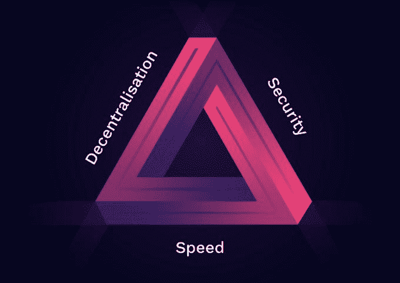
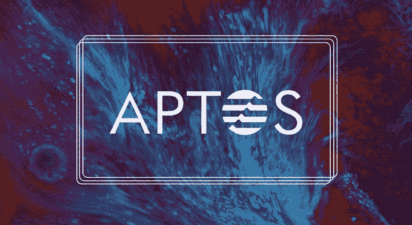
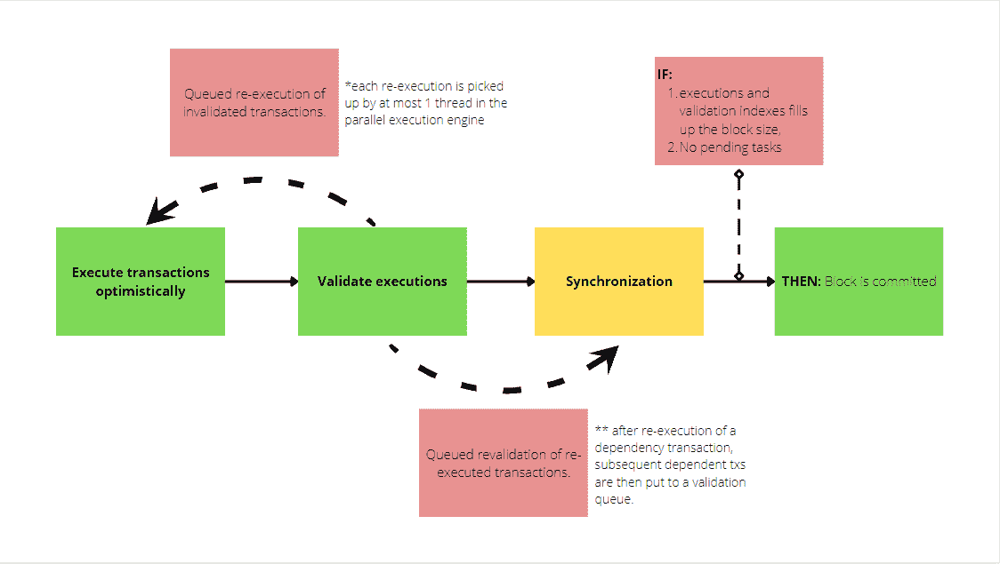
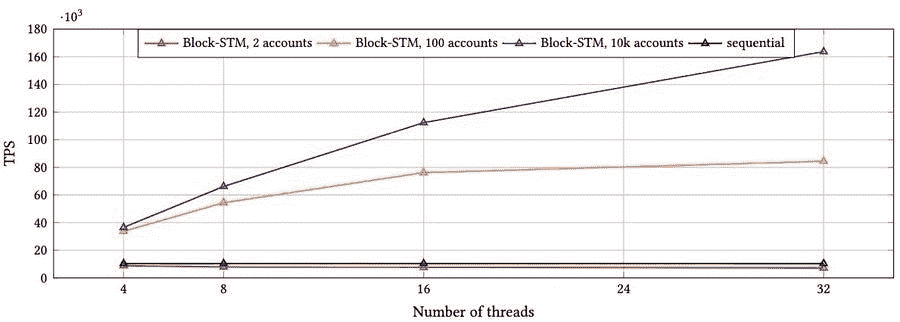
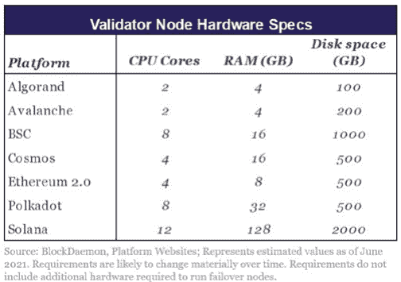
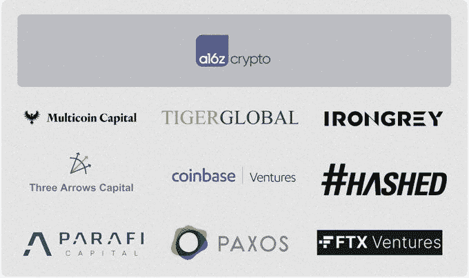

# 阿普托斯链条:隋的劲敌

> 原文：<https://medium.com/coinmonks/aptos-chain-a-worthy-opponent-to-sui-blockchain-4595105f78de?source=collection_archive---------3----------------------->

去年，功能层 1 拥有促进生态系统泵的重要基础。泵与具有更高吞吐量、更低费用、原生 dApps、风险迷因币、大规模 apy 等的 L1 相关联。作为精明的投资者，我们知道当一个生态系统表现良好时，购买基础令牌可以作为一个通用篮子来获取可观的利润。

L1s 试图解决区块链三难问题——去中心化、安全性和可伸缩性。

如果大规模采用加密货币是愿景，可扩展性仍然没有解决。以太坊、索拉纳和其他一些 L1 连锁店不太可能是寡头垄断结构的例外。

许多 L1 来了又走，而其他的已经成为非常成功的连锁店。现在，另一个 L1 即将加入这个派对。

新的 L1 被称为 Aptos。

Aptos 是由 Meta's Diem 团队创建的 L1 PoS 连锁店。它声称是一个更加安全和可伸缩的 L1。它还声称解决了区块链难题。

作为一个区块链，Aptos 目前正在使用 [Move](https://move-book.com/) (一种从 Diem 退出的专用语言)构建。Move 允许智能契约以确定的、密封的(可预测的；未污染)和计量方式(防止 DOS 攻击)。

使用 Move，Aptos 结合其改进的基于领导者的 BFT 共识机制，确保块提交的低延迟和零停机时间，这显然是 HotStuff 最[可靠的迭代。](https://eprint.iacr.org/2019/270.pdf)

Aptos 的成立是为了通过利用尖端技术和研究，为每个人提供平等获得权力下放好处的机会。目前，当需求激增时，活区块链要么停止，要么变得极其昂贵。如果我们想在现实世界中大量采用 crypto 和 web3，这并不好。它必须超越暗室的回音室。

## **那么，Aptos 如何扩展呢？**

Aptos 通过并行执行引擎将相互依赖的执行层和共识层解耦，最终实现同步，从而实现扩展。

并行执行层利用 Block-STM 设计，在检测和管理冲突之前乐观地执行事务，然后同步和改变状态。

## **但是检测到的冲突怎么办？**

它们至多被并行执行引擎中的一个线程拾取，并基于执行队列被重新执行，以及通过队列与它们的后续 tx 一起被重新验证。

Block-STM 算法处理无缝操作，抽象与琐碎的执行和验证分离开来。这一切都是可能的，因为预设的订单带有索引，可以在整个执行和验证周期中映射事务。

通过 Block-STM 设计的 32 个线程并行工作，辅以其强大的状态同步机制来减少延迟，Aptos 将能够以亚秒级的终结性夸耀高达 100k+ tps。

1.  安全性:除了 Move 的安全特性，共识机制；

*   将活性、安全性审计和正式验证分开
*   验证器管理是在链上完成的
*   名誉系统为了响应性而轮换领导者节点
*   确定性(仅基于分类帐状态中包含的信息)
*   计量(在事务执行级别防御拒绝服务攻击)
*   私有/一致密钥轮换。
*   关键恢复集成(新功能)

2.可量测性

*   Testnet 在终结时间和 TPS(独立的 txn 执行和共识机制)方面优于主要的对等体
*   txn 在两次网络访问中得到验证，而对等体需要多轮投票
*   改进的数据结构和存储
*   状态同步

3.在私有 mainnet 中不停机的情况下继续测试:在网络中断的情况下，链上信誉系统自动减轻故障验证器的影响。

4.网络体系结构

*   降低开发人员的技术复杂性和社会协调性
*   更低的延迟
*   改进的可组合性
*   改进的应用程序通信和功能
*   网络效果友好

5.分散

*   减少运行节点的障碍
*   最低硬件要求:四核 CPU、8GB 内存和 300GB 存储空间
*   比大多数竞争对手的硬件要求更低

现在，你可能会问一个问题。

这听起来不像隋吗？

**Aptos Vs 隋**

与 AptosLabs 一样，隋的 Mysten Labs 也是由 Meta 的一个前 Novi 研究团队创建的。这是一个高性能的 L1 PoS 链，主要面向游戏、社交、商业等广泛的元宇宙应用，提供可扩展的可组合动态 NFT。

与 Aptos 一样，Sui 的技术堆栈从 Diem 取得了重大进展，Diem 最初旨在处理少量保管钱包(10 到 100 个)之间的轻度支付流量。Diem 的原始架构无法支持大规模采用。

Aptos 和 Sui 有许多相同的投资者。这两家公司都被风险投资家下了重注，估值高达 20 亿美元或更多。

然而，隋和 Aptos 之间有许多基本和表面的相似之处。以下是其中的一些差异。

*   **编程语言:**虽然它们都使用 Move 编程语言的变体进行并行执行，但 Sui 的对象模型与 Aptos 略有不同。Sui 的举动清楚地表明了一个对象什么时候是拥有/共享的，什么时候是可变/不可变的，而 Aptos 不是。Sui 的所有权 API 也比 Aptos 的更干净，因为它更清楚地展示了区块链的设计。
*   架构:Sui 采用了基于 DAG 的 mempool (Narwhal)和 Tusk 共识算法。然后，DAG 用于执行层的并行化。与此同时，Aptos 通过使用 BlockSTM 动态检测依赖性和调度执行任务来实现并行化，BlockSTM 是高性能 HotStuff 算法的一种演变(其灵感来自软件事务内存)。
*   **可扩展性:**一般来说，值得注意的是，这两个链都没有针对家庭验证器或大规模分散化进行优化，而是针对“最大化网络容量”(即像索拉纳)。瓶颈很可能是州政府的增长。Aptos 优先考虑异构验证器(受约束的 CPU 和/或受约束的存储),而 Sui 通过高效划分存储和水平扩展资源来应对状态增长。
*   **开发者体验:**两者处于同一发展阶段，Aptos 略领先。我们还注意到一些我们认为可以分享的事情。

1.  我们建立系统比编码花的时间还长。学习语言和环境需要一些尝试和错误。
2.  在这两种情况下，部署到 devnet 也很耗时。幸运的是，单元测试库非常有用。最令人沮丧的方面是模糊的编译器错误和毫无意义的 devnet 错误响应。这些都是很大的时间浪费。

Aptos 以用户为中心进行技术开发。这源于这样一种信念，即要接触大众，用户体验需要在安全性和可伸缩性方面有显著的改进。如果操作正确，它有可能提供显著的竞争优势。

开发是一个重要的考虑因素，因为它影响链上应用的质量(影响用户获取)。根据流行的模型，资金的流动是这样的:资本->开发商->用户->交易-> TVL ->价格。在周期的早期投资意味着收获最大的收益。

为此，Aptos 有一个 Devnet，开发者可以在那里贡献开源代码。已经有一个令人印象深刻的开发商名单，包括比特币基地、币安、安克雷奇、Blockorus、Livepeer、Moonclave、Paxos、Paymagic 和 Rarible 等。

目前，Aptos Discord 服务器上有 8000 名开发人员，该服务器拥有 63，000 名成员。此外，已经有来自 40 个国家的 4000 个节点运营商。尽管事实上 Aptos 还没有白皮书。

Aptos 还宣布了一项鼓励发展的资助计划。该团队的主要关注领域是 DeFi、NFTs 和游戏，他们向成功申请其资助计划的开发者支付报酬(金额尚未披露)。

Aptos 也是资金最充足的加密项目之一。今年 3 月，他们宣布了由 a16z 牵头的一轮 2 亿美元融资。这轮投资还包括来自 Multicoin Capital、比特币基地风险投资公司、3AC、Tiger Global 和 FTX 风险投资公司的投资。

7 月 25 日，他们宣布了首轮融资，额外筹集了 1.5 亿美元。这一轮仍然有来自融资轮的大多数主要支持者；FTX 风投(领投了这轮融资)、Multicoin Capital、Circle Ventures 和安德森霍洛维茨(Andreessen Horowitz)。相比之下，Solana 在推出前筹集了 2500 万美元，而 Aptos 筹集了 3.5 亿美元。

**最终想法:**

Aptos 拥有一个资金充足、具有连续性和组织成熟度的团队来实现其愿景。凭借其现代化的技术和 Move 的语言效率，它被定位为领先的 L1 连锁店。

然而，很难预测 Sui 和 Aptos 谁在实践中表现更好。Aptos 已经在优化其当前设计方面做得非常出色，而 Sui 似乎有更大的空间。不同的解决方案已经被用于改善 L1(第二层、子网、分片、互操作性)。我们永远不会知道市场会做出什么决定，但 Aptos 是一个强有力的竞争者。

**参考资料:**

*   [https://github . com/aptos-labs/aptos-core/blob/main/developer-docs-site/static/papers/aptos-move-a-language-with-programmable-resources/2020-05-26 . pdf](https://github.com/aptos-labs/aptos-core/blob/main/developer-docs-site/static/papers/aptos-move-a-language-with-programmable-resources/2020-05-26.pdf)
*   [https://medium . com/aptos labs/welcome-to-aptos-incentived-testnet-2-af 26 e 2 FD 69 a 7](/aptoslabs/welcome-to-aptos-incentivized-testnet-2-af26e2fd69a7)
*   [https://github . com/aptos-labs/aptos-core/blob/main/developer-docs-site/static/papers/aptos-move-a-language-with-programmable-resources/2020-05-26 . pdf](https://github.com/aptos-labs/aptos-core/blob/main/developer-docs-site/static/papers/aptos-move-a-language-with-programmable-resources/2020-05-26.pdf)
*   [https://TechCrunch . com/2022/03/15/aptos-labs-a16z-multi coin-Facebook-diem-区块链/？guc counter = 1&guce _ referrer = ahr 0 CHM 6 ly 93d 3c uz 29 vz 2 xll mnvbs 8&guce _ referrer _ SIG = aqaacnn-wczwqseumjuztgkypq 6 vag 7c-CD 7 ys 59 waafhksnsmqbi 7 zqgzr 1 nys D5 w08 f _ edyjGoL-EpX _ ihz 9 iwile 1 CLT _ Hc _ GMF 4g HF 2 JVC 3 e 6 xbcw-G3 vsw](https://techcrunch.com/2022/03/15/aptos-labs-a16z-multicoin-facebook-diem-blockchain/?guccounter=1&guce_referrer=aHR0cHM6Ly93d3cuZ29vZ2xlLmNvbS8&guce_referrer_sig=AQAAACNn-wczWqseumjUzTgGkYPQ6VaG7C-Cd7Ys59wAAfHkSnsmQbI7ZqgzR1NySD5W08F_edyjGoL-EpX_IHZ9iwIlE1CLT_Hc_gmf4GHF2jVc3E6XBcw-g3Vsp2Dsx6O5V8KRoJDOqtFx7OYmTbAjDVSqpcNFE-k32lDfSXZKaolg)
*   [https://pontem . network/posts/the-future-of-pontem-with-aptos](https://pontem.network/posts/the-future-of-pontem-with-aptos)
*   [https://members . Delphi digital . io/reports/the-hitching liers-guide-to-ether eum/](https://members.delphidigital.io/reports/the-hitchhikers-guide-to-ethereum/)
*   [https://medium . com/aptos labs/aptos-incentived-testnet-roadmap-209 be 695 c77c](/aptoslabs/aptos-incentivized-testnet-roadmap-209be695c77c)
*   [https://medium . com/aptos labs/aptos-labs-partners-with-Google-cloud-enable-further-decentralization-of-the-aptos-network-f 6 EAE 47 D4 c 65](/aptoslabs/aptos-labs-partners-with-google-cloud-to-enable-further-decentralization-of-the-aptos-network-f6eae47d4c65)
*   [https://developers . diem . com/papers/diem-consensus-state-machine-replication-in-the-diem-区块链/2021-08-17.pdf](https://developers.diem.com/papers/diem-consensus-state-machine-replication-in-the-diem-blockchain/2021-08-17.pdf)
*   [https://arxiv.org/abs/1803.05069](https://arxiv.org/abs/1803.05069)

> 加入 Coinmonks [电报频道](https://t.me/coincodecap)和 [Youtube 频道](https://www.youtube.com/c/coinmonks/videos)了解加密交易和投资

# 另外，阅读

*   [3 商业评论](/coinmonks/3commas-review-an-excellent-crypto-trading-bot-2020-1313a58bec92) | [Pionex 评论](https://coincodecap.com/pionex-review-exchange-with-crypto-trading-bot) | [Coinrule 评论](/coinmonks/coinrule-review-2021-a-beginner-friendly-crypto-trading-bot-daf0504848ba)
*   [莱杰 vs Ngrave](/coinmonks/ledger-vs-ngrave-zero-7e40f0c1d694) | [莱杰 nano s vs x](/coinmonks/ledger-nano-s-vs-x-battery-hardware-price-storage-59a6663fe3b0) | [币安评论](/coinmonks/binance-review-ee10d3bf3b6e)
*   [加密交易机器人](/coinmonks/crypto-trading-bot-c2ffce8acb2a) | [Bingbon 评论](https://coincodecap.com/bingbon-review)
*   [Bybit Exchange 审查](/coinmonks/bybit-exchange-review-dbd570019b71) | [Bityard 审查](https://coincodecap.com/bityard-reivew) | [Jet-Bot 审查](https://coincodecap.com/jet-bot-review)
*   [3 commas vs crypto hopper](/coinmonks/3commas-vs-pionex-vs-cryptohopper-best-crypto-bot-6a98d2baa203)|[赚取加密利息](/coinmonks/earn-crypto-interest-b10b810fdda3)
*   [SmithBot 评论](https://coincodecap.com/smithbot-review) | [4 款最佳免费开源交易机器人](https://coincodecap.com/free-open-source-trading-bots)
*   [比特币基地僵尸程序](/coinmonks/coinbase-bots-ac6359e897f3) | [AscendEX 审查](/coinmonks/ascendex-review-53e829cf75fa) | [OKEx 交易僵尸程序](/coinmonks/okex-trading-bots-234920f61e60)
*   [如何在印度购买比特币？](/coinmonks/buy-bitcoin-in-india-feb50ddfef94) | [WazirX 评论](/coinmonks/wazirx-review-5c811b074f5b)
*   [加密交易机器人](/coinmonks/crypto-trading-bot-c2ffce8acb2a) | [菜鸟评论](https://coincodecap.com/probit-review)
*   [隐料斗替代品](/coinmonks/cryptohopper-alternatives-d67287b16d27) | [HitBTC 审查](/coinmonks/hitbtc-review-c5143c5d53c2)
*   [CBET 评论](https://coincodecap.com/cbet-casino-review) | [库科恩 vs 比特币基地](https://coincodecap.com/kucoin-vs-coinbase)