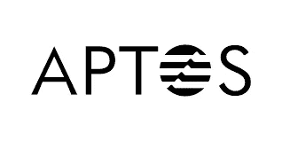
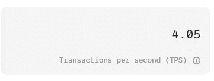
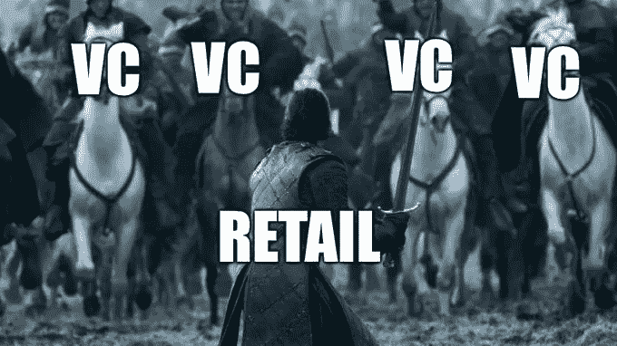
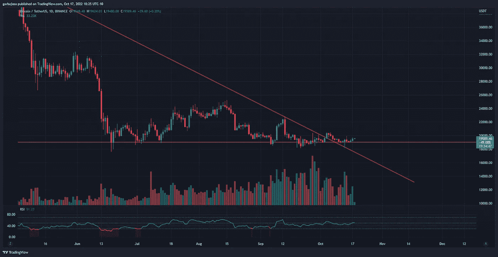
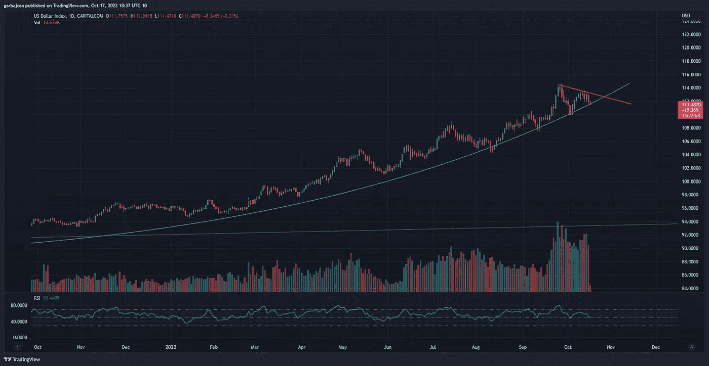
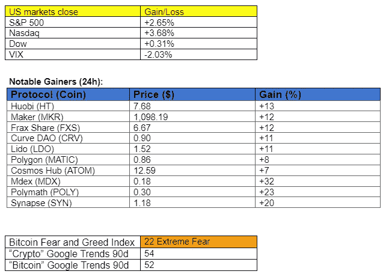
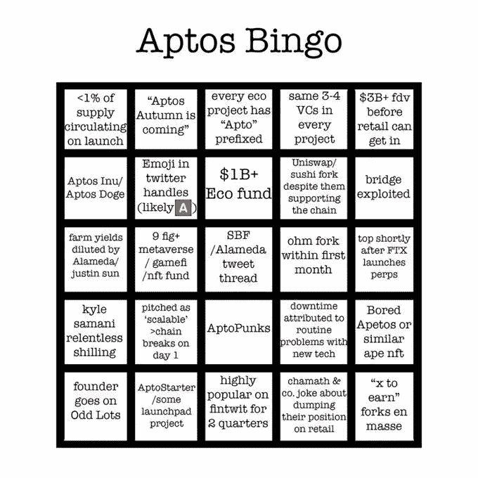

# Aptos:最新的 L1 技术或风险资本抢钱？

> 原文：<https://medium.com/coinmonks/aptos-newest-l1-tech-or-venture-capital-money-grab-b8a5ad164ab0?source=collection_archive---------5----------------------->

## 每日征服#106

最好的每日新闻、见解和阿尔法信息来源。

*密码市场是一个狂野、奇妙而令人生畏的地方；不要一个人跋涉！订阅加密征服者，让我们成为您的向导。*

订阅这份每日时事通讯，永不错过任何一期。

**概述**

*   介绍 Aptos:一个符号之谜。
*   DXY 开始下跌了吗？
*   Frax Finance 推出了以太坊流动性赌注协议。
*   NFT 现实世界的公用事业:房子在开放海上出售。

感谢阅读密码征服！免费订阅接收新帖，支持我的工作。

早上好，家人，

Aptos Mainnet 上线了！

经过四年的开发，前 Meta 工程师在市场上推出了最新的第一层(L1)区块链。根据[白皮书](https://aptos.dev/assets/files/Aptos-Whitepaper-47099b4b907b432f81fc0effd34f3b6a.pdf)，Aptos 开发人员根据这些基本原则设计了该链:可伸缩性、安全性、可靠性和可升级性。

该项目估值 10 亿美元，拥有一些重量级风险投资家的支持，如 FTX 风险投资公司、币安实验室、比特币基地风险投资公司和 a16z。但并非一切都好。

**链条开始不稳**。根据 Aptos Explorer，该链每秒钟仅处理[四个事务！请记住，这被称为“索拉纳黑仔。”4 tps 顺便说一下比比特币慢。随着 mainnet 的上线，Aptos Discord](https://explorer.aptoslabs.com/) 已经陷入黑暗。

令牌组学看起来也不那么热门。Aptos (APT) token 的供应量超过 1 万亿，估计有 8210 亿的股份，可能由早期 VC 投资者和团队控制。这些早期投资者将寻求获利了结。由于没有早期的代币发行或空投，零售将成为目标。

*来源:* [*推特，@nosleepjon*](https://twitter.com/nosleepjon/status/1582148895374598149?s=20&t=_9lGSwi6rm7-OE-x3vEhvw)

更糟糕的是，没有对象征经济学的深刻解释。密码分析师 Cobie 对此不太感兴趣，并在他的推文中提到了这个话题:

总而言之，Aptos 区块链在加密 Twitter 上受到了一些严厉的批评。此外，由于缺乏象征性的透明度，链性能差，以及很少的答案，除了项目组织者没有人可以责怪。

# 市场更新🌍

BTC/USDT·1D

价格在 18.2 万美元和 20.3 万美元之间徘徊了 34 天，交易量继续保持在较低的范围内。价格波动对比特币来说并不罕见，在熊市期间，比特币偶尔会进入休眠阶段。一个这样的例子是，从 2018 年 12 月到 2019 年 4 月，BTC 在 3300 美元到 4000 美元之间波动。BTC 收盘上涨 1.49%，至 19549 美元。

*高清* [***图表***](https://www.tradingview.com/x/Eomrxo5l/)

**DXY 1D**

从上周晚些时候到今天，美元指数(DXY)表现出最轻微的疲软。价格在 10 月 12 日创下较低高点后，抛物线支撑正在接受测试。交易量大幅增加，表明在这些层面正在酝酿重要的事情。如果我们幸运的话，DXY 开始下跌，投资者开始从美元转向风险更高的资产。DXY 收盘下跌 1.12%，至 111.83 点。

*高分辨率* [***图表***](https://www.tradingview.com/x/iEpegMJp/)

如果你喜欢这份报告，并且认为它值 20 分(0.01 美分)，请按下面的鼓掌按钮来支持我的写作。(最多 50 次！)谢谢！

# 新闻观察📰

**通过邮件传唤？**三箭资本破产案的清算人[要求](https://twitter.com/AutismCapital/status/1582067551282270208?s=20&t=N6C1Wx-MAfVWR56NMXsURA)官员有权通过电子邮件地址、Twitter 账户或律师电子邮件向联合创始人苏竹和凯尔戴维斯送达传票，因为这两人无法找到。此外，证券交易委员会(SEC)和商品期货交易委员会(CFTC)正在调查该公司在倒闭前误导投资者的资产负债表。

**液体静置 Frax 型。**分散稳定加入协议 Frax Finance I[正在引入](https://twitter.com/TheBlock__/status/1581989813473153024?s=20&t=N6C1Wx-MAfVWR56NMXsURA)一种铸造 Frax Ether (frxETH)代币的 Ethereum 流动性抵押协议，这是一种与 ETH(ETH)价格相匹配的衍生品。根据核心开发者杰克·科尔德里的说法，发射将在两周内进行，除非发生任何不可预见的情况。

**与 Ethereum 兼容的纹波测试侧链。**Ripple 开发人员正在[测试](https://twitter.com/RippleXDev/status/1581998430246690817?s=20&t=N6C1Wx-MAfVWR56NMXsURA)一个与 EVM 兼容的侧链，该侧链允许智能合同使用 XRP 分类账部署在以太网上。三个阶段中的第一个阶段已经完成，该团队预计到 2023 年会有一个正常运行的侧链。

**万事达卡+帕克斯**万事达卡和密码交易所 Paxos [联手](https://twitter.com/CNBC/status/1582052884123856905?s=20&t=N6C1Wx-MAfVWR56NMXsURA)帮助银行向客户提供密码交易。

**新闻花絮:**

*   得克萨斯州监管机构正在对美国 FTX 进行调查。
*   以太网[上海 Testne](https://www.coindesk.com/tech/2022/10/17/the-next-major-ethereum-upgrade-shanghai-now-has-a-testnet/) t 是活的。
*   朝鲜黑客组织拉扎勒斯[以日本密码公司](https://www.coindesk.com/business/2022/10/17/north-korean-hacker-group-lazarus-targets-japanese-crypto-firms/)为目标。
*   凯恩·韦斯特购买“自由言论平台”帕勒。

**NFT &元宇宙更新🐵**

*   **房地产区块链:南卡罗莱纳州的一栋房子使用 NFT 服务** [**屋顶存货**](https://twitter.com/rsonchain) **在公海以 17.5 万美元出售** **。**

**我的五美分……**

总是有很多关于提供最新和最伟大技术的新加密项目的炒作。往往，只是好的营销。明智的选择是等待一个项目的结果，尤其是如果它的象征经济学仍然是一个谜的话。

与此同时，让我们玩一些 Aptos 宾果游戏。

***加百列***

*关注我* [*推特*](https://twitter.com/web3_gabri) *每日更新！*

订阅这份每日简讯，永不错过任何一期。

> 交易新手？试试[加密交易机器人](/coinmonks/crypto-trading-bot-c2ffce8acb2a)或者[复制交易](/coinmonks/top-10-crypto-copy-trading-platforms-for-beginners-d0c37c7d698c)