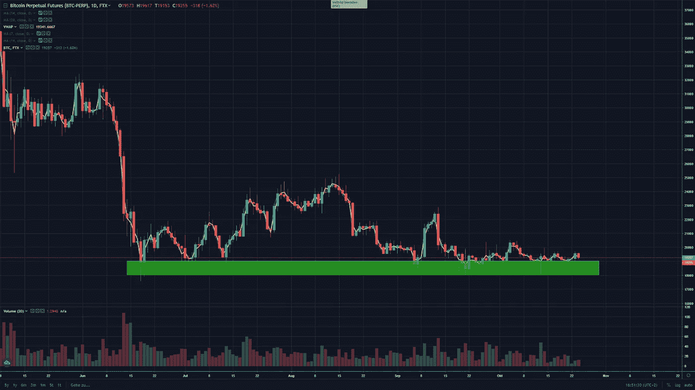
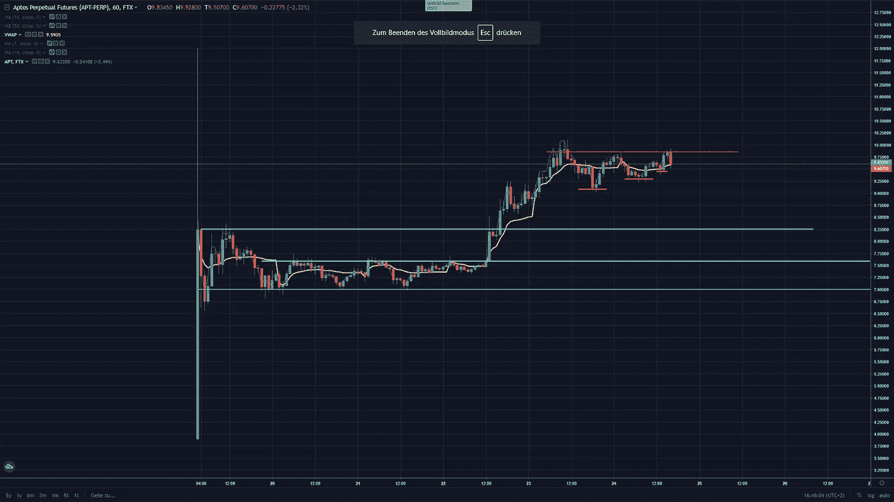

# Aptos —交易聚焦($APT)

> 原文：<https://medium.com/coinmonks/aptos-trading-spotlight-apt-9b1628240da3?source=collection_archive---------46----------------------->

比特币(BTC)在最近几天和几周获得支撑，所有更大的下跌都被浸透。所以我不想对 BTC 短期内的走势做任何预测，但对我来说，似乎我们还有下跌的空间。随着许多国家都在谈论衰退，我认为底部还没有到来。下面是比特币的日线图，支撑线在 19k 美元附近。

**APTOS:**

一种特殊的硬币是最近的热门话题，我显然是在说 Aptos ($APT)，它显示了一个非常好的多头排列，因为它很好地保持了 7 美元的水平，然后在 10 月 22 日突破了 8.20 美元的水平，此后再也没有回头。Aptos 很好地保持了 9 美元到 9.25 美元的水平，在我看来，如果 Aptos 保持更高低点的趋势，我们可以看到 Aptos 突破更高。如果成交量能突破 9.80 美元至 10 美元，我们可能会看到上涨。如果价格突破 10 美元大关，我们可以看到一些真正的动力。下面是 Aptos 的小时图。

希望这在某些方面有所帮助。祝您愉快！

尼克拉斯

声明:这不是财务建议！

> 交易新手？试试[密码交易机器人](/coinmonks/crypto-trading-bot-c2ffce8acb2a)或者[复制交易](/coinmonks/top-10-crypto-copy-trading-platforms-for-beginners-d0c37c7d698c)