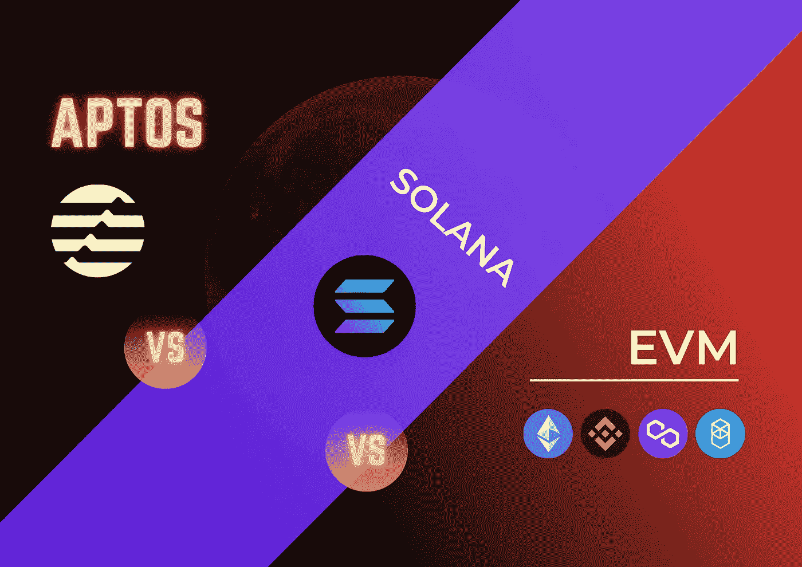
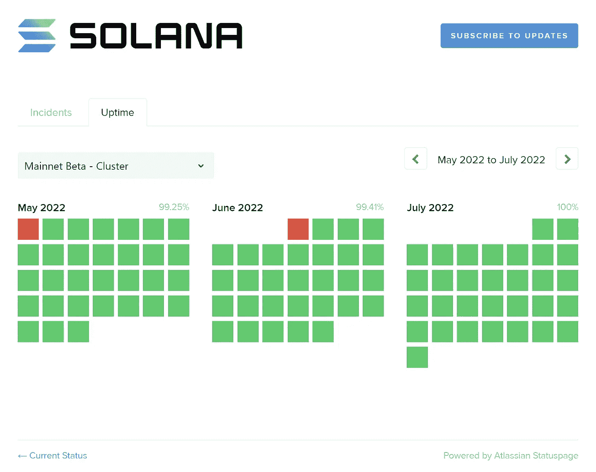
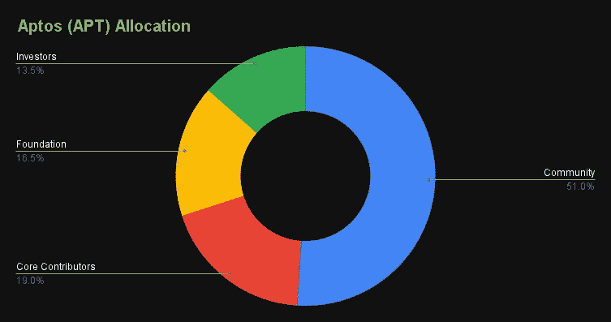
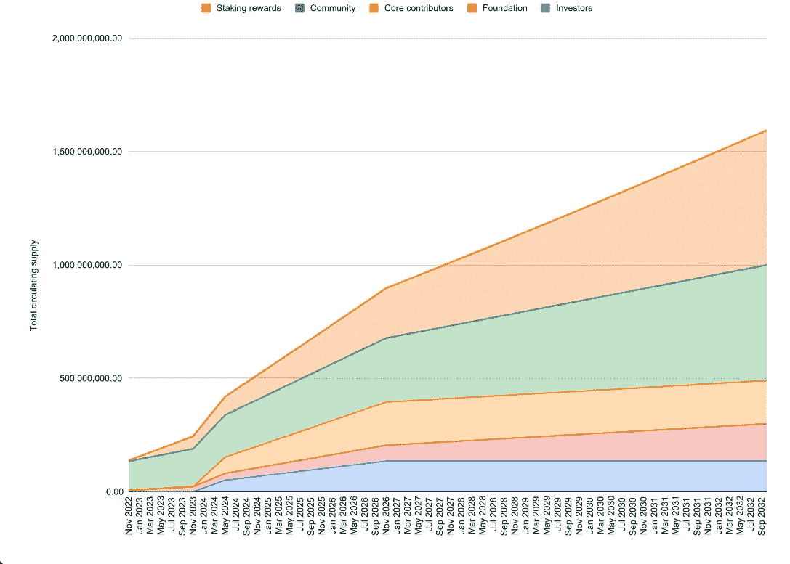
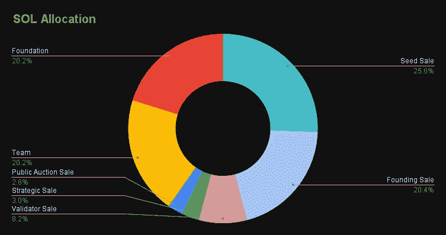
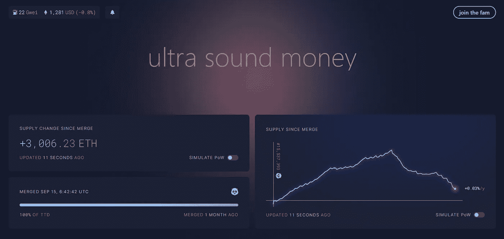
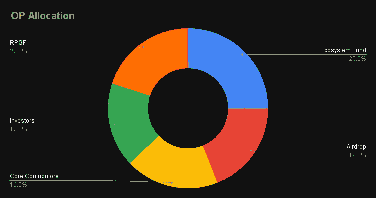
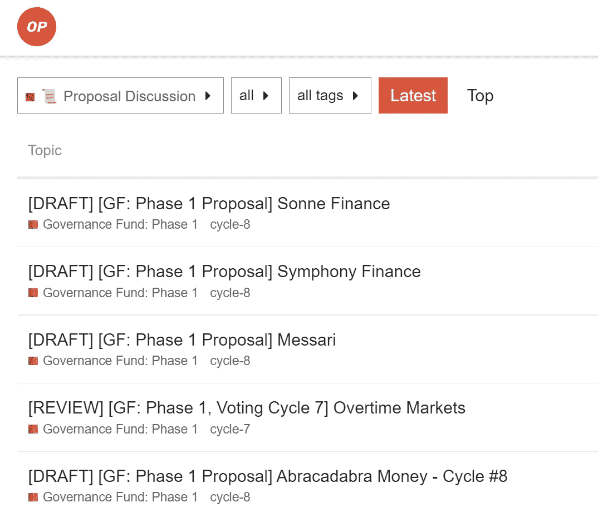

# Aptos VS 索拉纳 VS EVM 比较

> 原文：<https://medium.com/coinmonks/aptos-vs-solana-vs-evm-comparison-7194dc5dff59?source=collection_archive---------3----------------------->

Aptos vs Solana vs EVM

Aptos 是来自脸书最初的 Diem 开发团队的一个新的第一层区块链。Aptos 倾向于尽可能保持 Diem 的真实性。相比之下，Sui 倾向于进一步改进 Diem。

这篇博客将比较 Aptos 与 Solana 和 EVM 在性能、可靠性、词汇学和智能合同语言方面的差异。

# 表演

## Aptos

Aptos 正在发明一种叫做并行处理的创新。它允许同时处理多个事务，而不是传统的逐个处理事务的方式。它将使区块链具有无限的可扩展性。

传统方式要求每个节点重复处理所有事务，一次一个块，每个块包含多个事务。尽管一个块包含许多事务，但每个节点都从同一个未决事务池中挑选这些事务。尽管节点数量增加了一倍，但性能并没有任何提高，因为每个节点都处理相同的事情。

另一方面，在并行处理中，每个节点独立处理不同批次的未决事务。因此，随着节点数量的增长，网络的每秒事务吞吐量将会增加。通过提供更多节点，并行处理可以横向扩展。

Aptos 最近的负载测试结果已经达到**大约每秒 130，000 个事务**。如果实现得当，相对于正在运行的节点数量，Aptos 每秒可以处理无限的事务。

## 索拉纳

与其他主要利用利害关系证明的链不同，Solana 认为可伸缩性问题的根本原因依赖于共识。因此，索拉纳发明了一种新颖的历史证明共识连同塔 BFT，一个 PoH 优化版的 PBFT。Solana 还利用其他技术和工具获得了在 Aptos 推出之前可以使用最便宜的天然气费每秒处理大多数交易的头衔。

Solana 每秒可以处理大约 65，000 个**事务。**然而，由于其可靠性和复杂性，Solana 可能难以进一步扩大规模。目前，Solana 每秒钟可处理 3000 笔交易，每笔交易收取 0.00025 美元的油费。

## 幽灵

Fantom 是 EVM 的改进版本，因为每个节点不处理同一个事务批次。Fantom 的深度技术通过利用有向无环图(DAG)机制实现了 EVM 链中的并行处理。Fantom 使用专门的共识，巨蝮属，这是一种异步拜占庭容错(aBFT)共识算法，主要用于在其架构中实现并行处理。

Fantom 在每秒交易量和低燃气费方面都有显著的性能提升。然而，Fantom 每秒只能完成**大约 20，000 个事务，**而 Aptos 可以达到

## 其他 EVM

其他 EVM 主要按顺序处理事务。正如 Aptos 一节中提到的，每个节点都处理同一批事务。尽管节点数量增加了一倍，但性能并没有任何提高，因为每个节点都处理相同的事情。所以，在其他 EVM 中的表现很糟糕。比如**以太坊每秒只能处理大约 20 笔交易**。否则，气体会激增。

# 可靠性

## Aptos

Aptos 刚刚推出 mainnet，所以没有足够的数据来衡量 Aptos 的可靠性。不过应该比索拉纳靠谱；否则就会成为新的模因。

## 索拉纳

众所周知索拉纳非常不可靠。许多人说索拉纳杀手就是索拉纳本身，因为它在一年中下降了很多。每个人都可以看看索拉纳在 https://status.solana.com/uptime[的正常运行时间和停机时间。](https://status.solana.com/uptime)

[https://status.solana.com/uptime](https://status.solana.com/uptime)

## 以太坊

以太坊虽然性能差，气费痛，但是最可靠的链条。世界各地的多个验证者正在运行以太坊链。即使其中一个发生故障，也不会对链产生影响，因为其他验证器会代替它完成工作。以太坊从来不会有一段时间的宕机。

## 其他 EVM

其他 EVM 不如以太坊靠谱。他们通常使用新的定制技术来增加产量和降低天然气成本。这些技术是新的，没有经过实战检验。在重载情况下，这些链条有时会断裂。

Fantom 停运新闻举例:[https://Fantom . foundation/blog/Fantom-network-incident-analysis/](https://fantom.foundation/blog/fantom-network-incident-analysis/)

# 令牌组学

## Aptos

Aptos tokenomics 以 13.48%的比例分配给投资者，16.5%的比例分配给基金会，19%的比例分配给核心贡献者(团队)，51.02%的大部分分配给社区。Aptos 已经向早期用户空投了 2000 万枚代币(2%)。机构群体还要求提供一份关于如何使用剩余的 49.02%机构群体基金份额的透明度报告。

Aptos 正在利用来自通货膨胀的验证者奖励的利害关系证明。这张图表显示，Aptos 流通供应量将在 2024 年达到 10 亿，2032 年达到 15 亿。

[https://cloudfront-us-east-1.images.arcpublishing.com/coindesk/ST33DPD3KNEL7JQNYWDCHSIS7Q.png](https://cloudfront-us-east-1.images.arcpublishing.com/coindesk/ST33DPD3KNEL7JQNYWDCHSIS7Q.png)

## 索拉纳、方顿、多边形和大多数链

令牌组学通常分发给团队、基金会、私人销售和公开销售。利用利益一致证明的连锁企业也可能从通货膨胀中获得验证者奖励。

[https://www.coingecko.com/en/coins/solana/tokenomics](https://www.coingecko.com/en/coins/solana/tokenomics)

[https://www.coingecko.com/en/coins/solana/tokenomics](https://www.coingecko.com/en/coins/solana/tokenomics)

## 以太坊

以太坊被设计成拥有无限令牌。以太坊有一个基金会，向帮助发展生态系统的开发者分发 ETH 代币。

在以太坊合并之前，以太坊正在利用工作证明(POW)共识。这个代币是给矿工的奖赏。这不是一个伟大的象征经济学的设计。以太坊是早期采用者，推出时 crypto 市值不足，所以以太坊没有其他选择。然而，在以太坊合并后，以太坊采用了大多数新生连锁店使用的股权证明。

合并后以太币通货膨胀将下降，有可能在未来成为通货紧缩的标志。你可以在 https://ultrasound.money/追踪以太坊的通货膨胀。

[https://ultrasound.money/](https://ultrasound.money/)

## 币安智能连锁

币安智能链使用一次性薄荷。BNB 代币是在创世纪铸造的。分发给 ICO 买家，币安，奖励早期贡献者。BNB 利用了授权证明(PoSA)共识。验证者奖励完全来自交易费用。BNB 是通缩的象征，因为币安积极利用其交易费来烧 BNB。

## 乐观

乐观令牌组学与 Solana、Fantom 和大多数 chains 相似。除了它有一个新颖的空投和授权机制。乐观是第一个通过多次空投和一个透明的 DAO 来决定哪些项目应该获得资助的链。它吸引开发者和用户使用乐观链，并在这两方之间提供完美的匹配。

[https://www.coingecko.com/en/coins/optimism/tokenomics](https://www.coingecko.com/en/coins/optimism/tokenomics)

Optimism governance board: [https://gov.optimism.io/c/proposals/38](https://gov.optimism.io/c/proposals/38)

# 智能合同语言

Aptos 使用 Move 作为其主要的智能合约编程语言。它是专门为并行处理而设计的。与索拉纳和 EVM 智能合同编程语言的比较可以总结如下。

*   数据存储在每个所有者的帐户中，而不是存储在程序/智能合同中。这在实现并行性方面起着重要的作用。数据被分割成不同的对象，而不是与一个对象相关联。
*   并行性是自动完成的，不需要任何明确的说明。与 Solana 不同，Solana 要求显式指定事务中访问的所有帐户和程序。在 EVM 坚实的语言中，排比是不可能的。
*   事务重播保护类似于 EVM，其中使用了序列号(nonce)。相比之下，Solana 使用事务唯一性和事务记忆。
*   移动语言支持泛型(你见过 java 里的 SomeClass <k v="">？这被称为通用的),而 EVM 实性不支持它。Solana 正在使用 Rust，支持泛型，正如在[这个文档](https://doc.rust-lang.org/book/ch10-01-syntax.html)中看到的，但是它没有被广泛使用。</k>

# 摘要

Aptos 是来自脸书最初的 Diem 开发团队的一个新的第一层区块链。与索拉纳和 EVM 相比，它有着出色的表现。Aptos 达到了**每秒大约 13 万次交易**，Solana 达到了**每秒大约 6.5 万次交易，最快的 EVM Fantom 达到了每秒大约 2 万次交易。由于 Aptos 是一个新的链，没有足够的数据来衡量其可靠性。它应该比索拉纳可靠得多，索拉纳是一个已知全年会出现无数次下跌的链条。然而，以太坊尽管性能很糟糕，但仍然是最可靠的链条。Aptos tokenomics 并不特别，社区已经提出了许多透明度问题。而乐观主义仍然是最好的表征组学设计。Aptos 使用 **Move** 作为其主要的智能契约编程语言，**专门为并行处理而设计。**最显著的区别是**数据存储在每个所有者的账户中，而不是存储在程序/智能合同中。****

> 交易新手？尝试[加密交易机器人](/coinmonks/crypto-trading-bot-c2ffce8acb2a)或[复制交易](/coinmonks/top-10-crypto-copy-trading-platforms-for-beginners-d0c37c7d698c)