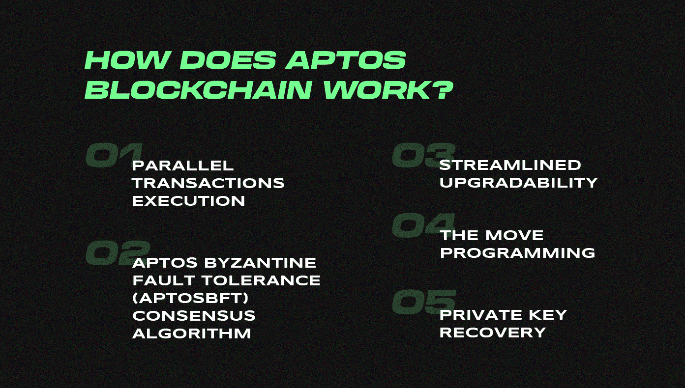
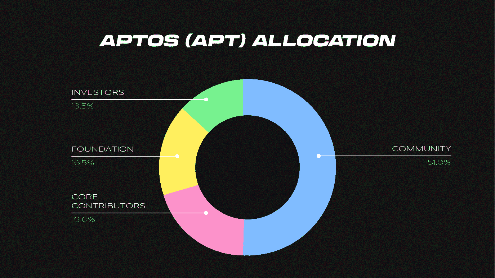
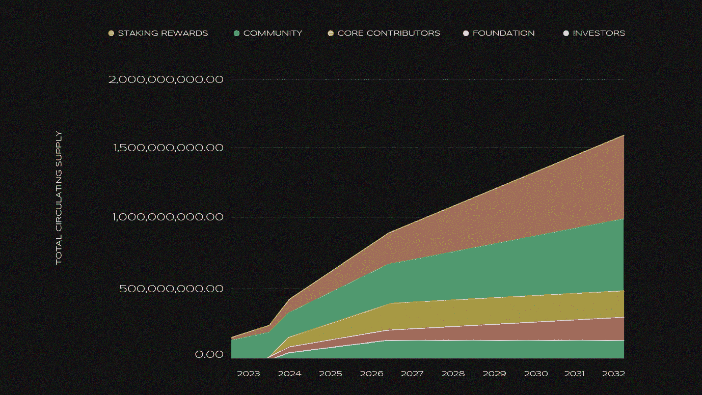

# Aptos:所有的炒作都是为了什么？

> 原文：<https://medium.com/coinmonks/aptos-what-is-all-the-hype-about-97599267a90f?source=collection_archive---------4----------------------->

在这个隐秘的冬天，当我们正在打盹的时候，一个新硬币掉落的消息像野火一样传播开来。[***Aptos Labs***](https://aptoslabs.com/)***于 10 月 18 日宣布推出他们的 mainnet，并在短短 30 小时后在所有主要交易所发布了$APT。***

随着最初的冲击波继续震撼加密交易员，我们正在深入了解这个项目的背景，希望能帮助你理解所有这些混乱是怎么回事。

# Aptos 背景

在 Aptos 的团队，由 [Mohammad Shaikh](https://twitter.com/moshaikhs?ref_src=twsrc%5Etfw%7Ctwcamp%5Etweetembed%7Ctwterm%5E1582470818155532289%7Ctwgr%5Ebedef471bbf1e936f6dcd9d2491e0027a126395e%7Ctwcon%5Es1_&ref_url=https%3A%2F%2Fwww.coindesk.com%2Fbusiness%2F2022%2F10%2F19%2Faptos-token-opens-for-trading-after-blockchains-rocky-debut%2F) 和 [Avery Ching](https://twitter.com/averyching?lang=en) 领导，两人都在一个 Meta(当时仍在脸书)Diem 区块链项目上合作。 [Diem 于今年 2 月被解雇](https://www.usnews.com/news/business/articles/2022-02-01/the-end-facebook-backed-digital-currency-diem-sold-to-bank)，但这并没有阻止开发团队，他们联合起来，成立了 Aptos 实验室，旨在为世界带来快速、可靠的区块链解决方案。

这就是$APT 投资者首先支持的——一个新的(但熟悉的)第一层区块链解决方案，它将支持智能联系人，并允许用户交易 NFT 和加密货币，使用和构建应用程序，以及连接钱包。

# MoveVM 和并行执行的前景

请记住，在区块链采用的这一点上，似乎还不存在一种快速、分散、使用成本低廉，同时保持可靠和良好运行时间的解决方案。这正是 Aptos 如此有前途的原因。

我们今天知道的大多数区块链，包括以太坊和 [BSC](https://docs.bnbchain.org/docs/bnbIntro/) 、polygon 等，目前使用 Solidity/EVM 数据模型，这使得并行执行不可能，因为资产存储在动态可索引地图中。

Aptos 实验室团队决心提供最低延迟、响应迅速的 BFT 协议，所有人都非常依赖他们提供[并行执行](https://aptos.dev/guides/basics-life-of-txn/)的能力，这基本上意味着这种区块链解决方案能够同时识别和执行独立的事务，这是为网络提供稳定未来所急需的。

Aptos 相对于另一个第 1 层区块链解决方案的主要优势是使用了创新的编程语言，这是项目的核心。它被称为[移动](https://aptos.dev/guides/move-guides/move-on-aptos/)，最初是为前面提到的 Diem 项目开发的。这一举措旨在表现数字资产并对其进行安全操作，重点是稀缺性和访问控制。简而言之，Move 编程语言允许它进行水平扩展，并以较低的成本提供行业领先的速度。

这将是 Aptos 未来扩展的基础，也是 Aptos 从竞争对手中脱颖而出的原因，例如，[以太坊](https://ethereum.org/en/)或[索拉纳](https://solana.com/)。

# 令牌组学

有了这样一个有前途的发布模式和背景，Aptos 团队在聚集投资者方面也做了令人印象深刻的工作。23 家领先的市场参与者，包括[币安实验室](https://labs.binance.com/)、 [FTX](https://ftx.us/?fromIntl=true) 、[帕拉菲资本](https://parafi.com/)和 [Jump Crypto](https://jumpcrypto.com/) ，在两轮主要投资中为该项目贡献了 3.5 亿美元。

就在发布前几个小时，Aptos 的总供应量达到 1，000，844，180.7，其中 821，216，328.37 被搁置。

保留的 2 亿英镑没有被计算在内，但根据加密市场的历史，最有可能被保留下来，用于 Aptos 的造市目标。

随着时间的推移，他们的活跃验证器预计将达到 100，000 个，然而在发布后几个小时，他们的数量稳定在 102 个，TPC 不断增加。

让我们[进一步细分这些数字](https://www.coingecko.com/en/coins/aptos/tokenomics):

*   51.02%分配给社区
*   19.00%分配给核心捐助者
*   16.50%分配给基金会
*   13.48%分配给投资者

预计投资者和主要贡献者的令牌将在运营的前 13 个月锁定，并达成协议，在接下来的 6 个月内每月解锁 330 万个令牌，在接下来的 29 个月内解锁 101.25 亿个令牌。

这基本上意味着，关键投资者和贡献者对市场的任何涌入都受到监管，象征性抛售的风险受到限制。

# 挑战和反弹的原因

那么，为什么 Aptos 在密码社区受到如此强烈的反对，他们的未来会是什么样子呢？

此次发布面临的一个主要挑战是 Aptos 团队选择的沟通方式不佳，尤其是在他们的令牌组学方面，该令牌组学仅在上市前一天[发布。](https://u.today/aptos-apt-hyped-tokenomics-finally-unveiled-ahead-of-listing-on-binance-and-ftx)由于很大一部分代币被贡献者、投资者和基金会瓜分，市场迫切希望了解更多关于搁置的法规。

加密社区习惯于最大化的透明度，当这不能满足标准时，批评者就会蜂拥而至。除了象征经济学的有限细节之外，就在人民币发行之前，主要的不和谐渠道是沉默的。所有与 Aptos 相关的 Twitter 频道都充斥着负面评论，迫使创始人为战略决策辩护。

静音频道旨在在 mainnet 公告之前限制过多的垃圾邮件和骗子，在某种程度上，这很可能是正确的选择，因为一旦 Discord 频道在$APT 发布时重新开放，它们就会被无法兑现其令牌空投的社区成员以及大量骗子淹没。最终，浪潮变得太大，Aptos 版主被迫第二次关闭频道。

Crypto Twitter 上已经充满了流言蜚语，并且[预言 Aptos 的](https://u.today/aptos-apt-hyped-tokenomics-finally-unveiled-ahead-of-listing-on-binance-and-ftx)将面临与 d infinity(＄ICP)相同的命运，早期投资者的戏剧在最初的 1.5 年内摧毁了这枚硬币，将它从[币安](https://labs.binance.com/)上市时的 400 多美元带到了非常可悲的 5 美元的当前价格。

虽然该项目的技术和操作说明使其非常诱人、全面，并且在现在非常热门的市场中是一个强有力的竞争对手，但缺乏通常的沟通使社区对该项目的未来产生了分歧。

不管是哪种情况，Aptos 的未来都很难说。一种新的编程语言的应用，获得强大的战略投资，以及未来增长的前景都使这个项目非常有吸引力，但沟通和缺乏透明度的挑战无疑增加了一些思考的内容。

> 在向日葵公司，我们肯定在密切关注这个备受期待的项目。你认为我们应该把它列出来吗？请在下面的评论中告诉我们。

> 交易新手？在[最佳加密交易](/coinmonks/crypto-exchange-dd2f9d6f3769)上尝试[加密交易机器人](/coinmonks/crypto-trading-bot-c2ffce8acb2a)或[复制交易](/coinmonks/top-10-crypto-copy-trading-platforms-for-beginners-d0c37c7d698c)