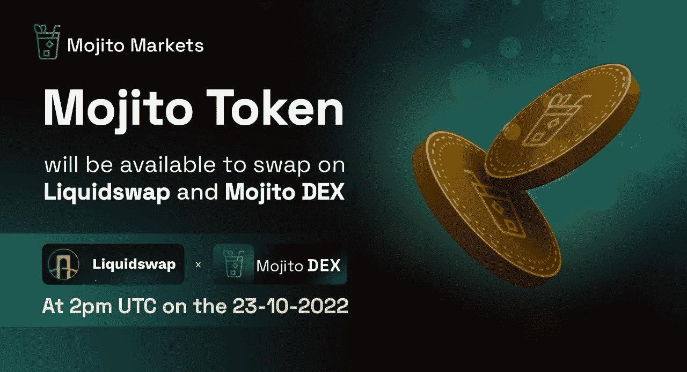

# APT 热门项目 Mojito 跌破 IDO 最低价

> 原文：<https://medium.com/coinmonks/apts-popular-project-mojito-falls-below-ido-s-lowest-price-2ba1c9b1f75f?source=collection_archive---------29----------------------->

最近 APTOS mainnet 上线的余热还在，APT 链条上的很多项目也跟着火爆起来。玩家也希望抓住短期机会。

但毕竟是熊市，流动性太差。有些项目可能不是来做事的，而是来布局和收获的。

Mojito

比如 APT 链上的第一个 IDO 项目 Mojito，本来很受欢迎，推出的时候并不尽如人意。

10 月 23 日上线后，网站瘫痪了一段时间，深度更差。据说项目方只拿出了 2wu 作为池子。

MOJO 的推出一落千丈，参与 IDO 的玩家先败。从链上的数据来看，标注为项目方的钱包地址，IDO 募集的 56 万 apt 已经转到平台上卖了，红极一时！

如果参与一级市场的时机不对，破发就是分分钟的事情。不是所有人都能玩一级市场的。

MOJO 15 minutes K line

一级市场的风险一直较高，99%的项目在飙升后归零。前后 10 分钟是完全不同的走势。楚小莲的钱包里也有很多山寨，数量上亿，却一点价值都没有。

和 2017 年入行的老玩家交流，也有人玩山寨和 IDOs，都已经归零了。当时选错了对象，没有主流令牌，山寨归零。浪费了几年时间。

2017 1Usdt EOS is back to 1Usdt

经常有群友说某个项目在 IDO，能不能投，据说可能有很多次机会。

我不看好这类项目。熊市没有流动性，10U 战神只是送燃料。与其大概率归零，不如直接放弃。

尤其是对项目还是不了解或者不了解的情况下，跟着做肯定得不到好结果。

任何行业都是二八法则，不做功课，不获取第一手资料。

Basic zero copy of HTmoon

上周 APT 空投后，提前互动的人抓住了机会。空投成了圈里的焦点。很多人都在找互动教程，想提前抢占先机。

但是大部分都是不能完成一次互动就自动放弃。真的不容易。

首先，基础工具阻止了大部分人。如果工具没有完成，后续的交互就无法继续；比较难的是互动运营，钱包，集水，互动等等。

第一次手术很难。要么你有足够的动力和能力去学习，要么你就放弃。

更不确定的是，10 次交互，一次空投都没有，你放弃的第十一次可能就是一次机会。空投也不容易，还是做好长期斗争的准备吧。

sui interactive tutorial

还有玩预定票的朋友。他们无法在短时间内收到关于其账户余额的正面反馈。有些人下注后就放弃了。

熊市低位震荡，大起大落，短期横盘，长期看涨。坚持做下去是一件很简单的事情，但是需要漫长的等待，平和的心态，坚定的信念。

一天整个市场暴跌，一天相关 ZC 发布，一天某个项目归零，市场不确定性太大。

BTC daily fluctuation

大部分人在熊市都是赔钱的，短线机会很少。很多人离开了赛场，不再打球，一些悄悄进场的人开始积极学习，逆势而上。

熊市中积累，牛市中才获得机会；留在熊市的人，只能做好长期吃苦的准备。

以上只是我个人观点，没有投资建议。我是楚小莲，我正在关注元宇宙和 web3。​​​​

> 交易新手？试试[加密交易机器人](/coinmonks/crypto-trading-bot-c2ffce8acb2a)或者[复制交易](/coinmonks/top-10-crypto-copy-trading-platforms-for-beginners-d0c37c7d698c)