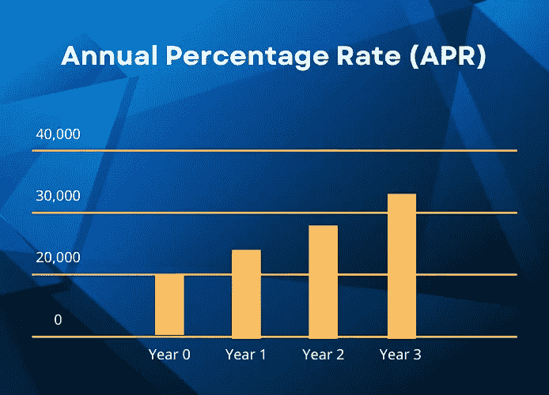

# APY vs APR:有什么区别？

> 原文：<https://medium.com/coinmonks/apy-vs-apr-what-are-the-differences-3cef5f49fbcc?source=collection_archive---------34----------------------->

# 介绍

当谈到[加密货币赌注](https://www.coinscope.co/earn)时，你可能会看到利率被表示为**年化利率(4 月)**或**年百分比收益率(APY)** 。尽管这两个术语听起来相似，但它们的作用方式不同。在本文中，我们将讨论这些术语之间的区别，如何计算它们以及应该注意什么。

# 年化利率(4 月)

APR 代表**年化利率**，这是你每年从投资中获得的利息。

计算 APR 的公式如下:

***APR =(PI x ROI x T)/100***

***PI*** *—本金投资*

***ROI*** *—利率(年)*

***T*** *—时间(多数情况下为年数)*

为了更清楚，我们来看一个例子。假设你[在一个利率为 20%的金融账户中投资](https://www.cyberscope.io/blog/beginners-guide-to-crypto-invest-in-2022)20，000 美元。在这种情况下，您的利息是通过将年利率乘以初始投资(通常称为“*本金”*)来计算的。

因此，一年后，您账户的总余额将为 24，000 美元。到第二年年底，将达到 28，000 美元，到第三年年底，将达到 32，000 美元，依此类推。

# 年产量百分比(APY)

**APY** 代表**年百分比收益率**，这是一项投资获得的实际回报率，但考虑了复利。

现在，在研究 APY 之前，理解复利这个术语是很重要的。**复利**是指在之前赚取的利息上再赚取利息。如果金融提供商每月向您的账户增加利息，那么一年中的每个月的 APY 将适用于已经增加的投资。在 DeFi 世界中，下注一个人的硬币将允许您从网络中获得奖励，并将它们添加到所有下注的硬币中，以便您下次获得更高的利润。

计算 APR 的公式如下:

***apy =[(1+pr/n)^n]-1***

*PR—期间汇率*

*n —复利周期数*

让我们举一个和之前一样的例子，假设你存一笔本金投资 20，000 美元，利率 20%，每月复利。第一年，你的账户上有 24，388 美元，第二年有 29，738 美元，第三年末有 36，263 美元。

# 4 月对 APY

正如你所理解的，APY 和年利率都是衡量投资收益的方法，但由于复利效应，它们导致不同的利润额。

不同的产品提供他们的利率在 4 月或 APY。正如上面的例子所示，当它复利时，利息可以增加。然而，请注意，APY 较高的投资并不总是比年利率较低的投资给你带来更多的利息。由于这种差异，在比较产品时使用相同的术语很重要，所以一定要首先进行正确的转换，以便得到正确的等式。

此外，将两种 Defi 产品与 APY 进行比较时，有必要检查复利周期，因为一种可能提供每月复利周期，而另一种可能提供每年复利周期。

当涉及到加密赌注时，你总是不得不将加密货币的易变性考虑在内。如果你持有的资产价值在周期利率*、*内下跌，那么你的投资将会低于你最初的投资。

# 结束语

总之，APR 和 APY 在工作方式上略有不同，但是你的选择将决定你投资的结果。总是[在投资之前做你自己的研究](https://medium.com/r?url=https%3A%2F%2Fwww.cyberscope.io%2Fblog%2Fbeginners-guide-to-crypto-invest-in-2022)并且使用上面解释的公式计算你的利息。或者你可以随时使用在线工具，让你的生活更轻松。

*……*

[*原载于 www.cyberscope.io*](https://cyberscope.medium.com/)

> 交易新手？尝试[加密交易机器人](/coinmonks/crypto-trading-bot-c2ffce8acb2a)或[复制交易](/coinmonks/top-10-crypto-copy-trading-platforms-for-beginners-d0c37c7d698c)