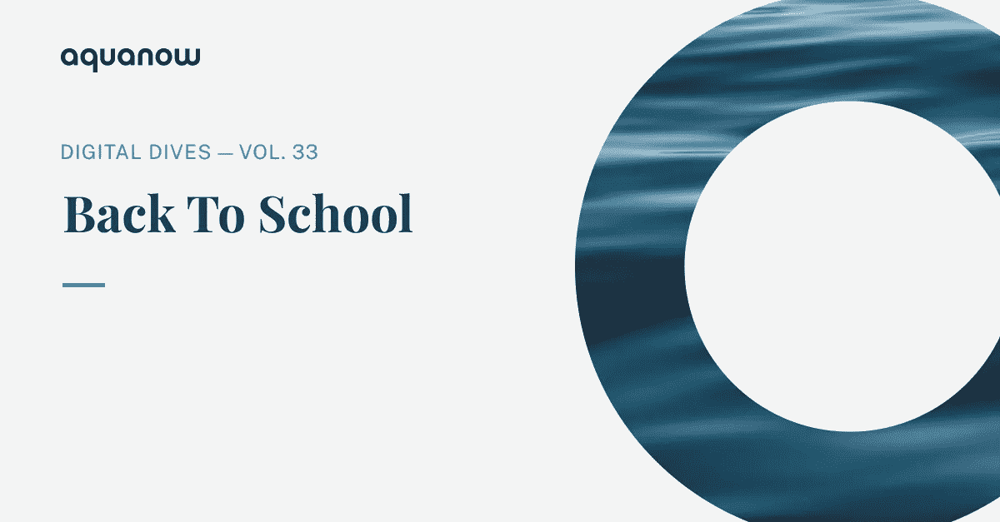
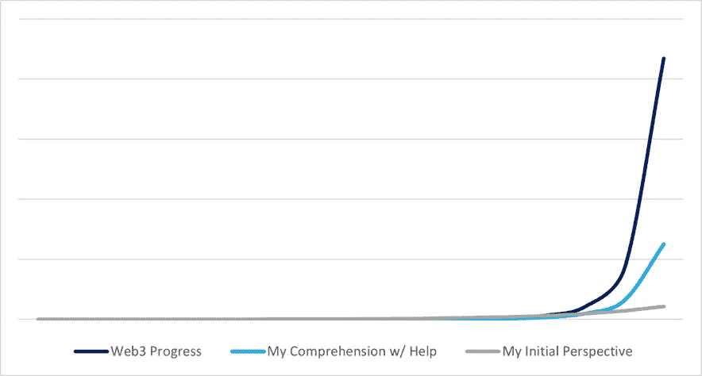
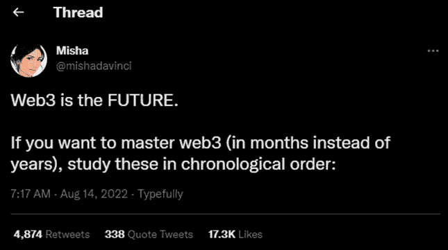
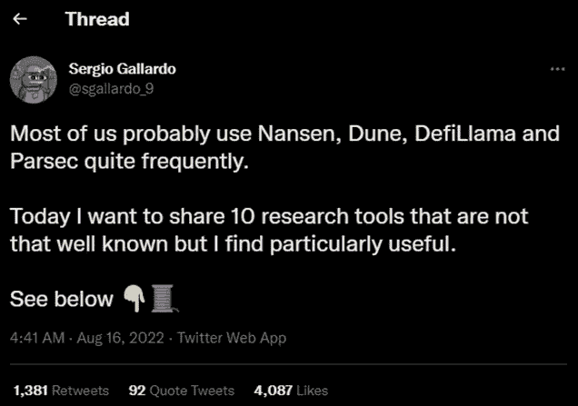
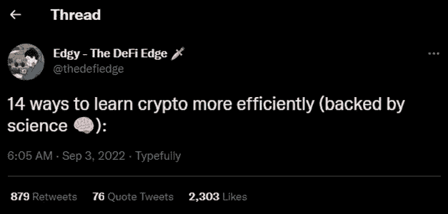
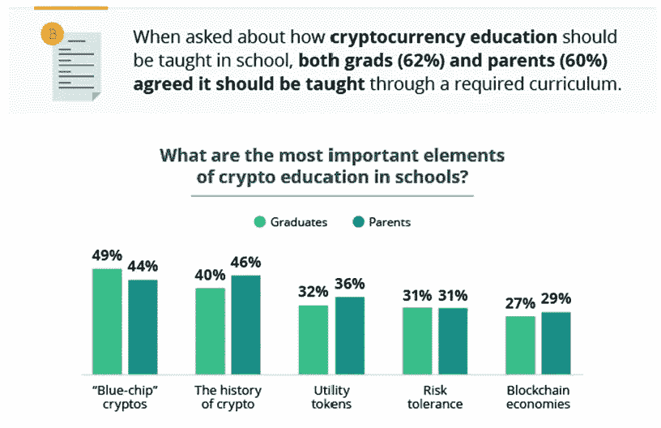

# Aquanow 数字潜水:回到学校——第 33 卷

> 原文：<https://medium.com/coinmonks/aquanow-digital-dives-back-to-school-vol-33-d6581b652c3c?source=collection_archive---------31----------------------->

上周，我们介绍了由双曲线技术进步引起的指数差距*的概念，而社会机构则以更线性的方式缓慢前进。其结果是一种拉锯战，可能会造成一些尴尬，因为技术在我们日常生活中的扎根速度快于政策制定者制定操作指南的速度，或者快到足以让现有巨头的高管感到紧张。今天，让我们来看另一个例子，看看这种分歧是如何表现出来的，以及 web3 社区是如何走到一起帮助协调各种观点的。*

*几年前，我以为我的职业道路已经确定了。我已经在金融行业工作了大约十年，担任过各种角色，并且非常享受每一次经历。幸运的是，我的老板鼓励我进行创新学习。有时，这包括研究组织外思想领袖的研究，追求各种价值目标，甚至参加与我的日常工作没有直接联系的会议。事后看来，我明白了 ***探索相邻主题的自由是我决定将职业从传统金融转向数字资产的根本原因。****

****我先说我是一个长期对加密货币持怀疑态度的人*** 。朋友们经常建议我看看区块链正在进行的创新，但这些方法很快就被驳回了。最终，我(不成功地)涉足了 2017 年的 ICO 热潮，并决定将我的时间更好地用于关注前沿技术和开发似乎更适合我的客户的主题。 ***然后，DeFi summer 出现了，突然间，这个充斥着 Lambos 和 memes 的狂野世界开始使用让我产生共鸣的术语*** ，比如*借款*、*放贷*、*利率*和*衍生品*。一些大括号开始发表关于链上活动测量、分散交换、非永久性损失等主题的正式研究。这些分析师(他们似乎不会逗留太久)和我说着同样的金融术语。这个以前奇异的世界开始变得更有意义。*

**

*[*来源*](https://imgflip.com/i/6soyyx)*

*一旦我理解了正在建造的东西的词汇，关于“*数字上升*的噪音和关于哪个链更好的丑陋部落帖子就消失了。我的 twitter 账户关注了整个生态系统中更冷静、更理智的声音。我读了[克里斯·伯恩斯克的《加密资产》](https://www.goodreads.com/book/show/36197082-cryptoassets)和[亚瑟·海斯的帖子](https://cryptohayes.medium.com/)。 ***这些研究转变了我的视角*** 。我曾经只看到骗局和炒作的混乱，现在我可以理解数字资产可能是金融创新的前沿(公平地说，仍然充满了空话和谎言)。我曾是指数差距的受害者，但在一些有思想的追随者的帮助下，我的理解在更陡峭的曲线上取得了进展。似乎许多其他人在有了类似的经历后已经决定转行加入 web3。*

**

## ****如果其他人的深思熟虑的作品为我缩小指数差距提供了重要的催化剂，那么教育能否被证明是获得更广泛的数字资产采用的重要工具？****

*在带着更多的好奇而不是怀疑探索了 web3 的前景之后，社区的感觉给我留下了深刻的印象，它与我所习惯的环境形成了鲜明的对比。在传统的资本市场中，想法和知识被视为知识产权，它们是你的优势。因此，每一次谈话或每一项定制的研究都是保密的。与此同时， ***数字资产中的人们照例免费生产出惊人的作品*** 。这并不是说没有付费墙之类的东西，而是说有更多的分享。例如，0xvikkk 制作了这个包含所有 web3 内容的知识库，任何人都可以用它来加深理解。许多其他人也管理类似的信息目录。这些是志愿者，他们想要分享他们的经验来帮助社区发展。*

*当它不好笑和没有帮助时，加密 Twitter 可能是一个令人讨厌的地方，所以我不建议想学习的孩子或任何容易被冒犯的人使用它，但你可以在下面看到一些更支持的贡献:*

**

*[*来源*](https://twitter.com/MishaDaVinci/status/1558820214699016193)*

**

*[*来源*](https://twitter.com/sgallardo_9/status/1559505675151183872)*

**

*[*来源*](https://twitter.com/thedefiedge/status/1566049764906373121)*

*Dao 和类似的公司已经建立了完整的内容库来帮助教育用户。主题从区块链或 NFTs 的一般教育，到避免诈骗和保护你的资产。在许多情况下，开展的活动会产生代币形式的奖励。这里有一个简短的列表，可以帮助你开始:*

*[兔子洞](https://rabbithole.gg/)*

*[总账学院](https://www.ledger.com/academy)*

*[货币市场基金](https://coinmarketcap.com/earn/)*

*[无银行学院](https://app.banklessacademy.com/)*

*向人们传授数字资产的知识还能增加一般金融知识，这是当今发达国家所缺乏的。信不信由你，你可能会开始看到这些话题出现在教育课程中。我不是指中学后教育(这种情况也在发生)，但如果这些调查结果被信以为真的话，你的孩子或孙子可能会在几年后被布置一些加密作业:*

**

*对于数字资产行业来说，让投票者跟上速度是有帮助的，但是让华尔街和其他金融机构也参与进来呢？ 事实证明，有几个团体正在努力用重要的工具来帮助弥合这一鸿沟。 [CoinDesk 推出了其数字资产分类系统(DACS)](https://www.coindesk.com/markets/coindesk-dacs/) ，该系统提供了令牌世界的分类法。像 [Token Terminal](https://tokenterminal.com/) 这样的组织提供免费的软件来分析盈利能力指标，为区块链项目的投资分析带来基本的严谨性。[Block](https://www.theblock.co/)、 [Messari](https://messari.io/) 和 [GCR](https://globalcoinresearch.com/) 提供免费和付费的研究分析，帮助参与者打破宣传。当然，还有像 [Aquanow 的 DeFi 融资指数和评级](https://aquanow.medium.com/aquanow-announces-new-tools-to-evaluate-risk-and-return-in-decentralized-finance-ffa9ee8e6c07)这样的工具可以帮助机构投资者分解他们投资组合中的风险和回报来源。此外， [Treehouse Finance](https://www.treehouse.finance/) 有一个钱包聚合器来帮助[在 DeFi](https://www.treehouse.finance/insights/deconstructing-defi-returns-harvesting-risk-premia) 中获取风险溢价。感兴趣的高管也可以从 [Genesis Volatility](https://genesisvolatility.io/) 或 [Deribit](https://metrics.deribit.com/futures/BTC) 注册免费的衍生品情报。*

**

*[过去一年，数字资产行业加大了游说力度](https://money.yahoo.com/steve-hanke-crypto-lobby-groups-are-dictating-terms-in-washington-000115239.html),如果你将该行业最早的一些国会证词与最近的证词进行比较，你会注意到当选官员的语气和提问路线有所不同。这得益于一些团体的努力，如[加拿大 Web3 理事会](https://web3canada.ca/)(其中 [Aquanow](https://www.aquanow.io/) 是一个自豪的成员)[数字资产倡导团体](https://digitalassetadvocacy.org/)、[区块链协会](https://theblockchainassociation.org/)、数字资产市场协会等等。像 a16z 和 FTX 的 Sam Bankman-Fried 这样的营利性组织也提供了大量的资金和支持。*

**

*[*来源*](https://twitter.com/fintechfrank/status/1529185967705292801)*

*尽管来自上述团体的积极沟通和想要教育大众的狂热爱好者的熙熙攘攘的社区，web3 生态系统继续面临着一场艰难的攀登。然而，我们不能放松努力，让人们意识到区块链的有用之处，或者在此基础上建立起来的创意和创新团队。无情的参与是大规模采用数字资产的必要因素，它将保持社区一致，同时开发人员构建更好的用户体验。 让我们一起教育现任机构，缩小指数差距。*

**

*[*来源*](https://lolalambchops.com/funny-back-to-school-memes/)*

> *交易新手？尝试[加密交易机器人](/coinmonks/crypto-trading-bot-c2ffce8acb2a)或[复制交易](/coinmonks/top-10-crypto-copy-trading-platforms-for-beginners-d0c37c7d698c)*