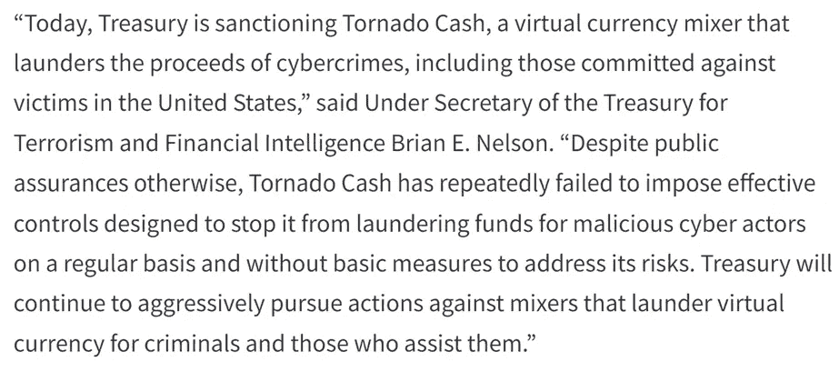
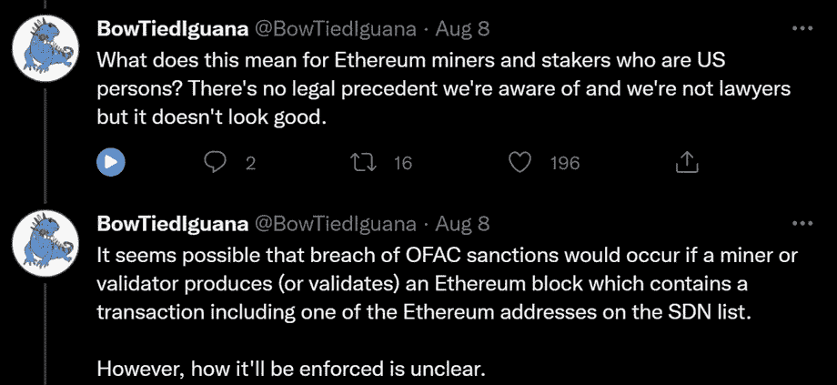
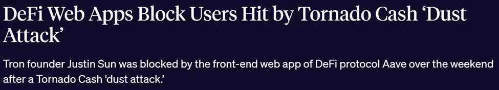
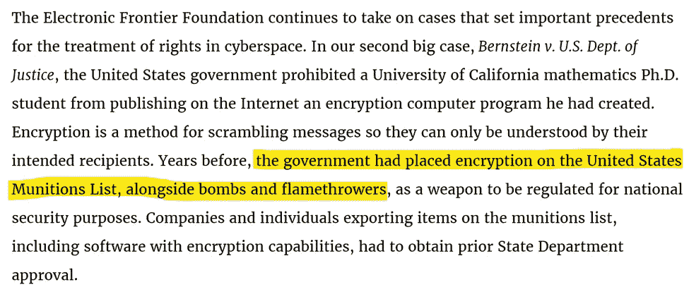
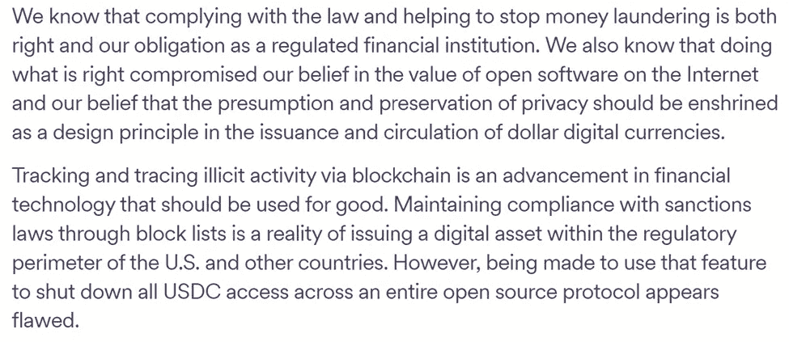
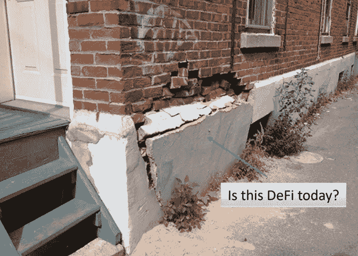
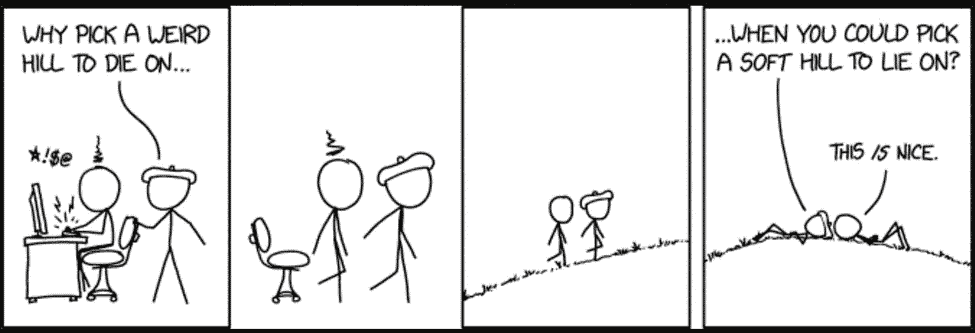
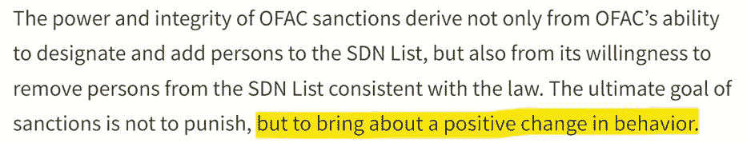

# Aquanow 数字潜水:选择你的山—第 30 卷

> 原文：<https://medium.com/coinmonks/aquanow-digital-dives-choose-your-hill-vol-30-8736327db7c5?source=collection_archive---------36----------------------->

Tornado Cash (TC)是 DeFi 中的一个应用程序，旨在混淆基于以太坊的加密货币的发送者和接收者之间的链接。其效果是将令牌的来源与其当前持有者隔开，这提供了一层隐私。想要秘密地在区块链上操作有合法的理由，但不幸的是，掩盖代币的交易历史也可以用来掩盖来自协议漏洞或其他骗局的非法资产。

上周，大约在贝莱德宣布为机构投资者推出比特币信托的同时，Tornado Cash 被添加到外国资产控制办公室(OFAC)制作的特别指定国民(SDN)名单中。 ***这字母汤是怎么回事？*** [你可以在这里挖掘真相](https://home.treasury.gov/news/press-releases/jy0916)，但为了我们讨论的目的，大意是那些与 TC 有过互动(或继续使用 TC)的人有被拒绝进入美国金融系统的风险，违规最高可判 30 年监禁。

简而言之，OFAC 是一个令大多数运营商感到恐惧的集团，因此，其结果是冻结了那些已知与已经通过翻转器的资产有过互动的钱包。这包括 7.5 万美元的 USDC，受到了社区的强烈反对。更大的压力是删除了包含 Tornado 开源代码的 GitHub 存储库，并且[该协议的一名核心开发人员在阿姆斯特丹](https://decrypt.co/107538/fiod-tornado-cash-dev-suspected-facilitating-money-laundering)被捕，原因是怀疑他“*参与隐藏犯罪资金流动和便利洗钱*。”

财政部的意图可能不是摧毁分散的金融。他们只是不接受一项技术，这项技术使追踪据称属于朝鲜恐怖分子和其他邪恶组织的资金的工作无法进行。然而，政治家也可能低估(或不真正关心)他们行为的后果。例如:

[*来源*](https://twitter.com/BowTiedIguana/status/1556683120002314241)

让数字资产领域讽刺性地使用技术来证明这一点。一些用户开始向一些知名人士的钱包里发送小额 ETH，如比特币基地首席执行官布莱恩·阿姆斯壮和脱口秀主持人吉米·法伦。从技术上讲，找到这些钱包的主人可能违反了 OFAC 的规定，那么他们会被追究责任吗？可能没有，但有些已经遇到了问题。

[*来源*](https://blockworks.co/defi-web-apps-block-users-hit-by-tornado-cash-dust-attack/)

如果你一直在关注这个故事，或者碰巧对更广泛的隐私感兴趣，那么你可能会发现 ***源代码在法律上等同于第一修正案下的言论，因此不能被审查*** 。这方面的先例出现在 20 世纪 90 年代初，当时一位名叫丹尼尔·伯恩斯坦的数学天才开发了一种加密的点对点消息服务。如今，WhatsApp 或 Signal 的大多数用户都认为这是理所当然的，但就在几十年前，加密信息还像核武器机密一样令人垂涎。鉴于加密在第二次世界大战和随后的冷战中的重要性，任何相关的事情都被认为是高度敏感的，伯恩斯坦先生要求发表一篇关于他的新技术应用的论文，在他决定起诉政府之前被拒绝了五次。在一场由[电子前沿基金会](https://www.eff.org/)支持的法庭战之后，他赢了。

[*来源*](https://www.eff.org/about/history)

这是美国政府在面临他们认为的国家安全风险时利用政策阻止技术进步的一次展示。是的，伯恩斯坦最终在他里程碑式的案例中做到了，但是花了五年多的时间。此外，[另一个混音器(Blender.io)也早在五月](https://home.treasury.gov/news/press-releases/jy0768)就被制裁了，所以 ***也许就写在这里的墙上*** 。对于行业来说，在隐私和区块链方面与官员进行负责任的对话似乎至关重要，否则就有破坏创新潜力的风险。美国官员可能冒着扼杀一个新兴的国内增长源的风险，但坦率地说，他们的影响力是如此之大，以至于最终也可能成为全球 web3 发展的逆风。大多数国家都希望进入美国的金融体系，而 OFAC 可以切断违规者的通道。

龙卷风式现金制裁对稳定资本的影响可能是这个故事的最大部分。

重要的是要记住，这种限制是由于行业无法找到足够的银行解决方案，但数字资产交易员有时希望通过转移到现金或类似的东西来降低投资组合的风险。USDC 紧随其后，为 USDT 有些不透明的储备报告提供了一个更透明的解决方案，但两家公司仍是集中发行人，这意味着它们的资产和高管都在立法者的权限之内。因此，他们必须遵守法律，即使这违反了他们的核心价值观。[杰瑞米·阿莱尔评论](https://www.circle.com/blog/the-responsibility-of-trust):

[正如我过去所写的](https://aquanow.medium.com/aquanow-digital-dives-stable-is-as-stable-does-vol-14-824fb17a7d3)，我们可以认为稳定的货币是 DeFi 的基石，因此 USDT 和/或 USDC 根据 DNS 名称冻结钱包的连锁反应可能会导致整个生态系统的不稳定。银行业和 DeFi 都是信心的游戏，所以如果人们不确定他们的储蓄是安全的，那么他们可能会把它们放在其他地方。 然而，仍有一部分热情的人希望尽可能减少与传统银行业务的互动，并会想方设法做到这一点。自然的解决方案是更大比例的算法或加密担保的稳定债券。虽然这些资产具有分散化的优势，但是它们也不太稳定。

综上所述，来自政策制定者的这种大锤式行动的持续威胁可能会破坏 DeFi 的稳定或彻底破坏它。[我们已经看到这条新闻撕裂了 MakerDAO](https://www.coindesk.com/business/2022/08/11/founder-details-how-makerdao-is-navigating-tornado-cash-sanctions/) 的社区，他们是 DeFi 最古老的分散式马厩的经营者，戴。

***这与 TradFi 中的洗钱事件有何不同？***

声称所有与 TC 代币互动的钱包都是非法的，这比政府在其他领域认为合理的范围还要广 。[有几个传统金融机构的控制未能提供关于非法资金的充分报告的例子](https://www.cityam.com/city-special-the-biggest-money-laundering-scandals-in-banking/)。结果是对银行进行罚款，并要求他们加强监管。领导层也经常会发生变动。在一个部分准备金银行的世界里，很难明确指出哪一美元的储蓄被借出到了哪里，而区分从支出中获得的利润就更复杂了。大多数银行以股息的形式支付部分利润，这可能意味着任何股东也将成为从犯罪收益中获益的同谋。大多数养老金和捐赠基金也直接或间接持有银行股，所以真的，没有人是无辜的。

通过 Tornado's mixer 转移的资金总额约为 75 亿美元[据估计，这些资产中有 15 亿美元是非法的](https://hub.elliptic.co/analysis/complying-with-ofac-s-tornado-cash-sanctions-key-questions-and-challenges/)。这不是一个小数字，但回想一下，在 2018 年，[欧洲的一个多年洗钱案超过了€200B](https://en.wikipedia.org/wiki/Danske_Bank_money_laundering_scandal) ，这只是最近许多事件中的一个。前者的反应迅速而果断，甚至导致一名核心开发人员被捕。在我看来，这里的主要区别在于，官员可以通过传统的金融机构调查资金的流向。这将是一项曲折的任务，但通过充分的记录和调查工作，执法机构可以采取行动。Tornado's mixer 的本质是，这种程度的审查是不可能的，这种盲点尤其令政府反感——即使是在自由世界。

另一个重要但有争议的问题是尺寸。记住，许多人仍然将加密货币和 web3 视为骗局，有相当一部分人对生态系统的消亡漠不关心。因此，数字经济的领导者有责任在完全模糊的问题上小心行事。[在本次采访](https://www.youtube.com/watch?v=zrJXP7wsUOQ)中，Jill Gunter 讨论了 web3 中的几个话题，并在 40 分钟左右的发言中指出，如何为某些方提供查看交易数据的能力可以作为 TradFi 的“*安全毯”，这将有助于推动更多数字资产的采用。 [Jill 最近写了一篇博文](https://www.espressosys.com/blog/financial-privacy-without-the-risks-of-a-mixer)，详细介绍了她的团队如何开发技术，能够提供可配置的隐私，而不会进入让政府不舒服的领域。*

在经营政策不佳的情况下，支持银行的“太大而不能倒”论点超出了这里的讨论范围，但它仍然是故事的重要部分。 ***当我们仍在努力争取这些新生技术的广泛采用时，我们应该注意将监管者逼入死角。在这种情况下，人们往往会大打出手，我们刚刚目睹了这种恐惧表现的一个例子。最近代表 web3 的游说有助于平衡空间持续发展的基调。 ***最终，技术将在广泛支持下赶上新数字经济的愿景，但尽管生态系统仍然脆弱，但谨慎选择我们的战斗并确保我们能够生存下来以备不时之需是明智的。******

[*来源*](https://www.explainxkcd.com/wiki/images/f/f7/weird_hill.png)

再抛出一个老生常谈——web 3 需要选择它想死的山头。应当支持代码作为语音的情况，但也需要考虑其细微差别。 隐私是最基本的，有*种方法可以让外行人的交易不被发现，同时能够向执法机构保证反洗钱法律得到遵守。这是广泛采用的途径。 ***这不就是这里的目标吗？也许我很天真，但我认为财政部龙卷风现金新闻稿中的这句话值得注意。如果我们改变我们的行为，那么我们的生态系统可以继续繁荣，所以让我们找到创造性的方法来这样做，同时保留我们的核心价值观。****

> 交易新手？试试[加密交易机器人](/coinmonks/crypto-trading-bot-c2ffce8acb2a)或者[复制交易](/coinmonks/top-10-crypto-copy-trading-platforms-for-beginners-d0c37c7d698c)