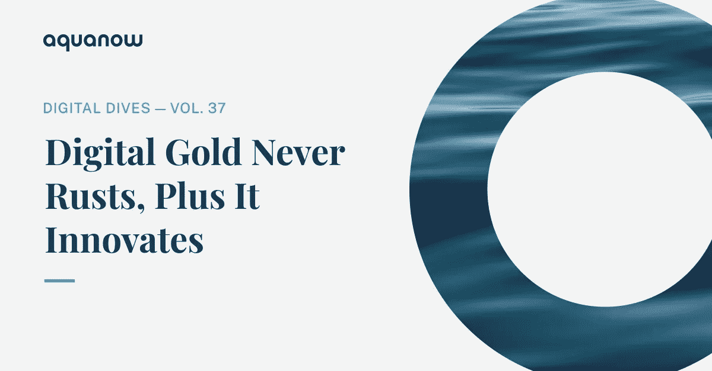
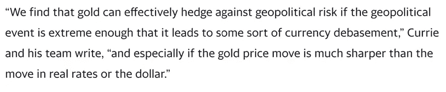
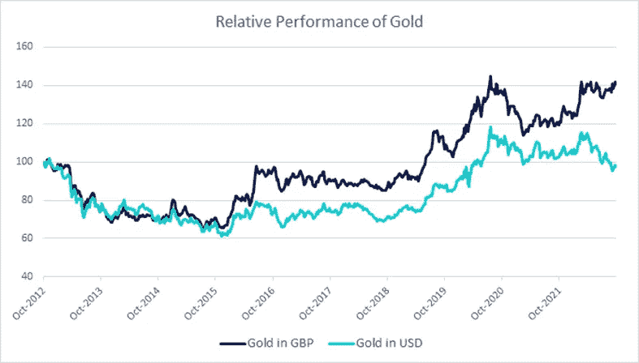
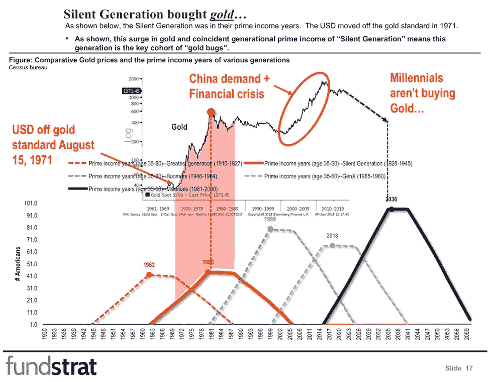
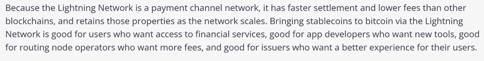
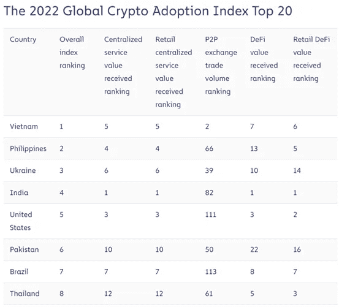
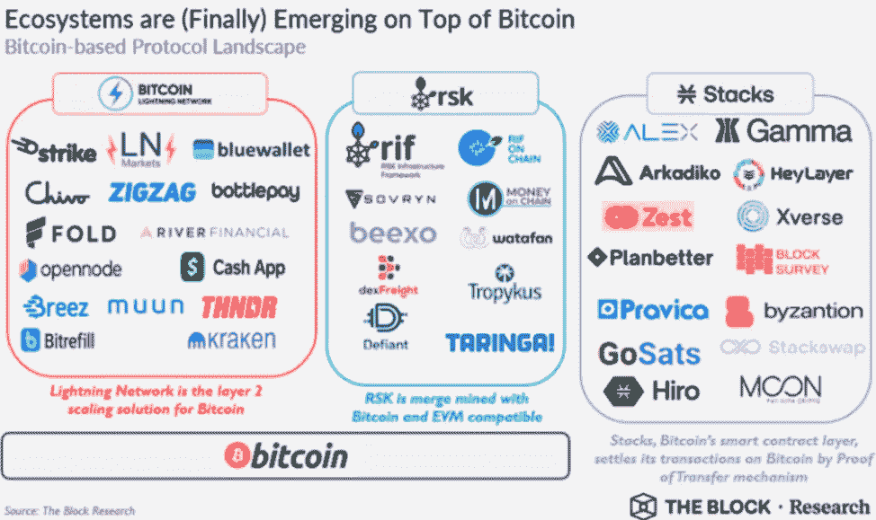

# Aquanow 数字潜水:数字黄金永不生锈，加上它的创新——第 37 卷

> 原文：<https://medium.com/coinmonks/aquanow-digital-dives-digital-gold-never-rusts-plus-it-innovates-vol-37-5e7e16f54ea9?source=collection_archive---------29----------------------->

比特币已经被富达和贝莱德等知名机构投资者大量采用。随着监管者继续纠结于如何提供代币监管，人们似乎一致认为比特币不是一种证券。 结果是，看到 crypto 前景的受监管资产管理公司首先提供对 BTC 的访问。支持最强大、可以说是最分散的社区，法律或职业风险要小得多。虽然[我相信当前的基本面有利于以太坊](/coinmonks/aquanow-digital-dives-ether-youre-in-or-you-re-in-the-way-vol-36-e9c4b2759b3f)，但我在最后一篇文章中的意图并不是把以太坊描绘成专业资产配置者的唯一投资(多元化是最重要的)。说到这里， ***让我们深入探讨一下 BTC 的机构投资理论。***

***没有任何其他项目能接近比特币作为当今数字资产领先品牌的地位*** 。对于许多不经意的观察者来说，这个项目是加密货币的同义词。这有助于 BTC 拥有最高的价值和最大的交易流动性，因此贷款人很乐意在集中和分散的场所接受作为抵押品。然而，目前没有比特币原生的 DeFi 应用，因此有时发布 BTC 以支持贷款、赚取利息或收取收益需要一定的过桥/交易对手风险。对于社区中那些质疑任何其他链或中介的安全性的人来说，这尤其重要。

[*来源*](https://www.hashinvest.com.br/single-post/2018/03/20/bitcoin-honey-badger-do-dinheiro)

根据 Messari 的说法，每天活跃的 BTC 地址大约有 90 万个，相比之下以太坊上只有 58 万个。此外，Reddit 上的比特币订户数量是 ETH 追随者的 3 倍。有趣的是，如果你浏览 YouTube 或 Crypto Twitter，似乎前者的社区更响亮。网络效应支撑着数字资产的价值，因此更广泛的用户群往往意味着更高的价值，这似乎正在 BTC 在估值方面遥遥领先的市场上上演。

多年来，围绕比特币价值驱动因素的叙述一直在演变。最初被称为“T0”的点对点电子现金系统已经演变成更像数字黄金的东西。 ***一种供应有限的非主权资产，可以用来对冲货币贬值*** (这与通货膨胀*不*一样，许多人都知道)。黄金是抵御极端地缘政治事件的有效对冲工具，比如战争和不合理的政策。高盛的杰夫·柯里指出:

一个有趣的实时例子是黄金相对于英镑和美元的表现。美元是主要的避险资产，我们已经看到其相对价值今年飙升。与此同时， ***在英国，全球配置者面临着同样的地缘政治紧张局势，引发了对美元的买盘，此外还有相当大的领导力不确定性、财政/货币紧张局势，以及关于英国退出欧盟后国家将如何繁荣的持续问题。*** 这可以形象地表现在黄金的相对表现上:

回到 10 年前，一个美国人的金条持有量会减少 3%左右，而伦敦的黄金投资者会增加 40%以上。比特币也存在类似的关系。然而，展望未来， ***₿拥有两个重要特征*** 的额外优势。首先，年轻一代对数字资产的去中心化产生共鸣。接下来，聪明人正在研究增加比特币使用案例的创新方法，这使得比特币比黄色金属更有趣。

在 2018 年的这个演讲中，Fundstrat 的 Tom Lee 对 ***关于为什么 crypto 背后有一个长期顺风*** 的代际争论做了一个精彩的总结。简而言之，沉默一代的储蓄者购买黄金是因为他们被塑造了他们青年时代的全球冲突所玷污。这些都是大规模地缘政治事件，会导致货币普遍贬值。第一批婴儿潮出生的人在 1982 年满 35 岁，进入了他们的黄金储蓄期。这个群体在 1999 年达到顶峰。他们青睐股票，同期标准普尔 500 指数上涨了 5 倍。千禧一代现在正进入财富积累的年龄，他们更喜欢成长股和数字资产。请记住，目前这一代人持有密码的比例与个人股票相同。

由于黄金在危机期间的独特表现，它在管理的机构资产中约占 1%。如果比特币增长到与这种黄色金属的配置相匹配，这将是一个巨大的胜利。将 BTC 纳入投资组合的另一个动机是，除了作为一种非主权稀缺资产，它还有可能成为可编程货币。

2017 年，一个名为 [SegWit](https://en.wikipedia.org/wiki/SegWit) 的重要扩展解决方案在整个比特币网络中可用，使每个区块中可以包含更多交易。这一变化恰逢[闪电网络](https://lightning.network/) (LN)的推出——这是位于比特币区块链之上的一个额外的[和令人兴奋的](https://crypto.nateliason.com/p/bitcoin-lightning)层——它有望 ***实现即时和低成本的安全交易*** 。这是一件大事，因为它带回了 BTC 作为在线 P2P 现金系统的承诺。四年后，比特币网络经历了又一次重大升级。 [Taproot](https://blog.chainalysis.com/reports/bitcoin-taproot-upgrade/) 增加了一些隐私相关的改进和数据效率，有助于提高可伸缩性。闪电实验室的团队没有浪费时间推出了 [Taro](https://lightning.engineering/posts/2022-4-5-taro-launch/) ，这是一个利用主根功能并允许 ***像 stablecoins*** 这样的新资产转移的协议。他们在 B 轮融资中筹集了 7000 万美元，为未来的发展提供资金。

黄金是做不到的。

伊丽莎白·斯塔克是闪电实验室的联合创始人，她的任务是看到“ [*人数上升*](/@lightning_labs/number-of-people-go-up-or-bitcoin-as-the-worlds-protocol-of-value-d1df7cefca37) ”，目的是利用 LN 在支付方面的优势来帮助金融普惠。当然，这种努力在数字资产采用率最高的国家利用了比特币的品牌[，这些国家的用户将从较低的成本中获得最大收益。](https://blog.chainalysis.com/reports/2022-global-crypto-adoption-index/#key-takeaways)

闪电网络并不是唯一一个希望给比特币带来新功能的组织。 [Fedimint](https://fedimint.org/docs/category/primer) 寻求进一步拓展 LN，强调社区和隐私。 [Stacks](https://www.stacks.co/) 是一个开源的区块链网络，它利用₿的安全性和广度来实现分散式应用和智能合同，而无需额外的能耗。最后， [RSK](https://blog.rsk.co/) 是一个受比特币网络保护的智能合约平台，兼容以太坊虚拟机(EVM)。理论上，开发者可以从以太坊引入创新，并利用比特币的安全性和可扩展性。然而， ***随着 BTC 被层层加码，安全等级本来就有所削弱*** 。

[*来源*](https://www.techtimes.com/articles/277900/20220711/bitcoin-ecosystems-in-review-q3-2022.htm)

对于关注投资环境影响的机构而言，瑞士联邦理工学院转向股权证明是提高其吸引力的一大步。对于那些担心工作证明的碳足迹的人来说，比特币现在实际上是唯一引人注目的东西。 [Nic Carter 在《HBR》上写了一篇很棒的文章](https://hbr.org/2021/05/how-much-energy-does-bitcoin-actually-consume)来解决这个话题。他指出，BTC 可以使用否则会被浪费的能源(如剩余的水力发电)，该网络使用的可再生能源比例估计高达 76%。此外，采矿使用了大部分能源，而且只有不到 10%的代币有待铸造，随着时间的推移，这一链条可能会自然变得更加绿色。

回到我最初的观点，对于投资组合经理来说，有一个非常令人信服的投资理论来配置₿.你想拥有 BTC 的大多数主题理由对 ETH 来说也是正确的，但后者随着使用越来越少，并且不需要一个桥梁/中介来赚取收益。以太坊具有明显的环境和创新优势，但它在规模和范围上有所损失。我在 ETH 论文中没有充分强调的一点是，比特币不是一种证券，这使得它成为许多人唯一的数字资产选择。这是拥有它的一个非常吸引人的理由。

> 交易新手？试试[加密交易机器人](/coinmonks/crypto-trading-bot-c2ffce8acb2a)或者[复制交易](/coinmonks/top-10-crypto-copy-trading-platforms-for-beginners-d0c37c7d698c)