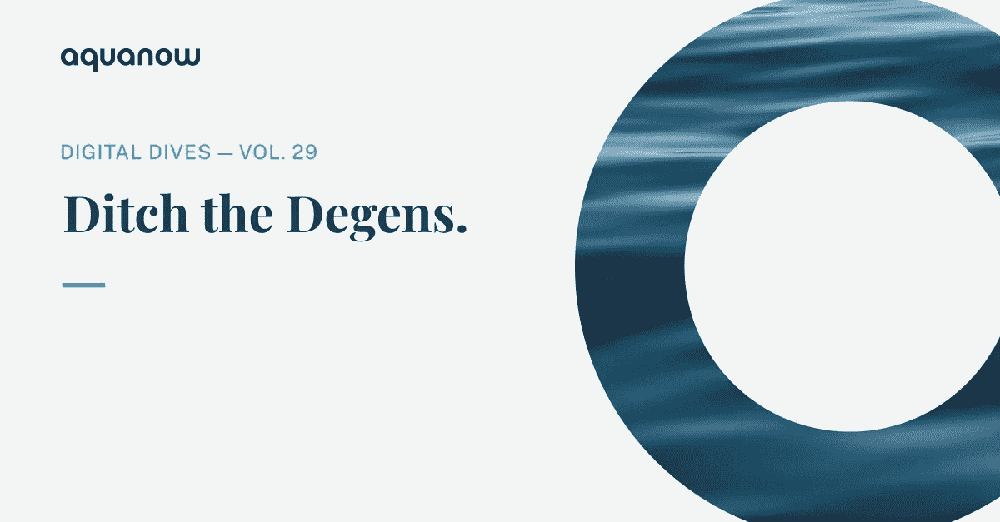
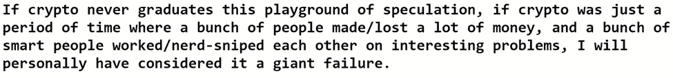
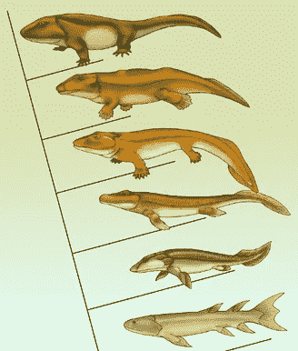
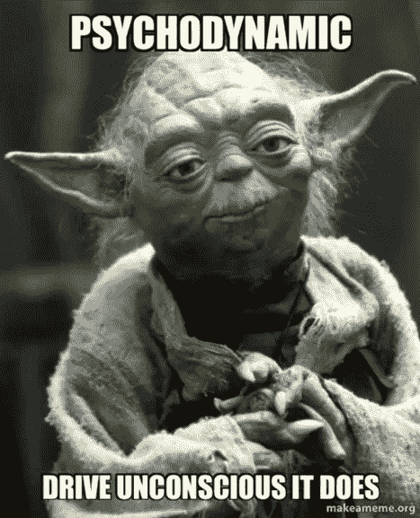
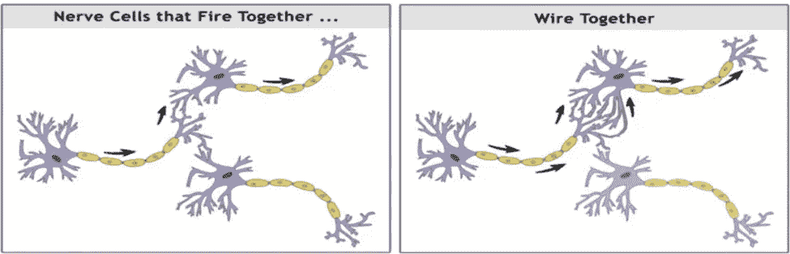
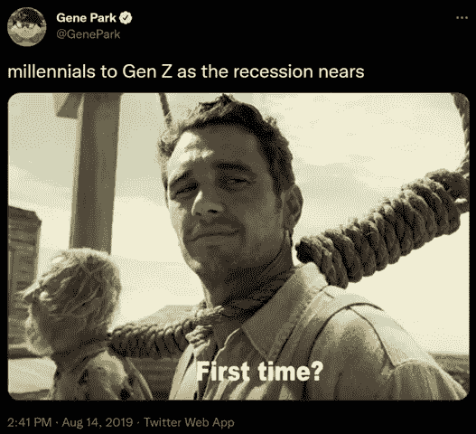
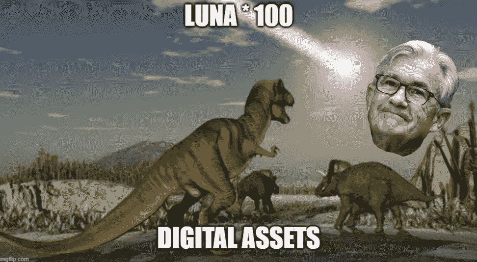

# Aquanow 数字潜水:抛弃德根——第 29 卷

> 原文：<https://medium.com/coinmonks/aquanow-digital-dives-ditch-the-degens-vol-29-c46de655670?source=collection_archive---------41----------------------->

前几天，我从阿米尔·博洛斯那里读到了一篇有趣的文章。他是一个相对年轻的计算机科学家，他形容自己是“*的神奇者+流浪者*”，这引起了我的共鸣。他的论述“[我在密码](https://amirbolous.com/posts/crypto-frustrations/)中感到沮丧的是什么”是有意从悲观的角度写的，如果你发现自己积极倾向于消费，但希望谨慎，那么它就是重要的东西。理解我们的社交媒体应用程序是算法的回音室，寻找可以挑战我们的投资论点、世界观等的观点是至关重要的。

阿米尔的文章基于他在数字资产会议上询问与会者的经历:“*在目前的加密或区块链状态下，你认为哪些应用程序正在解决* ***现实世界的问题*** *？*“他评论道，大多数人的反应都是冷漠的，这表明这个领域的许多人只是随大流——参与一个场景，一路上找点乐子。然而，阿米尔沮丧的背后是一种隐含的乐观。他*是否在分权的区块链看到了潜力，但担心:*

文章继续讨论，虽然 DeFi 提供了一些有趣的新方法来实现金融交易，但这些工具引入了传统框架中不存在的新障碍，例如做市商的非永久性损失。新颖的借贷方式很酷，但就目前的形式而言，最大的用途是支持投机，而不是为没有银行账户的人提供服务。他提出了类似的反对 NFT 的论点，NFT 有可能演变成比稀缺和可证明的 JPEGs 所有权更有趣的东西，但仍然是人们玩更大的傻瓜游戏的焦点。我将把其他评论留给好奇的读者，但重点是——生态系统继续押注“数字上升”的时间越长，就越有可能永远如此。

这变成了一种路径依赖，过去的事件、想法和行为因为不愿意改变而持续存在。与此相关的是“*系统发育惰性*”[的生物现象，维基百科将](https://en.wikipedia.org/wiki/Phylogenetic_inertia)详细描述为由先前的适应强加给未来进化路径的*限制。*“经过几亿年，一条鱼可以变成蜥蜴，但它可能还需要几百年才能长出皮毛，而且它会保留原始形态的元素。

我不是生物学的学生，但我在这个学期的播客中遇到了我最喜欢的两个人——吉姆·奥肖内西和亚历克斯·丹可。那场讨论的前 20 分钟让我晕头转向，因为博学者们从一个深刻的话题跳到另一个。从那以后，我不得不反复播放了几次，让各种想法深入人心。这两个人如何进入路径依赖的话题是一个疯狂的旅程，但我将尝试在 Amir Bolous 对数字资产市场的关注的背景下将它联系在一起。

简而言之，心理学家描述说，在一个人的一生中，童年经历会对行为产生深远的影响。西格蒙德·弗洛伊德的工作启发了[心理动力学理论](https://www.thoughtco.com/psychodynamic-theory-4588302)的领域，该理论用最简单的描述证明了我们的大部分行为根植于我们的无意识。我们的感觉、动机和决定都受到过去环境的影响。(我是非常松散的转述，所以可以在这里随意回应和纠正我)。

[*来源*](https://makeameme.org/meme/psychodynamic-drive-unconscious)

现在，让我们把这个概念扩展到一群经常在一起的人。作为一个群体，个体将开始体现一套集体动机和经历，从而形成一种联合大脑。当它的神经元以特定的模式以更高的频率放电时，大脑获得[突触强度](https://en.wikipedia.org/wiki/Synaptic_plasticity)并且以特定的方式表现成为对给定脉冲的正常反应。我们可以将这一点应用于商业领域，考虑到一家公司感到最不安全的事情可能源于其创始人在创办企业时的集体经历。不管是好是坏，这激发了他们的策略，并可能在以后的岁月里使改变变得困难。

[*来源*](https://rewardfoundation.org/brain-basics/neuroplasticity/)

有相当多的研究是关于一家公司创立时的经济环境如何影响其发展进程的(这里有一个关于银行的研究[)。很难理清生存偏见，但我读过的一些论文表明，即使在调整了大多数初创企业都没有成功的事实后，当公司在衰退期间成立时，失败的倾向也更大。然而，](https://www.sciencedirect.com/science/article/abs/pii/S0883902698000111)[那些成功晋级的人在他们各自的行业中变得根深蒂固](https://journals.aom.org/doi/abs/10.5465/257002)。

[*来源*](https://twitter.com/genepark/status/1161754851803578368?lang=en)

O'Shaughnessy 和 Danco 讨论了我们如何将心理动力学理论的观点推广到这一发现。在经济困难时期成立的公司可能会更加节俭，表现出更好的风险管理，甚至在经营中会有斗争或逃跑的激烈程度。 这些特征通过参与在团队中根深蒂固，并通过[传说](https://cayennecreative.com/2016/10/brand-story-vs-company-lore/)延伸开来。建国初期的行为将得到强化，正如本·霍洛维茨指出的那样:你做什么，就是你是谁。

***Aquanow 是在 2018 年加密熊市期间推出的。三个朋友离开了他们在传统金融领域的显赫职业，为一种资产类别开创了一个流动性和交易平台，这种资产类别正被不加区别地处置，并被嘲笑为骗局。然而，通过优质的服务和较低的成本，这三家公司继续与该领域的机构建立联系。***

创始人保持团队的小规模，并通过自己的毅力进行管理。 一位高管早年没有睡在普通的床上，因为他设计了一个闹钟，只要需要他注意，它就会叫醒他。我们都很高兴那些日子已经过去了，但没有人比他更高兴。随着时间的推移，产品得到了改进，包括一个在产房中部分编码的迭代，因为一个未来的执行官正在出生。尽管在数字资产市场建立信任非常困难，但客户名单还是通过口口相传而增长。为了保存这种丰富的文化，团队发展缓慢。

快进到现在，我们的员工人数已经增加到近 70 人，但无论市场状况如何，新员工都将继续专注于推进公司的抱负。 ***Aquanow 没有经历过任何危机，也不需要在当前的低迷时期调整其风险管理框架，因为它是在类似的条件下建立的。这种行为可能会随着时间的推移而改变，但如果我们相信商业中存在系统进化惰性的因素，那么它可能会在未来一段时间内根深蒂固。***

Aquanow 并不是唯一一家从事 web3 的公司可以讲述类似的故事。这个行业始于一种可以不受政府控制地管理和转移的数字资产的想法。然后，它发展到基于类似架构的智能合约。接下来是以代码为中介的金融应用程序，拥有数字文化，等等。每个周期都会吸引赌徒，但随着他们的退出，生态系统会留下一个更强大、更庞大、更多样化的建设者群体。这些团队谨慎地运营，同时试图做出改变并负责任地利用新兴技术。

关于这一切的最后一个想法。生长毛发并看到其血统在地球上进化的蜥蜴，是在一次大规模灭绝事件后这样做的，那次事件消灭了它的大多数爬行动物兄弟。我不希望看到其中一个冲击数字资产市场，但如果这个行业不摆脱投机工具而走向成熟，这是一个风险。正如 Blockworks 的 Byron Gilliam 本周早些时候在他的报告中所说，当 Jay Powell 提高利率并从市场中撤出流动性时，我们可能躲过了一颗流星。这杀死了 Terra/Luna，并导致了数百亿美元的损失。然而，如果不加以控制，跆拳道社区可能会继续大规模扩张。如果随之而来的损失是数倍的话，那么回应可能会是彻底禁止加密。如果大量储户受到影响，这种行动会更容易社会化。 ***决策者已经注意到了这一点，他们正在制定规则。与此同时，我们看到大量进入数字资产市场的人，他们习惯于在一个受监管且(通常)投机性较低的环境中运营。这可能会抑制生态系统中的一些创造性元素，但你认为这是一种更可持续的趋势吗？***

> 交易新手？尝试[加密交易机器人](/coinmonks/crypto-trading-bot-c2ffce8acb2a)或[复制交易](/coinmonks/top-10-crypto-copy-trading-platforms-for-beginners-d0c37c7d698c)