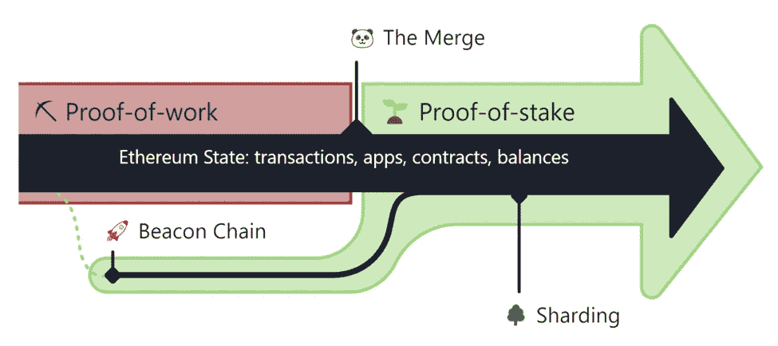
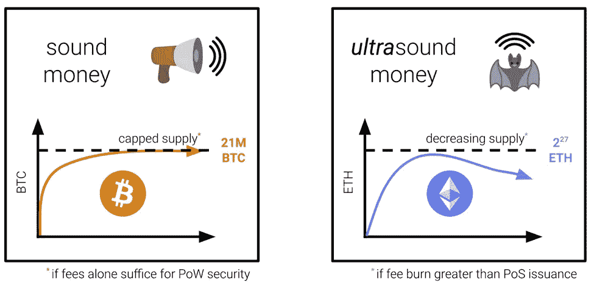
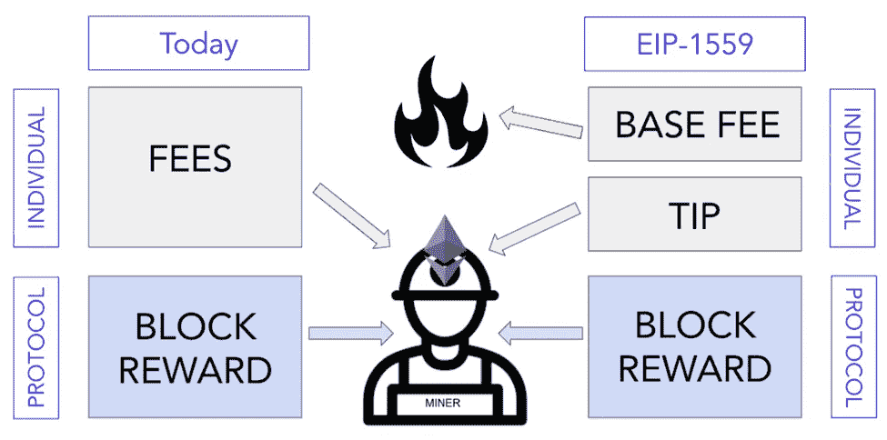
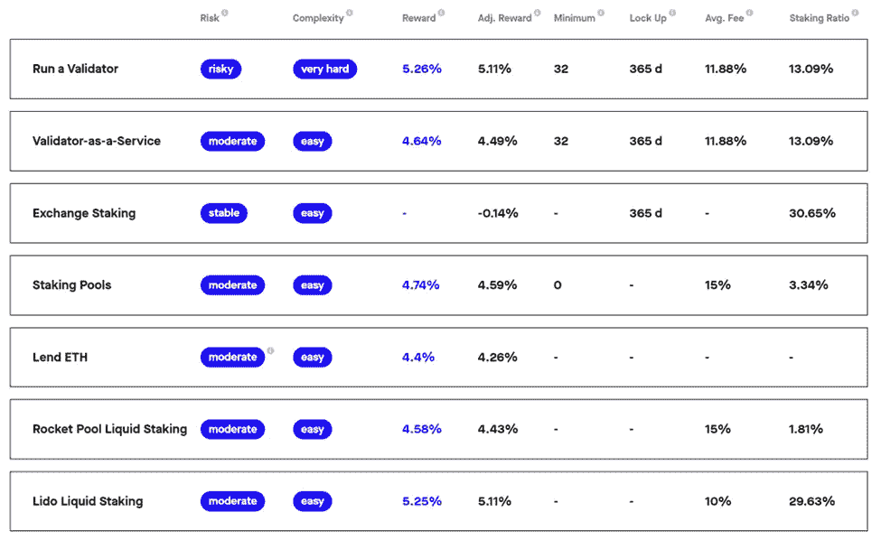
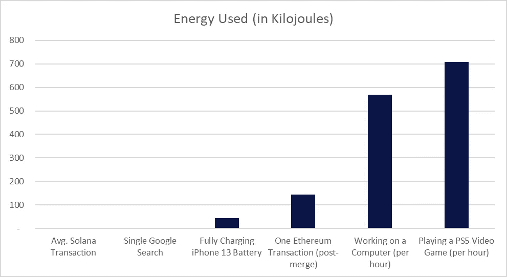
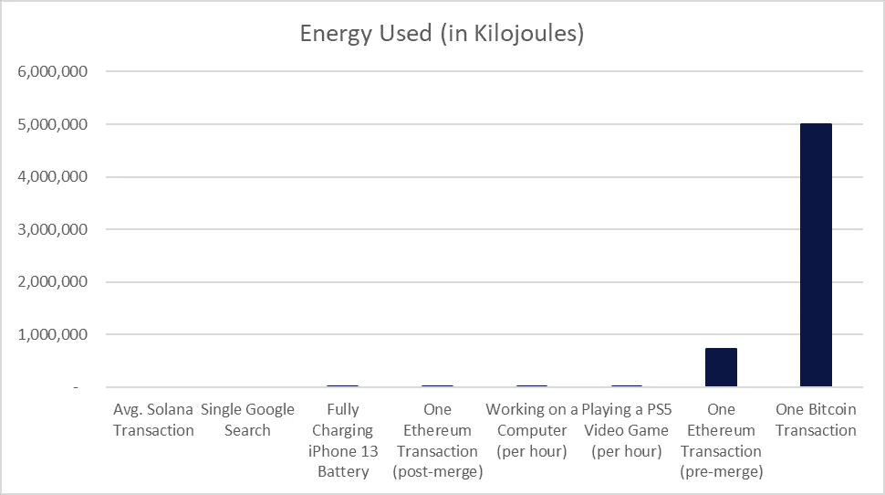
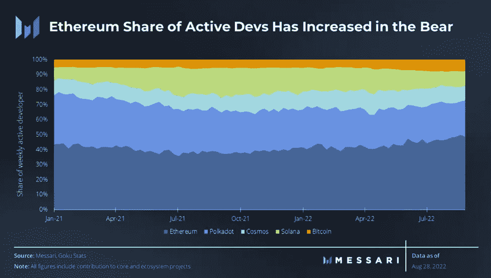
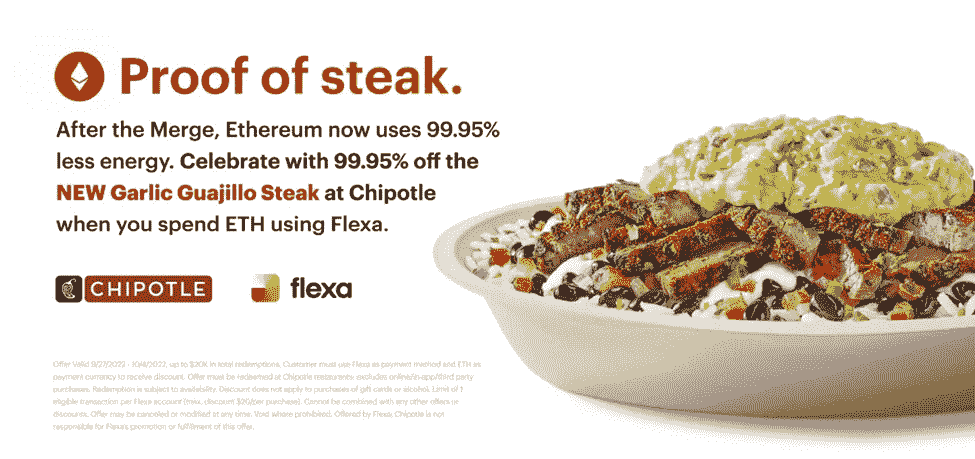

# Aquanow 数字潜水:是你在里面还是你在路上——第 36 卷

> 原文：<https://medium.com/coinmonks/aquanow-digital-dives-ether-youre-in-or-you-re-in-the-way-vol-36-e9c4b2759b3f?source=collection_archive---------26----------------------->

两周前，发生了一件很酷的事情。 ***一群开发人员设法无缝转换了一个全球去中心化数据存储和交易验证平台的底层共识机制。*** 换句话说，以太坊区块链从工作证明(PoW)过渡到利益证明(PoS)。这些协议是网络建立信任和可靠性的方式，这是该技术的基础。以太坊每天大约有 52.5 万名用户，近 3000 个应用程序锁定了 310 亿美元的价值。出错的风险很大，但一切都进行得很顺利。更重要的是，这项工作不是在董事会中协调的——它是利用在线渠道设计的，将分散在世界各地的优秀程序员的工作结合在一起。结果是一个更环保、更分权、更安全、经济模式更健康的区块链。我相信这一成就使该项目成为机构投资者眼中的区块链最佳项目。

[*来源*](https://ethereum.org/en/upgrades/merge/)

当然，[这一切都始于一个迷因](https://twitter.com/drakefjustin/status/1367900072252473345)。在我看来，将数字资产作为国家货币替代品的说法有点误导。当前的体系需要一些改革，但是我不认为经历布雷顿森林体系 III 会有很多乐趣。有一个 ETH 支持者联盟，他们认为这种资产正在成为" [*超声波货币*](https://ultrasound.money/) "这有其缺陷，但潜在的前提是机构投资论点的一个重要元素。以太坊的前卫建筑是这样的，它的代币的流通供应可能很快会系统地下降。

让我们回顾一下历史，看看以太坊经济过去是如何运作的。在 PoW 下，协议奖励矿工执行能源密集型计算，以确保交易的有效性和安全的网络状态。此外，矿工们还收到进行交易的个人支付的天然气费。这导致每天大约铸造 13，000 个 ETH 令牌，并且由于与网络交互的成本不可预测，导致用户体验不佳。社区注意到了这一点，并于 2021 年 8 月实施了 EIP-1559 号法案。这引入了一个标准基本费用和可选小费的新框架，用户可以支付这些费用来激励他们更快地处理操作。重要的是，基本费用被烧掉了，这使得这些代币不再流通。

[*来源*](https://consensys.net/blog/quorum/what-is-eip-1559-how-will-it-change-ethereum/)

现在合并已经通过，矿工已经被一个验证者网络取代，成为区块链的保护者。因为 PoS 网络的设计不涉及解决数学问题的计算能力，所以激励赌注的回报较低。这将导致用于大宗奖励的 ETH 日发放量减少至 1600 份左右。当用户完成一笔交易时，小费会流向验证器，而基本费用仍会被扣除。 ***随着链上活动的加快，有一种情况是燃烧的 ETH 量大于每日发放量，导致总供应量减少。在这种情况下，并保持链的价值不变，这意味着代币价格会上涨。传统金融中的类比是股票回购，这是一个通常对机构资本配置者有吸引力的特征。***

[*来源*](https://ultrasound.money/)

在熊市期间，可能很难记住价格会上涨，但随着宏观周期的变化和创新吸引了更多的区块链用户，估值似乎也将走高。 ***对 ETH 来说，合并后投资理论的另一个重要发展是，任何持有人都可以将他们的资产投入到链条的安全性中，并从大宗奖励和提示中获得收益*** 。赚取这种收入的方式各不相同，从建立一个节点到通过桩服务进行委托，但额外的回报是高度民主化的，并提供了更多利润的出口。许多机构投资委托都有收入要求，现在以太坊满足了这一限制。此外，产生现金流使得资产的传统财务建模成为可能。

[*来源*](https://www.stakingrewards.com/earn/ethereum-2-0/)

机构投资者近年来非常熟悉的一个术语是 ***可持续性*** 。这通常与将资本分配给正在改善的项目或公司相混淆，因为这与环境、社会和治理(ESG)价值观有关。 ***以太坊过渡到 PoS，能耗降低了 99%以上。*协议开发人员的分散团队合作，为长期生存重新布线，一路上检查 E、S 和 G 框。下面是一些图表，可以帮助你想象变化的规模:**

[*来源*](https://solana.com/news/solanas-energy-use-report-september-2022)

以太坊市值 1650 亿美元，是第二大最有价值的数字资产。CoinMarketCap 指出，ETH 日均交易量约为 200 亿美元。这些数字对于监管大量资金池、不想在交易时影响价格的投资组合经理来说是可以接受的。以太坊是为数不多的对机构资金池具有足够流动性的数字资产之一。

在当前的熊市中，交易量、费用收入和锁定的总价值都大幅下降，但相对于其他连锁店，以太坊在所有这些方面仍占主导地位。结果， ***网络继续拿市场份额说到开发者*** 。吸引人才有助于促进像合并这样的转型，并为未来更光明的日子铺平道路。

[开发团队的下一个](https://www.youtube.com/watch?v=tKjs8bBQ3sk)是[上海升级](https://www.youtube.com/watch?v=7ggwLccuN5s&t=101s)。重要的是，这可能允许退出赌注以太坊。目前，这些代币被锁定，除非提交给[的流动资产池](https://coinmarketcap.com/alexandria/article/liquid-staking-and-its-benefits-a-deep-dive-by-lido)，那里也在努力提供[企业级解决方案](https://alluvial.finance/)。无论如何，分拆的能力将消除机构采用的最后一个障碍(监管是最重要的，仍有待解决)，这可能允许创新投资基金，如 ***staked ETH ETF*** 。该连锁店还计划进行几项可扩展性改进，这使得 [Messari 得出结论](https://messari.io/report/state-of-ethereum-q3-2022),“*以太坊很可能在未来 12-18 个月内对 99%的用户来说足够快和便宜*” ***ETH 依然是增长型资产*** 。

据估计，[机构在 2021 年](https://consensys.net/blog/metamask/metamask-institutional/the-impact-of-the-merge-on-institutions)向数字资产市场投资了 93 亿美元，同比增长 36%。随着许多贪婪和风险管理不善的案例被曝光，代币价格受到了打击。这些故事仍然是负面头条。与此同时，这个领域还在继续发展，并不断有新的用户加入。 ***也许今年数字资产领域最重要的发展是以太坊的 PoS 转型，这极大地提高了其能效，同时以产量和潜在供应减少的形式提供了新的回报来源。综合来看，我认为我们会听到更多关于机构投资者投资以太坊的消息。即使如 QCP 指出的那样，这也只是投资者表达宏观观点的一个“高贝塔”游戏。*[美国银行](https://decrypt.co/109518/ethereum-merge-institutional-adoption-bank-of-america)、[富达](https://www.fidelitydigitalassets.com/research-and-insights/ethereum-merge)、[智慧树](https://blockworks.co/the-merge-completely-changes-ethers-investment-case-for-institutions/)甚至 [Chipotle](/flexa/celebrate-the-merge-with-99-95-off-chipotles-new-garlic-guajillo-steak-b8c8bac94263) 都同意。**

> 交易新手？试试[加密交易机器人](/coinmonks/crypto-trading-bot-c2ffce8acb2a)或者[复制交易](/coinmonks/top-10-crypto-copy-trading-platforms-for-beginners-d0c37c7d698c)