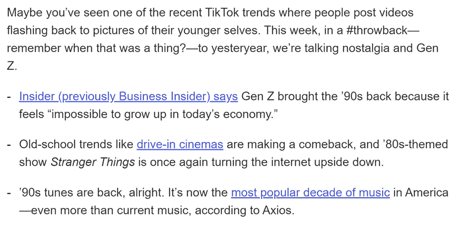
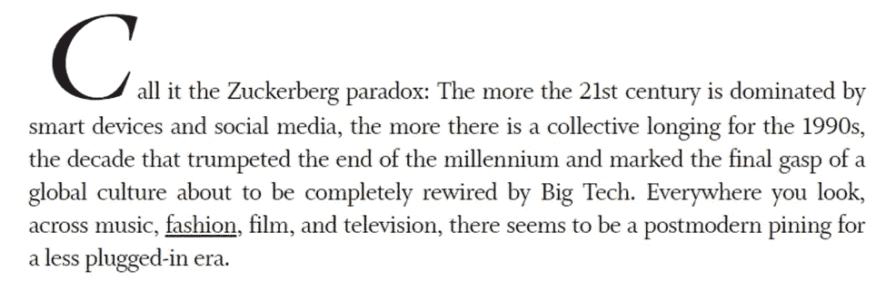
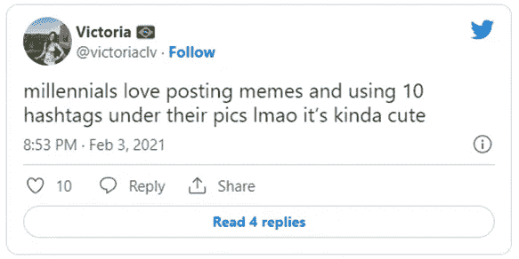
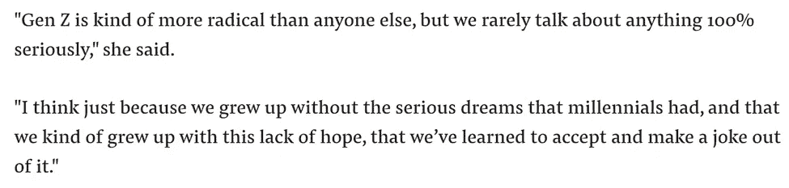
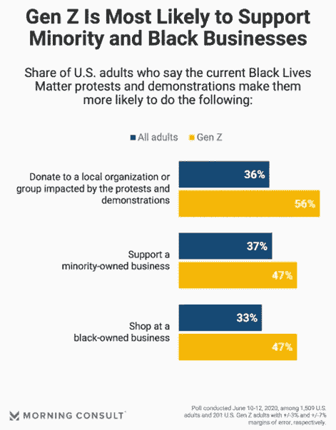
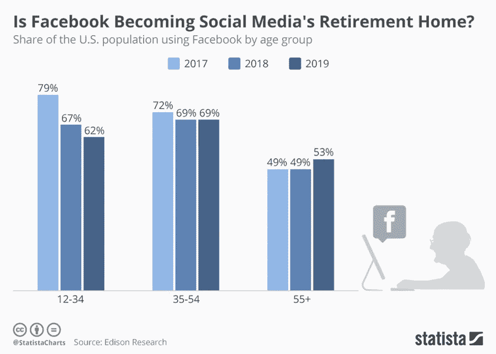
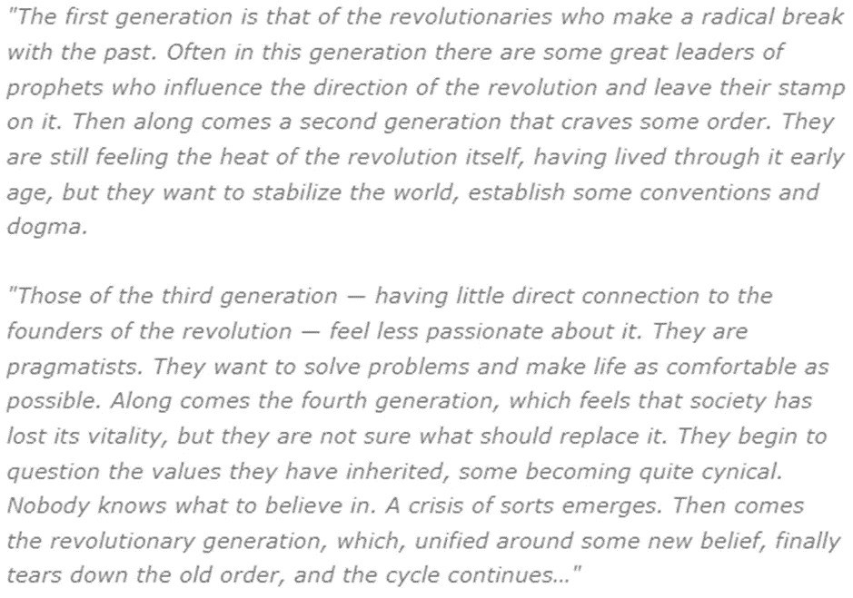
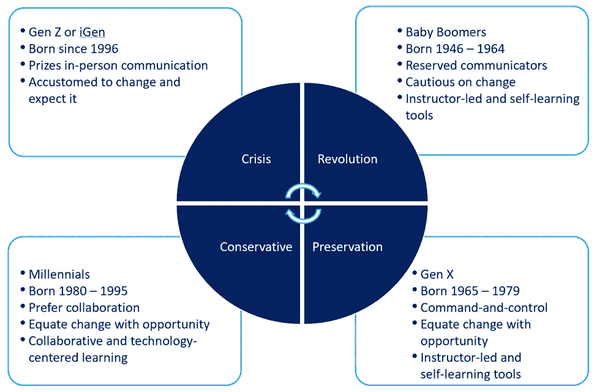
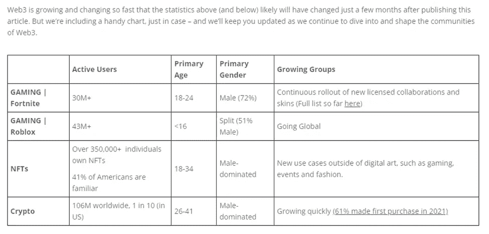

# Aquanow 数字潜水:世代机遇——第 26 卷

> 原文：<https://medium.com/coinmonks/aquanow-digital-dives-generational-opportunities-vol-26-88f4442fa36e?source=collection_archive---------24----------------------->

你有没有意识到最近 90 年代似乎又流行起来了？走来走去，很难不注意到有多少人穿着印有旧乐队褪色标志的 t 恤、宽松的破洞牛仔裤或霓虹运动套装。我很想知道这种趋势是地方性的还是更大的，所以我咨询了谷歌，发现回归垃圾、学院风和格子已经成为许多大时装公司 [*“五年来”季节性系列的亮点*](https://www.lofficielusa.com/fashion/gen-z-y2k-millennial-90s-fashion-nostalgia) 这不是我第一次成为潮流的最后一人。

[来源](https://www.mckinsey.com/~/media/mckinsey/email/genz/2022/07/19/2022-07-19b.html)

在某种程度上，看到工装裤和珍珠果酱到处都是可能只是有规律的周期性。过去的时尚经常被设计师重新设计，他们对这些外观有一定的亲和力。然而，我读过的许多关于这个话题的文章表明，现代青少年/年轻人被 90 年代吸引也是出于某种情感联系。你经常听说老年人渴望生活更简单的美好时光，但我认为这是因为随着时间的推移，我们的思维变得越来越僵化，而我们周围的世界在不断变化。然而，今天的年轻人也渴望更简单的时代——即使他们没有活着去经历:

在不确定的时期，人们通常会回忆起童年的舒适，那时他们的安全是由别人保证的。千禧一代(1980-1995 年出生)会发现自己渴望 90 年代，这是有道理的，但这如何解释 Z 世代的新痴迷？ 他们不太可能只是在复制老一代人，因为[两个群体之间有一场社交媒体的口水战](https://www.buzzfeednews.com/article/laurenstrapagiel/gen-z-mocking-millennials)，年轻一代声称他们的年长堂兄弟太异想天开，太肤浅，而且过于专注于品牌。

[*来源*](https://www.huffpost.com/entry/millennials-gen-z-differences-tweets_l_6095d569e4b0aead1b83d142)

在疫情期间，许多人发现自己在寻找不同的流媒体服务来转移注意力。人们认为，90 年代的情景喜剧中的角色面对面互动，很少见到电脑，这给一代人带来了怀旧的效果。一些人认为，这种屏幕时间提供了一种讽刺的逃避方式，让人们可以在学校或与朋友互动的数字平台上度过无尽的时间。更奇怪的是，这个年轻人喜欢上了 Snapchat、Instagram 等。来表达他们对这个三十年前的内容所描绘的时代的看法。在这里，他们通过共同的幽默、时尚和音乐找到了一种社区意识。现在#怀旧、# 90 年代和#y2k 在抖音都有数十亿的浏览量。

头条新闻和当前的时尚似乎暗示，今天 20 多岁的年轻人渴望回顾 X 一代，他们可能会发现这种文化中的一些元素很有吸引力。然而，社交帖子对他们有讽刺的倾向，这让我觉得他们可能同时在嘲笑 X 一代。这不是年轻一代第一次攻击另一个群体。Ok Boomer 和千禧一代的讽刺作品在抖音也很容易找到。 ***但是为什么今天的年轻人认为自己足够高尚，可以取笑他们的父母呢？***

老年人向成年人过渡的十年迎来了新内容和新技术的浪潮。营利性广播电视尝试挑战社会规范的情景喜剧，你可以全天候观看新闻，HBO 重新定义了家庭娱乐。 ***当然，*** ***万维网和手机也在这个时期出现。上世纪 90 年代的创新大有可为，但事后看来，许多创新创造了外部性或扩大了差距。让我们考虑几个例子。***

像《阿瑟尼奥·豪尔秀》和《贝莱尔的新鲜王子》这样的节目吸引了非裔美国人和年轻的白人观众，这在早期对广告商来说是有吸引力的。然而，在达到规模后，网络将注意力集中在收入最高的市场部分。 [Adriana Davis 解释说](https://www.refinery29.com/en-us/2016/09/124823/black-sitcoms-90s-tv-shows-cancelled)“一旦这种趋势平息下来，他们就放弃了黑人秀，我们已经有十多年没有看到类似的事情了”这种行为会激怒 Z 世代，他们已经表现出更强烈的反对歧视的意愿。

[*来源*](https://morningconsult.com/2020/06/22/why-gen-z-isnt-interested-in-your-statements-promises-and-commitments-yet/)

[***辛普森案的审判*** 在几个方面造成了分歧](https://www.washingtonpost.com/sports/redskins/how-the-oj-simpson-murder-trial-20-years-ago-changed-the-media-landscape/2014/06/09/a6e21df8-eccf-11e3-93d2-edd4be1f5d9e_story.html)。重要的是，它也让美国人的眼球紧盯新闻频道。突破性的故事情节本来就有限，现场新闻又很昂贵，所以追求利润最大化的广播公司随后试图吸引观众，开始让更多的“*专家*”提供他们对主题的意见，而不是报道。辩论的焦点通常是情绪化的话题，这有分化观众和吸引他们注意力的效果。这在今天的电视新闻([Z 世代不怎么看](https://reutersinstitute.politics.ox.ac.uk/our-research/how-young-people-consume-news-and-implications-mainstream-media))和伴随他们成长的社交媒体频道上显而易见。

然后是互联网本身，它在 20 世纪 90 年代开始全球化。它最初是一个开放的网络，技术限制将活动限制在静态网站、聊天和电子邮件上。从这些卑微的开始，我们有了今天的网络，它被广泛认为是人类的非凡壮举，但也被认为有点过于集中。我们开始看到年轻用户对通过算法将他们的数据货币化的围墙花园表示不信任。这可能是因为对监管和建设 web2 的 GenXers 有一些敌意。

[*来源*](https://www.statista.com/chart/17306/share-of-the-us-population-using-facebook-by-age-group/)

这些都很好地提醒了我们，创新的好处应该被仔细审视。对许多人来说，2000 年以前的十年是令人印象深刻的全球化、技术进步和普遍社会进步的十年。[回想起来，这种繁荣似乎是不可持续的](https://www.history.com/news/1990s-the-good-decade)，有可能 Z 世代看到了他们父母的错误，天真地认为他们本可以做得更好。这就是我的大脑当年如何工作的。

***历史上有世代循环冲突的先例*** 。罗伯特·格林在他的 [*人性法则*](https://www.goodreads.com/book/show/39330937-the-laws-of-human-nature) (强烈推荐)中，专门用了一章来阐述这个观点——“抓住历史时刻:代际近视法则”。他的理论的基础是一种不断变化的时代精神，或时代精神，它将出生在同一时期的人们联系在一起。目前很难发现这些力量，但事后来看，它们更容易被识别。借助于尼可罗·马基亚维利、威廉·史特劳斯和尼尔·豪的作品，格林先生发现历史跨越了四代人:

[*来源*](https://www.scottmonty.com/2019/03/the-differences-between-generations.html)

如果你不想拿起这本书，那么[你可以在这里](https://www.youtube.com/watch?v=D6nVo_1kG5w)和罗伯特·格林一起钻研论文。我试着用下面的信息图将这些想法放在今天的背景下:

[*来源*](http://www.whereintheworldismario.com/2019/07/4-generation-cycles.html) ， [*来源*](https://managementhelp.org/interpersonal/understand-generational-differences.htm)

***Z 世代是危机世代吗？*** 随着时间的推移，我们只有*知道*这个问题的答案，但似乎这个循环正在重演。第四代的年轻人出生在一个制度已经在几十年前建立的世界，但不再恰当地反映时代的现实，所以他们向后推。近年来，一些激进社会行动的例子似乎指向一个内部分裂的系统。

促进自由和多样性，但同时又压制任何不同意的人，这很讽刺。此外，还出现了取消文化、激进的环境保护主义等后果。所以我们要看看当前的压力是否会逆转。据称， ***这些都是危机一代*** 的正常不和谐。如果年轻人继续反抗现有的制度框架，那么我们可能会处于罗伯特·格林(Robert Greene)所称的“最激动人心的时刻”……见证即将发生的变化……这些变化正从底层浮出水面。”

这一切都极具破坏性，但我们可以通过重构环境来摆脱对对抗的恐惧。通过认识到即将到来的变化是一个更大的增长周期的自然部分，我们可以理解冲突是自然更新的有机必要条件。 ***这怎么玩进 web3？*** 请记住，互联网和所有权的这种演变源自于一种[Z 世代&对与数据、身份和金融服务的集中控制有关的滥用权力的千禧年反弹](https://www.forbes.com/sites/forbesbusinesscouncil/2022/06/29/what-is-the-appeal-of-web3-for-gen-z/?sh=6d4bc5fe1926)。有很多方法可以将一代人的想法和数字资产结合在一起，但我会把这张表留在这里，让你思考:

[*来源*](https://movementstrategy.com/editorial/users-web3-demographics/)

> 交易新手？尝试[加密交易机器人](/coinmonks/crypto-trading-bot-c2ffce8acb2a)或[复制交易](/coinmonks/top-10-crypto-copy-trading-platforms-for-beginners-d0c37c7d698c)