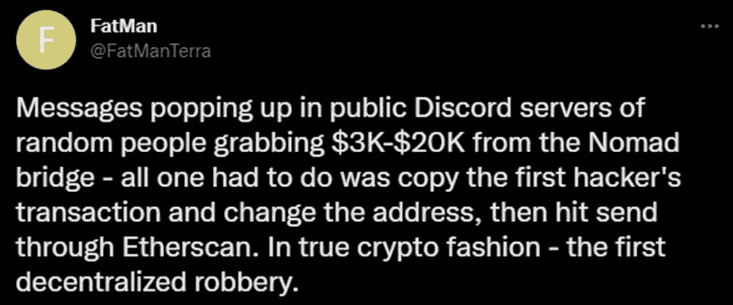
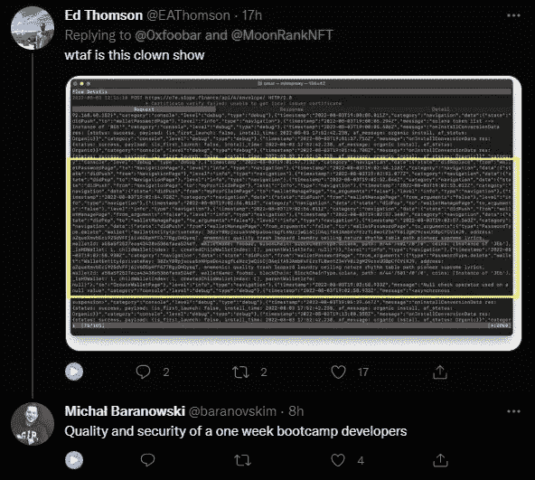
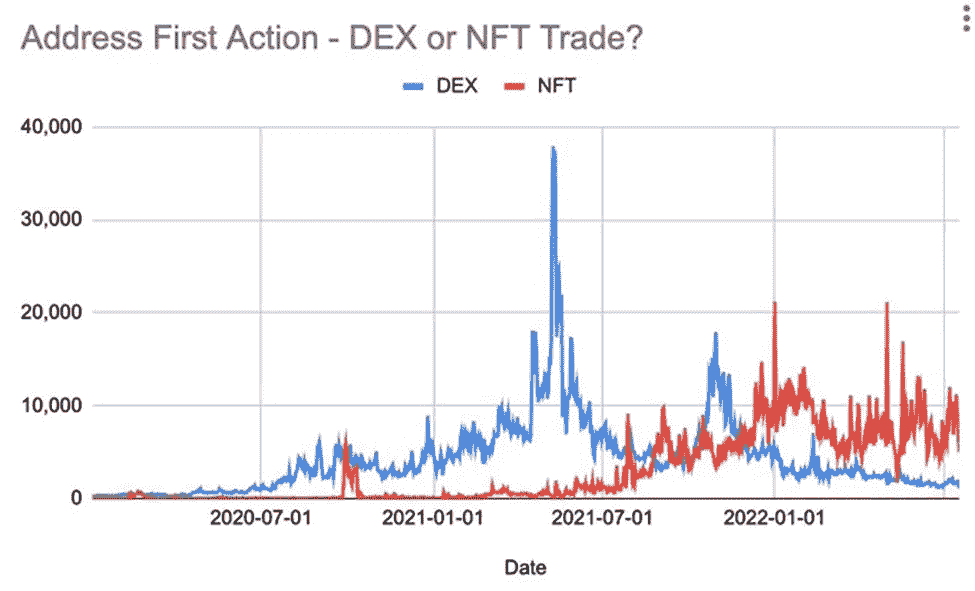
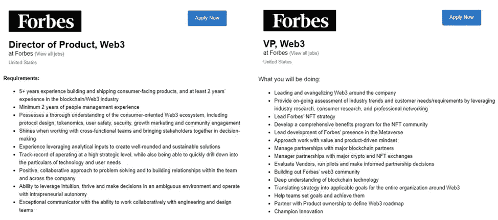
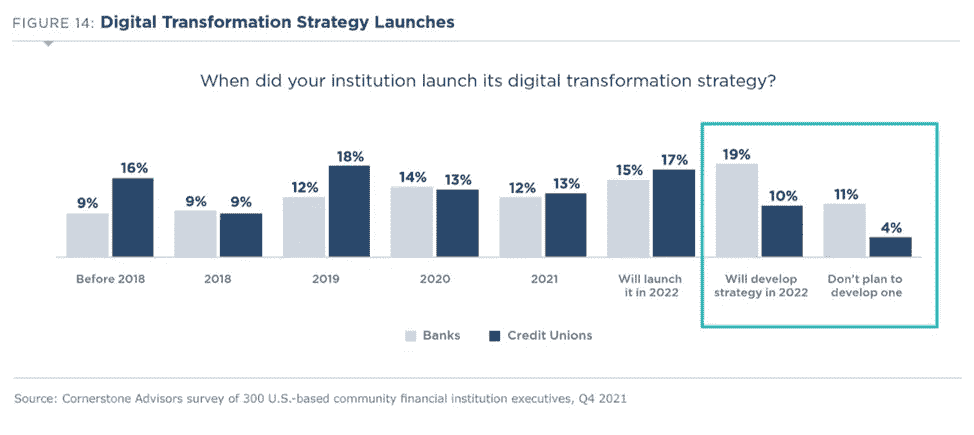
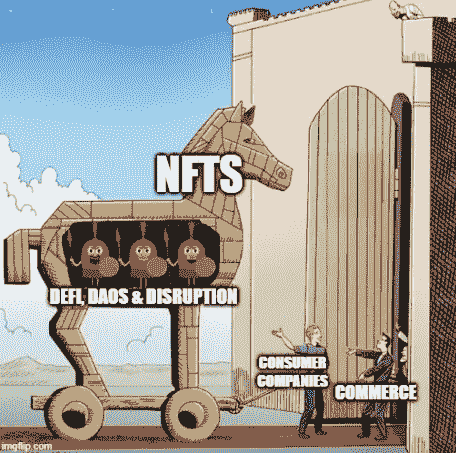

# Aquanow 数字潜水:侵入骨骼！第 28 卷

> 原文：<https://medium.com/coinmonks/aquanow-digital-dives-hack-the-bone-vol-28-e097822d664?source=collection_archive---------50----------------------->

对于本周要写的内容，我有其他计划，但数字资产领域最新的高调开发创造了一个小小的漩涡，让我无法思考其他太多事情。这些黑客攻击是在一系列其他失败之后发生的，这些失败将在多年内塑造 web3 的发展，这增加了它们的重要性。尽管发生了灾难，但仍有创新和强大的社区在维护生态系统。然而，头条新闻为监管者提供了更多实施监管的理由，并可能刺激他们变得专横跋扈。

让我们来看看最近发生的一些事情，以及它们可能如何影响这个年轻生态系统的前进道路。

8 月 1 日，Nomad bridge(一个为连接几个区块链而建立的互操作性平台)被利用，当时[的一次例行升级使得协议容易被批准任何提交给它的精心编写的交易](https://blockworks.co/nomad-token-bridge-raided-for-190m-in-frenzied-free-for-all/)。一些了解这种情况的人在一些大宗交易中窃取了资金，这引起了其他交易员的注意，他们复制了原始交易，并将受益人地址改为自己的地址。总共价值 1 . 9 亿美元的代币被送到了 41 个钱包*，[让一些人开玩笑](https://twitter.com/FatManTerra/status/1554258880380772352):

**自*以来，黑客已经返还了大约 1700 万美元

Nomad 在 4 月份以 2 . 25 亿美元的估值筹集了 2200 万美元，其附带的博客文章吹捧他们的安全第一的互操作性。“我没有资格谈论任何技术问题，但也许这些团队在他们的迭代过程中进展得有点太快了。在这次攻击之前，包括[虫洞](https://blog.chainalysis.com/reports/wormhole-hack-february-2022/)(3.2 亿美元)[浪人](https://www.elliptic.co/blog/540-million-stolen-from-the-ronin-defi-bridge)(5.4 亿美元)和[地平线](/harmony-one/harmonys-horizon-bridge-hack-1e8d283b6d66)(1 亿美元)在内的一些团体犯下了一系列代价高昂的技术疏忽，这些团体都试图通过允许资产所有权跨链流动来增加价值。在每一个例子中，都出现了不同程度的补偿，他们的事业对于数字资产市场来说是崇高的。然而， ***这种“动作快，破事”的做法是不是弊大于利？***

在 Nomad 漏洞的第二天，Solana 的用户开始报告他们的钱包被掏空了。少量以太坊账户也被清空。在撰写本文时，确切的问题仍未被发现，但据信, [Slope wallet](https://www.crunchbase.com/organization/slope-finance/company_financials) 的代码中存在一个漏洞，该漏洞允许传播纯文本种子短语，在某些情况下，还允许其他钱包共享导入的私钥。

[*来源*](https://twitter.com/0xfoobar/status/1554928011669118976)

你可能会忍不住认为，在这些马裤、Terra/Luna 崩溃、3 Arrows 内爆和一系列 CeFi 破产造成的损失之间，数字资产行业将走向死亡， ***但不知何故，情况并非如此*** 。[DappRadar 的人发表了一篇关于危机开始以来加密市场状况的文章](https://dappradar.com/blog/how-blockchain-users-reacted-to-the-crypto-contagion-and-the-latest-macro-events)，其中一些发现可能会让你大吃一惊。相对于 Q1，Unique Active Wallet (UAW)在 Q2 的活动减少了 12%，但同比仍增长了 62%。与 2021 年相比，NFT 遭受了类似的命运，交易量下降了 33%，而活动量增加了 48%。游戏似乎完全逆潮流而动，玩家继续以"*或多或少与 Terra 事件前相同的速度与相关 dApps 互动。*

***事实证明，NFT 在加入方面表现得尤为出色*** 许多钱包展示了它们与生态系统的第一次互动，就像使用 DEX 的 NFT 交易一样。这符合 JPEGs 的文化成分比金融应用更受欢迎的论点。

[*来源*](https://twitter.com/ElBarto_Crypto/status/1548684477605486592)

上周，我参加了由《福布斯》主办的电话会议，会上有许多专注于为企业采用构建基础设施的嘉宾。当大型组织寻求启用数字资产时，他们通常会从雇佣顾问或利用他们的网络接受教育开始。接下来，高管们将注意力转向数字资产的安全交互和存储。在更大的范围内，有比典型的零售参与者更多的防范措施(冷藏、多签名钱包等)。)而且大部分群体不会直接和 DeFi 互动。我认为这有助于避免大规模爆发，并在机构层面建立信心，这里的领导人现在正寻求通过雇佣一个小团队来制定走向市场的 web3 战略，从而为现有业务线增加喷气燃料*。一旦选定了游戏计划，下一步就是组建一个由产品经理、工程师、设计师等组成的团队。来执行战术。*

很少有公司已经开始为 web3 的开发创造能力，但是有很多公司处于早期阶段——[特别是 NFTs](/omniaprotocol/nft-adoption-by-institutions-is-on-the-rise-b6849e34c965) 。这是令人鼓舞的，与许多公司已经为 web2 改造了他们的业务没有太大的不同。 我们以平面媒体为例。在互联网出现之前，他们经营着一个由工厂和新闻中心组成的系统，但万维网的出现改变了消费模式。深思熟虑的高管试图理解这种新的动态，然后慢慢改变他们与客户互动的方式。不久，他们雇佣开发人员来开发应用程序，并推出新的内容形式。现在，他们看起来更像科技企业，而不是印刷和写作网络。我不确定这部分是不是照本宣科的，但它提到福布斯正在招聘，这是他们在 web3 上的两个帖子:

[*来源*](https://www.forbes.com/careers-at-forbes/)

***虽然许多创新的现任者希望利用加密资产的力量，但仍有一批公司尚未真正转向数字时代*** 。[在最近对 300 名美国金融高管的调查中](https://www.crnrstone.com/whats-going-on-banking-2022)，14.4%的人表示他们计划在今年制定数字化转型战略，而 7.5%的人表示他们根本没有这样的计划。这一长期趋势持续了 25 年，超过五分之一的美国社区银行和信用合作社仍然没有一个如何在电子领域竞争的战略。与此同时， [GonzoBanker 注意到“*”三成的新生代和千禧一代现在认为数字银行或金融科技是他们的主要支票账户提供商。*](https://gonzobanker.com/2022/07/bankings-hard-fork-in-the-post-neobank-era/)

***监管是否影响了金融机构对数字化的犹豫？***

自 2008 年以来，银行受到了严格的监管，这让我想知道这是否在一定程度上导致了银行不愿接受转型。**此外，潜在的金融服务提供商远离或沿着其他方向竞争。竞争减少和共同的逆风可能会巩固过时的技术。**

[经合组织称](https://www.oecd.org/finance/financial-markets/44362117.pdf)“*理想的政策方法是在维护系统的安全性和稳健性与允许金融机构和市场履行其预期功能之间找到适当的平衡* ***由于对客户资产风险的高度敏感性，加强监管可能会减缓银行业的突破*** 。正如 Jessica Pinkston 在[这篇评论中批评该行业缺乏创新](https://gonzobanker.com/2022/07/who-owns-digital-ugh-thats-the-problem-for-bankers/)的那样，一些“尴尬的客户事件或危险的安全漏洞可以追溯到不正确的配置或脆弱的接口。” ***听起来耳熟吗？金融体系遭遇了与新兴在线所有制经济类似的挫折，但由于担心惹恼政策制定者，创新通常进展缓慢。 ***即将到来的监管可能会给加密资产带来类似的环境。******

立法者已经允许金融科技公司在比传统银行更宽松的规则下运营，因此新兴的数字所有权经济有望获得类似的回旋余地，但 ***拼图的碎片似乎表明，许多司法管辖区的监管机构将采取严厉措施启动*** 。前者遭遇了数据泄露，但我想不起也没发现任何客户资产被黑客窃取的事件。也就是说，因为非功能性技术(以其目前的形式)不太可能构成任何系统性威胁，而且因为消费行业继续加快对该技术的采用，所以早期立法似乎会留出空间。不管事情如何发展，我相信社区将继续致力于代码、治理和……迷因的实验。

> 交易新手？尝试[加密交易机器人](/coinmonks/crypto-trading-bot-c2ffce8acb2a)或[复制交易](/coinmonks/top-10-crypto-copy-trading-platforms-for-beginners-d0c37c7d698c)