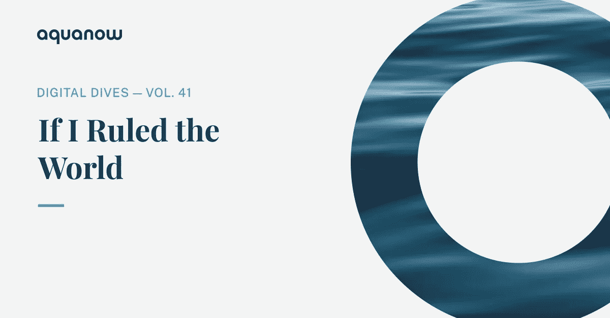
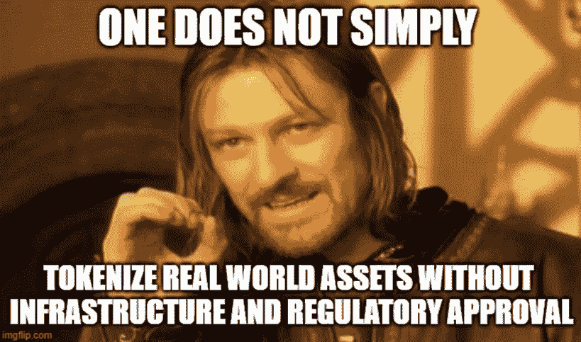
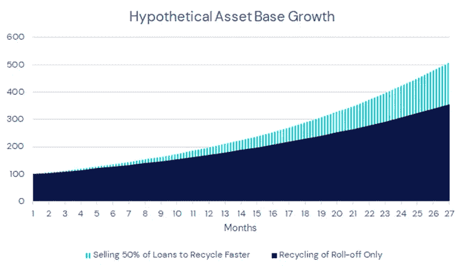
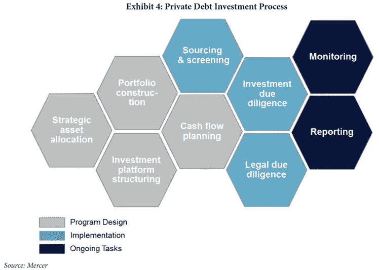
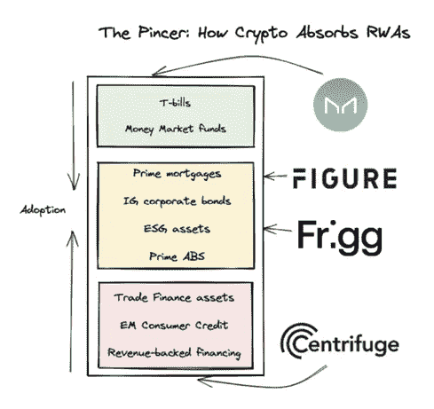
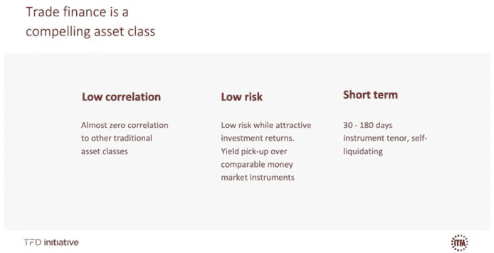
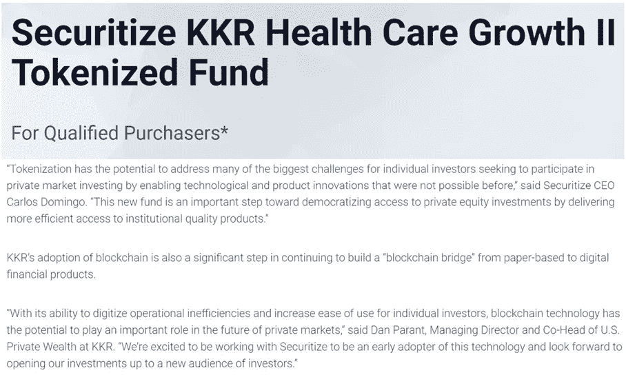
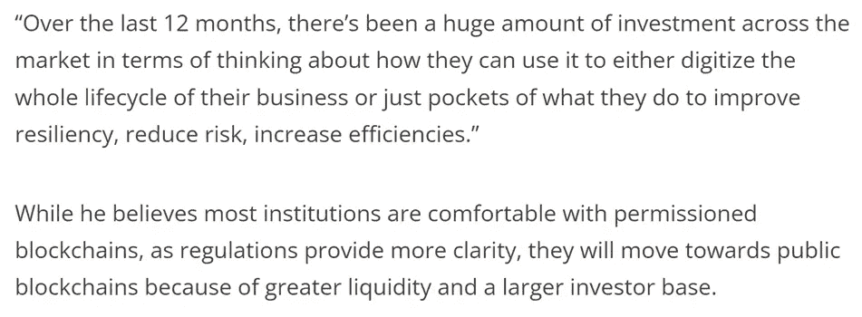

# Aquanow 数字潜水:如果我统治世界——第 41 卷

> 原文：<https://medium.com/coinmonks/aquanow-digital-dives-if-i-ruled-the-world-vol-41-1737840667c2?source=collection_archive---------12----------------------->

在最近的数字潜水中，我们看到了利用区块链技术为另类投资带来流动性的前景。 ***金融高管们普遍认为，将资产令牌化可以让这个行业变得更好，因为创造一个非流动性资产可以在二级市场上自由交易的生态系统，有可能提供更快、更便宜的交易，更大的透明度和更大的可及性，同时总体上降低资本成本。*** 由于发达市场和传统投资已经享受到了许多这些好处， ***我们很可能会看到令牌化首先在服务不足的投机资产和新兴司法管辖区取得成功。***

***全面令牌化趋势的最大障碍是监管的清晰性。*** 网络效应对于释放向尚未进行二级交易的资产提供流动性的收益至关重要。随着参与人数的增加，整个系统的价值增加。为了实现其潜力，象征性投资需要监管者之间的跨境合作，而如今决策者甚至无法就数字资产的国内监管达成一致。此外，创建、管理和保护令牌化的技术相对较新。因此[需要基础设施](https://www.bnymellon.com/us/en/insights/all-insights/the-rise-of-tokenization.html)将数字化资产与遗留系统连接起来，以确保它们的顺利加入和管理。

《真实世界资产的虚幻入门》一书的作者相信，市场的供应方将更容易到来。 考虑新兴市场消费金融、保理或法律结算预付款等深奥的贷款。这些资产往往缺乏流动性，本质上更具投机性，但它们也提供了诱人的回报和潜在的多样化收益。这些信贷的发起人自然对新的廉价资本来源敞开大门，因为他们的商业模式是基于以相对低廉的成本借款和溢价放贷的能力。然而，它们也受到资产负债表的限制，因此通常更倾向于出售资产获利，并将收益回收到新的贷款中，从而加快贷款人的增长。

在市场的另一边，我们有监管信贷资金的人。这些工具将其持有的大部分资产投资于流动性更高的市场领域，如公司、抵押贷款支持证券或抵押贷款协议，允许经理根据经济状况调整其头寸并满足资本赎回。然而， ***这一职业因表现出色而获得回报，因此为了获得优势，经理们通常会对投机性资产进行较小的配置，包括上文所述的非常规贷款。*** 涉足这些利基市场领域需要专业知识，需要时间评估前景。然而，在追求卓越表现的过程中，这种努力是合理的，许多集团乐于付出额外的努力。这些非典型投资的另一个重要特征是，交易流是零星的，基于关系，这使得许多人难以获得有意义的敞口。

[*来源*](https://caia.org/sites/default/files/7_private_debt_2-26-18.pdf)

我们可以看到 ***资产管理者习惯于推动边界以获得优势*** 。因此，这个细分市场似乎有可能成为首批采用令牌化资产的市场之一(假设他们可以合法地这样做)。这种持股需要额外的尽职调查和复杂的托管，这一事实被差异化、更高的回报潜力和流动性前景所抵消。

**[金翅雀](https://goldfinch.finance/)、[离心机/天湖](https://centrifuge.io/)和[翁多](https://ondo.finance/)已经将价值数亿美元的现实世界资产进行了令牌化，为 DeFi 带来了新的回报来源。在更大的金融体系背景下，这些都是小数目，但在 DeFi 寻找催化剂启动另一轮牛市之际，这可能是值得关注的事情。**

[掉一些“*热阿尔法*”](https://www.youtube.com/watch?v=ilGOSx-NOr4)、 ***《虚幻初级读本》的作者认为，2023 年的一个重要叙事将是金融科技公司孵化自己的令牌化平台，为其平台产生的金融资产带来流动性*** 。提供嵌入式信贷、SaaS 税收贷款甚至供应链融资的公司是现实世界资产的天然创造者。然而，他们的资本相对有限，因此能够将贷款从他们的账上拿掉对增长很重要。他们可以把借款卖给像离心机这样的人，但之后他们会看不到自己的旅程，因此可能会错过有价值的见解。这些金融科技往往是数字本地的和数据驱动的，因此对他们来说，设计可以附属于其发起、承销和服务部门的协议可能是有意义的。以下是他们认为 Flexport 将率先上市的原因:

[*来源*](https://itfa.org/wp-content/uploads/2020/12/Making-trade-investible-for-institutional-investors-banks-make-it-Dec-2020.pdf)

传统的金融机构已经进行了象征性的实验，但到目前为止，它们主要关注的是外汇和固定收益等流动性已经很强的市场。然而，一些资产管理公司，如 [KKR](https://securitize.io/securitize-capital/investment-opportunities/securitize-kkr-health-care-growth-ii-tokenized-fund) 和[汉密尔顿巷](https://www.hamiltonlane.com/en-us/news/hamilton-lane-securitize-tokenize-funds)已经在公开的区块链将他们的私募股权基金令牌化，通过降低最低投资门槛释放流动性并扩大投资者范围。值得注意的是[证券化](http://www.securitize.io/)仍将作为一个中心方来确认基金的购买者是经过认可的。

早在 2021 年 4 月，欧洲投资银行就在以太坊网络上发行并结算了其首只数字债券。有趣的是，[EIB 在几周前又回来了，但是这次他们使用了高盛的令牌化平台——GS DAP。这可能是 EIB 在因使用合并前以太坊而受到抨击后，转而使用私人区块链，但我认为这表明了一种趋势，即 ***TradFi 运营商将使用许可或私人环境*** 进行他们的实验。一旦金融机构已经习惯于将他们的业务转移到供应链上，那么他们可能会在公共网络上推出产品/服务，以吸引更多的受众。我们对每家银行的策略没有太多的了解，但这正是](https://www.eib.org/en/press/all/2022-448-eib-innovates-further-with-project-venus-the-first-euro-denominated-digital-bond-on-a-private-blockchain) [JP 摩根的克里斯汀·莫伊在本次对话中概述的顺序](https://forkast.news/video-audio/jpmorgan-onyx-jpm-coin-banking-blockchain/) (25 分钟，但整个事情都很好)[高盛也描述了](https://www.ledgerinsights.com/goldman-sachs-unveils-digital-asset-platform-with-eib-e100m-blockchain-bond/):

[私有分布式分类账的想法在过去一直受到批评](https://bsvblockchain.org/news/comparing-public-and-private-blockchain-features-pros-cons/)，但对于受到严格监管的金融行业来说，这种想法很有意义。银行可以利用已经在 GitHub 上的([和贡献](https://developer.gs.com/discover/open-source))开源代码来加速他们的概念验证，这可以用来获得决策者的支持，最终一些协议可以公开推出。

[正如道富银行数字资产集团的 Luke Brereton 和 Nitin Gaur 所讨论的](https://events.coindesk.com/arca_webinar/agenda/session/1032694)，我们在 ETF 领域看到了类似的设置，即只有获得授权的参与者才有权创建/赎回基金单位。可以想象，这是因为交易块的所需规模和监控/执行所需的技术，但也是因为信任和避免来自随机来源的垃圾邮件请求。也就是说，任何拥有折扣经纪账户和资金的人都可以购买 ETF。

对于大多数 DeFi 社区来说，我刚才描述的情况会引发呕吐反射 。如果我统治世界，这不一定是我想要的结果[，但是考虑到我们现在所处的位置，这似乎是一条通向更加开放和无许可系统的可能和合理的道路。现有金融机构的资产负债表和客户基础足以证明大规模投资该领域的合理性，而许多秘密组织仍对今年的事件感到震惊，并对过多的杠杆感到不满。](https://www.youtube.com/watch?v=-8dyp89uWxA)

大量聪明人将继续为公共链构建创造性应用和基础设施，除非监管机构严重越权，否则这个空间将基于社交应用、游戏和定义的参与而繁荣发展。然而，我认为，全球金融在区块链机构规模的早期迭代将有所限制。如果数字资产现有者想要在那张桌子上占有一席之地，那么前面将会有无数的合作机会。

这是 2022 年数字潜水的最后一版。我祝你和你的家人节日愉快。为 2023 年的转机干杯！🍻

> 交易新手？尝试[加密交易机器人](/coinmonks/crypto-trading-bot-c2ffce8acb2a)或[复制交易](/coinmonks/top-10-crypto-copy-trading-platforms-for-beginners-d0c37c7d698c)