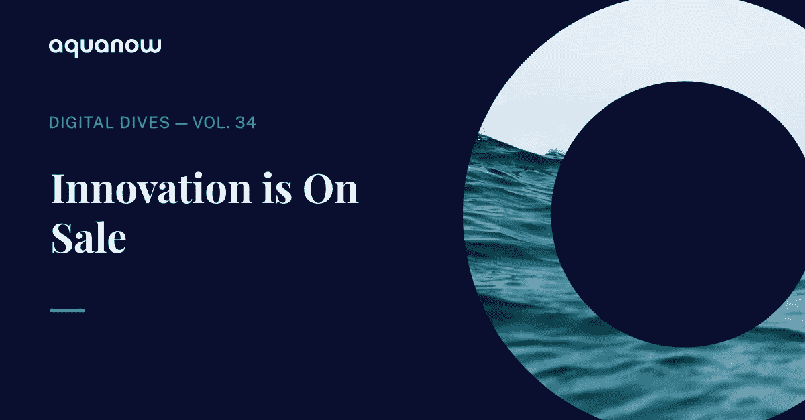
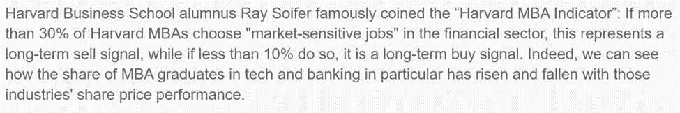
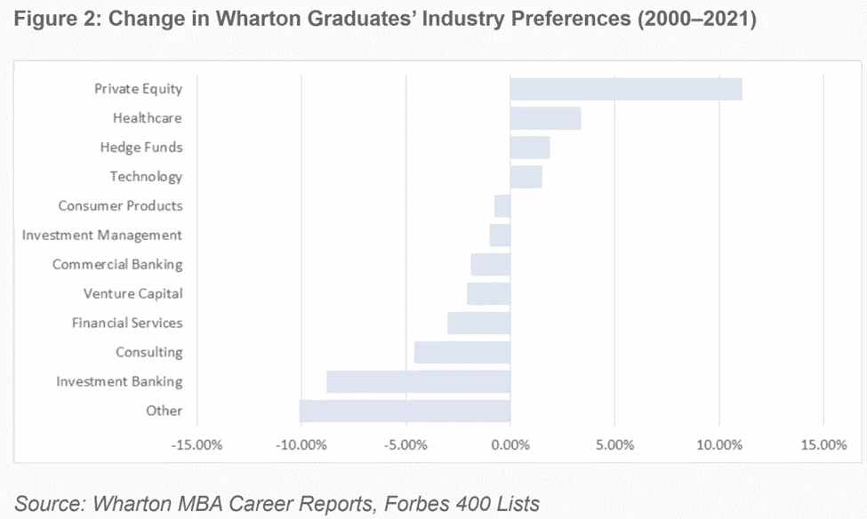
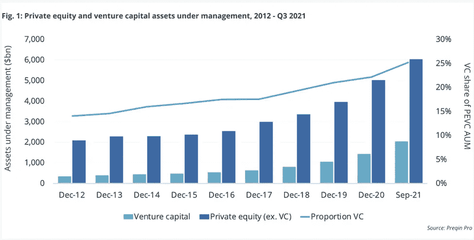
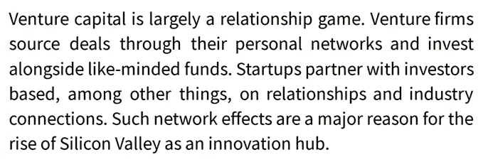
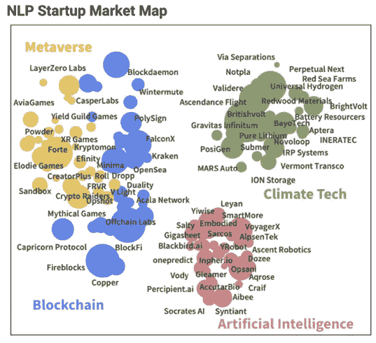
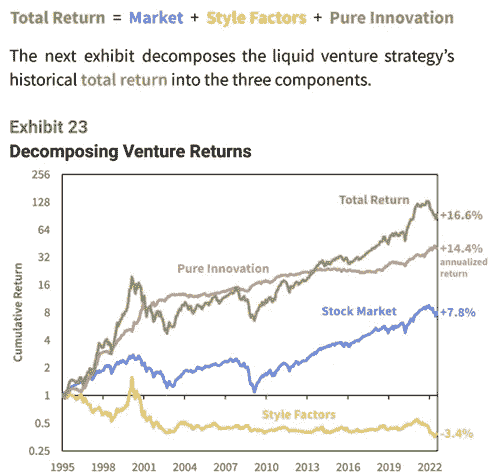
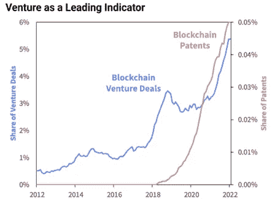
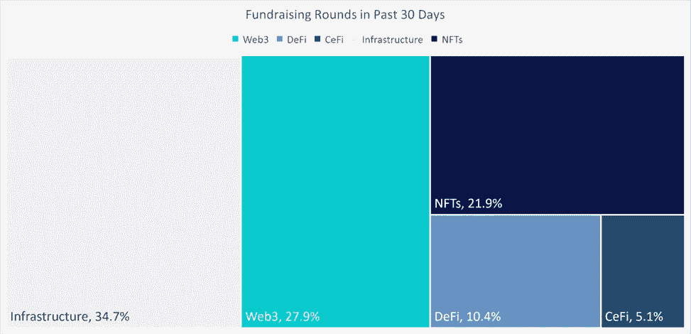
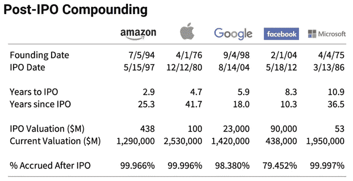

# Aquanow 数字潜水:创新正在出售——第 34 卷

> 原文：<https://medium.com/coinmonks/aquanow-digital-dives-innovation-is-on-sale-vol-34-6606aceca170?source=collection_archive---------41----------------------->

前几天，我在 Verdad 看到了 Dan Rasmussen 和其他人发的一个有趣的帖子。它讨论了一种潜在的市场时机信号，这种信号可以通过研究 MBA 学校的模式来识别。

丹和他的团队研究了沃顿商学院 MBA 的可用数据，发现在 2021 年，咨询是首选，占 27.2%，其次是技术、资本市场和私募股权，分别占 18.7%、12.9%和 11.1%。因此，没有卖出，但有许多潜在的长期买入——如果你相信这种启发式的预测能力的话。

也许更有趣的是自 2000 年以来偏好的变化:

在对沃顿商学院 MBA 偏好的分析中，令我惊讶的一件事是，随着时间的推移，风险投资作为最初的职业道路已经减少，2021 年只有 3.4%的毕业生进入该领域。宾夕法尼亚大学在这一领域的课程可能不是特别强，但考虑到管理的风险资产的显著增长(AUM)，这让我感到奇怪。

[*来源*](https://www.preqin.com/insights/research/blogs/venture-capital-becomes-second-private-capital-class-to-hit-2tn-aum)

Sparkline Capital 的吴凯最近发表了一份关于风险投资的出色报告，我想把这份报告推荐给任何喜欢研究早期投资、量化金融、机器学习或密码的人。在这篇文章中，可能会有一些线索，解释为什么那些对从事风险投资职业感兴趣的人不把美国东北部的商学院作为一条出路。

你经常听说 MBA 不在于你学到了什么，而在于你遇见了谁，因为大学是基于地理位置的(就目前而言)，你在哪里学习很重要。有道理的是，有足够技能进入沃顿商学院的人也可能是更接近加州活动的项目的可接受候选人。因此，我推断这就是正在发生的事情。随着新的技术中心在奥斯汀和纽约出现，这种情况是否会随着时间的推移而改变，这将是一件有趣的事情。

***风投找什么样的题材配资？***

在 HBR 的一篇经典文章中，鲍勃·齐德指出:“一个神话是，风险资本家会投资优秀的人和好的想法。现实是，他们投资于好的行业。“吴凯首先查看了剑桥联合美国风险资本指数和纳斯达克综合指数中每个 GICSs 部门的持股比例:

百分比分配通常看起来是相同的，但在医疗保健和消费者领域有更明显的差异，风投对前者的权重较高，对后者的权重较低。[在几年前的一份报告中](https://www.sparklinecapital.com/post/value-investing-is-short-tech-disruption)，Sparkline Capital 的分析师做了一些工作，让他们 ***提醒投资者不要假设所有的技术都是创新的，要记住所有行业都有颠覆性的公司*** 。为了更深入地挖掘，他们使用自然语言处理模型从专利摘要中梳理出某些主题，并将它们映射到他们的创业数据库中的公司描述。然后小组生成下图。

很难创建一个具有类似映射的交易所交易公司指数，特别是当它与左侧的主题相关时。事实上，上市的 web3 公司如此之少，以至于一些[彭博分析师发表了一篇文章](https://www.bloomberg.com/news/articles/2022-09-01/crypto-etfs-moving-in-lockstep-highlight-diversification-dilemma?leadSource=uverify%20wall)指出，18 只美国上市的加密主题 ETF 中的 ***14 只具有 0.9 或更高的成对相关性*** 。然而，在因素模型的帮助下，吴凯和他的团队有了一个有趣的发现。

不出所料，风投支持的私营企业往往比上市公司更年轻、规模更小、发展更快。然而，他们也往往更昂贵和无利可图。随着时间的推移，后两个因素会对投资回报产生显著的负面影响，如果公司存活下来，前三个因素会转瞬即逝。 ***那么，是什么推动了 venture 的可观回报呢？*** 迷你图进行回归分析，并将 VC 利润分解如下:

***都是创新！事实证明，你可以在公开市场中找出甚至分离出这个因素，但我会把它留给好奇的读者。我认为在数字资产环境中最相关的是 ***专利是衡量独创性的一种形式*** 。虽然区块链向美国专利商标局(USPTO)申请的专利在更大范围内仍然很少，但变化的速度是指数级的，风险投资已经涌入相关交易:***

整个生态系统的代币价格下降了 60%-90%，但融资活动依然强劲。[据 Messari](https://messari.io/fundraising-data) 称，在过去 30 天里，随着市场重新触及今年的低点，有超过 15 亿美元的资本被分配到早期数字资产项目——包括 3 亿美元的 Layer 1，Sui 系列和 2 亿美元的 NFT 游戏项目 Limit Break。

风险投资模式倾向于更高的估值，原因有几个。虽然我注意到一些轶事证据表明生态系统中的估值已经下降，但它们肯定没有像今天自由交易的令牌那样下降。例如，Mysten Labs 因开发一款甚至还未进入 testnet 阶段的区块链(Sui)而获得了 2B 的美元估值。也许它最终会成为一项伟大的投资，但这不是我想说的重点。

***如果久经考验的创新猎人继续向 web3 项目投入大量资金，那么他们会看到该领域持续的颠覆性技术进步*** 。这并不是说今天那些令牌可以自由交易的项目都停止了推出新功能(*咳咳*合并)，那么这是否意味着有一些重大的创新交易即将到来？ 并非所有的令牌都是一样的，所以你需要参考你的[令牌组学 101](https://every.to/almanack/tokenomics-101?utm_source=pocket_mylist) 手册，但是这里有一个有趣的图表(同样来自迷你图)表明 ***一些流动项目可能有更多的上升空间*** :

这不是投资建议，但这篇论文得到了验证，机构投资者已经注意到了。回到顶尖年轻人才希望在哪里工作的主题——KKR 宣布，他们将利用雪崩区块链提供[象征性的私募股权投资机会，麦肯锡等管理顾问已经发表了关于](https://www.ledgerinsights.com/kkr-fund-tokenized-avalanche-public-blockchain/)[如何在元宇宙](https://www.mckinsey.com/business-functions/growth-marketing-and-sales/our-insights/value-creation-in-the-metaverse)取得成功的研究。如果你的公司想涉足这个领域，那么我很乐意帮你联系一个可以提供帮助的团队(提示:是 [Aquanow](https://www.aquanow.io/) )。

> 交易新手？试试[加密交易机器人](/coinmonks/crypto-trading-bot-c2ffce8acb2a)或者[复制交易](/coinmonks/top-10-crypto-copy-trading-platforms-for-beginners-d0c37c7d698c)