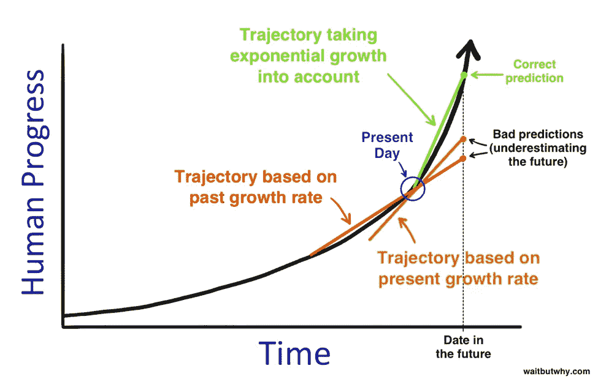
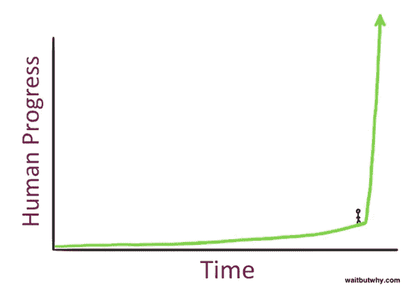
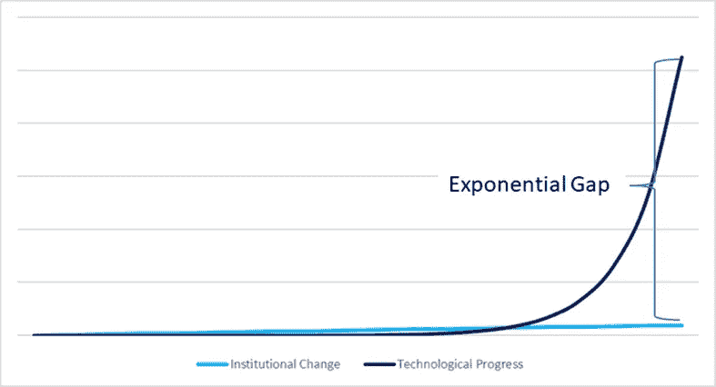
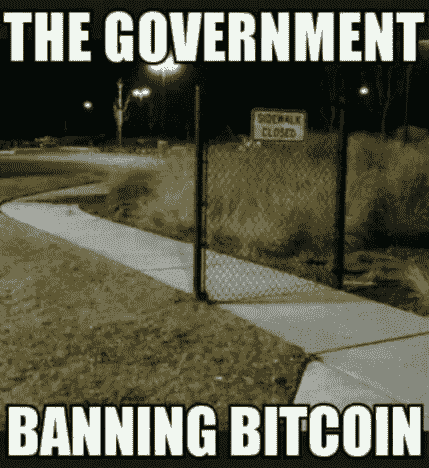
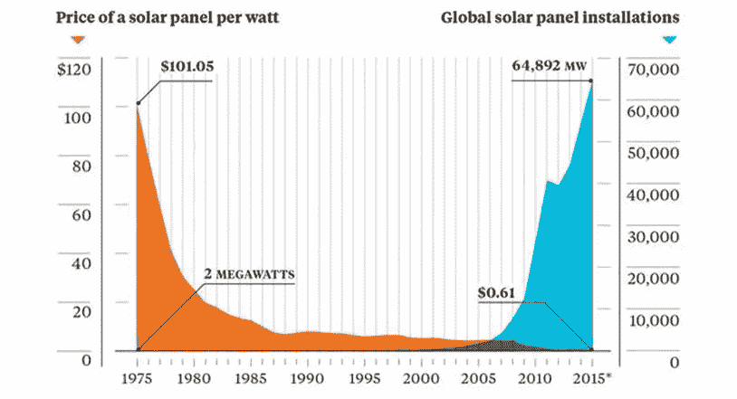

# Aquanow 数字潜水:注意差距——第 32 卷

> 原文：<https://medium.com/coinmonks/aquanow-digital-dives-mind-the-gap-vol-32-4f0a26257e31?source=collection_archive---------24----------------------->

这几天是不是感觉世界变化特别快？ 也许我们的日常生活看起来相对重复，甚至平淡无奇，但退一步说，有证据表明不同技术和人口趋势的融合正在加速变化。识别这种转变具有挑战性，因为它与我们线性思考的倾向相冲突。[在一篇关于即将到来的人工智能革命](https://waitbutwhy.com/2015/01/artificial-intelligence-revolution-1.html)的文章中，蒂姆·厄本用两张图片很好地总结了这一点:

大多数预测模型以线性方式推断历史趋势，这对于在指数增长时代估计资源需求或预算是有问题的。这里有一个内生效应在起作用，我们使用线性方法，因为它们相对容易解释/理解，并且它们的结论比双曲线估计更接近当前状态。想象一下，当其他人正在模拟红线或橙线情景时，向公司董事会展示基于上面绿线的分析。 ***你听起来很疯狂！***

然而，如果你相信厄本先生、[莱克斯·弗里德曼](https://lexfridman.com/)或[帕奇·麦考密克](https://www.notboring.co/)等人的作品，那么我们可能会更好地接受这样一种观点，即 ***事情将变得怪异*** :

坦率地说，今天的情况已经有点奇怪了，因为我们已经看到了几种技术的指数级增长，而我们的机构却在继续跟踪更稳定的适应步伐。这种效应就是阿齐姆·阿兹哈尔所说的“指数差距”，它对社会有着深远的影响。即使是最开放的经济体也是在这样一种假设下运行的，即如果没有政策制定者的干预，市场力量会变得有点难以驾驭。这些规则可能落后了几步，但监管仍在继续塑造产业组织。

社交媒体和大规模数据收集已经盛行了十多年，但直到现在我们才开始看到立法者介入遏制科技巨头的权力。当脸书在 2012 年收购 Instagram 时，这个竞争对手有 13 名员工、3000 万用户，却没有收入。当马克·扎克伯格(指数型思想家)出价 100 万美元收购该公司时，人们惊呆了，当时这笔交易并不存在法律上的挑战。这次收购现在被认为是历史上最好的收购之一，监管机构建议 Meta 在事后将脸书、Instagram 和 WhatsApp 分开。 ***当监管者未能调整他们的思维模式时，他们的工具就会变得不那么有效，有时甚至会完全放错地方。***

我们最近也看到了数字资产市场的指数差距。Tornado Cash 被添加到由外国资产控制办公室(OFAC)制作的特别指定国民(SDN)列表中，这导致几个钱包被冻结或锁定在某些 dApps 之外，即使所有者从未直接与隐私工具交互。另一个例子来自加拿大的一系列法律，这些法律已经实施了一段时间，但最近成为头条新闻，因为新获得许可的交易所必须遵守每年购买 3 万美元的限制，这些代币不是比特币、以太坊、莱特币或比特币现金。

抛开个人投资领域受限的观点，这条法律的精神是善意的。 ***政策制定者希望保护散户投资者不要过度投资于投机性投资，因为在监管更加严格的环境中，披露要求可能没有那么详细。然而，加密市场变化很快，所以像莱特币和比特币现金这样的资产在按市值排名时甚至不在前二十名。此外，stablecoins 在技术上被视为“*受限加密货币*”，尽管在大多数情况下是投机性最低的代币，但仍受到购买限制。这是指数差距的一个明显例子。如何缩小差距？***

政府可以决定实施繁重的规则来拉平技术进步曲线，但创新对于持续的经济增长至关重要，削减国内经济投资会使一个国家面临竞争力落后的风险 。此外，有可能我们已经走得太远，无法把猫放回袋子里。任何有互联网连接的人都可以很容易地获得学习算法和数据集，因此业余爱好者可以出于兴趣构建预测机器。想象一下，一个企业通过分配严肃的资源给相关的实验可以做什么。看来[堆叠 s 曲线在这一点上几乎是不可避免的](https://freaktakes.substack.com/p/when-do-ideas-get-easier-to-find?s=r)。

[*来源*](https://sparklinecapital.files.wordpress.com/2022/04/sparkline-innovation.pdf)

***监管者能否采用指数思维？让决策者像创新者一样快速行动，打破常规，可能不符合社会的最佳利益。首先，轻率的决定可能会产生专横跋扈的负面影响；其次，在会议桌上缓慢而审慎的声音，与技术专家群体发出的不惜一切代价实现增长的口号形成了鲜明对比。***

我们希望避免监管俘获，但似乎最好的前进方式是行业继续努力促进与政策制定者的健康对话，并推动教育。有几个组织支持数字权利倡议，并帮助双方沟通。数字资产领域的领导者们很快意识到了这一点，有些人甚至会在竞选捐赠中花费高达 100 万美元的 1B 来帮助平衡对话。我们的目标是将 crypto 设计成一种具有巨大潜力的技术，而不是因为它新颖而让人害怕的东西。

[*来源*](https://www.trality.com/blog/funniest-crypto-memes)

在对《金融时报》记者约翰·桑希尔的采访中，阿齐姆·阿兹哈尔谈到了对政府来说，要赶上飞速发展的变化，最好的方法之一就是投资开发技术。 创新产品往往一开始价格昂贵，随着时间的推移，随着开发人员通过学习改进他们的流程，成本会逐渐降低。国家购买新生设备、软件等。能否迫使政策制定者研究和理解新兴技术，同时提供某种补贴以促进国内市场的创新实践？这方面的一个例子是太阳能电池板，德国最初对其进行了大量补贴，以鼓励安装。既然成本已经大幅下降，消费者可以完全自掏腰包了。政府资助的创新基金是政策制定者跟上科技发展趋势的另一种方式。

[*来源*](https://www.trality.com/blog/funniest-crypto-memes)

***让我们给珍妮特·耶伦一个 Metamask 钱包和一个 Discord ID*** 。它不会消除指数差距，但如果政策制定者是数字资产社区的参与者，那么他们可能更适合设计其监管框架。 下周，我们将仔细看看 web3 运营商效仿 web2 巨头的一些方式，培养市场导向的解决方案，帮助运营商和官员接受教育。

> 交易新手？尝试[加密交易机器人](/coinmonks/crypto-trading-bot-c2ffce8acb2a)或[复制交易](/coinmonks/top-10-crypto-copy-trading-platforms-for-beginners-d0c37c7d698c)