# Aquanow 数字潜水:一个大交易——第 25 卷

> 原文：<https://medium.com/coinmonks/aquanow-digital-dives-one-big-trade-vol-25-fb5b7da8ad96?source=collection_archive---------10----------------------->

Lyn Alden 是一名宏观策略师，有着工程背景，她说在从实习生到经营一家航空设施的过程中，她在 33 岁时提前退休，经济独立。“她的研究每月被成千上万的投资者消耗掉，最近[她和无银行](https://www.youtube.com/watch?v=XaHuwUDd1C8)坐下来讨论当前的经济形势。林恩的工作受到了雷伊·达里奥的启发，和他一样，她相信我们正处于长期债务周期的一个重要转折点。发达国家的政策制定者手头有一个问题，因为政府负债累累，通货膨胀正在加速。由于担心消费者价格失控的后果，央行行长们致力于提高利率，以期减缓经济增长。不幸的是，这有可能导致经济衰退，在此期间失业:

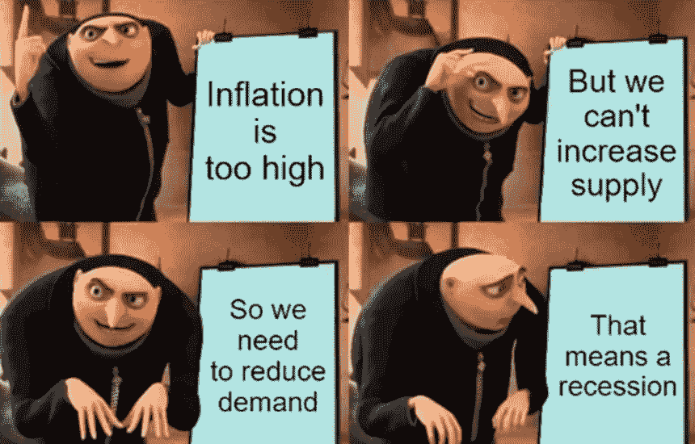

[*来源*](https://www.lynalden.com/june-2022-newsletter/)

有可能是美联储等人精心策划了一场软着陆，金融条件收紧到足以抑制增长，商品被提取出来以平衡需求，而没有彻底的衰退，但是历史先例对他们不利 。

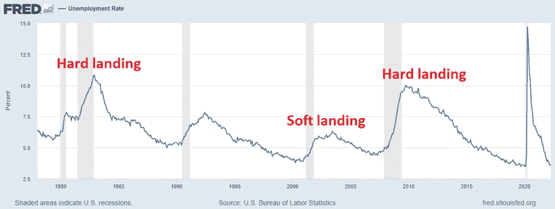

[*来源*](https://noahpinion.substack.com/p/it-looks-like-were-headed-for-a-soft)

如果没有杰伊·鲍威尔(Jay Powell)和他的朋友们娴熟/幸运的执行，这种安排并不好，调整期对许多人来说可能是痛苦的，除非经济体能够重新建立高水平的生产率。从长远来看，我们指望聪明才智来帮助我们摆脱长期超支。这造成了一个非常困难的投资环境，所以你可以期待在一段时间内看到你的投资组合出现不祥的标题和红色。 ***什么会导致这种逆转？***

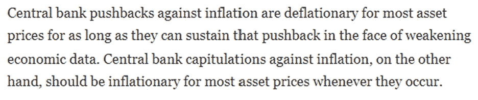

[*来源*](https://www.lynalden.com/june-2022-newsletter/)

更多的刺激可以在更短的时间内重新启动循环 ，但平衡环境政策和政府越来越倾向于通过钱包激励选民反对财政审慎、不断上升的能源需求和地缘政治紧张局势将是一件棘手的事情。资本市场的古老格言“*不要对抗美联储*”比以往任何时候都更加明显，这意味着许多资产将继续和谐交易——向下↓

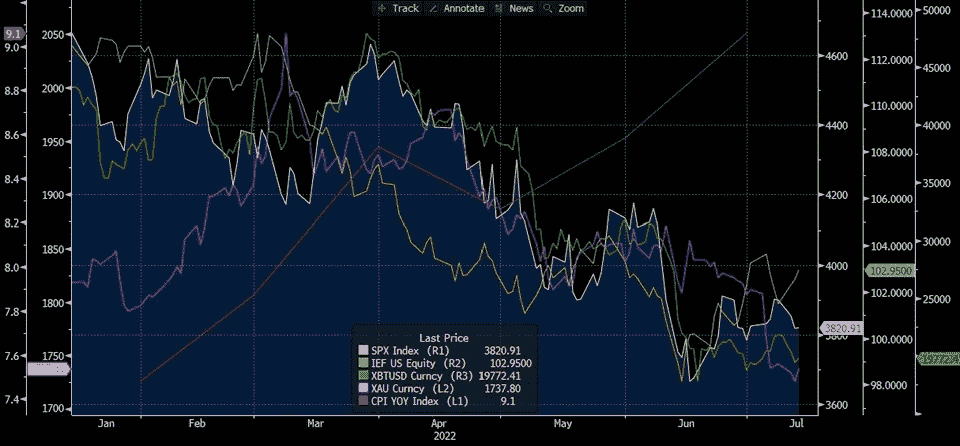

数字资产有许多反对者，最近他们一直在宣扬的一个统一的贬损是，比特币与股票的相关性驳斥了其被纳入投资组合的价值。在这里，重要的是要记住，只要一项资产与其他资产的相关性不够完美，那么将其包括在内就会有一些降低风险的好处。较低的相关性确实放大了这种效应，但是在你的投资中包括 BTC 和其他代币仍然会提供多样化——即使它们相当不稳定。 ***相关性的问题在于，它们并不是恒定的，当市场为收紧货币政策等条件做好准备时，它们往往会随着资产价格下跌而上升****:*

*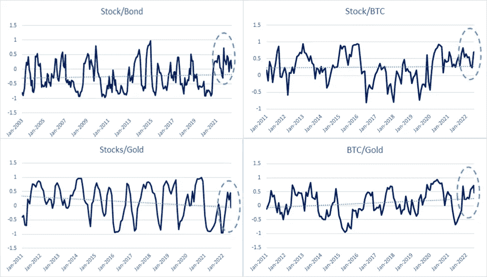*

*股票和债券价格通常不会一起变动，但我们可以看到，在当前的环境下，这种关系并不成立。这并没有消除息票支付对投资组合长期回报的贡献，配置者完全放弃固定收益是不负责任的。比特币也显示出了与股票更强的相关性，就像过去两种资产同时大幅上涨或下跌时的情况一样。就连经常被吹捧为通胀对冲工具的黄金，其走势也更像股票和 BTC。 ***这里的要点是，很多时候资产类别表现出高度相关性，不幸的是，这往往发生在抛售期间。****

*克里斯·科尔从量化的角度研究市场，他写了一系列笔记，阐述了他的论点，即从经典的 60/40 分配转向他所谓的龙投资组合:*

*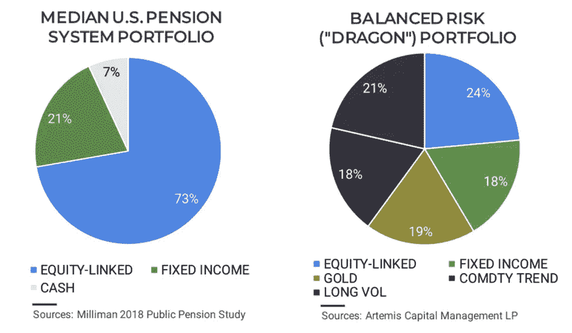*

*你可以(也应该)在这里挖掘细节，但我们将重点关注黄金 19%的股份，科尔认为这是一项重要的资产，因为它在 T2 贬值、政治风险和战争时期保护了财富。“四千年前，出于某种原因，人们认为黄金是有价值的，这个迷因一直流传至今。然而，[正如阿尔托指出的](https://www.altoira.com/wp-content/uploads/2022/06/Alto2022AlternativeInvestingReport.pdf)，比特币是这个城市的新迷因。他们的研究显示，大约 40%的千禧一代拥有数字资产，这一比例高于拥有共同基金的比例，也高于配置个人股票的比例。*

*正如我们所见， ***数字资产也未能幸免于普遍的避险*** 。除了陷入由利率上升推动的“一大交易”之外，该行业还遭遇了两起扰乱市场的特殊事件:*

*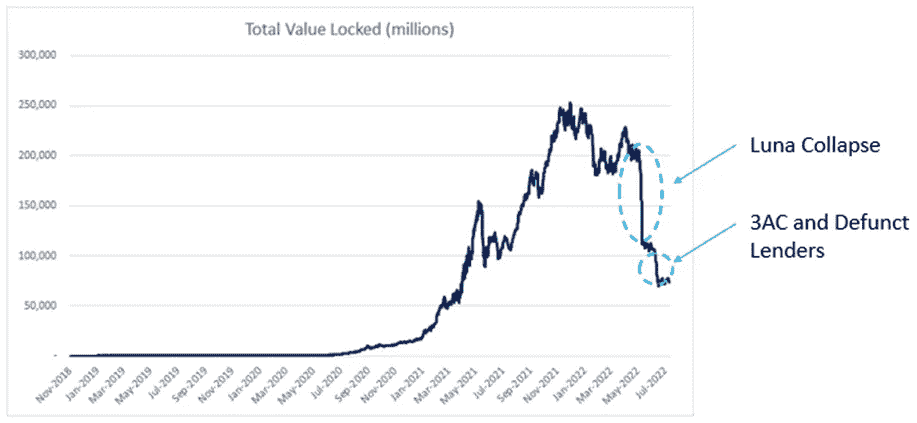*

*在某种程度上，Terra/Luna 灾难是由宏观力量造成的，因为人们预期会出现进一步的损失，因此抛售了他们持有的象征性股票，使得市场变得脆弱，银行挤兑的时机已经成熟。Anchor 的失败暴露了糟糕的风险管理实践和贪婪。这引发了重大的去杠杆化，进一步打压了价格，今天我们发现自己在这里:*

*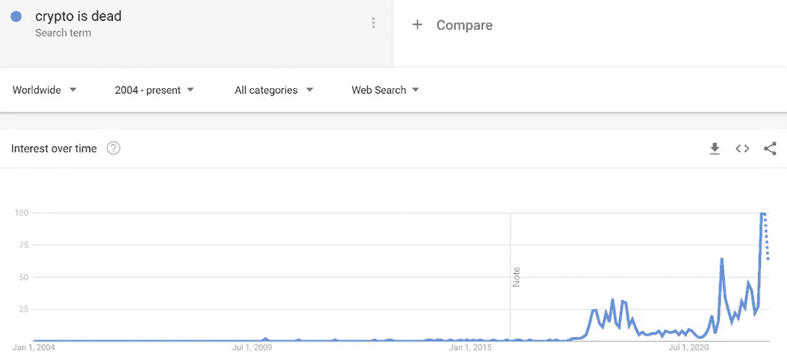*

*[最近谷歌看到了有史以来最多的关于“ *crypto 已死*”的查询，这听起来可能像是不可克服的逆风，但另一方面，它表明该资产类别正变得更加主流。此外，从情绪的角度来看，极度恐惧的发生往往与趋势逆转相一致。在所有负面因素都存在的情况下，暗示拐点即将到来听起来有些疯狂。另外，我不太擅长把握市场时机。当周三的通胀数据出乎市场意料时，数字资产大幅下跌，但此后有所上涨。 ***这可能意味着定位过度向“一个大行业”倾斜，如果没有更多负面催化剂，那么我们可以开始形成一个基础。让我重申一下——我不知道会发生什么。不过，这些迹象很有趣。***](https://trends.google.com/trends/explore?date=all&geo=CA&q=crypto%20is%20dead)*

*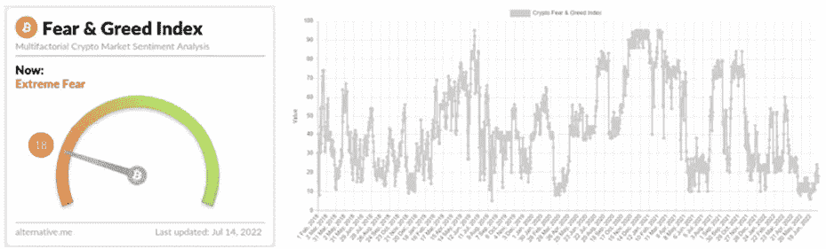*

*[*来源*](https://alternative.me/crypto/fear-and-greed-index/)*

*在每月一期的文章中， [Fidelity 评论说](https://www.fidelitydigitalassets.com/research-and-insights/research-round-july)该组织跟踪的指标可以被视为数字资产持续逐步采用的证据:*

***BTC 超过 0.001 的活跃钱包数量***

*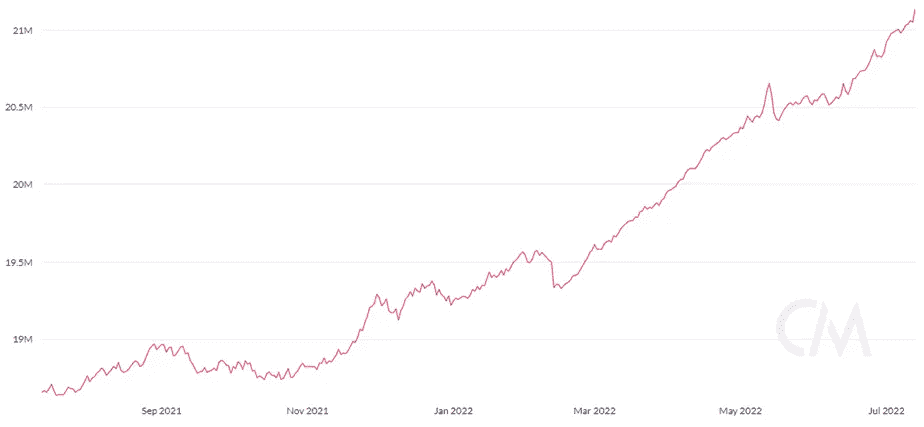*

*[*来源*](https://charts.coinmetrics.io/network-data/)*

*另一个活动领域是以太坊 2s 上锁定的总价值(TVL)的[增长，如果你在跟踪这个领域，这是不应该被忽视的。这些扩展解决方案提供了对 ETH 安全性和分散化的访问，但使用户能够以很小的成本进行交易。 ***我仍然认为，数字资产接受度的下一次飞跃将来自于社交*** ，所以我已经盯上了像 Immutable X 这样的项目。这个 L2 是一个专注于 NFTs 和游戏的](https://thedefiant.io/optimism-layer-2s-surge/) [zk-rollup](https://docs.ethhub.io/ethereum-roadmap/layer-2-scaling/zk-rollups/) 协议。凭借快速交易、低费用以及通过信用卡将资金存入钱包的能力，这一专门设计的项目可能已经充分消除了障碍，因此人们会发现它很容易试用。*

***总值锁定以太坊 2s 层***

*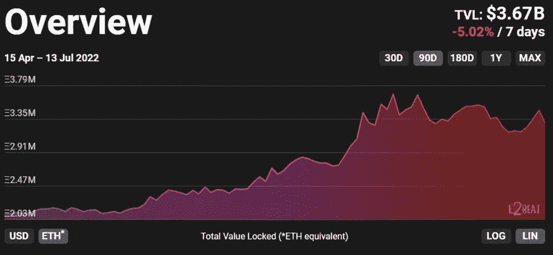*

*[*来源*](https://l2beat.com/)*

*Soo Hugh，苹果电视流行的弹球游戏的创作者，最近接受了 Morning Brew 的采访，提供了一个相关的轶事。当被问及为什么外语内容的消费有如此显著的增长时，编剧回答道:*

*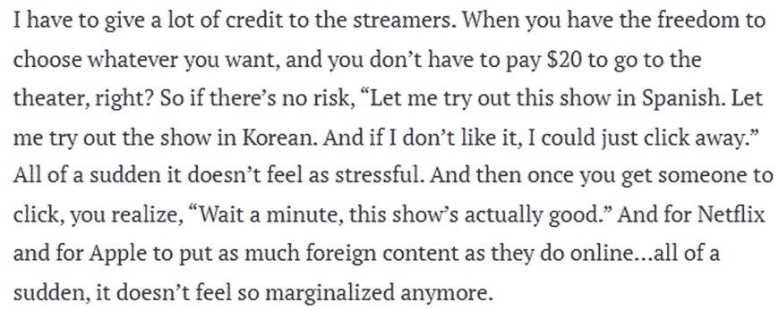*

*这些横幅减少了尝试不同文化媒体的摩擦，当人们尝试时，许多人发现了一些新的东西，他们现在更经常地享受这些东西。似乎有理由假设，随着与数字资产的交互变得更容易/更便宜，更多的用户将被转化，我们现在看到了这种情况发生的迹象。即使当“加密已死”的概念达到前所未有的高度。*

****最终宏观经济逆风会消退，新的周期会重生*** 。正如 Delphi Digital 的 Jason Pagoulatos 最近所说:“*牛市收益的基础通常是熊市中积累的头寸。*“如果你一直在旁观等待参与，我认为我们看到了一些建设性的证据，可以考虑重新参与进来。下图显示了比特币从历史最高水平的下降。它只更新到 6 月 6 日，我们从那里下降了三分之一，但仍然比历史上与 max pain 一致的 80%的下降率高出约 30%。*

*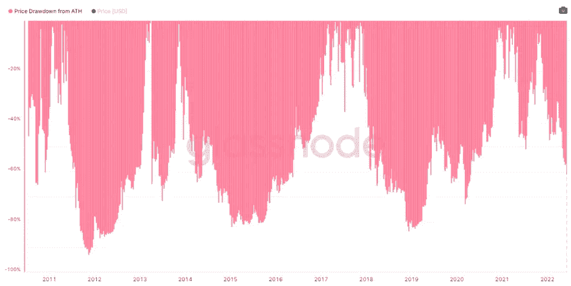*

*[*来源*](https://studio.glassnode.com/metrics?a=BTC&category=&contractExpiration=1680220800&ema=0&m=market.PriceDrawdownRelative&resolution=1w&zoom=all)*

*我不建议任何人今天出去买代币，但让我们回顾一下所涉及的一些主题。中央银行正在给经济降温，许多人认为这将导致经济衰退。因此，现在有一笔大交易正在进行，这可能会抑制随后的抛售，或者在解套时导致反弹。比特币高度相关的时期往往相对较短，因此其未来走势可能会特别增加风险。然而，对数字资产的普遍看法很糟糕，因此很少有人想介入并购买。糟糕的是，采用率继续增长，这驳斥了“ *crypto 已死*”的观点，历史类比暗示我们可能接近底部。当各国央行转向宽松政策(或实现软着陆)时，一个新的周期将拉开序幕。 ***我们将何去何从？****

*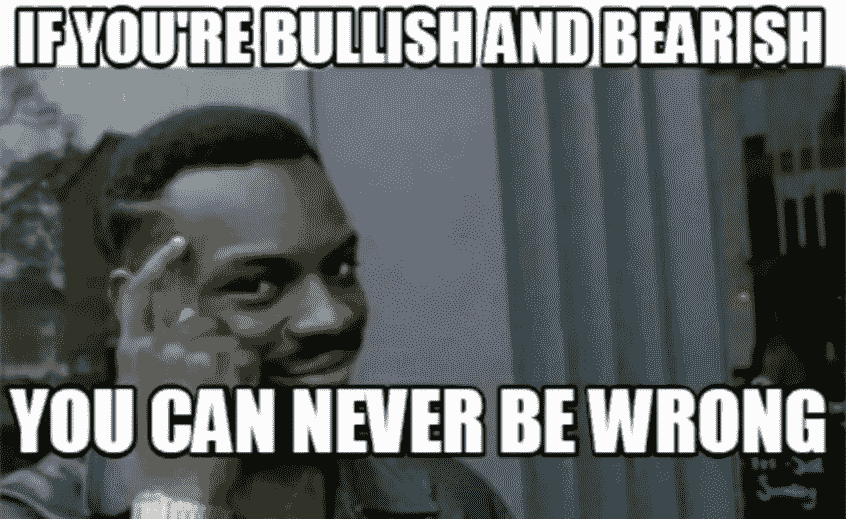*

*[*来源*](https://www.memecreator.org/meme/if-youre-bullish-and-bearish-you-can-never-be-wrong/https:/www.memecreator.org/meme/if-youre-bullish-and-bearish-you-can-never-be-wrong/)*

> *交易新手？尝试[加密交易机器人](/coinmonks/crypto-trading-bot-c2ffce8acb2a)或[复制交易](/coinmonks/top-10-crypto-copy-trading-platforms-for-beginners-d0c37c7d698c)*