# Aquanow 数字潜水:stable coins——躲避经济风暴的避难所？☔——第 23 卷

> 原文：<https://medium.com/coinmonks/aquanow-digital-dives-stablecoins-shelter-from-an-economic-storm-vol-23-14c8f05b5928?source=collection_archive---------21----------------------->

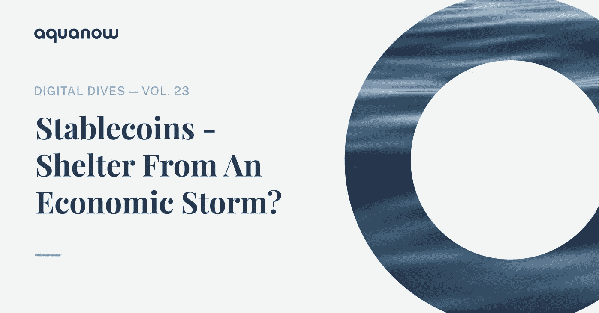

为了吸引我们的注意力，媒体经常通过播放坏消息来吸引我们的损失厌恶。当谈到数字资产时，即使在经济景气时期，说话的人也往往倾向于消极，所以当项目和基金因贪婪或糟糕的风险管理而告吹时，你必须深入挖掘，找到一个乐观的故事情节。正如我们上周讨论的， ***一样，一些社区继续推进他们的计划，不管——或者甚至可能不顾——所有的负面影响。*** 我相信这些建设者可以为下一波采用做出有意义的贡献。至少，它们很好地提醒了我们，为什么为互联网的发展做出贡献是如此之大。除了旨在创造更好的 web3 体验和解锁新用例的独创性之外，随着经济周期的转变，现有技术可能有机会获得更大的采用。当然，除非我们也让它失控。

> 交易新手？尝试[加密交易机器人](/coinmonks/crypto-trading-bot-c2ffce8acb2a)或[复制交易](/coinmonks/top-10-crypto-copy-trading-platforms-for-beginners-d0c37c7d698c)

金融市场的主流说法是，我们已经进入了一个与通胀和利率相关的不同机制。过去三十年来，许多行业的消费价格涨幅一直很低，甚至是负增长，借贷成本也呈下降趋势。

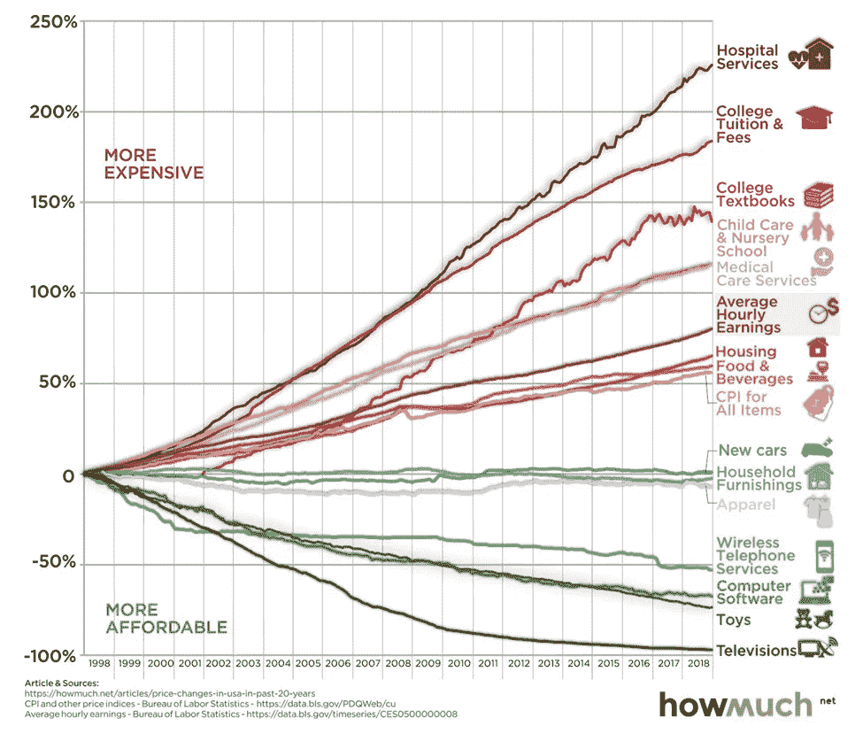

[*来源*](http://www.roseassociates.ca/20-years-of-price-changes-in-the-united-states-selected-consumer-goods-services-wages-january-1998-to-december-2018/)

然而， ***经过三十年不断增强的全球协调，世界现在发现自己正与影响供应链和成本曲线的重大原则分歧作斗争。*** 对新冠肺炎顽固立场的各种政策反应、乌克兰战争、与当选官员不同的央行议程，以及环境问题与能源安全的冲突，导致许多预言家得出结论:全球衰退即将来临。

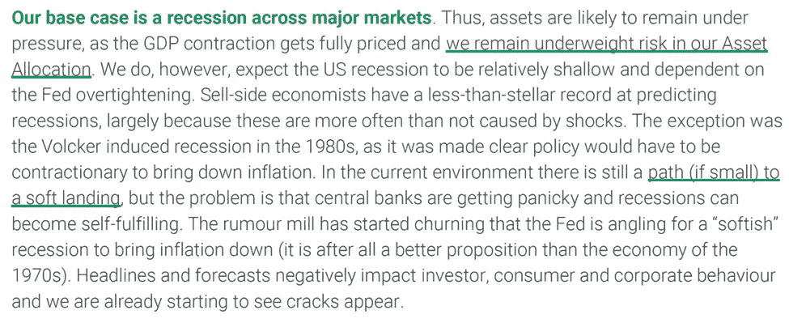

*TS Lombard*

当投资组合经理担心经济疲软即将到来时，他们会增持安全资产，其中最稳健的仍然是美元。对美元需求的上升会压低新兴市场国家的货币，这对这些市场的消费者来说不是好兆头。JP 摩根的策略师在他们的年中展望中描述了这种情况:

> 在这种融资成本上升、可用资本减少的环境下，新兴市场资产通常会承压，从年初至今新兴市场债券外流就可以看出这一点。这进而给需要融资的新兴市场信贷市场、新兴市场货币和新兴市场本币利率带来压力。尽管年初至今回报率大幅下降，但 10 多年来宽松金融环境的大规模平仓所带来的未知因素，仍保持着快速增加 H2 新兴市场固定收益资产的高门槛

如果你是发展中国家的储蓄者，这一切都不是好消息，如果你不够富有，无法进入外国市场，这尤其困难。全球机构可以将投资组合从新兴市场资产重新配置到美国国债等安全港。然而，外国散户投资者转向美元计价资产比听起来要复杂得多。外汇兑换差价很大，许多外汇经纪人收取过高的费用，在某些情况下，这种行为是受控制的或非法的。结果是，10 国集团以外的消费者和企业必须坐视其相对购买力被侵蚀。

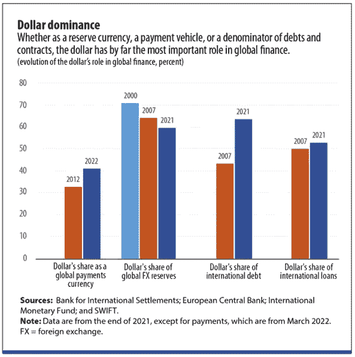

2009 年，当 iPhone 开始获得势头时，苹果公司推广了口号“*有一个应用程序来实现这个目标”。今天，随着数字资产在网络上激增，我们可以将口号修改为“*”。Oof——那是令人畏缩的，但是请容忍我。如果外国储户希望获得作为全球交易媒介的安全储值手段，有许多这样的代币。可以使用计算机或移动设备在交易所(分散或其他)购买美元支持的稳定货币。此外，这些资产可以借出给基于协议的流动性池，以赚取一些利息。不幸的是，由于机构级项目的利率约为 1.5%-2.0%，考虑到全球通胀趋势为高个位数，实际回报仍将为负，但这似乎仍是摩根大通办公桌描绘的情景的更好替代方案。**

如前所述，来自国外的富有投资者将有更多的机会通过经纪公司、公司结构等在国内市场之外进行投资，但一般的散户储蓄者可能不会。除了疫情导致的经济关闭之外，稳定的货币还没有出现全球衰退，但是如果经济增长确实转为负值，它们可能会得到广泛认可。COVID 是推动 Axie Infinity 用户增长飙升的重要催化剂，因此 ***我想知道我们是否会看到 stablecoin 的采用有意义地增加，因为较小的投资者现在可以在资本外逃期间获得美元计价的资产以保护他们的财富。***

[这篇 HBR 笔记](https://hbr.org/2015/12/what-is-disruptive-innovation)深入探讨了“*颠覆性创新*”——这是一个经常被过度使用的流行语，用来描述任何一个行业被撼动、先前成功的在位者被绊倒的情况。 ***真正的颠覆性创新源于新的或低端的细分市场。此外，在质量达到大众期望的标准之前，颠覆性创新不会成为主流。这些特征允许技术发展追随者，而现有者继续关注更有利可图的消费者群体，他们认为颠覆者是劣等的。与此相关的是创造性破坏的概念，它最初是由奥地利经济学家[约瑟夫·熊彼特在 1942 年](https://www.investopedia.com/terms/c/creativedestruction.asp)提出的，当时他描述了一个“*工业突变的过程，这个过程不断地从内部革新经济结构，不断地摧毁旧的结构，不断地创造新的结构。”****

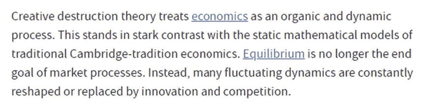

***在新兴市场家庭储蓄的背景下，稳定信贷和违约贷款有没有可能被视为银行业和财富管理的颠覆性创新？*** 看来必要的条件已经具备。发展中国家的许多零售储户甚至无法获得银行服务，更不用说全球资产了，因此他们代表了一个现任者不感兴趣的“*低端市场”。Stablecoins、移动钱包和支付基础设施有潜力为这一此前被忽视的消费者群体提供服务。*

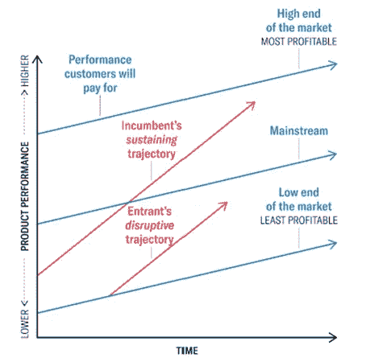

数字经济的入口和出口很可能会造成一个问题，即经常将纸币转换成稳定的纸币，但请考虑以下汇款统计数据:

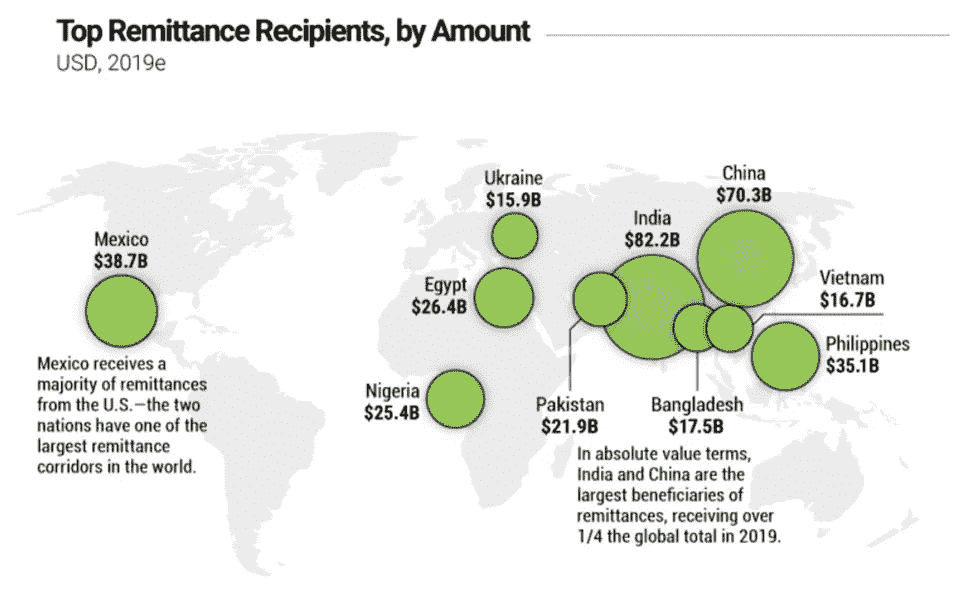

[*来源*](https://www.visualcapitalist.com/global-remittance-flows/)

在上述许多国家中，外国零售支付流量占 GDP 的 5%以上，这一点非常重要。资本从发达国家流向不那么幸运的国家的家庭，会受到与传统支付网络相关的摩擦，这意味着支付通常需要时间和高昂的成本。然而，区块链的技术有潜力极大地改善货币在世界范围内的流通方式。让我们以乌克兰战争为例:[据估计，大约 30%的用于资助国防努力的信用卡/借记卡捐赠被取消](https://www.coindesk.com/layer2/2022/06/10/where-the-coins-go-inside-ukraines-125m-wartime-fundraise/)，因为几家"*当地银行对转移到乌克兰的资金进行了特别审查*，所以交易被拒绝。菲亚特仍然是捐赠资本的主要来源，但 crypto 占了近 40%的捐赠，其与更广泛系统的更大集成已被证明是有帮助的:

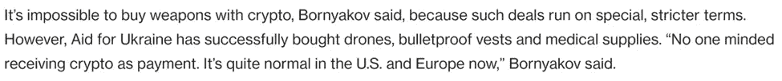

对于 70%成功的传统支付来说，一个挥之不去的问题是转账的价格。[世界银行估计，向乌克兰汇款的成本约为 6.5%](https://data.worldbank.org/indicator/SI.RMT.COST.IB.ZS?locations=UA) ，预计今年[汇款额将接近 200 亿美元](https://www.aa.com.tr/en/economy/remittances-to-ukraine-expected-to-rise-22-due-to-war-world-bank/2585363)，交易费用将大幅节省。随着发达国家越来越担心即将到来的衰退，捐赠已经开始减少。数字资产熊市也无助于形势。每一个百分点的节约都意味着另外 2 亿美元的援助，因此一个成本更低的跨境网络将大有作为。 拥有健全的 KYC 控制但加密经验有限的各方甚至可以使用 Aquanow 这样的中介来避免管理直接的钱包交互。这里有一个说明性的例子:

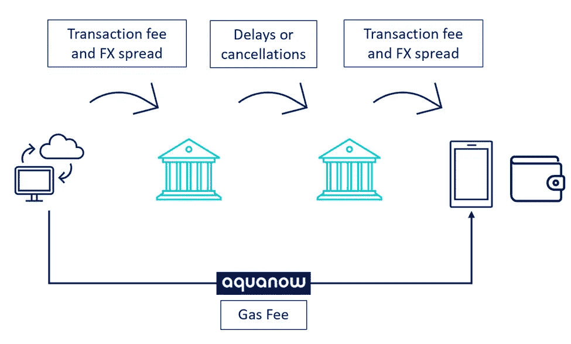

这只是一个可能的使用案例，但是潜在的节约已经达到数亿。你可以想象，如果整个价值约 1 万亿美元的市场被打乱，财富转移的增加会带来怎样的影响。

如果汇款流开始有利于稳定的货币，那么当地人之间用来结算债务、购买商品或支付服务费用的代币转账似乎将变得很常见。假以时日，在数字货币和纸币之间流动的网络可能会随之诞生。也许发达国家的家庭成员甚至会要求直接以数字货币形式接收他们的工资，以进一步简化这一过程？这样做的好处是，由于交易成本较低，不太富裕社区的家庭将保留更多从海外获得的资金，这些支出的购买力将得到保护。任何盈余都可以作为以美元计价的储蓄持有，甚至可能安全地投资于 DeFi。[国际货币基金组织在本月早些时候的一篇论文中讨论了这样的未来:](https://www.imf.org/en/Publications/fandd/issues/2022/06/enduring-preeminence-eswar-prasad)

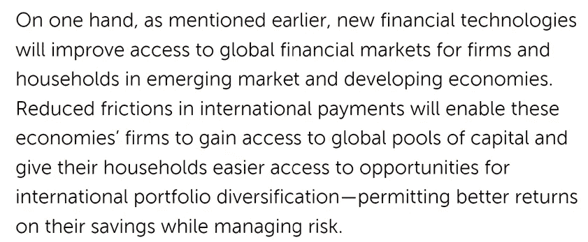

遗憾的是，这不是万灵药。如果外国对美元的使用大幅增加，那么可能会产生进一步的不稳定影响，并可能加剧新兴市场央行发行的货币的外汇和利率波动。然而，在全球经济中更多地使用稳定的货币似乎确实会带来切实而直接的好处，这引起了政策制定者的注意。 事实上，[我们知道他们已经在研究如何在不断发展的现实中操作，所有的钱都变得可编程](https://www.bis.org/publ/arpdf/ar2022e3.htm)。然而，围绕数字资产生态系统的负面报道可能意味着监管机构将技术纳入内部，并使用自己的封闭系统构建数字经济:

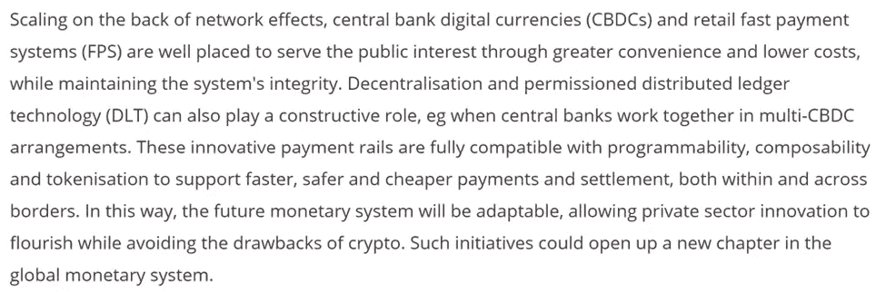

克莱顿·克里斯滕森(Clayton Christensen)对颠覆性创新的研究的一个关键原则是，现有企业要么看不到斗志昂扬的初创企业的到来，要么干脆忽视它们，专注于利润更高的客户。尽管如此，监管者和[嵌入式高管](https://blockworks.co/jpmorgan-exec-payments-systems-are-the-future-of-fintech/)似乎已经读懂了《创新者的困境》，因为 ***他们现在都在关注数字资产领域发生的事情*** 。这项技术具有重塑社会的巨大潜力，但不幸的是，贪婪和无知导致基层社区可以将他们的创新复制/粘贴到传统结构上。无论是哪种情况，数字资产的创造性破坏似乎正在到来。谁知道呢，也许更大的疏忽会拯救我们自己？

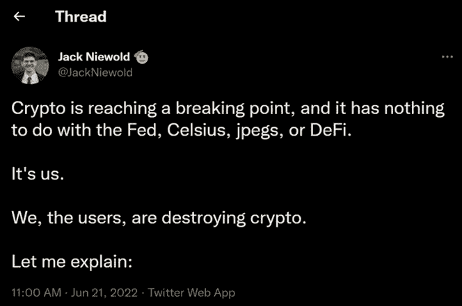

[*来源*](https://twitter.com/JackNiewold/status/1539307339928457217)

关于数字资产如何在慈善筹款中发挥重要作用以及 web3 如何额外融入社会事业的其他方式的更充分的讨论，[查看本文](https://drive.google.com/file/d/1GrZvcO2VgDdq33gWUCSIKelHwFY8jZFn/view)。

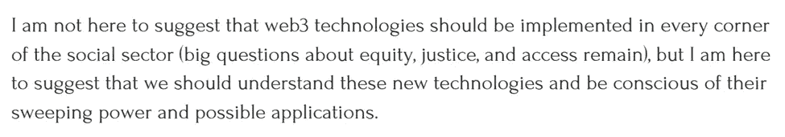