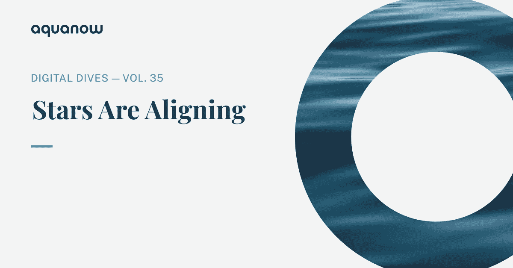
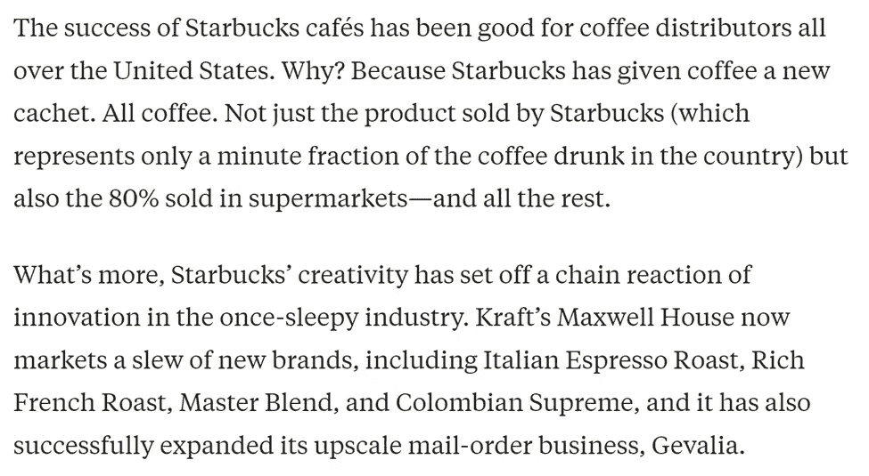
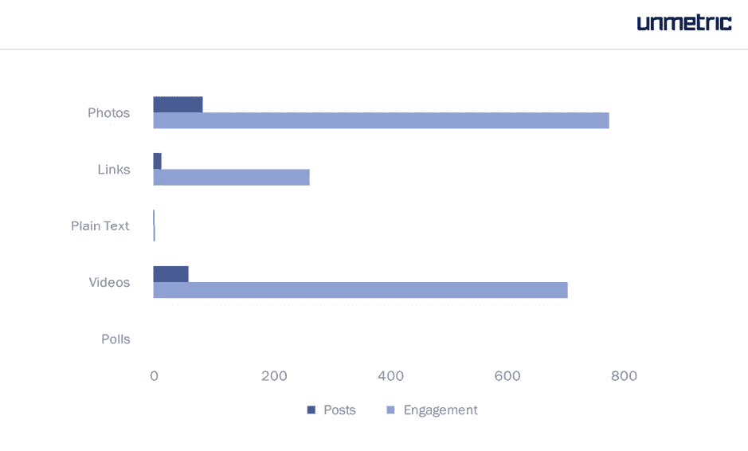
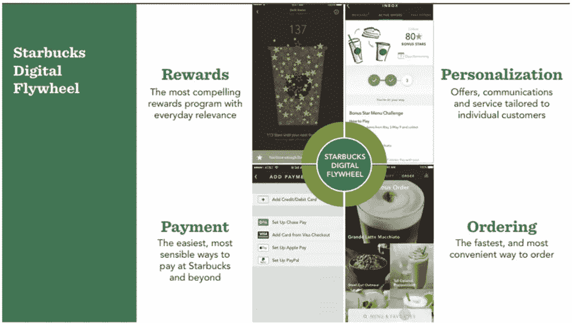
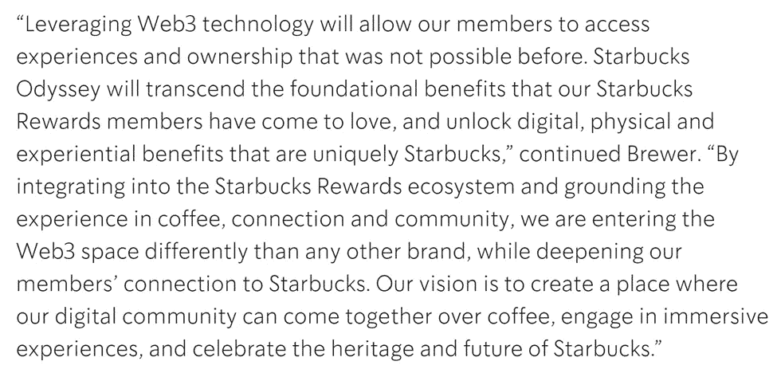
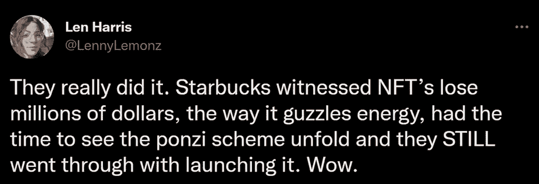
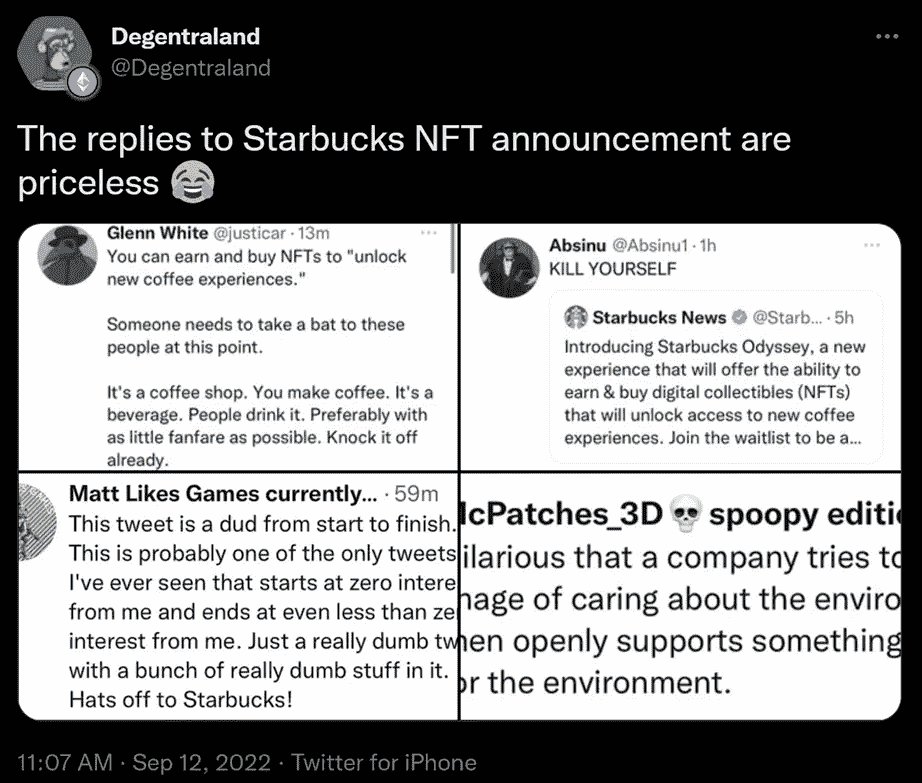
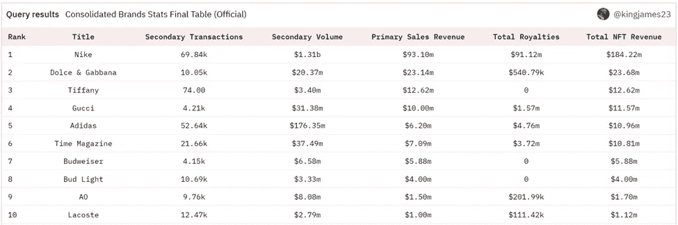

# Aquanow 数字潜水:恒星正在排列——第 35 卷

> 原文：<https://medium.com/coinmonks/aquanow-digital-dives-stars-are-aligning-vol-35-22e03e28b7d0?source=collection_archive---------39----------------------->

如今通货膨胀这个话题已经无法回避了。无论你走到哪里，人们都在讨论物价越来越高，以及利率上升会减缓这一速度。市场动荡不安，由 60%股票和 40%债券组成的传统投资组合正步入大萧条以来最糟糕的一年，因为这两种资产都经历了损失。然而，在某些情况下，较高的消费价格值得称赞。

世纪之交,《哈佛商业评论》发表了一篇名为“T2 星巴克效应”的文章，详细描述了该公司如何在北美重塑咖啡。霍华德·舒尔茨引进了他度假时参观过的意大利咖啡馆的温暖和艺术性，以提供高质量的产品，但价格很高。在 20 世纪 90 年代，只有 3%的咖啡价格高于品牌价值，但是当 HBR 咖啡上市时，这个数字上升到了 40%。

支撑星巴克提高价格能力的是 ***一个强大的品牌，它建立在对客户的一致性和同情心之上*** 。在他们被商界视为合法的干扰者后不久，在网络泡沫破裂的末端，该公司在其舒适的商店网络中推出了免费无线网络。管理层理解顾客希望保持联系，这种环境鼓励他们在购买后留下来。顺应客户对可持续发展的偏好，该公司开始从道德上采购咖啡豆；自 2015 年以来，99%的产品已通过认证。

世界进一步推进到数字时代，星巴克展示了利用社交媒体与客户建立更深层次关系的非凡能力。他们在 Instagram 和推特上分别有 1800 万和 1100 万粉丝。即使是[南瓜拿铁调料](https://twitter.com/TheRealPSL)也有 88K 粉丝。当需要时，渠道管理客户服务问题，小组通常在几小时内回复帖子。2017 年，该公司仅在脸书发布了 158 次，但增加了 71 万名新粉丝。他们生成的内容获得了巨大的参与，这支持了这样一种观点，即 ***公司与客户有联系，知道如何交付他们想要的东西。***

[*源*](https://blog.unmetric.com/starbucks-social-media-strategy)

该组织的“*数字飞轮*”战略利用了基于云计算的力量和机器学习的进步来丰富客户端体验 ***，同时抵御来自潜在精通技术的颠覆者*** 的竞争。该架构允许收集巨大的数据存储库，可以对其进行分析，以根据购买行为提供独特的报价。它还允许管理人员更有效地管理库存和商店位置。虽然最近围绕咖啡师的就业条件存在一些争议，但管理层表示[他们很快也可以使用该应用程序平衡工作量](https://www.reuters.com/business/retail-consumer/starbucks-exploring-tech-ease-high-us-demand-worker-stress-2022-09-13/)。

[*来源*](https://www.zdnet.com/article/starbucks-to-step-up-rollout-of-digital-flywheel-strategy/)

当星巴克第一次以酷炫的音乐、温暖的氛围和舒适的座位为特色的咖啡馆在现场引起轰动时，他们试图以“*第三地*”的身份融入人们的生活——在工作和家庭之间，人们可以放松、社交和舒适。今年五月，该组织发表了一篇博文，解释了他们打算如何推广这一想法，因为我们倾向于在网上与他人联系。有趣的是，这封信是首席营销官 Brandy Brewer 和顾问 Adam Brotman(前星巴克首席数字官兼全球零售业务副总裁，现任 web3 忠诚度计划顾问 [Forum3](https://www.forum3.com/) 的联合创始人)写的。

上周，这个消费巨头推出了[星巴克奥德赛的等待名单](https://waitlist.starbucks.com/#/landing)——“T20”将为会员提供赚取和购买数字收藏邮票(NFT)的能力，这些邮票将解锁新的沉浸式咖啡体验该项目旨在创建一个社区，成员和员工可以使用 web3 相互交流。

嘣。

从这个有意义的公告中有几个重要的收获，我认为它将成为传统机构的最佳实践，这些机构希望实现数字资产 。首先，这个程序使用的是 web3 rails，但是 ***它们为不熟悉这个领域的用户弥合了鸿沟*** (更多[在这里](https://aquanow.medium.com/aquanow-digital-dives-designing-web3-for-chasm-crossing-vol-10-3e9cc3c32d43))。为避免混淆，NFT 被称为“*邮票。*“当他们驻留在多边形区块链上时， ***用户不需要知道他们甚至有一个钱包*** 。奥德赛会员可以通过在商店的“*行为”或参与“*旅程*”(互动和教育性游戏和挑战)来获得邮票。某些限量代币将可通过传统渠道在 ***购买。*** 还会有交易的市场。*

该项目的另外两个重要特征是现任者正在慢慢了解新兴技术如何与他们顾客至上的精神相结合。至关重要的是，星巴克选择了 ***一个在他们的行业有经验并且对 web3*** 有深刻了解的合作伙伴。前者让高管和董事会确信，即使象征性的价格大幅下跌，NFT 的活动已经慢如蜗牛。后者有助于组织与时俱进，在快速变化的环境中保持敏捷。

新引入的技术往往会让许多支持现状的人感到困惑，这可能会导致内部摩擦，并让其他利益相关者感到沮丧:

[*来源*](https://twitter.com/LennyLemonz/status/1569557958102597634)

多边形链使用了利害关系证明共识机制，因此这位星巴克员工的能源论点是被误导的。坦率地说，考虑到数字资产领域的大肆宣传和贪婪，她没有意识到客户参与和潜在的社会影响是可以理解的。这是一种情绪反应，而且她并不孤单。

在一位值得信赖的顾问的全面研究和支持的帮助下，该公司已经评估了启动这样一项计划的潜在风险——你可以在企业沟通中看到对潜在阻力的深思熟虑。他们可能预料到一定程度的阻力，然后权衡潜在的好处。

星巴克的忠诚计划在美国有大约 2700 万参与者，因此如果该项目执行得好，那么 ***奥德赛可能是 web3 采用*** 的一大胜利。我花了很长时间详细描述该公司以前的成功和一致性，因为它与客户互动有关，以说明 ***他们很有可能会搞定这个*** 。这样的结果将使数字资产生态系统和星巴克股东互惠互利。历史上，公司赞助的 NFT 项目有相当大的差异，但收入机会是巨大的。以下是前 10 名的列表:

要看到奥德赛成功的证据还需要一段时间。也就是说，如果你是一家考虑数字资产的机构的高管，并且同意星巴克的方法是合理的，[请联系](https://www.aquanow.io/contact)。 ***Aquanow 拥有一批经验丰富的行业专业人士，他们拥有支持这些新兴金融用例的丰富经验。***

> 交易新手？尝试[加密交易机器人](/coinmonks/crypto-trading-bot-c2ffce8acb2a)或[复制交易](/coinmonks/top-10-crypto-copy-trading-platforms-for-beginners-d0c37c7d698c)