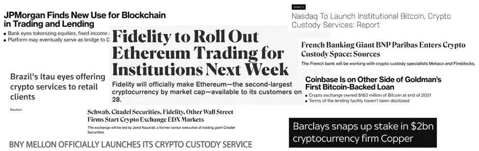
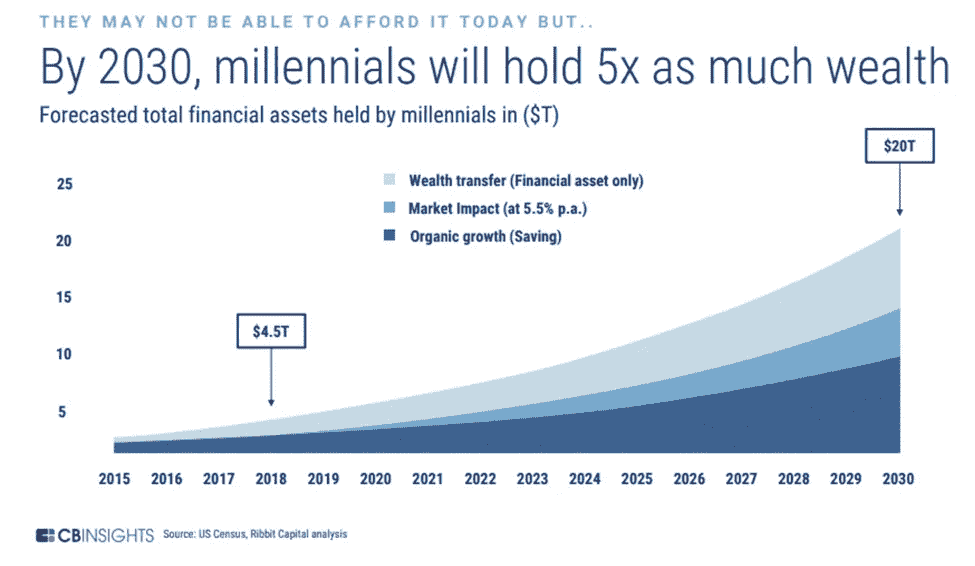
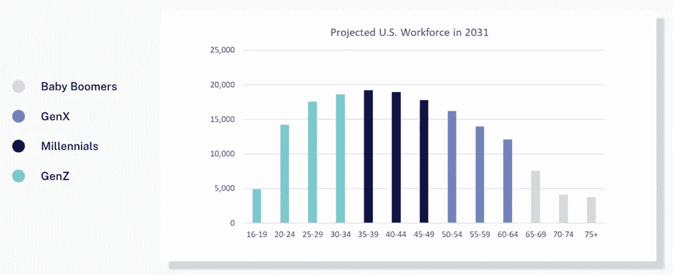
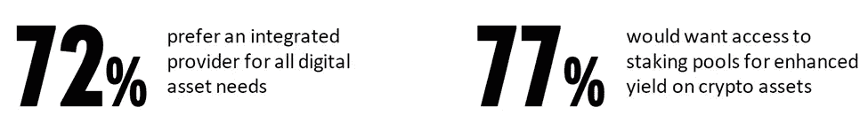
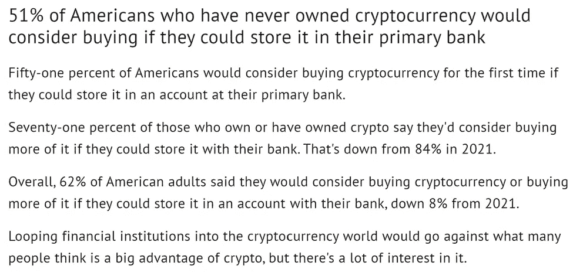
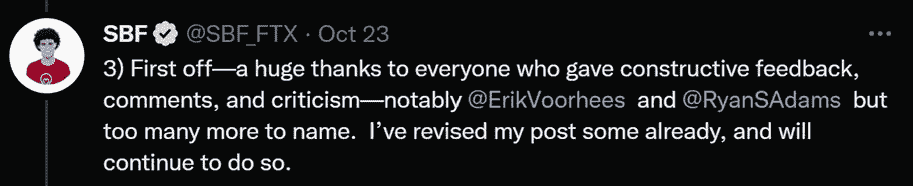
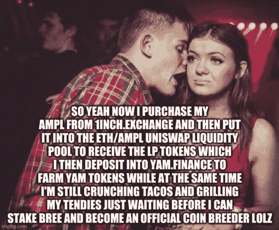

# Aquanow 数字潜水:小心了，第 38 卷

> 原文：<https://medium.com/coinmonks/aquanow-digital-dives-watch-out-now-vol-38-e52b1dadddac?source=collection_archive---------21----------------------->

在我们开始之前，快速提醒一下，作为一个市场呆子，我的思想倾向于关注相关的事情。然而，大多数人可能对 web3 的财务方面不感兴趣，因此，与社会创新相比，web 3 的影响相对较小。话虽如此，追求利润的投资公司正大举进军这一领域:

鉴于数字资产市场在 2022 年的表现如此糟糕，上述标题非常引人注目。在这种情况下，一个老牌企业要进入一个新兴资产类别，需要坚定的信念和巨大的支持，那么是什么鼓励了这些高管呢？

***这一切都归结于人口统计学。***

千禧一代和 GenZ 对世界机构的现状不太满意。近年来，这些群体中一些更有激情的人一直在积极反击。对他们不信任中央集权的动机的评估超出了我们的讨论范围。对于本周的论文来说，重要的是随着时间的推移，这些年轻一代的价值体系变得越来越重要，而且变化的速度将会加快。

[*来源*](https://www.edisonpartners.com/blog/yieldstreet/wealth/transfer/)

一个可能在未来几年加速变化的重要现象是，这些年轻人的祖父母、父母将在未来 20 年仅在美国就留下约 84 万亿美元的遗产。此外，到 2031 年，千禧一代和 GenZ 将主导劳动力市场:

当你将上述趋势与 ***银行业关系趋向于粘性*** 的概念，以及 ***当今年轻人已经接受数字资产*** 的事实结合起来，那么就很清楚为什么这么多现任者正在投资于他们的相关能力。

为了应对巨大的需求，[纽约梅隆银行最近推出了面向机构投资者的数字资产托管解决方案](https://www.bnymellon.com/emea/en/about-us/newsroom/press-release/bny-mellon-launches-new-digital-asset-custody-platform-130305.html)。他们的研究人员发现*“大多数公司目前都在积极参与各种各样的数字资产，特别是专注于标记化、标记和访问 DeFi。*”有趣的是，这些 ***在任者也偏爱与一体化(即中央集权)的政党*** 打交道。

分散金融被吹捧为银行世界非中介化和金融民主化的一种方式。在 DeFi 目前的状态下，这两种说法都是严重的夸大其词，但一些正在进行的相关实验有望成功，区块链的金融应用肯定会导致我们与金钱互动的模式转变。 ***如果你是一名银行高管，那么你不希望看到自己的业务被边缘化，并在今天的中央集权机构中表现出色，因此即使你对数字资产的前景感兴趣，你也不太可能像迄今为止人们想象的那样热衷于 DeFi。***

金融公司被 crypto 所吸引，因为它有显著的人口统计学优势和潜在的新回报来源。然而，他们对权力下放相对不感兴趣。

西方政府最近发布的监管公告有一些统一的因素。也就是说:新的法律需要尽快出台，无论通过哪项立法，都必须在 KYC/反洗钱与促进创新之间取得平衡，无论未来的规则如何决定，都必须维护金融稳定。

如果你是当今美国的监管者，你会如何应对这种情况？也许一个好主意是让银行有能力为客户生成数字钱包，并让他们承担合规的责任。 这几乎肯定会限制向您的选民提供的“ *DeFi* ”申请的数量，但由支持银行批准的申请可能被视为安全的，甚至可能带有保险。其结果可能是[到目前为止，船上许多人一直心存疑虑](https://www.fool.com/the-ascent/research/study-americans-cryptocurrency/)(同时可悲地继续避开没有银行账户的人)。此外，你们国家的公民是世界上最富有的人之一，因此，许多利润最大化的协议会找出如何满足银行进入利润丰厚的市场的需求，这似乎是合理的。

一些群体可能会离开这个国家，因为上述方法违背了他们的核心价值观，即权力下放。毕竟 ***比特币矿工都是匆匆逃离中国的吧？*** [是的，但他们并没有离开很长时间……](https://www.coindesk.com/layer2/2022/05/22/china-cant-seem-to-stop-bitcoin-mining/)有着庞大的消费文化和几个志同道合的盟友，整个行业背弃它是不太可能的。回到我的评论，即 web3 的社会影响可能是最深远的，如果大量国内用户可以通过类似 Chase 或美国银行钱包的东西访问他们的应用程序，那么那些在奥斯汀、纽约、加利福尼亚和怀俄明州建设非金融项目的人会留下来，这似乎是明智的。

***说清楚一点，这不是我希望会发生的*** 。然而，认为立法者不会因为害怕失去创新而独立行动的想法是错误的。上周，FTX 创始人萨姆·班克曼-弗里德在[发表了一些关于数字资产可能监管的想法，包括分散金融](https://www.ftxpolicy.com/posts/possible-digital-asset-industry-standards)(你可以在这里 — 21:38)收听 [DeFi 部分后，Twitter 上一片沸腾。在情绪激动的加密推特上发布如此两极分化的东西必然会引发争议，这个帖子引发了相当多的反馈，其中大部分是负面的，但也有一些很好的反馈。](https://www.coindesk.com/podcasts/the-breakdown-with-nlw/the-debate-around-sbfs-regulatory-ideas/)

[*来源*](https://twitter.com/sbf_ftx/status/1584095445185622016)

在 TradFi 工作了 15 年后，我的观点可能会受到影响，但对我来说，如果我们希望从实验走向实施，DeFi 必须做出改变。今天的年轻人在经济和社会上的重要性日益增长，但他们还没有掌权。 ***采用更分散的方式将是一种成功，这方面的势头可能会随着时间的推移而增强。*** ***或者，用协议迅速取代现有协议所造成的混乱将是如此之大，以至于它可能会彻底破坏金融民主化的承诺。***

从短期来看，DeFi 的最佳行动方案是继续与政策制定者接触，希望取得比我上面提出的更好的结果。展望未来， ***我们需要找到更好的安全解决方案*** 。理解审计代码不是一件容易的事，也许一些致力于在华盛顿游说的资金可以用来教育建筑商如何评估智能合同的可利用性，或者激励 bug 奖金。 ***用户界面也需要一些工作*** 。诚然，许多银行平台也好不到哪里去，但 FinTech 也紧随 DeFi 之后。与前者相比，他们在年轻人中有更好的声誉，但仍保持同样的集权。最后， [***我们需要抛弃德根***](https://www.aquanow.io/resource-posts/aquanow-digital-dives-ditch-the-degens-vol-29) 。正如 Joel John 指出的那样，我们并没有看到太多的创新，因为你可以推出相当于“ *x，for y new chain* ”的东西，人们会蜂拥而至以获得短期回报。年轻的建筑商被鼓励去轻松赚钱。

[*来源*](https://www.reddit.com/r/cryptocurrencymemes/comments/i893ij/new_yield_farming_meme/)

有些团队仍然致力于制造人们想要使用的产品，因为他们提供了更好的东西，而不是一周一次的产量提升。这样的创新将有助于让世界相信为什么权力下放很重要，但是变革需要时间。正如甲壳虫乐队所说的那样。你很难下咽。

***在 Aquanow，我们帮助机构释放数字资产的潜力*** ，因此，如果您或您认识的任何人正在考虑这项功能，那么[请联系](https://www.aquanow.io/contact)。我们很高兴利用我们的专业知识来帮助您超越。

如果你想为 web3 运动做贡献， ***Aquanow 正在寻找好奇和积极的人加入我们的团队*** 。*请随意直接联系*或[查看此处的当前空缺](https://www.linkedin.com/jobs/search/?f_C=33286432&geoId=92000000)。

> 交易新手？试试[加密交易机器人](/coinmonks/crypto-trading-bot-c2ffce8acb2a)或者[复制交易](/coinmonks/top-10-crypto-copy-trading-platforms-for-beginners-d0c37c7d698c)