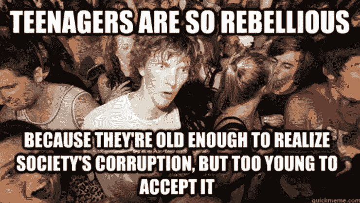
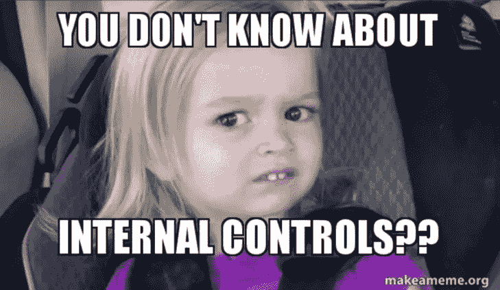
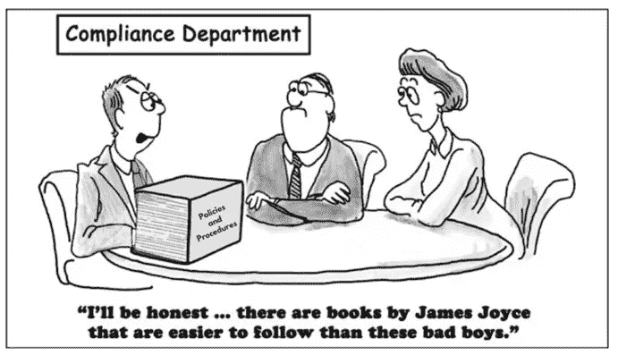
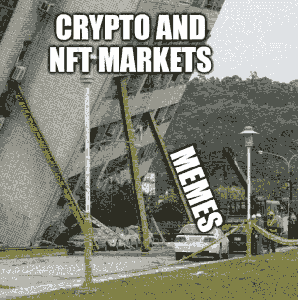
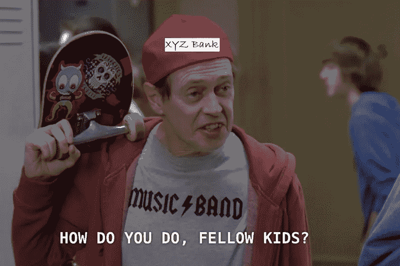

# Aquanow 数字潜水:我还能说什么？第 39 卷

> 原文：<https://medium.com/coinmonks/aquanow-digital-dives-what-more-can-i-say-vol-39-abf3013094e2?source=collection_archive---------36----------------------->

crypto 中最重要的叙述是，年轻一代正在成为主导的消费者力量，他们已经采用了数字资产。对中央集权机构的不满推动了早期对区块链金融的接受。不幸的是，2022 年，数字资产生态系统中的几个中央集权方将以类似于次贷危机中倒闭的银行的方式崩溃。这是否会破坏千禧一代和 GenZ 将成为大规模采用的基础的论点？

我不这么认为。比特币的早期采用者一直在寻找一种替代的金融系统，但一种更具活力的系统已经出现。Web3 将区块链技术的应用扩展到了金融之外，许多充满激情的开发者将继续开发。此外，将不会有政府救助，当局已表示愿意监禁被认为是坏演员的加密。因此，我们可以期待比大金融危机后更多的问责。最后，年轻人倾向于喜欢对他们有害的东西(酒、香烟等)。).

过去一周的事件无疑会给数字资产生态系统留下印象。

让我们从历史类比中了解一下当前的形势会如何发展。

19 世纪中期，自由银行不受联邦监管。这些集团仍然在州一级受到监管，但审计员经常超负荷工作，所以问题经常从缝隙中溜走。这些野猫银行之所以如此命名，是因为它们位于如此偏远的地区，只有动物才能进入。

在那个时候，印有银行名称的纸币将作为交换媒介流通。它们代表了金融机构的负债，可以兑换成黄金/白银(有时甚至是成袋的面粉)。然而，抵押品很少([或投资于高风险的国家债务](https://www.alt-m.org/2015/07/23/real-pseudo-free-banking/))，大多数贷款人都破产了。最终，大量广为人知的欺诈导致公众对国家银行体系的充分支持。随之而来的是对狂野西部的驯服。

1863 年和 1864 年的国家银行法案建立了联邦金融体系，并将商业银行置于美国政府的监管之下。国有银行有更高的资本要求，并且不允许贷款超过其持股的 10%，这提供了额外的安全性。

今天我们普遍认为银行是可靠的，这是因为监管。 利用交易所或集中借贷平台获得加密资产的人应该意识到，他们的资金不如储蓄账户中的存款安全。然而，负责监管这些资产的 ***受托人应该受到高标准的关注。***

不幸的是，在恐惧或贪婪的影响下，人类可以为各种行为辩护，所以就像我们看到的野猫银行一样，让一些中央机构监督行业并执行立法通常是明智的。这有其自身的后果，如成本上升、监管俘获、官僚效率低下等。但这意味着避免因渎职而血汗钱蒸发的情况。

我认为，继 2022 年一系列高调崩盘后，数字资产领域也将面临类似的命运。Crypto 一直在通过教育和参与获得监管机构的认可。然而，本周丑闻的性质削弱了 web3 的游说努力，并可能煽动立法者支持严厉的监管。在这一点上，大多数公众会赞成这样的结果，而这个行业也没有太多的道德制高点来争论。

2008 年金融危机后，多德-弗兰克法案(以及国际上的巴塞尔协议 III)开启了银行监管的新时代。尽管资本市场和投资银行部门曾是前几年的增长引擎，但这些部门开始萎缩。现在，一家典型银行的招聘公告板上，风险和技术部门的职位空缺数量不成比例。前者是不言自明的，但对于后者，重要的是要记住，现代金融机构的大部分 it 工作涉及保护数据、监控员工和模拟风险，因此这两项职能有共同的目标— ***识别和管理对令人垂涎的资本缓冲的任何威胁。***

我在 TradFi 工作期间，很明显银行业正在采纳一种风险管理文化。在次贷危机之前，该行业受到了严格的监管，但审议的级别大大提高了。这种变化是显而易见的，但并不需要公司原则的大规模转变。相比之下，似乎大多数加密本地人在理念上不同意 KYC/反洗钱报告或获得作为经纪交易商经营的许可证等想法。因此，当即将出台的政策出台时，对许多人来说，这可能感觉像是一场生存危机。 不仅如此，[依从也很难](https://www.paymentgenes.com/all-about-payments-videos/why-neobanks-fail-to-meet-aml-requirements)。

[*来源*](https://twitter.com/C_R_Concepts/status/1343579203741110276/photo/1)

对我来说，数字资产空间的细微差别需要一种全新的方法来制定规则。看起来工业界和立法者之间正在进行一场平衡的对话，这将保留一定程度的自由。那已经不在讨论范围内了。最近的头条新闻和戏剧引起了美国司法部和世界各地监管机构的注意。如今，Crypto 还不足以引发系统性风险，但官员们知道它将继续增长，他们希望获得更直接的影响。

对于最近宣布进入数字资产领域的所有现任金融机构来说，本周的灾难是个好消息。他们精通监管，与政策制定者有着长期的关系。当谈到为其他 TradFi 公司推出解决方案时，他们说同样的方言，更容易理解，这将更容易确保业务关系，并将数字资产功能带给大众。

***那 buildooors 呢？*** 可悲的是，即将到来的监管将给这个领域的创造力和快速创新增加摩擦。技术的巧妙之处在于，许多最酷的项目都是从爱好开始的，所以总会有聪明人在边缘地带进行实验。另外，web3 最有趣的方面不是金融。社交应用应该相对不受影响。然而，涉及经济资产的项目如果希望扩大规模并利用机构资本，则必须遵守 KYC/反洗钱、注册等规定。这是一种痛苦的权衡，但眼睁睁看着数十亿美元的零售储蓄因风险管理不足而化为乌有也是如此。

我希望这些迷因会一直存在下去。

[*来源*](https://twitter.com/cryptoW1p0/status/1522679762661085184)

***数字资产生态系统将在未来许多年保持活力。增加监管应该有助于减少资金损失，甚至可能在事情不可避免地再次出错时提供支持。然而，随着监管本地人的影响力以牺牲加密本地人的利益为代价而扩大， ***创新的步伐预计会放缓*** 。这将开创一个更加严肃而少探索的新时代。也许有人会说，再多一点“*长大了*”？***

[就像 Jay-Z 说的](https://www.youtube.com/watch?v=CVZ5KSRkXI0)“*我不穿球衣我 30 岁外加*”……下面是[共识 2025](https://www.coindesk.com/consensus/) 的预告:

> 交易新手？试试[加密交易机器人](/coinmonks/crypto-trading-bot-c2ffce8acb2a)或者[复制交易](/coinmonks/top-10-crypto-copy-trading-platforms-for-beginners-d0c37c7d698c)